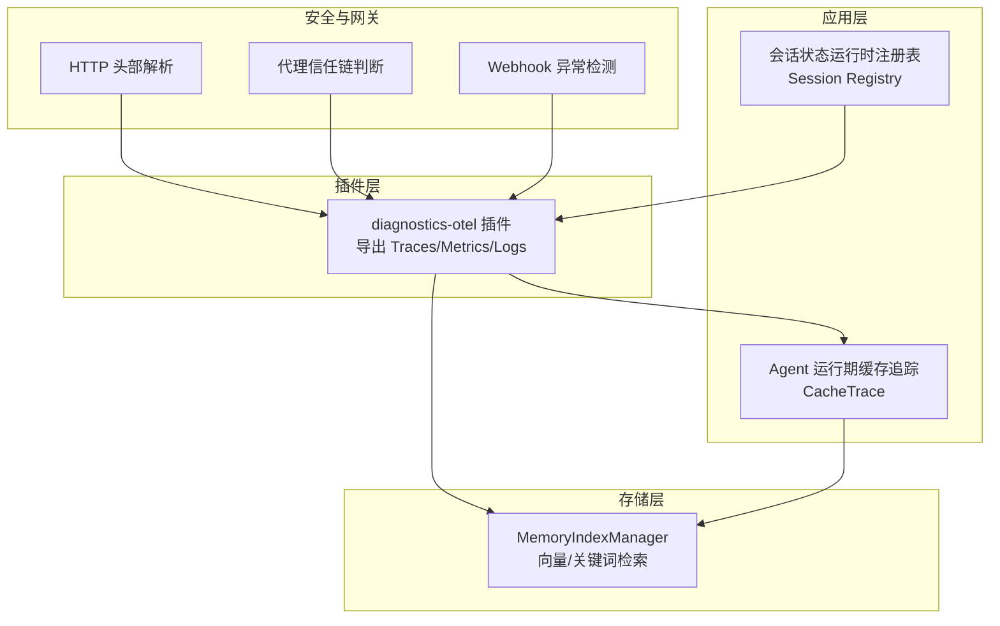
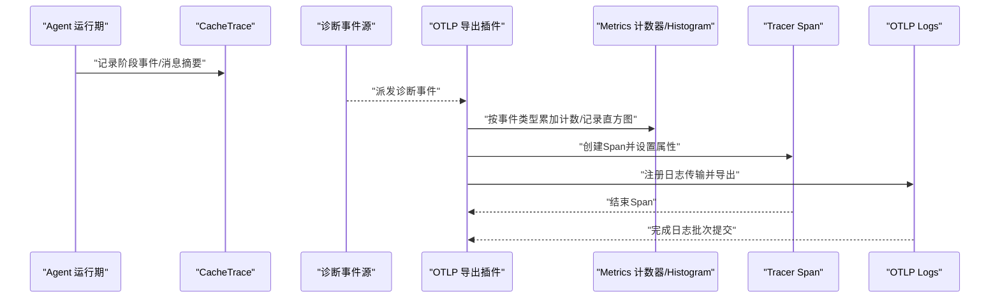
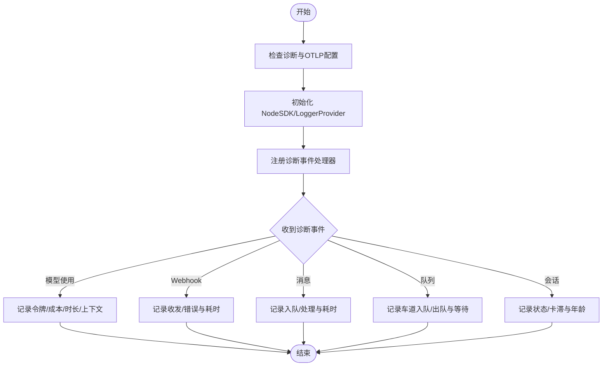
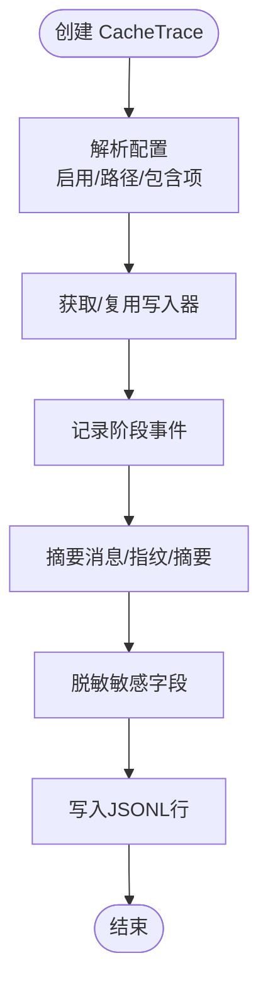
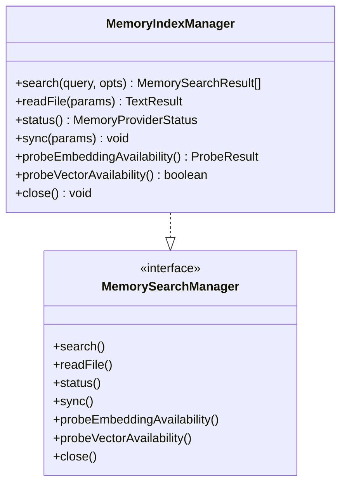
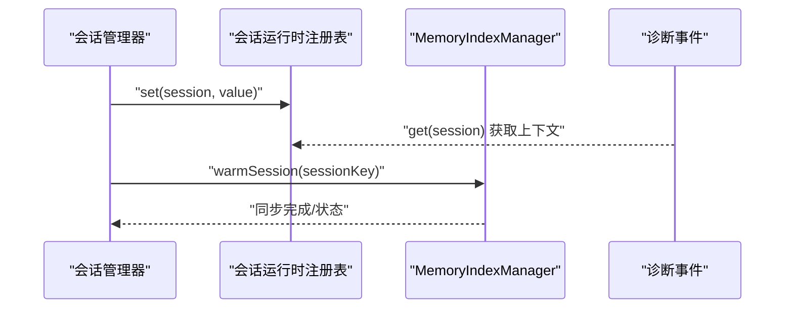
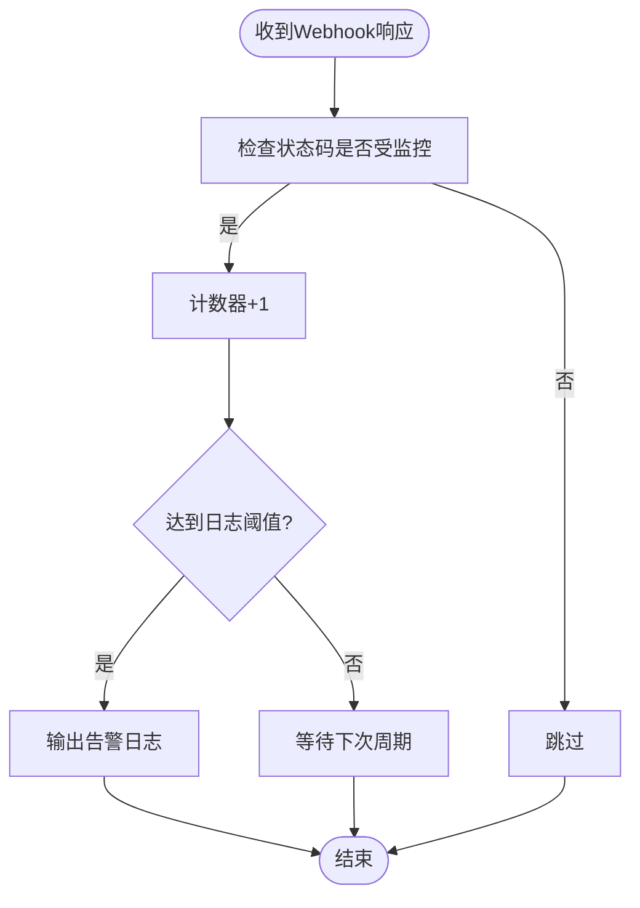
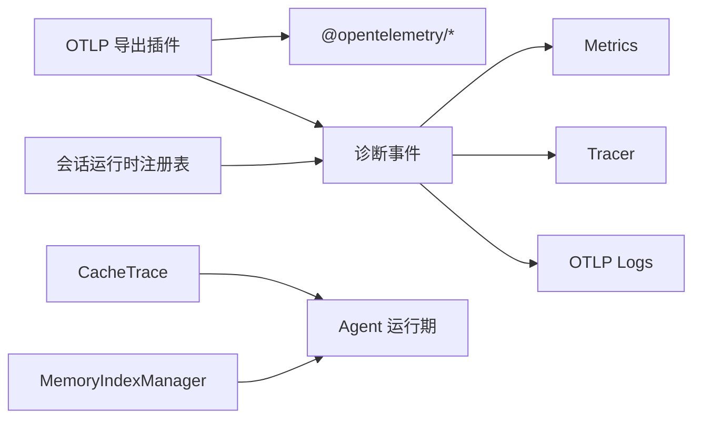

# 分布式追踪

<cite>
**本文引用的文件**
- [service.ts](file://extensions/diagnostics-otel/src/service.ts)
- [cache-trace.ts](file://src/agents/cache-trace.ts)
- [manager.ts](file://src/memory/manager.ts)
- [types.ts](file://src/memory/types.ts)
- [memory-search.ts](file://src/agents/memory-search.ts)
- [session-manager-runtime-registry.ts](file://src/agents/pi-extensions/session-manager-runtime-registry.ts)
- [webhook-memory-guards.ts](file://src/plugin-sdk/webhook-memory-guards.ts)
- [http-headers.ts](file://extensions/voice-call/src/http-headers.ts)
- [net.ts](file://src/gateway/net.ts)
</cite>

## 目录
1. [简介](#简介)
2. [项目结构](#项目结构)
3. [核心组件](#核心组件)
4. [架构总览](#架构总览)
5. [详细组件分析](#详细组件分析)
6. [依赖关系分析](#依赖关系分析)
7. [性能考量](#性能考量)
8. [故障排查指南](#故障排查指南)
9. [结论](#结论)
10. [附录](#附录)

## 简介
本文件面向OpenClaw分布式追踪系统，聚焦跨服务请求链路的追踪机制、上下文传播与事件关联，以及会话状态管理、内存索引与查询优化的追踪实现。内容覆盖分布式ID生成、Span创建与链路数据采集，追踪数据的存储格式、查询接口与性能分析工具，并提供错误追踪、慢查询检测与依赖关系可视化的实现思路。

## 项目结构
OpenClaw在多个层面实现了可观测性：
- 插件层：通过诊断插件将OpenClaw内部诊断事件导出至OTLP后端（Traces/Metrics/Logs）。
- 应用层：Agent运行期缓存追踪（CacheTrace），记录关键阶段与消息摘要。
- 存储层：内置内存索引管理器（MemoryIndexManager），支持向量与关键词混合检索，提供状态与性能指标。
- 会话层：会话状态运行时注册表，支撑会话生命周期内的上下文与状态传播。
- 安全与网关：HTTP头部解析、代理信任链与Webhook异常检测，辅助链路完整性与安全审计。

**图表来源**
- [service.ts](file://extensions/diagnostics-otel/src/service.ts#L72-L686)
- [cache-trace.ts](file://src/agents/cache-trace.ts#L167-L258)
- [manager.ts](file://src/memory/manager.ts#L45-L787)
- [session-manager-runtime-registry.ts](file://src/agents/pi-extensions/session-manager-runtime-registry.ts#L1-L29)
- [http-headers.ts](file://extensions/voice-call/src/http-headers.ts#L1-L12)
- [net.ts](file://src/gateway/net.ts#L120-L154)

**章节来源**
- [service.ts](file://extensions/diagnostics-otel/src/service.ts#L72-L686)
- [cache-trace.ts](file://src/agents/cache-trace.ts#L167-L258)
- [manager.ts](file://src/memory/manager.ts#L45-L787)
- [types.ts](file://src/memory/types.ts#L61-L81)
- [memory-search.ts](file://src/agents/memory-search.ts#L355-L367)
- [session-manager-runtime-registry.ts](file://src/agents/pi-extensions/session-manager-runtime-registry.ts#L1-L29)
- [http-headers.ts](file://extensions/voice-call/src/http-headers.ts#L1-L12)
- [net.ts](file://src/gateway/net.ts#L120-L154)

## 核心组件
- 诊断OTLP导出插件：负责启动OTLP SDK，注册日志传输，按类型化事件记录指标与Span，支持采样率与批量导出配置。
- 缓存追踪（CacheTrace）：以JSONL格式记录Agent运行关键阶段、消息摘要与错误信息，便于离线分析与回放。
- 内存索引管理器（MemoryIndexManager）：提供向量与关键词混合检索、状态查询、批处理与只读数据库恢复等能力，支撑会话与记忆体的性能追踪。
- 会话状态运行时注册表：基于WeakMap的会话级运行时注册表，用于在会话生命周期内传播状态与上下文。
- Webhook异常检测：对Webhook状态码进行计数与告警阈值控制，辅助慢查询与异常检测。
- HTTP头部与代理信任链：统一头部解析与代理可信判定，保障链路来源与上下文一致性。

**章节来源**
- [service.ts](file://extensions/diagnostics-otel/src/service.ts#L72-L686)
- [cache-trace.ts](file://src/agents/cache-trace.ts#L167-L258)
- [manager.ts](file://src/memory/manager.ts#L45-L787)
- [types.ts](file://src/memory/types.ts#L61-L81)
- [memory-search.ts](file://src/agents/memory-search.ts#L355-L367)
- [session-manager-runtime-registry.ts](file://src/agents/pi-extensions/session-manager-runtime-registry.ts#L1-L29)
- [webhook-memory-guards.ts](file://src/plugin-sdk/webhook-memory-guards.ts#L164-L196)
- [http-headers.ts](file://extensions/voice-call/src/http-headers.ts#L1-L12)
- [net.ts](file://src/gateway/net.ts#L120-L154)

## 架构总览
下图展示从诊断事件到OTLP导出的整体流程，以及与缓存追踪、内存索引、会话状态的交互关系。

**图表来源**
- [service.ts](file://extensions/diagnostics-otel/src/service.ts#L619-L664)
- [cache-trace.ts](file://src/agents/cache-trace.ts#L186-L232)

**章节来源**
- [service.ts](file://extensions/diagnostics-otel/src/service.ts#L619-L664)
- [cache-trace.ts](file://src/agents/cache-trace.ts#L186-L232)

## 详细组件分析

### 诊断OTLP导出插件（Traces/Metrics/Logs）
- 启动与配置
  - 支持协议校验与端点规范化，自动补全OTLP信号路径。
  - 资源属性注入服务名，支持采样率与批量导出间隔配置。
- 指标与直方图
  - 提供令牌用量、成本、运行时长、上下文窗口、Webhook收发与耗时、消息队列深度与等待时间、会话状态与卡滞、运行尝试次数等指标。
- 日志导出
  - 注册日志传输，将日志对象序列化为OTLP日志记录，含结构化属性与代码位置元数据。
- 事件处理
  - 针对模型使用、Webhook收发/错误、消息入队/处理、队列车道、会话状态与卡滞、心跳等事件，分别记录指标与Span。
  - Span属性包含会话标识、通道、更新类型、聊天ID等，便于跨服务关联。

**图表来源**
- [service.ts](file://extensions/diagnostics-otel/src/service.ts#L80-L156)
- [service.ts](file://extensions/diagnostics-otel/src/service.ts#L619-L664)

**章节来源**
- [service.ts](file://extensions/diagnostics-otel/src/service.ts#L80-L156)
- [service.ts](file://extensions/diagnostics-otel/src/service.ts#L158-L366)
- [service.ts](file://extensions/diagnostics-otel/src/service.ts#L382-L664)

### 缓存追踪（CacheTrace）
- 存储格式
  - JSONL（每行一条事件），包含时间戳、序号、阶段、运行/会话标识、模型信息、工作区目录、提示词/系统/选项/模型参数摘要、消息数量/角色指纹/摘要、备注与错误。
- 关键阶段
  - 会话加载/清理/限制、提示词前后处理、流式上下文、会话后处理。
- 数据保护
  - 对图片数据与敏感字段进行脱敏；消息摘要采用稳定序列化与哈希，便于去重与对比。
- 使用方式
  - 可包裹流式函数，记录上下文与选项；可按配置决定是否包含消息、提示词与系统内容。

**图表来源**
- [cache-trace.ts](file://src/agents/cache-trace.ts#L78-L100)
- [cache-trace.ts](file://src/agents/cache-trace.ts#L167-L258)

**章节来源**
- [cache-trace.ts](file://src/agents/cache-trace.ts#L167-L258)

### 内存索引管理器（MemoryIndexManager）
- 查询模式
  - FTS-only（无嵌入提供者）或混合检索（向量+关键词），支持BM25归一化、MMR去重与时间衰减。
- 性能与可靠性
  - 批处理嵌入、失败计数与恢复策略、只读数据库错误自动重连与模式重建。
  - 提供状态接口，返回文件/块统计、缓存条目、向量可用性、批处理状态与只读恢复统计。
- 会话集成
  - 支持按会话键预热同步，结合会话增量字节/消息阈值触发增量同步。

**图表来源**
- [manager.ts](file://src/memory/manager.ts#L45-L787)
- [types.ts](file://src/memory/types.ts#L61-L81)

**章节来源**
- [manager.ts](file://src/memory/manager.ts#L240-L348)
- [manager.ts](file://src/memory/manager.ts#L435-L535)
- [manager.ts](file://src/memory/manager.ts#L610-L722)
- [types.ts](file://src/memory/types.ts#L61-L81)

### 会话状态管理与上下文传播
- 会话级运行时注册表
  - 基于WeakMap的会话实例到值的映射，确保同一会话实例的set/get一致性。
- 上下文传播
  - 在诊断事件中附加会话Key/ID，配合Span属性实现跨服务链路关联。
- 与内存索引的协作
  - 会话预热与增量同步，减少首次检索延迟，提升链路响应时间稳定性。

**图表来源**
- [session-manager-runtime-registry.ts](file://src/agents/pi-extensions/session-manager-runtime-registry.ts#L1-L29)
- [manager.ts](file://src/memory/manager.ts#L224-L238)
- [service.ts](file://extensions/diagnostics-otel/src/service.ts#L516-L526)

**章节来源**
- [session-manager-runtime-registry.ts](file://src/agents/pi-extensions/session-manager-runtime-registry.ts#L1-L29)
- [manager.ts](file://src/memory/manager.ts#L224-L238)
- [service.ts](file://extensions/diagnostics-otel/src/service.ts#L516-L526)

### Webhook异常检测与慢查询
- 异常检测
  - 基于有界计数器与TTL，对指定状态码进行键控计数，周期性日志输出，避免噪声干扰。
- 慢查询与耗时
  - Webhook处理耗时记录为直方图，结合错误Span与属性，定位慢调用与失败路径。
- HTTP头部与代理信任
  - 统一头部解析与代理可信判定，确保来源链路可追溯与安全。

**图表来源**
- [webhook-memory-guards.ts](file://src/plugin-sdk/webhook-memory-guards.ts#L164-L196)

**章节来源**
- [webhook-memory-guards.ts](file://src/plugin-sdk/webhook-memory-guards.ts#L164-L196)
- [http-headers.ts](file://extensions/voice-call/src/http-headers.ts#L1-L12)
- [net.ts](file://src/gateway/net.ts#L120-L154)

## 依赖关系分析
- 插件依赖
  - OTLP导出插件依赖OpenTelemetry API与NodeSDK，按配置选择性启用Traces/Metrics/Logs。
- 应用与存储
  - CacheTrace与MemoryIndexManager均面向Agent运行期，前者侧重事件记录，后者侧重检索与状态。
- 会话与链路
  - 会话运行时注册表为链路属性提供上下文来源，与诊断事件中的会话标识共同实现跨服务关联。

**图表来源**
- [service.ts](file://extensions/diagnostics-otel/src/service.ts#L1-L11)
- [cache-trace.ts](file://src/agents/cache-trace.ts#L1-L10)
- [manager.ts](file://src/memory/manager.ts#L1-L25)
- [session-manager-runtime-registry.ts](file://src/agents/pi-extensions/session-manager-runtime-registry.ts#L1-L29)

**章节来源**
- [service.ts](file://extensions/diagnostics-otel/src/service.ts#L1-L11)
- [cache-trace.ts](file://src/agents/cache-trace.ts#L1-L10)
- [manager.ts](file://src/memory/manager.ts#L1-L25)
- [session-manager-runtime-registry.ts](file://src/agents/pi-extensions/session-manager-runtime-registry.ts#L1-L29)

## 性能考量
- 指标与直方图
  - 使用直方图记录Webhook与消息处理耗时，有助于识别尾部延迟与热点。
- 批处理与并发
  - 内存索引批处理配置支持并发与轮询间隔，降低嵌入调用开销。
- 只读数据库恢复
  - 自动重连与模式重建，减少因只读错误导致的长时间不可用。
- 缓存与摘要
  - CacheTrace的消息指纹与摘要，便于快速比对与增量分析，降低存储与传输成本。

[本节为通用指导，无需列出具体文件来源]

## 故障排查指南
- OTLP导出失败
  - 检查协议与端点配置，确认资源属性与采样率设置；查看日志传输错误与SDK启动异常。
- 慢查询与异常Webhook
  - 结合Webhook异常检测日志与耗时直方图，定位高频错误与慢响应路径。
- 会话卡滞
  - 观察会话卡滞计数与年龄直方图，结合Span错误状态定位阻塞环节。
- 内存索引不可用
  - 查看只读恢复统计与批处理失败计数，必要时调整批处理配置或切换嵌入提供者。

**章节来源**
- [service.ts](file://extensions/diagnostics-otel/src/service.ts#L150-L156)
- [service.ts](file://extensions/diagnostics-otel/src/service.ts#L488-L501)
- [service.ts](file://extensions/diagnostics-otel/src/service.ts#L591-L607)
- [manager.ts](file://src/memory/manager.ts#L501-L535)
- [webhook-memory-guards.ts](file://src/plugin-sdk/webhook-memory-guards.ts#L164-L196)

## 结论
OpenClaw通过OTLP导出插件、缓存追踪、内存索引与会话运行时注册表，构建了覆盖事件、指标、日志与检索的完整追踪体系。诊断事件驱动的Span与指标，结合会话标识与HTTP头部解析，实现跨服务链路的上下文传播与事件关联；内存索引的状态与性能指标为慢查询与异常提供量化依据；Webhook异常检测与代理信任链进一步强化了链路完整性与安全性。

[本节为总结性内容，无需列出具体文件来源]

## 附录
- 配置要点
  - OTLP：协议、端点、服务名、采样率、批量间隔、日志开关。
  - CacheTrace：启用、文件路径、包含消息/提示词/系统。
  - 内存搜索：提供者、模型、存储路径、分块参数、同步策略、查询权重与候选倍数、缓存大小。
  - 会话：运行时注册表键值传播。
  - Webhook：受监控状态码、计数阈值与日志频率。
- 推荐实践
  - 为关键路径创建独立Span，附加会话与通道属性。
  - 使用直方图监控尾部延迟，定期审查慢查询与异常。
  - 对敏感字段进行脱敏，遵循最小暴露原则。
  - 合理设置批处理与缓存，平衡吞吐与延迟。

[本节为通用指导，无需列出具体文件来源]