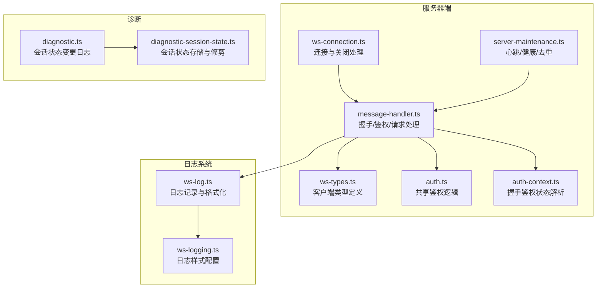
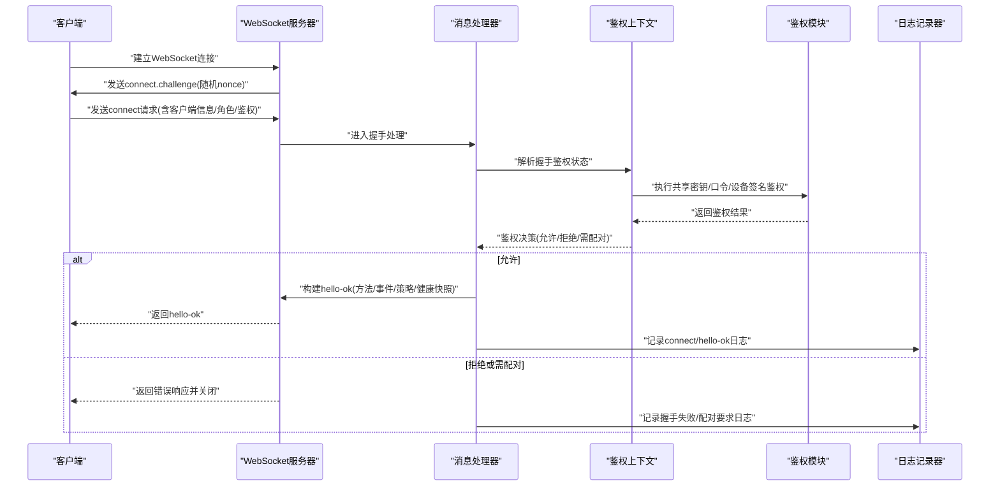
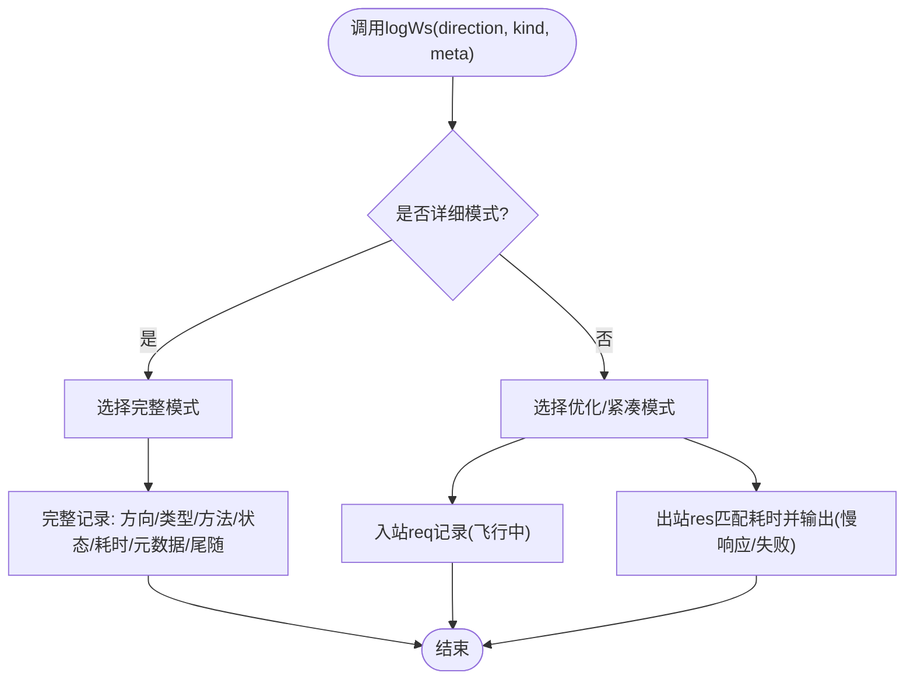
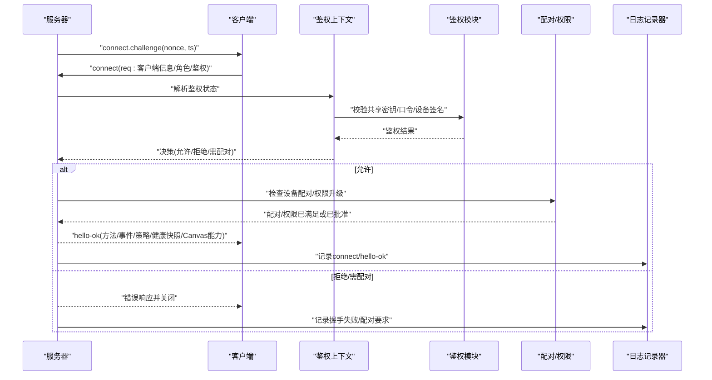
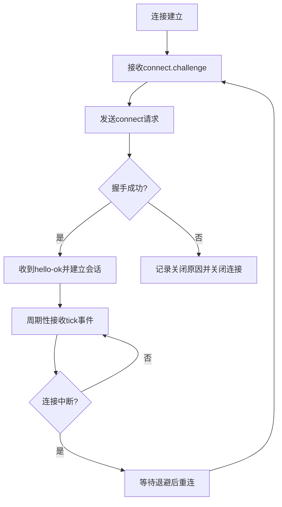
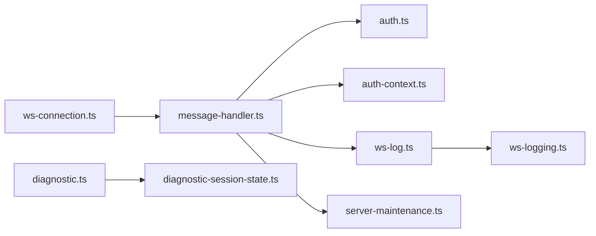

# WebSocket日志

<cite>
**本文引用的文件**
- [src/gateway/ws-log.ts](file://src/gateway/ws-log.ts)
- [src/gateway/ws-logging.ts](file://src/gateway/ws-logging.ts)
- [src/gateway/server/ws-connection.ts](file://src/gateway/server/ws-connection.ts)
- [src/gateway/server/ws-connection/message-handler.ts](file://src/gateway/server/ws-connection/message-handler.ts)
- [src/gateway/server/ws-types.ts](file://src/gateway/server/ws-types.ts)
- [src/gateway/server-maintenance.ts](file://src/gateway/server-maintenance.ts)
- [src/gateway/auth.ts](file://src/gateway/auth.ts)
- [src/gateway/server/ws-connection/auth-context.ts](file://src/gateway/server/ws-connection/auth-context.ts)
- [src/logging/diagnostic.ts](file://src/logging/diagnostic.ts)
- [src/logging/diagnostic-session-state.ts](file://src/logging/diagnostic-session-state.ts)
- [apps/macos/Tests/OpenClawIPCTests/GatewayWebSocketTestSupport.swift](file://apps/macos/Tests/OpenClawIPCTests/GatewayWebSocketTestSupport.swift)
- [apps/shared/OpenClawKit/Tests/OpenClawKitTests/GatewayNodeSessionTests.swift](file://apps/shared/OpenClawKit/Tests/OpenClawKitTests/GatewayNodeSessionTests.swift)
</cite>

## 目录
1. [简介](#简介)
2. [项目结构](#项目结构)
3. [核心组件](#核心组件)
4. [架构总览](#架构总览)
5. [详细组件分析](#详细组件分析)
6. [依赖关系分析](#依赖关系分析)
7. [性能考量](#性能考量)
8. [故障排查指南](#故障排查指南)
9. [结论](#结论)
10. [附录](#附录)

## 简介
本文件面向OpenClaw的WebSocket日志系统，系统性阐述实时日志传输机制、连接建立流程、消息格式、断线重连策略、显示模式（自动/紧凑/完整）、日志订阅与客户端过滤、实时刷新、安全与认证、访问控制、日志聚合与搜索、可视化展示集成以及诊断会话状态管理与远程调试支持。目标是帮助开发者与运维人员快速理解并高效使用该系统。

## 项目结构
围绕WebSocket日志的关键代码分布在以下模块：
- 连接与握手：服务器侧连接处理器、消息处理与鉴权上下文
- 日志输出：统一的WebSocket日志记录器与样式控制
- 维护与心跳：周期性健康快照与去重缓存清理
- 诊断与会话：会话状态跟踪与事件发射
- 测试支撑：用于验证握手响应与请求ID解析的测试工具

图表来源
- [src/gateway/server/ws-connection.ts](file://src/gateway/server/ws-connection.ts#L93-L319)
- [src/gateway/server/ws-connection/message-handler.ts](file://src/gateway/server/ws-connection/message-handler.ts#L236-L1216)
- [src/gateway/server/ws-types.ts](file://src/gateway/server/ws-types.ts#L4-L14)
- [src/gateway/auth.ts](file://src/gateway/auth.ts#L437-L490)
- [src/gateway/server/ws-connection/auth-context.ts](file://src/gateway/server/ws-connection/auth-context.ts#L75-L122)
- [src/gateway/server-maintenance.ts](file://src/gateway/server-maintenance.ts#L58-L91)
- [src/gateway/ws-log.ts](file://src/gateway/ws-log.ts#L256-L439)
- [src/gateway/ws-logging.ts](file://src/gateway/ws-logging.ts#L1-L14)
- [src/logging/diagnostic.ts](file://src/logging/diagnostic.ts#L194-L227)
- [src/logging/diagnostic-session-state.ts](file://src/logging/diagnostic-session-state.ts#L79-L112)

章节来源
- [src/gateway/server/ws-connection.ts](file://src/gateway/server/ws-connection.ts#L93-L319)
- [src/gateway/server/ws-connection/message-handler.ts](file://src/gateway/server/ws-connection/message-handler.ts#L236-L1216)
- [src/gateway/ws-log.ts](file://src/gateway/ws-log.ts#L256-L439)
- [src/gateway/ws-logging.ts](file://src/gateway/ws-logging.ts#L1-L14)
- [src/gateway/server-maintenance.ts](file://src/gateway/server-maintenance.ts#L58-L91)
- [src/logging/diagnostic.ts](file://src/logging/diagnostic.ts#L194-L227)
- [src/logging/diagnostic-session-state.ts](file://src/logging/diagnostic-session-state.ts#L79-L112)

## 核心组件
- WebSocket日志记录器：负责将入站/出站帧、错误、耗时等信息以统一格式输出，并支持三种显示模式（自动/紧凑/完整），同时内置敏感信息脱敏与长度限制。
- 连接处理器：负责握手挑战、鉴权、设备配对、节点注册、存在性更新、Canvas能力令牌发放、健康快照与策略下发。
- 消息处理与鉴权上下文：解析首帧、校验协议版本、执行浏览器来源检查、解析共享密钥/口令鉴权、设备签名与公钥校验、设备配对与权限升级、请求路由与响应。
- 服务器维护：周期性发送心跳事件、刷新健康快照、清理去重缓存。
- 诊断与会话：记录会话状态变化、队列深度、活动时间，定期修剪过期状态，发射诊断事件供外部消费。

章节来源
- [src/gateway/ws-log.ts](file://src/gateway/ws-log.ts#L256-L439)
- [src/gateway/server/ws-connection.ts](file://src/gateway/server/ws-connection.ts#L115-L319)
- [src/gateway/server/ws-connection/message-handler.ts](file://src/gateway/server/ws-connection/message-handler.ts#L363-L1216)
- [src/gateway/server-maintenance.ts](file://src/gateway/server-maintenance.ts#L58-L91)
- [src/logging/diagnostic.ts](file://src/logging/diagnostic.ts#L194-L227)
- [src/logging/diagnostic-session-state.ts](file://src/logging/diagnostic-session-state.ts#L79-L112)

## 架构总览
下图展示了从客户端发起连接到服务器完成握手、鉴权、配对与会话建立的全链路流程，以及日志记录在各阶段的落点。

图表来源
- [src/gateway/server/ws-connection.ts](file://src/gateway/server/ws-connection.ts#L115-L195)
- [src/gateway/server/ws-connection/message-handler.ts](file://src/gateway/server/ws-connection/message-handler.ts#L396-L1131)
- [src/gateway/server/ws-connection/auth-context.ts](file://src/gateway/server/ws-connection/auth-context.ts#L75-L122)
- [src/gateway/auth.ts](file://src/gateway/auth.ts#L437-L490)
- [src/gateway/ws-log.ts](file://src/gateway/ws-log.ts#L256-L314)

## 详细组件分析

### 实时日志传输机制与显示模式
- 显示模式
  - 自动/紧凑：在非详细模式下，优先紧凑输出，仅在慢响应或失败时补充耗时与元数据；紧凑模式下按连接分组显示连接ID，减少重复。
  - 完整：输出详细字段，包含方向箭头、方法名、状态标记、耗时、剩余元数据与尾随标识。
- 关键特性
  - 敏感信息脱敏：默认启用工具类脱敏规则，避免泄露令牌、路径等。
  - 长度限制：单值最大长度限制，超长截断并保留上下文。
  - 聚合与去重：内部维护飞行中请求映射，计算往返耗时；在优化模式下对慢响应进行阈值触发输出。
- 日志入口
  - 所有入站/出站帧、解析错误、握手阶段均通过统一接口记录，便于集中观察与过滤。

图表来源
- [src/gateway/ws-log.ts](file://src/gateway/ws-log.ts#L256-L439)
- [src/gateway/ws-logging.ts](file://src/gateway/ws-logging.ts#L1-L14)

章节来源
- [src/gateway/ws-log.ts](file://src/gateway/ws-log.ts#L256-L439)
- [src/gateway/ws-logging.ts](file://src/gateway/ws-logging.ts#L1-L14)

### 连接建立与握手流程
- 握手挑战
  - 服务器在连接建立后立即发送connect.challenge，携带随机nonce与时间戳，客户端需在connect请求中携带相同nonce以通过设备签名校验。
- 协议协商
  - 校验客户端声明的最小/最大协议版本与服务端当前版本兼容性，不兼容则拒绝。
- 角色与作用域
  - 默认角色为操作者；作用域必须显式声明，未绑定设备身份时会清空作用域以避免自声明权限。
- 浏览器来源检查
  - 若检测到浏览器来源头，将执行严格的origin校验；支持Host头回退策略（可配置），并记录安全指标。
- 设备身份与配对
  - 校验设备公钥、签名时效、nonce一致性；若设备未配对或权限升级，触发配对流程（静默/交互），并在需要时要求用户批准。
- Canvas能力与策略
  - 对节点角色颁发Canvas能力令牌，下发最大载荷、缓冲字节与心跳间隔等策略参数。
- 健康快照与存在性
  - 建立连接后更新系统存在性快照，广播健康状态；首次连接即预热健康快照，确保客户端能立即获得完整状态。

图表来源
- [src/gateway/server/ws-connection.ts](file://src/gateway/server/ws-connection.ts#L174-L195)
- [src/gateway/server/ws-connection/message-handler.ts](file://src/gateway/server/ws-connection/message-handler.ts#L396-L1131)
- [src/gateway/server/ws-connection/auth-context.ts](file://src/gateway/server/ws-connection/auth-context.ts#L75-L122)
- [src/gateway/auth.ts](file://src/gateway/auth.ts#L437-L490)

章节来源
- [src/gateway/server/ws-connection.ts](file://src/gateway/server/ws-connection.ts#L115-L195)
- [src/gateway/server/ws-connection/message-handler.ts](file://src/gateway/server/ws-connection/message-handler.ts#L396-L1131)
- [src/gateway/server/ws-connection/auth-context.ts](file://src/gateway/server/ws-connection/auth-context.ts#L75-L122)
- [src/gateway/auth.ts](file://src/gateway/auth.ts#L437-L490)

### 消息格式与断线重连策略
- 消息格式
  - 首帧：type=req，method=connect，包含客户端信息、角色、作用域、鉴权与设备签名等。
  - 响应帧：type=res，携带ok与payload或error；connect成功后返回hello-ok，包含协议版本、服务器版本、方法/事件列表、健康快照、Canvas能力与策略。
  - 事件帧：type=event，如connect.challenge与心跳tick等。
- 断线与重连
  - 服务器在连接关闭前记录原因、握手状态、持续时长、最后帧类型/方法/id等元数据，便于诊断。
  - 心跳：周期性发送tick事件，客户端需保持活跃；健康快照定期刷新，确保断线重连后能尽快恢复状态。
  - 重连建议：客户端应在握手失败或连接异常时等待指数退避后重试，并携带相同的nonce与鉴权信息。

图表来源
- [src/gateway/server/ws-connection.ts](file://src/gateway/server/ws-connection.ts#L174-L265)
- [src/gateway/server-maintenance.ts](file://src/gateway/server-maintenance.ts#L58-L70)

章节来源
- [src/gateway/server/ws-connection.ts](file://src/gateway/server/ws-connection.ts#L174-L265)
- [src/gateway/server-maintenance.ts](file://src/gateway/server-maintenance.ts#L58-L70)

### 日志订阅机制、客户端过滤与实时刷新
- 订阅与事件
  - 服务器在握手成功后下发features.methods与features.events，客户端据此订阅所需事件；心跳tick事件可用于驱动实时刷新。
- 客户端过滤
  - 在客户端侧可基于角色、工具、查询词、时间范围等条件进行过滤；过滤结果与统计可在UI中呈现。
- 实时刷新
  - 通过周期性tick事件与健康快照，客户端可感知系统状态变化并主动刷新界面。

章节来源
- [src/gateway/server/ws-connection/message-handler.ts](file://src/gateway/server/ws-connection/message-handler.ts#L1031-L1054)
- [src/gateway/server-maintenance.ts](file://src/gateway/server-maintenance.ts#L58-L70)

### 安全考虑、认证机制与访问控制
- 共享密钥/口令鉴权
  - 支持token/password两种共享鉴权方式，失败时进行速率限制并记录原因。
- 设备身份与签名
  - 设备公钥、签名时效、nonce一致性严格校验；支持v2/v3签名负载版本解析。
- 浏览器来源检查
  - 强制校验origin，支持Host头回退（可配置），并记录安全指标。
- 权限与作用域
  - 未绑定设备身份时清空作用域；角色与作用域升级需经配对审批。
- 代理与本地判定
  - 正确识别受信任代理与本地直连，避免代理绕过导致的误判。

章节来源
- [src/gateway/auth.ts](file://src/gateway/auth.ts#L437-L490)
- [src/gateway/server/ws-connection/message-handler.ts](file://src/gateway/server/ws-connection/message-handler.ts#L522-L532)
- [src/gateway/server/ws-connection/auth-context.ts](file://src/gateway/server/ws-connection/auth-context.ts#L75-L122)

### 日志聚合、搜索与可视化集成
- 聚合与统计
  - 通过会话维度聚合工具使用次数、模型/提供商分布、会话时长等指标，支持按天/小时筛选。
- 搜索
  - 支持按角色、工具、是否含工具、查询词等条件过滤日志条目；时间轴范围可作为额外筛选器。
- 可视化
  - UI层根据聚合结果渲染图表与表格，展示工具使用趋势、会话分布与关键指标。

章节来源
- [src/gateway/server/ws-connection/message-handler.ts](file://src/gateway/server/ws-connection/message-handler.ts#L1031-L1054)
- [src/gateway/server-maintenance.ts](file://src/gateway/server-maintenance.ts#L58-L70)

### 诊断会话状态管理与远程调试支持
- 会话状态
  - 记录会话ID、会话键、状态、最后活动时间、队列深度；支持状态变更日志与事件发射。
- 修剪策略
  - 当会话数量超过上限或长时间未活动时，按最后活动时间排序修剪，保证内存占用可控。
- 远程调试
  - 通过诊断事件与日志记录器输出，辅助定位握手失败、权限不足、配对问题等常见场景。

章节来源
- [src/logging/diagnostic.ts](file://src/logging/diagnostic.ts#L194-L227)
- [src/logging/diagnostic-session-state.ts](file://src/logging/diagnostic-session-state.ts#L79-L112)

## 依赖关系分析
- 组件耦合
  - 连接处理器与消息处理器紧密耦合，前者负责生命周期与关闭，后者负责握手与请求处理。
  - 日志记录器被广泛调用，贯穿握手、请求处理、错误与关闭等关键路径。
  - 鉴权模块与上下文模块共同决定连接是否被接受，影响后续配对与权限。
- 外部依赖
  - ws库用于WebSocket通信；chalk用于终端彩色输出；Node原生模块用于系统信息与网络解析。
- 循环依赖
  - 未发现直接循环依赖；日志与维护模块仅作为副作用被调用，无反向依赖。

图表来源
- [src/gateway/server/ws-connection.ts](file://src/gateway/server/ws-connection.ts#L93-L319)
- [src/gateway/server/ws-connection/message-handler.ts](file://src/gateway/server/ws-connection/message-handler.ts#L236-L1216)
- [src/gateway/auth.ts](file://src/gateway/auth.ts#L437-L490)
- [src/gateway/server/ws-connection/auth-context.ts](file://src/gateway/server/ws-connection/auth-context.ts#L75-L122)
- [src/gateway/ws-log.ts](file://src/gateway/ws-log.ts#L256-L439)
- [src/gateway/ws-logging.ts](file://src/gateway/ws-logging.ts#L1-L14)
- [src/gateway/server-maintenance.ts](file://src/gateway/server-maintenance.ts#L58-L91)
- [src/logging/diagnostic.ts](file://src/logging/diagnostic.ts#L194-L227)
- [src/logging/diagnostic-session-state.ts](file://src/logging/diagnostic-session-state.ts#L79-L112)

章节来源
- [src/gateway/server/ws-connection.ts](file://src/gateway/server/ws-connection.ts#L93-L319)
- [src/gateway/server/ws-connection/message-handler.ts](file://src/gateway/server/ws-connection/message-handler.ts#L236-L1216)
- [src/gateway/ws-log.ts](file://src/gateway/ws-log.ts#L256-L439)
- [src/gateway/ws-logging.ts](file://src/gateway/ws-logging.ts#L1-L14)
- [src/gateway/server-maintenance.ts](file://src/gateway/server-maintenance.ts#L58-L91)
- [src/logging/diagnostic.ts](file://src/logging/diagnostic.ts#L194-L227)
- [src/logging/diagnostic-session-state.ts](file://src/logging/diagnostic-session-state.ts#L79-L112)

## 性能考量
- 日志开销控制
  - 优化模式下仅在慢响应或失败时输出，显著降低高频请求下的日志写入压力。
  - 内部飞行中映射容量限制，避免内存膨胀。
- 心跳与健康
  - 周期性心跳与健康快照预热，确保断线重连后状态可用，减少客户端等待时间。
- 缓冲与策略
  - 服务器下发最大载荷与缓冲字节限制，客户端据此调整批量推送与背压策略。

章节来源
- [src/gateway/ws-log.ts](file://src/gateway/ws-log.ts#L316-L378)
- [src/gateway/server-maintenance.ts](file://src/gateway/server-maintenance.ts#L58-L91)
- [src/gateway/server/ws-connection/message-handler.ts](file://src/gateway/server/ws-connection/message-handler.ts#L1049-L1054)

## 故障排查指南
- 常见问题与定位
  - 握手失败：检查协议版本、角色/作用域、浏览器来源、设备签名与nonce一致性。
  - 权限不足：确认设备配对状态与权限升级是否已完成，查看授权失败原因与速率限制。
  - 连接异常关闭：关注关闭原因、握手状态、最后帧元数据与持续时长。
- 诊断事件与日志
  - 使用诊断事件与会话状态日志，结合日志记录器输出，快速定位问题根因。

章节来源
- [src/gateway/server/ws-connection.ts](file://src/gateway/server/ws-connection.ts#L207-L265)
- [src/gateway/server/ws-connection/message-handler.ts](file://src/gateway/server/ws-connection/message-handler.ts#L445-L460)
- [src/logging/diagnostic.ts](file://src/logging/diagnostic.ts#L194-L227)

## 结论
OpenClaw的WebSocket日志系统通过统一的日志记录器、严谨的握手与鉴权流程、灵活的显示模式与实时刷新机制，提供了高可观测性与强安全性的日志传输能力。配合会话状态管理与诊断事件，能够有效支撑远程调试与运维监控。建议在生产环境中启用合适的日志样式与速率限制策略，结合心跳与健康快照，确保系统稳定与可观测性。

## 附录
- 测试支撑
  - 提供握手响应数据构造与请求ID解析的测试工具，便于单元测试与端到端验证。

章节来源
- [apps/macos/Tests/OpenClawIPCTests/GatewayWebSocketTestSupport.swift](file://apps/macos/Tests/OpenClawIPCTests/GatewayWebSocketTestSupport.swift#L31-L71)
- [apps/shared/OpenClawKit/Tests/OpenClawKitTests/GatewayNodeSessionTests.swift](file://apps/shared/OpenClawKit/Tests/OpenClawKitTests/GatewayNodeSessionTests.swift#L104-L138)