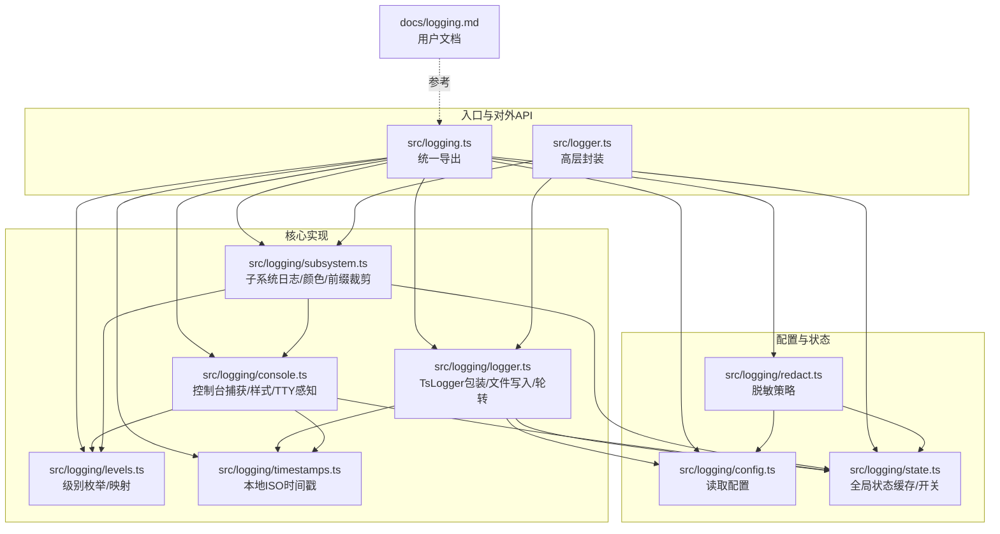
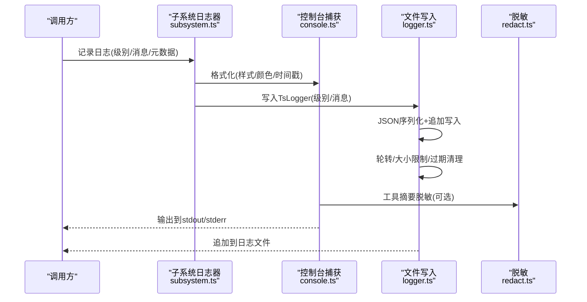
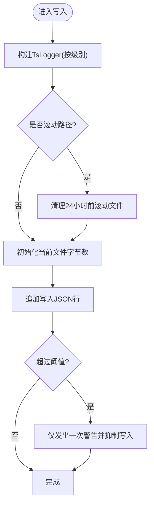
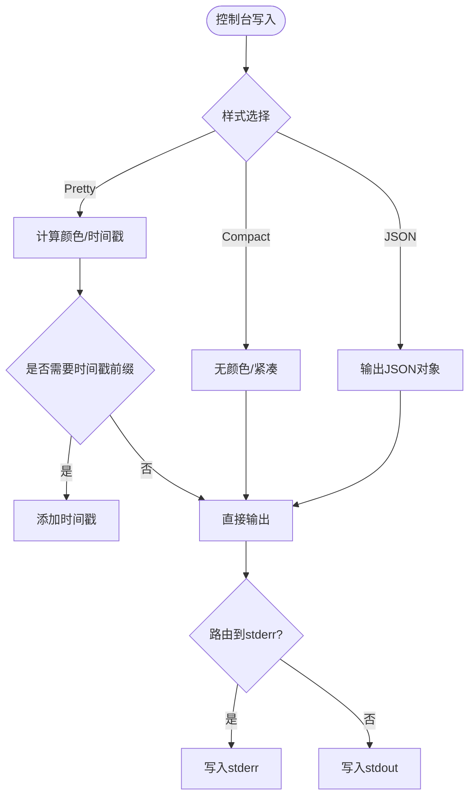
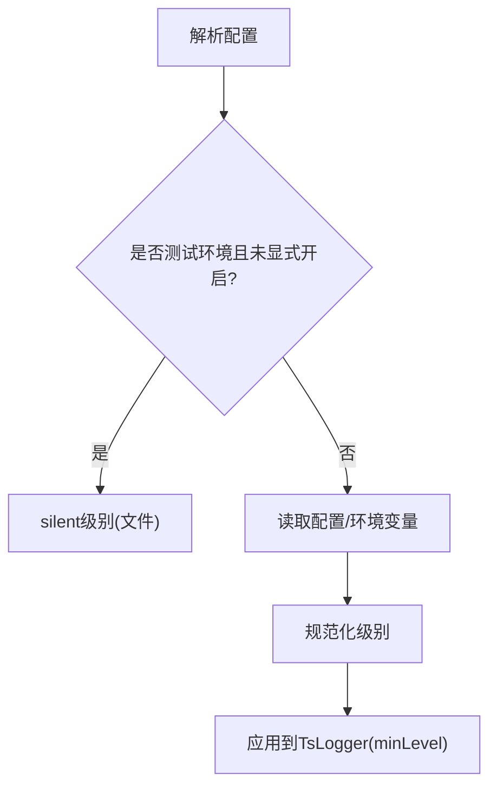
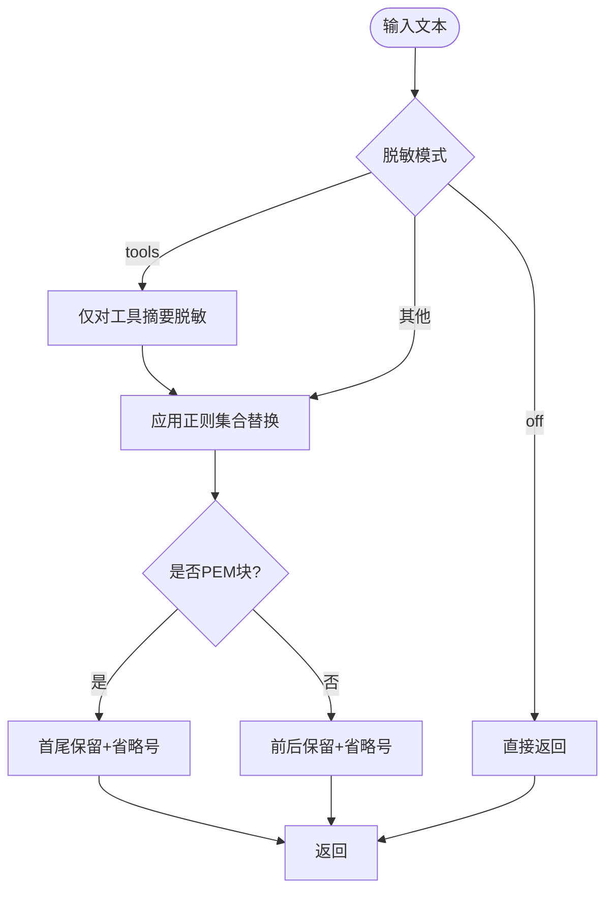
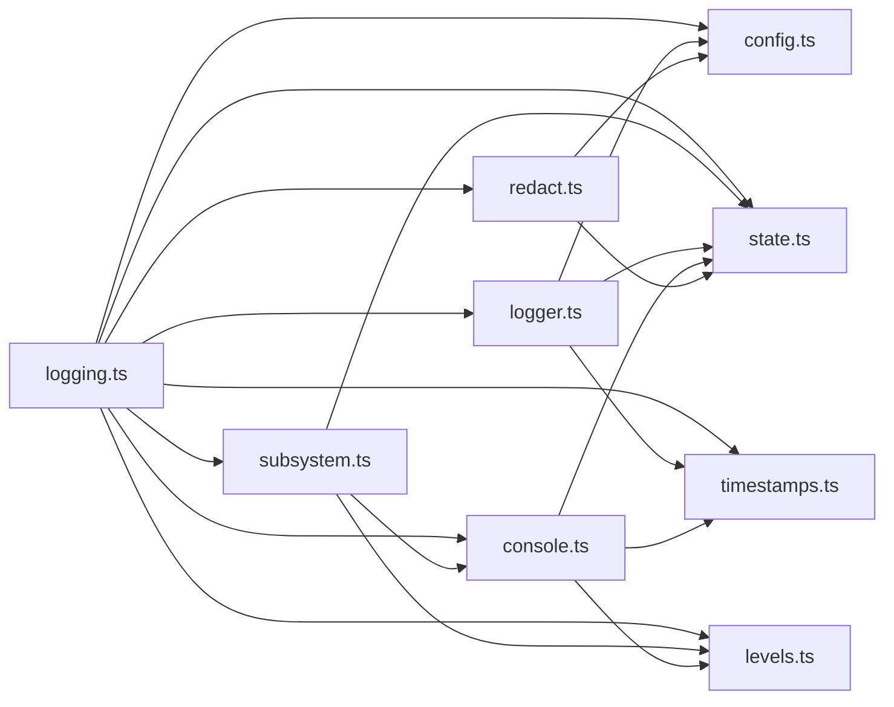

# 应用日志

<cite>
**本文引用的文件**
- [src/logger.ts](file://src/logger.ts)
- [src/logging.ts](file://src/logging.ts)
- [src/logging/logger.ts](file://src/logging/logger.ts)
- [src/logging/console.ts](file://src/logging/console.ts)
- [src/logging/levels.ts](file://src/logging/levels.ts)
- [src/logging/redact.ts](file://src/logging/redact.ts)
- [src/logging/subsystem.ts](file://src/logging/subsystem.ts)
- [src/logging/config.ts](file://src/logging/config.ts)
- [src/logging/state.ts](file://src/logging/state.ts)
- [src/logging/timestamps.ts](file://src/logging/timestamps.ts)
- [docs/logging.md](file://docs/logging.md)
</cite>

## 目录
1. [简介](#简介)
2. [项目结构](#项目结构)
3. [核心组件](#核心组件)
4. [架构总览](#架构总览)
5. [组件详解](#组件详解)
6. [依赖关系分析](#依赖关系分析)
7. [性能考量](#性能考量)
8. [故障排查指南](#故障排查指南)
9. [结论](#结论)
10. [附录](#附录)

## 简介
本技术指南面向OpenClaw应用的日志系统，聚焦“文件日志+控制台日志”的双通道输出机制，覆盖以下关键能力：
- 双通道输出：文件日志采用JSON Lines格式；控制台输出支持Pretty/Compact/JSON三种模式，并具备TTY感知与颜色主题。
- 日志轮转与存储：按日滚动的文件命名策略、最大文件大小限制、过期清理。
- 日志级别控制：文件级别与控制台级别的独立配置，环境变量优先级与命令行覆盖。
- 敏感信息脱敏：针对工具摘要与通用文本的脱敏策略，可自定义正则模式。
- WebSocket日志显示模式：在Web控制界面中支持自动、紧凑、完整等模式，便于不同调试场景。
- 配置项与使用：集中于用户配置文件中的logging段落，以及环境变量与CLI参数的覆盖方式。
- 聚合与可视化：通过CLI与Control UI进行实时尾随、过滤与检索；结合OTLP导出到外部可观测性平台。

## 项目结构
日志子系统由“入口导出层”“核心实现层”“配置与状态层”“格式化与脱敏层”组成，形成清晰的分层职责与低耦合接口。

**图表来源**
- [src/logging.ts](file://src/logging.ts#L1-L70)
- [src/logger.ts](file://src/logger.ts#L1-L86)
- [src/logging/logger.ts](file://src/logging/logger.ts#L1-L348)
- [src/logging/console.ts](file://src/logging/console.ts#L1-L327)
- [src/logging/subsystem.ts](file://src/logging/subsystem.ts#L1-L395)
- [src/logging/levels.ts](file://src/logging/levels.ts#L1-L38)
- [src/logging/timestamps.ts](file://src/logging/timestamps.ts#L1-L37)
- [src/logging/config.ts](file://src/logging/config.ts#L1-L25)
- [src/logging/state.ts](file://src/logging/state.ts#L1-L20)
- [src/logging/redact.ts](file://src/logging/redact.ts#L1-L152)
- [docs/logging.md](file://docs/logging.md#L1-L353)

**章节来源**
- [src/logging.ts](file://src/logging.ts#L1-L70)
- [src/logger.ts](file://src/logger.ts#L1-L86)
- [docs/logging.md](file://docs/logging.md#L1-L353)

## 核心组件
- 文件日志与轮转
  - 默认滚动文件路径基于本地日期，文件名形如“openclaw-YYYY-MM-DD.log”，位于临时目录下。
  - 写入时以JSON Lines格式追加，每条记录包含时间戳字段；当超过最大文件字节阈值时，会发出警告并抑制后续写入，避免磁盘膨胀。
  - 每次启动或切换路径时，清理超过24小时的历史滚动文件，保持磁盘整洁。
- 控制台日志
  - 支持TTY感知：TTY环境默认Pretty模式并带颜色与时间戳；非TTY默认Compact模式。
  - 提供JSON模式用于日志处理器消费；支持将所有控制台输出路由至stderr，保证stdout纯净。
  - 子系统前缀裁剪与颜色分配，提升可读性；支持子系统过滤与时间戳前缀开关。
- 日志级别
  - 允许独立设置文件级别与控制台级别；支持silent/fatal/error/warn/info/debug/trace。
  - 环境变量OPENCLAW_LOG_LEVEL可覆盖配置；CLI全局选项可进一步覆盖环境变量。
- 脱敏与红化
  - 工具摘要与通用文本均可进行敏感信息脱敏，默认模式为“仅工具摘要”；可通过配置开启“关闭脱敏”或自定义正则模式集。
  - 对PEM私钥块与长令牌采用边界替换策略，保留前后有限片段以辅助定位。
- WebSocket日志显示模式
  - 在Web控制界面中，日志尾随支持自动、紧凑、完整等模式，满足不同调试场景下的阅读偏好与性能需求。
- 配置与使用
  - 所有配置集中在用户配置文件的logging段落，包括level、file、consoleLevel、consoleStyle、redactSensitive、redactPatterns等。
  - CLI提供logs --follow、--json、--plain、--no-color等参数；Control UI的Logs标签页同样尾随同一文件。

**章节来源**
- [src/logging/logger.ts](file://src/logging/logger.ts#L15-L348)
- [src/logging/console.ts](file://src/logging/console.ts#L13-L327)
- [src/logging/subsystem.ts](file://src/logging/subsystem.ts#L1-L395)
- [src/logging/levels.ts](file://src/logging/levels.ts#L1-L38)
- [src/logging/redact.ts](file://src/logging/redact.ts#L1-L152)
- [src/logging/config.ts](file://src/logging/config.ts#L1-L25)
- [docs/logging.md](file://docs/logging.md#L1-L353)

## 架构总览
下图展示从调用方到文件与控制台输出的完整链路，以及关键决策点（级别过滤、TTY检测、脱敏、轮转）。

**图表来源**
- [src/logging/subsystem.ts](file://src/logging/subsystem.ts#L276-L371)
- [src/logging/console.ts](file://src/logging/console.ts#L203-L326)
- [src/logging/logger.ts](file://src/logging/logger.ts#L126-L184)
- [src/logging/redact.ts](file://src/logging/redact.ts#L126-L147)

## 组件详解

### 文件日志与轮转
- 默认路径与命名
  - 默认日志目录来自临时目录；默认文件名为“openclaw-YYYY-MM-DD.log”，确保按日滚动。
- 写入与格式
  - 使用TsLogger作为后端，输出为JSON Lines；每条记录包含时间戳字段，时间格式为本地ISO 8601带时区偏移。
- 大小限制与抑制
  - 当累计写入字节数超过阈值时，仅发出一次警告并抑制后续写入，防止磁盘写满。
- 过期清理
  - 清理超过24小时的滚动文件，避免历史文件堆积。
- 设置解析与缓存
  - 首次访问时解析配置与环境变量，随后缓存以避免重复开销；配置变更触发重建。

**图表来源**
- [src/logging/logger.ts](file://src/logging/logger.ts#L126-L184)
- [src/logging/logger.ts](file://src/logging/logger.ts#L309-L347)

**章节来源**
- [src/logging/logger.ts](file://src/logging/logger.ts#L15-L348)
- [src/logging/timestamps.ts](file://src/logging/timestamps.ts#L10-L36)

### 控制台日志与显示模式
- 模式选择
  - Pretty：TTY环境彩色、带时间戳，适合交互终端。
  - Compact：非TTY或显式要求时更紧凑，适合长时间会话。
  - JSON：每行一条JSON对象，便于下游处理。
- TTY感知与颜色主题
  - 自动检测TTY与TERM/COLORTERM等环境变量，决定是否启用颜色；支持FORCE_COLOR与NO_COLOR。
- 时间戳与前缀
  - 可开启时间戳前缀；对已含时间戳或JSON负载自动跳过。
- 输出路由
  - 可强制将所有控制台输出写入stderr，保持stdout纯净，便于RPC/JSON模式。
- 子系统过滤
  - 支持按子系统前缀过滤，仅显示关注模块的日志。

**图表来源**
- [src/logging/console.ts](file://src/logging/console.ts#L169-L178)
- [src/logging/console.ts](file://src/logging/console.ts#L203-L326)
- [src/logging/subsystem.ts](file://src/logging/subsystem.ts#L193-L235)

**章节来源**
- [src/logging/console.ts](file://src/logging/console.ts#L13-L327)
- [src/logging/subsystem.ts](file://src/logging/subsystem.ts#L74-L92)

### 日志级别控制
- 级别枚举与映射
  - 支持silent/fatal/error/warn/info/debug/trace；内部映射到TsLogger数值级别。
- 独立配置
  - logging.level控制文件日志级别；logging.consoleLevel控制控制台级别。
- 优先级
  - OPENCLAW_LOG_LEVEL环境变量覆盖配置；CLI全局选项可进一步覆盖环境变量。
- 测试优化
  - 测试环境下默认静默文件日志，避免加载重配置栈。

**图表来源**
- [src/logging/levels.ts](file://src/logging/levels.ts#L25-L37)
- [src/logging/logger.ts](file://src/logging/logger.ts#L73-L106)

**章节来源**
- [src/logging/levels.ts](file://src/logging/levels.ts#L1-L38)
- [src/logging/logger.ts](file://src/logging/logger.ts#L73-L124)

### 敏感信息脱敏与工具摘要红化
- 脱敏范围
  - 工具摘要脱敏：仅对控制台输出的工具摘要进行脱敏（默认开启）。
  - 通用文本脱敏：对传入文本进行正则匹配替换，保留前后有限字符。
- 默认模式与正则
  - 默认模式为“tools”；可关闭或自定义正则列表。
  - 默认正则覆盖ENV赋值、JSON字段、CLI标志、Authorization头、PEM块、常见令牌前缀等。
- 实现策略
  - 对PEM块采用首尾保留策略；对长令牌采用前后截断与省略号连接。
  - 使用安全正则编译器，避免回溯风险。

**图表来源**
- [src/logging/redact.ts](file://src/logging/redact.ts#L108-L147)
- [src/logging/redact.ts](file://src/logging/redact.ts#L77-L96)

**章节来源**
- [src/logging/redact.ts](file://src/logging/redact.ts#L1-L152)

### WebSocket日志显示模式与调试场景
- 显示模式
  - 自动：根据会话类型与内容动态调整。
  - 紧凑：减少冗余信息，适合长时间运行与高吞吐场景。
  - 完整：展示全部细节，便于深度诊断。
- 调试建议
  - 结合CLI logs --follow与Control UI Logs标签页，实时观察日志流。
  - 使用子系统过滤与JSON模式，快速定位问题域。

**章节来源**
- [docs/logging.md](file://docs/logging.md#L48-L72)

### 配置选项与颜色主题、TTY感知
- 配置项
  - logging.level：文件日志级别
  - logging.consoleLevel：控制台级别
  - logging.consoleStyle：pretty/compact/json
  - logging.file：自定义滚动文件路径
  - logging.redactSensitive：off/tools
  - logging.redactPatterns：自定义正则列表
- 环境变量与CLI
  - OPENCLAW_LOG_LEVEL：覆盖配置
  - CLI全局选项：覆盖环境变量
- 颜色主题与TTY
  - 自动检测TTY与TERM/COLORTERM；支持FORCE_COLOR/NO_COLOR；Windows GitHub Actions下做特殊兼容处理。

**章节来源**
- [docs/logging.md](file://docs/logging.md#L99-L141)
- [src/logging/console.ts](file://src/logging/console.ts#L50-L58)
- [src/logging/console.ts](file://src/logging/console.ts#L82-L91)
- [src/logging/subsystem.ts](file://src/logging/subsystem.ts#L74-L92)

### 日志聚合、搜索与可视化集成
- CLI与Control UI
  - CLI提供logs --follow、--json、--plain、--no-color等参数；Control UI Logs标签页尾随同一文件。
- OTLP导出
  - 通过diagnostics-otel插件将日志导出到OTLP/HTTP；遵循logging.level与redact策略。
  - 支持采样率与刷新间隔配置，适配高吞吐场景。
- 搜索与过滤
  - JSON模式便于管道工具（如jq）进行结构化查询与过滤。
  - 子系统过滤与TTY感知共同提升可读性与定位效率。

**章节来源**
- [docs/logging.md](file://docs/logging.md#L40-L81)
- [docs/logging.md](file://docs/logging.md#L224-L267)

## 依赖关系分析
- 模块耦合
  - logging.ts统一导出，降低上层依赖复杂度。
  - subsystem.ts依赖console.ts与levels.ts，负责格式化与颜色；同时依赖logger.ts的文件写入能力。
  - logger.ts依赖config.ts与state.ts，负责配置解析与缓存；依赖timestamps.ts生成时间戳。
  - console.ts依赖state.ts与levels.ts，负责TTY检测与级别判断；依赖timestamps.ts与redact.ts。
  - redact.ts依赖config.ts与safe-regex，负责正则编译与替换。
- 外部依赖
  - TsLogger：提供结构化日志与子日志器能力。
  - json5：解析用户配置文件。
  - chalk：控制台颜色。
- 循环依赖
  - 通过“导出层”与“状态层”解耦，避免循环导入。

**图表来源**
- [src/logging.ts](file://src/logging.ts#L1-L70)
- [src/logging/logger.ts](file://src/logging/logger.ts#L1-L348)
- [src/logging/console.ts](file://src/logging/console.ts#L1-L327)
- [src/logging/subsystem.ts](file://src/logging/subsystem.ts#L1-L395)
- [src/logging/levels.ts](file://src/logging/levels.ts#L1-L38)
- [src/logging/timestamps.ts](file://src/logging/timestamps.ts#L1-L37)
- [src/logging/config.ts](file://src/logging/config.ts#L1-L25)
- [src/logging/state.ts](file://src/logging/state.ts#L1-L20)
- [src/logging/redact.ts](file://src/logging/redact.ts#L1-L152)

**章节来源**
- [src/logging.ts](file://src/logging.ts#L1-L70)

## 性能考量
- 启动与缓存
  - 配置与TsLogger实例缓存，避免重复解析与IO开销；测试环境默认静默文件日志以加速启动。
- 写入路径
  - 文件写入采用同步追加，失败不阻塞；控制台输出在异常情况下捕获EPIPE/EIO错误，防止崩溃。
- 轮转与清理
  - 滚动文件按天生成，定期清理过期文件；超过阈值时抑制写入，避免磁盘写满。
- TTY与颜色
  - 非TTY时禁用颜色与多余前缀，减少渲染成本；Windows CI下做特殊兼容处理。

**章节来源**
- [src/logging/logger.ts](file://src/logging/logger.ts#L73-L106)
- [src/logging/logger.ts](file://src/logging/logger.ts#L149-L178)
- [src/logging/console.ts](file://src/logging/console.ts#L214-L225)
- [src/logging/subsystem.ts](file://src/logging/subsystem.ts#L237-L251)

## 故障排查指南
- Gateway不可达
  - 使用openclaw doctor检查网关健康状态；确认日志文件路径与权限。
- 日志为空
  - 检查logging.file路径是否存在；确认logging.level未被设置为silent。
- 需要更多细节
  - 将logging.level提升至debug或trace；必要时开启--verbose（仅影响控制台）。
- 控制台输出异常
  - 检查TTY环境与COLORTERM；尝试--no-color或--plain；必要时使用--json便于解析。
- 脱敏导致难以定位
  - 临时将logging.redactSensitive设为off或调整redactPatterns；注意仅影响控制台输出。

**章节来源**
- [docs/logging.md](file://docs/logging.md#L347-L353)

## 结论
OpenClaw日志系统通过“文件日志+控制台日志”的双通道设计，实现了高可读性与高可运维性的平衡。其特性包括：
- 文件日志：结构化JSON Lines、按日滚动、大小限制与过期清理。
- 控制台日志：TTY感知、多模式显示、颜色主题、子系统过滤与输出路由。
- 配置灵活：独立级别、环境变量与CLI覆盖、可定制脱敏策略。
- 可扩展：支持OTLP导出与CLI/Control UI集成，便于构建完整的可观测性体系。

## 附录
- 常用配置要点
  - logging.level：文件日志级别
  - logging.consoleLevel：控制台级别
  - logging.consoleStyle：pretty/compact/json
  - logging.file：自定义滚动文件路径
  - logging.redactSensitive：off/tools
  - logging.redactPatterns：自定义正则列表
- CLI常用参数
  - openclaw logs --follow：实时尾随
  - --json：JSON模式
  - --plain：强制纯文本
  - --no-color：禁用颜色
  - --log-level <level>：覆盖环境变量

**章节来源**
- [docs/logging.md](file://docs/logging.md#L99-L141)
- [docs/logging.md](file://docs/logging.md#L40-L81)