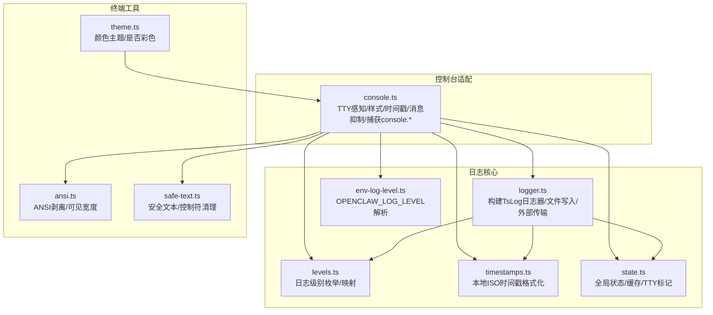
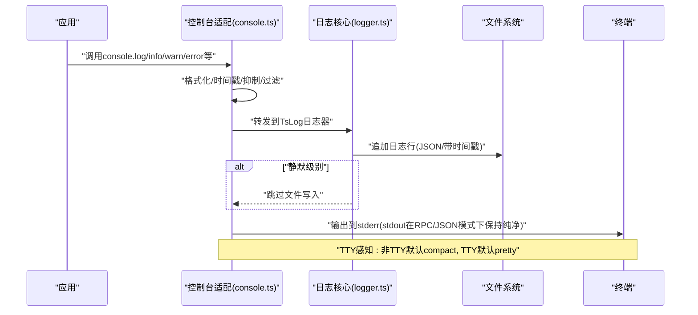
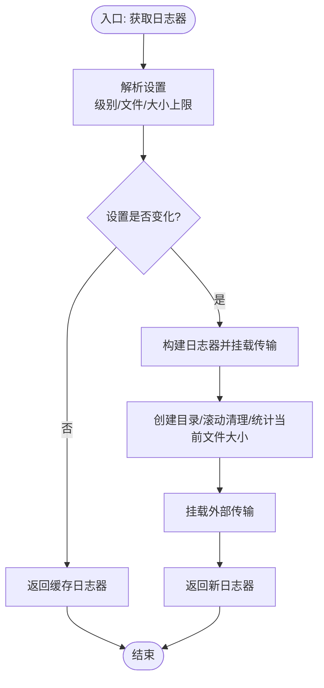
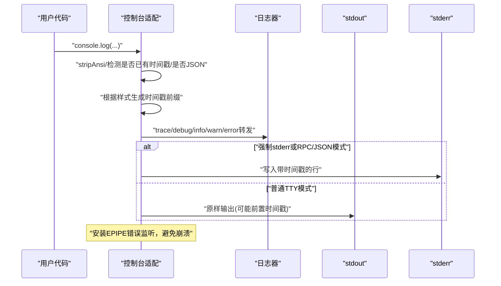
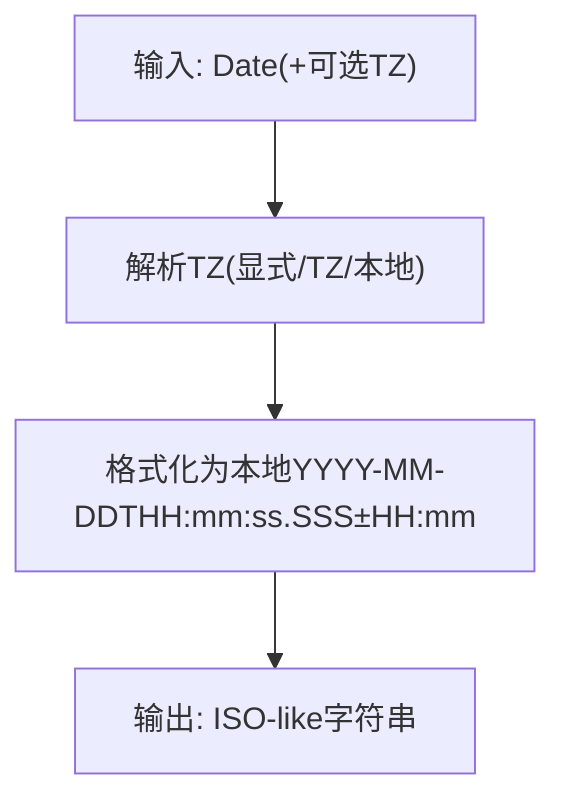
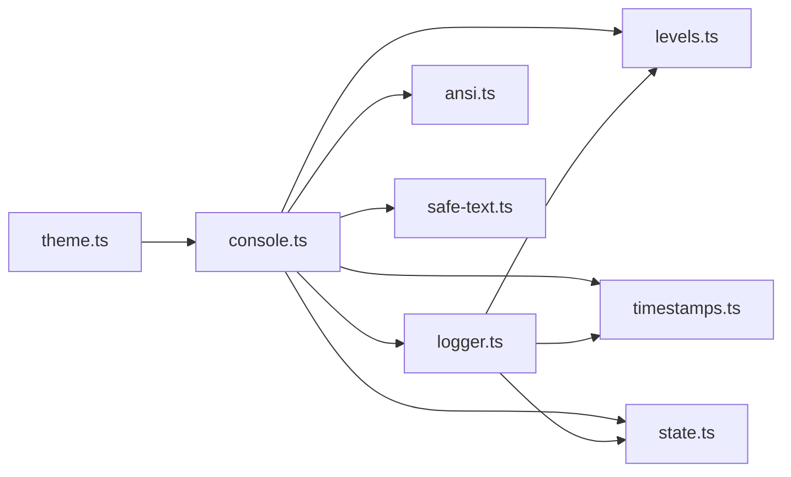

# 控制台日志

<cite>
**本文引用的文件**
- [src/logging/logger.ts](file://src/logging/logger.ts)
- [src/logging/console.ts](file://src/logging/console.ts)
- [src/logging/levels.ts](file://src/logging/levels.ts)
- [src/logging/env-log-level.ts](file://src/logging/env-log-level.ts)
- [src/logging/timestamps.ts](file://src/logging/timestamps.ts)
- [src/logging/state.ts](file://src/logging/state.ts)
- [src/terminal/theme.ts](file://src/terminal/theme.ts)
- [src/terminal/ansi.ts](file://src/terminal/ansi.ts)
- [src/terminal/safe-text.ts](file://src/terminal/safe-text.ts)
- [src/logging/console-settings.test.ts](file://src/logging/console-settings.test.ts)
- [src/logging/console-timestamp.test.ts](file://src/logging/console-timestamp.test.ts)
</cite>

## 目录
1. [简介](#简介)
2. [项目结构](#项目结构)
3. [核心组件](#核心组件)
4. [架构总览](#架构总览)
5. [组件详解](#组件详解)
6. [依赖关系分析](#依赖关系分析)
7. [性能考量](#性能考量)
8. [故障排查指南](#故障排查指南)
9. [结论](#结论)
10. [附录](#附录)

## 简介
本技术指南聚焦于 OpenClaw 的控制台日志系统，系统性阐述控制台输出的格式化机制（颜色主题、时间戳、TTY 感知）、日志级别过滤、环境变量配置与实时输出控制，并覆盖跨平台兼容性（ANSI 转义序列与字符编码）、调试模式、详细输出与静默模式、以及性能优化（缓冲与异步输出策略）。读者可据此在不同操作系统与终端环境下获得一致、可读、可控且高性能的日志体验。

## 项目结构
围绕控制台日志的关键模块分布如下：
- 日志核心：负责日志器构建、级别解析、文件滚动与大小限制、外部传输注册等
- 控制台适配：负责控制台样式选择、TTY 感知、消息前缀时间戳、消息抑制、捕获 console.* 输出并写入文件
- 时间戳与级别：提供本地 ISO 时间戳格式化与日志级别映射
- 终端主题与 ANSI：提供颜色主题、ANSI 剥离与可见宽度计算、安全文本处理
- 状态与环境：集中管理缓存状态、TTY 标记、静默/强制输出标记、子系统过滤等；支持环境变量覆盖

图表来源
- [src/logging/logger.ts](file://src/logging/logger.ts#L1-L348)
- [src/logging/console.ts](file://src/logging/console.ts#L1-L327)
- [src/logging/levels.ts](file://src/logging/levels.ts#L1-L38)
- [src/logging/env-log-level.ts](file://src/logging/env-log-level.ts#L1-L24)
- [src/logging/timestamps.ts](file://src/logging/timestamps.ts#L1-L37)
- [src/logging/state.ts](file://src/logging/state.ts#L1-L20)
- [src/terminal/theme.ts](file://src/terminal/theme.ts#L1-L31)
- [src/terminal/ansi.ts](file://src/terminal/ansi.ts#L1-L15)
- [src/terminal/safe-text.ts](file://src/terminal/safe-text.ts#L1-L21)

章节来源
- [src/logging/logger.ts](file://src/logging/logger.ts#L1-L348)
- [src/logging/console.ts](file://src/logging/console.ts#L1-L327)
- [src/logging/levels.ts](file://src/logging/levels.ts#L1-L38)
- [src/logging/env-log-level.ts](file://src/logging/env-log-level.ts#L1-L24)
- [src/logging/timestamps.ts](file://src/logging/timestamps.ts#L1-L37)
- [src/logging/state.ts](file://src/logging/state.ts#L1-L20)
- [src/terminal/theme.ts](file://src/terminal/theme.ts#L1-L31)
- [src/terminal/ansi.ts](file://src/terminal/ansi.ts#L1-L15)
- [src/terminal/safe-text.ts](file://src/terminal/safe-text.ts#L1-L21)

## 核心组件
- 日志器与文件输出
  - 使用第三方库构建日志器，按级别过滤输出；在“静默”级别下不写文件，仅保留外部传输
  - 文件采用滚动命名（按日期），并在写入前检查大小上限，超过则发出警告并抑制后续写入
  - 写入采用同步追加，但对异常进行吞吐以避免阻塞主流程
- 控制台样式与 TTY 感知
  - 控制台样式支持 pretty/compact/json；非 TTY 环境默认 compact，TTY 环境默认 pretty
  - 可通过开关为每条控制台输出添加时间戳前缀，支持本地 HH:MM:SS 或 ISO-like 带时区偏移
  - 支持子系统过滤，仅输出匹配前缀的消息
  - 提供消息抑制规则，避免冗余提示（如会话开启/关闭、特定慢监听告警）
- 级别与环境变量
  - 允许通过环境变量覆盖日志级别；非法值会记录一次警告
  - 测试模式下默认静默控制台输出，除非显式开启
- 终端主题与 ANSI
  - 提供基于调色板的颜色主题，支持 FORCE_COLOR/NO_COLOR 控制彩色输出
  - 提供 ANSI 剥离与可见宽度计算，保障日志一致性与表格渲染
  - 安全文本处理用于单行渲染，剔除控制符与换行符，确保日志整洁

章节来源
- [src/logging/logger.ts](file://src/logging/logger.ts#L115-L124)
- [src/logging/logger.ts](file://src/logging/logger.ts#L126-L184)
- [src/logging/console.ts](file://src/logging/console.ts#L40-L91)
- [src/logging/console.ts](file://src/logging/console.ts#L169-L178)
- [src/logging/console.ts](file://src/logging/console.ts#L132-L138)
- [src/logging/console.ts](file://src/logging/console.ts#L148-L162)
- [src/logging/env-log-level.ts](file://src/logging/env-log-level.ts#L4-L23)
- [src/terminal/theme.ts](file://src/terminal/theme.ts#L4-L27)
- [src/terminal/ansi.ts](file://src/terminal/ansi.ts#L8-L14)
- [src/terminal/safe-text.ts](file://src/terminal/safe-text.ts#L6-L20)

## 架构总览
控制台日志系统由“日志核心”和“控制台适配层”组成，二者通过统一的状态与配置解析协同工作。核心职责包括：
- 解析与缓存日志设置（级别、文件路径、大小上限）
- 构建日志器并挂载外部传输
- 处理文件滚动与大小限制
- 控制台适配层负责：
  - TTY 感知与样式选择
  - 时间戳前缀生成与插入
  - 消息抑制与子系统过滤
  - 捕获 console.* 并转发到文件日志器

图表来源
- [src/logging/console.ts](file://src/logging/console.ts#L203-L326)
- [src/logging/logger.ts](file://src/logging/logger.ts#L126-L184)

## 组件详解

### 日志器与文件输出（logger.ts）
- 设置解析与缓存
  - 优先从环境变量获取日志级别；否则从配置读取；测试模式下有快速路径
  - 缓存已解析设置，避免重复 IO 与配置加载
- 日志器构建
  - 使用第三方日志库构建，最小级别与类型（隐藏 ANSI）由设置决定
  - “静默”级别不写文件，仅保留外部传输
- 文件滚动与大小限制
  - 滚动文件名按日期生成；写入前计算字节，超过上限后发出一次性警告并抑制后续写入
  - 同步追加，异常吞吐，保证不阻塞业务
- 外部传输
  - 注册外部传输函数，日志对象触发时转发；异常吞吐，避免影响主流程

图表来源
- [src/logging/logger.ts](file://src/logging/logger.ts#L73-L106)
- [src/logging/logger.ts](file://src/logging/logger.ts#L210-L219)
- [src/logging/logger.ts](file://src/logging/logger.ts#L126-L184)

章节来源
- [src/logging/logger.ts](file://src/logging/logger.ts#L73-L106)
- [src/logging/logger.ts](file://src/logging/logger.ts#L115-L124)
- [src/logging/logger.ts](file://src/logging/logger.ts#L126-L184)
- [src/logging/logger.ts](file://src/logging/logger.ts#L210-L219)

### 控制台样式与 TTY 感知（console.ts）
- 样式与级别解析
  - 控制台级别：verbose 模式强制 debug；测试模式默认静默（除非显式开启）
  - 控制台样式：非 TTY 默认 compact，TTY 默认 pretty；支持 json
- 时间戳前缀
  - pretty 模式输出本地 HH:MM:SS；compact/json 模式输出本地 ISO-like 带时区偏移
  - 仅在未包含时间戳且非 JSON 负载时自动添加
- 消息抑制与子系统过滤
  - 抑制冗余提示（会话开启/关闭、特定慢监听告警）
  - 子系统过滤：支持精确匹配或前缀匹配
- 捕获 console.* 输出
  - 将 console.log/info/warn/error/debug/trace 转发至日志器
  - 异步 EPIPE 错误保护：安装流错误监听，避免管道关闭导致崩溃
  - 强制输出到 stderr：在 RPC/JSON 模式下保持 stdout 纯净

图表来源
- [src/logging/console.ts](file://src/logging/console.ts#L203-L326)
- [src/logging/console.ts](file://src/logging/console.ts#L169-L178)
- [src/logging/console.ts](file://src/logging/console.ts#L132-L138)
- [src/logging/console.ts](file://src/logging/console.ts#L148-L162)

章节来源
- [src/logging/console.ts](file://src/logging/console.ts#L40-L91)
- [src/logging/console.ts](file://src/logging/console.ts#L169-L178)
- [src/logging/console.ts](file://src/logging/console.ts#L132-L138)
- [src/logging/console.ts](file://src/logging/console.ts#L148-L162)
- [src/logging/console.ts](file://src/logging/console.ts#L203-L326)

### 时间戳与级别（timestamps.ts、levels.ts）
- 时间戳
  - 依据 TZ 或本地时区，生成带毫秒与时区偏移的本地 ISO 字符串
  - 支持校验时区有效性
- 级别
  - 定义允许级别集合与归一化逻辑
  - 将日志级别映射为内部最小级别数值，便于过滤

图表来源
- [src/logging/timestamps.ts](file://src/logging/timestamps.ts#L10-L36)

章节来源
- [src/logging/levels.ts](file://src/logging/levels.ts#L1-L38)
- [src/logging/timestamps.ts](file://src/logging/timestamps.ts#L1-L37)

### 终端主题与 ANSI（theme.ts、ansi.ts、safe-text.ts）
- 主题
  - 基于调色板定义强调色、信息色、成功色、警告色、错误色等
  - 支持 FORCE_COLOR/NO_COLOR 控制彩色等级
- ANSI
  - 提供 ANSI 与超链接转义序列剥离，以及可见宽度计算
- 安全文本
  - 单行渲染时剔除控制符与换行，确保日志整洁

章节来源
- [src/terminal/theme.ts](file://src/terminal/theme.ts#L1-L31)
- [src/terminal/ansi.ts](file://src/terminal/ansi.ts#L1-L15)
- [src/terminal/safe-text.ts](file://src/terminal/safe-text.ts#L1-L21)

### 环境变量与状态（env-log-level.ts、state.ts）
- 环境变量
  - OPENCLAW_LOG_LEVEL：覆盖日志级别；非法值仅记录一次警告
- 状态
  - 缓存日志器与设置、TTY 标记、强制 stderr、时间戳前缀、子系统过滤、重入解析保护、原始 console 引用等

章节来源
- [src/logging/env-log-level.ts](file://src/logging/env-log-level.ts#L1-L24)
- [src/logging/state.ts](file://src/logging/state.ts#L1-L20)

## 依赖关系分析
- 组件耦合
  - 控制台适配依赖日志核心、级别映射、时间戳格式化、ANSI 工具与状态
  - 日志核心依赖级别映射、时间戳格式化与状态（缓存）
  - 终端主题与 ANSI 为 UI/日志渲染提供支撑
- 外部依赖
  - 第三方日志库用于构建日志器与传输
  - Node 内置模块用于文件系统、路径与格式化

图表来源
- [src/logging/console.ts](file://src/logging/console.ts#L1-L327)
- [src/logging/logger.ts](file://src/logging/logger.ts#L1-L348)
- [src/logging/levels.ts](file://src/logging/levels.ts#L1-L38)
- [src/logging/timestamps.ts](file://src/logging/timestamps.ts#L1-L37)
- [src/logging/state.ts](file://src/logging/state.ts#L1-L20)
- [src/terminal/theme.ts](file://src/terminal/theme.ts#L1-L31)
- [src/terminal/ansi.ts](file://src/terminal/ansi.ts#L1-L15)
- [src/terminal/safe-text.ts](file://src/terminal/safe-text.ts#L1-L21)

章节来源
- [src/logging/console.ts](file://src/logging/console.ts#L1-L327)
- [src/logging/logger.ts](file://src/logging/logger.ts#L1-L348)

## 性能考量
- 缓冲与写入
  - 文件写入采用同步追加，简单可靠；异常吞吐避免阻塞
  - 在达到大小上限后发出一次性警告并抑制后续写入，降低频繁 IO 成本
- 级别过滤
  - 日志器最小级别与内部级别映射减少不必要的格式化与传输
- TTY 感知
  - 非 TTY 下默认 compact，减少多余时间戳与 ANSI 开销
- 外部传输
  - 传输失败不影响主流程，避免级联阻塞
- 异步错误处理
  - 安装流错误监听，避免 EPIPE 导致进程崩溃，提升稳定性

章节来源
- [src/logging/logger.ts](file://src/logging/logger.ts#L149-L178)
- [src/logging/logger.ts](file://src/logging/logger.ts#L287-L296)
- [src/logging/console.ts](file://src/logging/console.ts#L214-L225)

## 故障排查指南
- 控制台输出被吞掉或为空
  - 检查是否处于测试模式且未开启控制台输出
  - 检查子系统过滤是否将目标消息排除
  - 检查消息是否被抑制（冗余提示）
- 时间戳缺失或格式异常
  - 确认样式是否为 pretty/compact/json
  - 检查是否已存在时间戳或负载为 JSON
- 颜色主题无效
  - 检查 NO_COLOR/FORCE_COLOR 环境变量
- EPIPE 导致崩溃
  - 系统已安装错误监听；若仍出现，确认监听是否被覆盖或重置
- 文件写入停止
  - 达到大小上限后会抑制写入并输出警告；检查日志文件大小与上限配置

章节来源
- [src/logging/console-settings.test.ts](file://src/logging/console-settings.test.ts#L70-L89)
- [src/logging/console-timestamp.test.ts](file://src/logging/console-timestamp.test.ts#L1-L78)
- [src/logging/console.ts](file://src/logging/console.ts#L148-L162)
- [src/logging/console.ts](file://src/logging/console.ts#L214-L225)
- [src/logging/logger.ts](file://src/logging/logger.ts#L156-L171)

## 结论
OpenClaw 的控制台日志系统通过清晰的分层设计实现了高可读性与强健性：控制台适配层负责 TTY 感知、样式与消息处理，日志核心负责级别过滤、文件滚动与外部传输；终端工具提供颜色与 ANSI 支撑。配合环境变量覆盖、测试模式优化与 EPIPE 错误防护，系统在多平台与多场景下均能稳定输出高质量日志。

## 附录

### 环境变量与配置要点
- OPENCLAW_LOG_LEVEL：覆盖日志级别，非法值仅记录一次警告
- OPENCLAW_TEST_CONSOLE：测试模式下控制台输出开关
- OPENCLAW_TEST_FILE_LOG：测试模式下文件日志开关
- VITEST：测试运行标识
- FORCE_COLOR/NO_COLOR：控制彩色输出
- TZ：指定时间戳时区

章节来源
- [src/logging/env-log-level.ts](file://src/logging/env-log-level.ts#L4-L23)
- [src/logging/console.ts](file://src/logging/console.ts#L44-L72)
- [src/logging/timestamps.ts](file://src/logging/timestamps.ts#L10-L15)