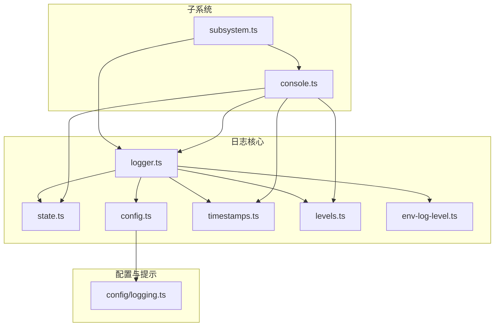
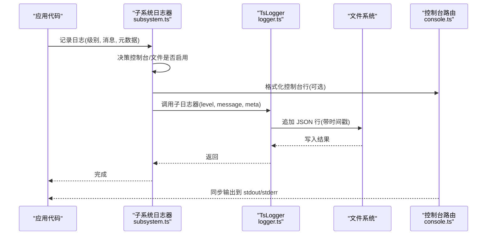
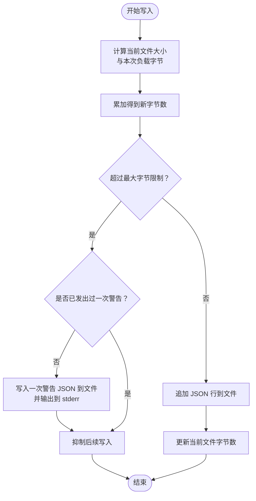
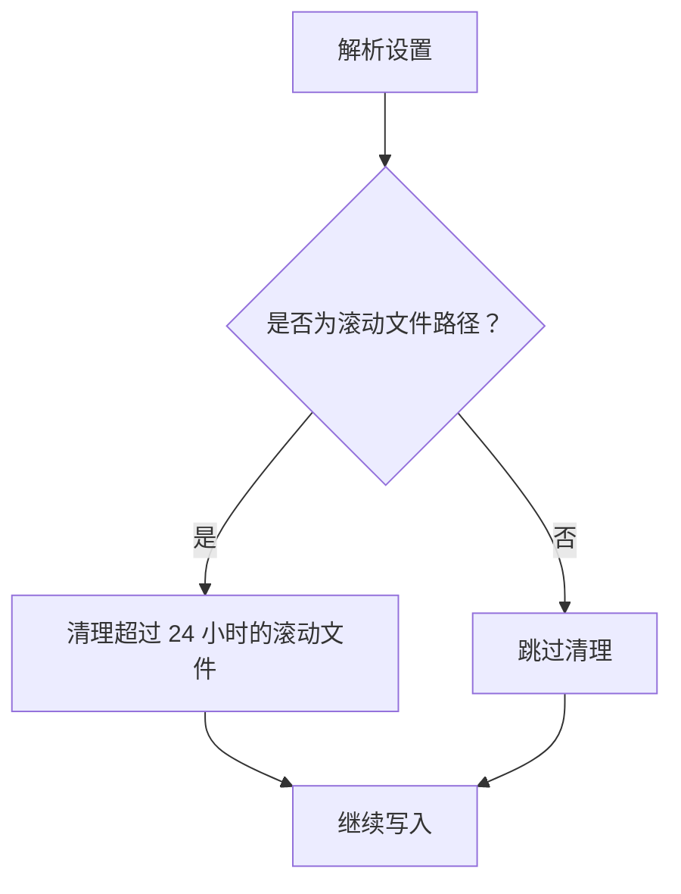
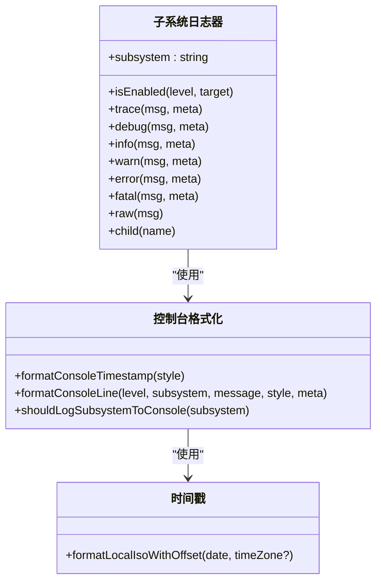
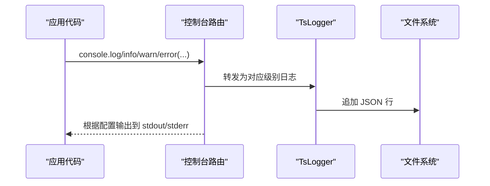
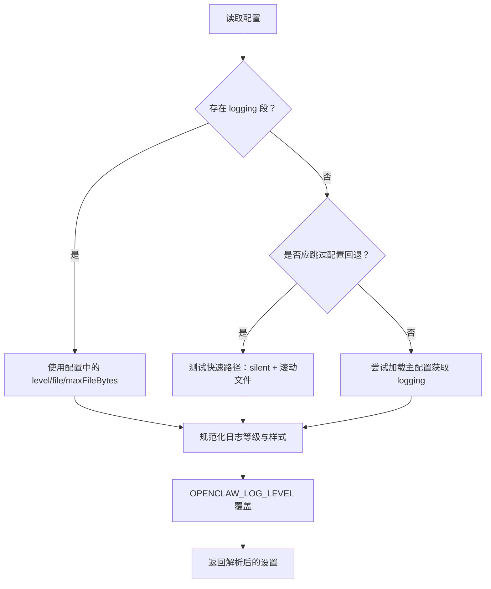
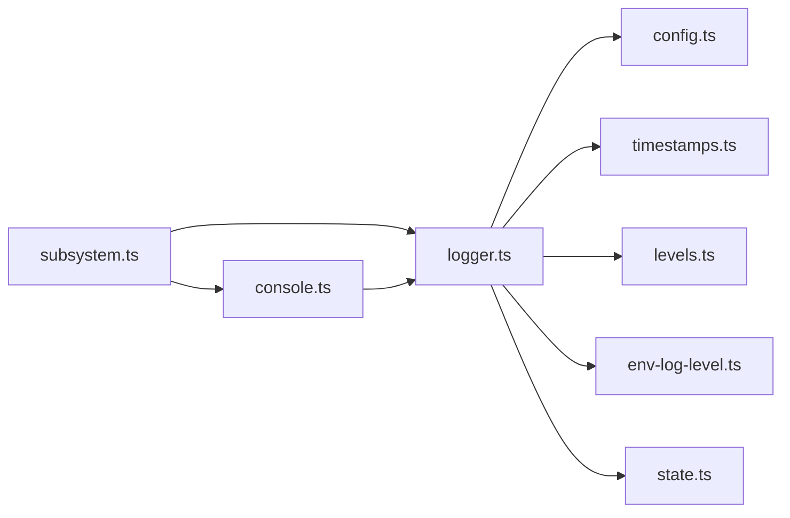

# 文件日志

<cite>
**本文引用的文件**
- [src/logging/logger.ts](file://src/logging/logger.ts)
- [src/logging/subsystem.ts](file://src/logging/subsystem.ts)
- [src/logging/config.ts](file://src/logging/config.ts)
- [src/logging/console.ts](file://src/logging/console.ts)
- [src/logging/timestamps.ts](file://src/logging/timestamps.ts)
- [src/logging/levels.ts](file://src/logging/levels.ts)
- [src/logging/env-log-level.ts](file://src/logging/env-log-level.ts)
- [src/logging/state.ts](file://src/logging/state.ts)
- [src/logging/log-file-size-cap.test.ts](file://src/logging/log-file-size-cap.test.ts)
- [src/logging/subsystem.test.ts](file://src/logging/subsystem.test.ts)
- [src/config/logging.ts](file://src/config/logging.ts)
</cite>

## 目录
1. [简介](#简介)
2. [项目结构](#项目结构)
3. [核心组件](#核心组件)
4. [架构总览](#架构总览)
5. [组件详解](#组件详解)
6. [依赖关系分析](#依赖关系分析)
7. [性能考量](#性能考量)
8. [故障排查指南](#故障排查指南)
9. [结论](#结论)
10. [附录](#附录)

## 简介
本文件日志系统为 OpenClaw 提供统一的文件日志能力，覆盖以下关键能力：
- 日志文件创建与写入：基于滚动文件命名（按日期），默认写入 JSON 格式行，支持文件大小上限控制与一次性警告提示。
- 路径与轮转：默认日志目录来自首选临时目录；当使用按日期命名的滚动文件时，自动清理超过保留期的历史文件。
- 时间戳与子系统标识：文件输出统一使用本地 ISO 时区格式时间戳；子系统日志在控制台与文件中分别展示与过滤。
- 生命周期与清理：按天滚动文件，保留最长达 24 小时；达到文件大小上限后抑制后续写入并仅发出一次警告。
- 权限与安全：通过 Node.js 文件系统接口进行写入，遵循进程运行用户权限；未显式设置额外权限位。
- 性能与可靠性：写入采用同步追加，避免阻塞；异常不中断主流程；控制台输出可路由至 stderr 以保持 stdout 清洁。

## 项目结构
围绕日志的核心模块分布如下：
- 日志核心：logger.ts（构建与缓存 TsLogger、解析配置、文件写入与大小限制、滚动清理）
- 子系统日志：subsystem.ts（按子系统生成日志器、控制台与文件双通路、消息格式化与过滤）
- 控制台：console.ts（控制台级别与样式、消息捕获、EPIPE 错误处理、时间戳前缀）
- 配置读取：config.ts（从配置文件读取 logging 段）
- 时间戳：timestamps.ts（本地 ISO 时间戳与时区偏移）
- 等级定义：levels.ts（日志等级枚举与映射）
- 环境覆盖：env-log-level.ts（OPENCLAW_LOG_LEVEL 环境变量）
- 全局状态：state.ts（缓存与开关）
- 配置更新提示：config/logging.ts（配置更新提示工具）

**图示来源**
- [src/logging/logger.ts](file://src/logging/logger.ts#L1-L348)
- [src/logging/subsystem.ts](file://src/logging/subsystem.ts#L1-L395)
- [src/logging/config.ts](file://src/logging/config.ts#L1-L25)
- [src/logging/console.ts](file://src/logging/console.ts#L1-L327)
- [src/logging/timestamps.ts](file://src/logging/timestamps.ts#L1-L37)
- [src/logging/levels.ts](file://src/logging/levels.ts#L1-L38)
- [src/logging/env-log-level.ts](file://src/logging/env-log-level.ts#L1-L24)
- [src/logging/state.ts](file://src/logging/state.ts#L1-L20)
- [src/config/logging.ts](file://src/config/logging.ts#L1-L19)

**章节来源**
- [src/logging/logger.ts](file://src/logging/logger.ts#L1-L348)
- [src/logging/subsystem.ts](file://src/logging/subsystem.ts#L1-L395)
- [src/logging/console.ts](file://src/logging/console.ts#L1-L327)
- [src/logging/config.ts](file://src/logging/config.ts#L1-L25)
- [src/logging/timestamps.ts](file://src/logging/timestamps.ts#L1-L37)
- [src/logging/levels.ts](file://src/logging/levels.ts#L1-L38)
- [src/logging/env-log-level.ts](file://src/logging/env-log-level.ts#L1-L24)
- [src/logging/state.ts](file://src/logging/state.ts#L1-L20)
- [src/config/logging.ts](file://src/config/logging.ts#L1-L19)

## 核心组件
- 日志构建器与缓存：负责解析配置、构建 TsLogger、注册传输、缓存设置与实例。
- 子系统日志器：按子系统生成日志器，同时向控制台与文件输出，支持消息过滤与格式化。
- 控制台路由与捕获：将 console.* 输出转发到文件日志，同时可强制输出到 stderr，保证 stdout 清洁。
- 配置读取：从配置文件读取 logging 段，支持环境变量覆盖。
- 时间戳格式化：统一输出本地 ISO 时间戳（含毫秒与时区偏移）。
- 等级与过滤：定义允许等级、映射最小等级阈值，用于文件与控制台输出决策。
- 环境变量覆盖：OPENCLAW_LOG_LEVEL 可覆盖日志等级，无效值会记录一次警告。
- 全局状态：缓存已解析设置、控制台开关、过滤器等。

**章节来源**
- [src/logging/logger.ts](file://src/logging/logger.ts#L1-L348)
- [src/logging/subsystem.ts](file://src/logging/subsystem.ts#L1-L395)
- [src/logging/console.ts](file://src/logging/console.ts#L1-L327)
- [src/logging/config.ts](file://src/logging/config.ts#L1-L25)
- [src/logging/timestamps.ts](file://src/logging/timestamps.ts#L1-L37)
- [src/logging/levels.ts](file://src/logging/levels.ts#L1-L38)
- [src/logging/env-log-level.ts](file://src/logging/env-log-level.ts#L1-L24)
- [src/logging/state.ts](file://src/logging/state.ts#L1-L20)

## 架构总览
下图展示了从应用调用到文件写入与控制台输出的整体流程。

**图示来源**
- [src/logging/subsystem.ts](file://src/logging/subsystem.ts#L276-L371)
- [src/logging/logger.ts](file://src/logging/logger.ts#L126-L184)
- [src/logging/console.ts](file://src/logging/console.ts#L203-L327)

## 组件详解

### 日志文件创建与写入
- 默认路径：默认日志目录来自首选临时目录；默认文件名兼容旧版单文件路径。
- 滚动策略：若使用按日期命名的滚动文件，则在构建日志器前清理超过 24 小时的历史文件。
- 写入流程：每次写入前计算当前文件大小与本次负载字节数之和；超过上限则仅发出一次警告并抑制后续写入，同时将警告信息写入文件与 stderr。
- JSON 输出：每条日志为一行 JSON，包含原始字段与新增 time 字段（本地 ISO 时间戳）。
- 大小限制：默认 500 MB；可通过配置项覆盖；非法或非正数值回退到默认。

**图示来源**
- [src/logging/logger.ts](file://src/logging/logger.ts#L149-L184)
- [src/logging/logger.ts](file://src/logging/logger.ts#L186-L208)
- [src/logging/timestamps.ts](file://src/logging/timestamps.ts#L10-L36)

**章节来源**
- [src/logging/logger.ts](file://src/logging/logger.ts#L15-L21)
- [src/logging/logger.ts](file://src/logging/logger.ts#L141-L184)
- [src/logging/logger.ts](file://src/logging/logger.ts#L186-L208)
- [src/logging/timestamps.ts](file://src/logging/timestamps.ts#L10-L36)
- [src/logging/log-file-size-cap.test.ts](file://src/logging/log-file-size-cap.test.ts#L45-L67)

### 文件路径配置与滚动
- 默认目录：来自首选临时目录。
- 默认文件：兼容旧版单文件路径。
- 滚动文件：按日期命名（如 openclaw-YYYY-MM-DD.log），位于默认目录下。
- 清理策略：保留最多 24 小时；超过则删除。
- 配置来源：优先使用日志配置段；若不可用且非特定命令场景，尝试加载主配置获取 logging 段。

**图示来源**
- [src/logging/logger.ts](file://src/logging/logger.ts#L103-L105)
- [src/logging/logger.ts](file://src/logging/logger.ts#L143-L145)
- [src/logging/logger.ts](file://src/logging/logger.ts#L314-L321)
- [src/logging/logger.ts](file://src/logging/logger.ts#L323-L347)
- [src/logging/config.ts](file://src/logging/config.ts#L8-L24)

**章节来源**
- [src/logging/logger.ts](file://src/logging/logger.ts#L15-L21)
- [src/logging/logger.ts](file://src/logging/logger.ts#L103-L105)
- [src/logging/logger.ts](file://src/logging/logger.ts#L309-L321)
- [src/logging/logger.ts](file://src/logging/logger.ts#L323-L347)
- [src/logging/config.ts](file://src/logging/config.ts#L8-L24)

### JSON 格式化、时间戳与子系统标识
- JSON 输出：每条日志为一行 JSON，包含原始字段与 time 字段（本地 ISO 时间戳）。
- 时间戳：使用本地时区格式，包含毫秒与时区偏移。
- 子系统标识：控制台输出时可裁剪冗余前缀，文件输出保留完整子系统键；支持按子系统过滤控制台输出。

**图示来源**
- [src/logging/subsystem.ts](file://src/logging/subsystem.ts#L17-L28)
- [src/logging/subsystem.ts](file://src/logging/subsystem.ts#L193-L235)
- [src/logging/console.ts](file://src/logging/console.ts#L169-L178)
- [src/logging/timestamps.ts](file://src/logging/timestamps.ts#L10-L36)

**章节来源**
- [src/logging/subsystem.ts](file://src/logging/subsystem.ts#L193-L235)
- [src/logging/console.ts](file://src/logging/console.ts#L169-L178)
- [src/logging/timestamps.ts](file://src/logging/timestamps.ts#L10-L36)

### 控制台与文件双通路
- 控制台：支持 pretty/compact/json 三种样式；可强制输出到 stderr；可按子系统过滤；可为非 JSON 行添加时间戳前缀。
- 文件：统一 JSON 行；包含时间戳与子系统键；受日志等级与大小上限控制。
- 捕获：将 console.* 输出转发到文件日志，确保所有输出被记录。

**图示来源**
- [src/logging/console.ts](file://src/logging/console.ts#L203-L327)
- [src/logging/logger.ts](file://src/logging/logger.ts#L149-L184)

**章节来源**
- [src/logging/console.ts](file://src/logging/console.ts#L113-L138)
- [src/logging/console.ts](file://src/logging/console.ts#L203-L327)
- [src/logging/logger.ts](file://src/logging/logger.ts#L149-L184)

### 配置与环境变量
- 配置读取：从配置文件读取 logging 段；若不可用且非特定命令，尝试加载主配置。
- 环境覆盖：OPENCLAW_LOG_LEVEL 可覆盖日志等级；无效值会记录一次警告。
- 测试快速路径：在特定测试环境下跳过配置读取，直接返回静默文件日志设置。

**图示来源**
- [src/logging/logger.ts](file://src/logging/logger.ts#L73-L106)
- [src/logging/config.ts](file://src/logging/config.ts#L8-L24)
- [src/logging/env-log-level.ts](file://src/logging/env-log-level.ts#L4-L23)
- [src/logging/console.ts](file://src/logging/console.ts#L60-L91)

**章节来源**
- [src/logging/logger.ts](file://src/logging/logger.ts#L73-L106)
- [src/logging/config.ts](file://src/logging/config.ts#L8-L24)
- [src/logging/env-log-level.ts](file://src/logging/env-log-level.ts#L4-L23)
- [src/logging/console.ts](file://src/logging/console.ts#L60-L91)

### 生命周期管理、备份与清理
- 生命周期：按需构建 TsLogger 并缓存；当设置变更时重建。
- 备份策略：未实现自动压缩或复制备份；滚动文件通过保留期清理实现“软备份”。
- 清理机制：按天滚动文件；超过 24 小时的历史文件删除。

**章节来源**
- [src/logging/logger.ts](file://src/logging/logger.ts#L108-L113)
- [src/logging/logger.ts](file://src/logging/logger.ts#L323-L347)

### 错误处理、故障恢复与完整性
- 写入失败：捕获异常，避免阻断主流程；控制台输出同样不会因日志失败而中断。
- EPIPE 错误：监听 stdout/stderr 的异步错误，避免管道关闭导致崩溃。
- 完整性：文件写入为追加模式；达到大小上限后抑制写入但不破坏现有内容；警告信息独立 JSON 行记录。

**章节来源**
- [src/logging/logger.ts](file://src/logging/logger.ts#L149-L184)
- [src/logging/console.ts](file://src/logging/console.ts#L164-L167)
- [src/logging/console.ts](file://src/logging/console.ts#L214-L225)
- [src/logging/console.ts](file://src/logging/console.ts#L282-L284)

## 依赖关系分析
- 模块耦合：
  - subsystem.ts 依赖 logger.ts 的子日志器与文件写入能力。
  - console.ts 依赖 logger.ts 的全局日志器与时间戳格式化。
  - logger.ts 依赖 config.ts、timestamps.ts、levels.ts、env-log-level.ts、state.ts。
- 外部依赖：tslog（日志库）、json5（配置解析）、Node.js fs/path/util。

**图示来源**
- [src/logging/subsystem.ts](file://src/logging/subsystem.ts#L1-L13)
- [src/logging/console.ts](file://src/logging/console.ts#L1-L11)
- [src/logging/logger.ts](file://src/logging/logger.ts#L1-L13)

**章节来源**
- [src/logging/subsystem.ts](file://src/logging/subsystem.ts#L1-L13)
- [src/logging/console.ts](file://src/logging/console.ts#L1-L11)
- [src/logging/logger.ts](file://src/logging/logger.ts#L1-L13)

## 性能考量
- 写入路径：同步追加写入，避免锁竞争与复杂缓冲；适合 CLI/守护进程场景。
- 缓存策略：日志器与设置缓存减少重复构建与 IO。
- 测试优化：在特定测试环境下跳过配置读取，提升启动速度。
- 控制台输出：非 JSON 行可选择添加时间戳前缀，避免重复格式化开销。

[本节为通用性能讨论，无需列出具体文件来源]

## 故障排查指南
- 日志未落盘：
  - 检查日志等级与目标（文件/控制台）是否启用。
  - 若达到大小上限，系统会抑制写入并输出一次警告；检查 stderr 与日志文件末尾。
- 控制台输出异常：
  - 确认是否强制输出到 stderr（RPC/JSON 模式）。
  - 检查子系统过滤器是否屏蔽了目标子系统。
- 时间戳显示问题：
  - 控制台样式为 json 时不添加时间戳前缀；其他样式会添加本地时间戳。
- 配置不生效：
  - 确认配置文件路径与格式；检查 OPENCLAW_LOG_LEVEL 是否为有效等级。

**章节来源**
- [src/logging/log-file-size-cap.test.ts](file://src/logging/log-file-size-cap.test.ts#L45-L67)
- [src/logging/subsystem.test.ts](file://src/logging/subsystem.test.ts#L40-L56)
- [src/logging/console.ts](file://src/logging/console.ts#L113-L138)
- [src/logging/console.ts](file://src/logging/console.ts#L169-L178)
- [src/logging/env-log-level.ts](file://src/logging/env-log-level.ts#L4-L23)

## 结论
OpenClaw 文件日志系统以简洁可靠为核心设计原则：按天滚动、统一 JSON 输出、严格的大小上限与一次性警告、控制台与文件双通路、以及完善的错误与边界处理。该方案在 CLI 与服务场景下具备良好的可维护性与可观测性。

[本节为总结性内容，无需列出具体文件来源]

## 附录
- 配置更新提示：提供配置路径格式化与更新提示工具，便于在配置变更时输出用户可见信息。

**章节来源**
- [src/config/logging.ts](file://src/config/logging.ts#L10-L18)