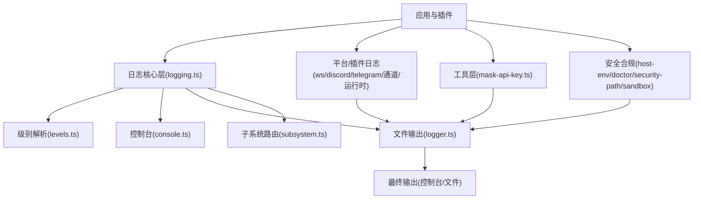
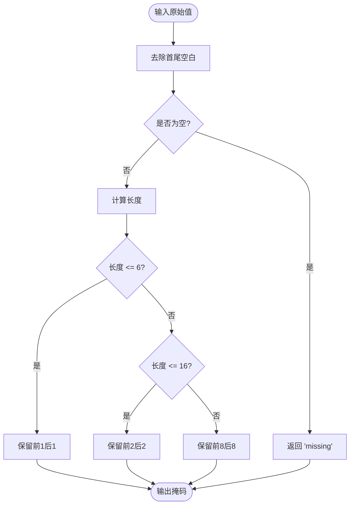
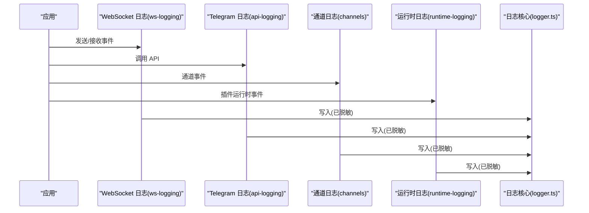
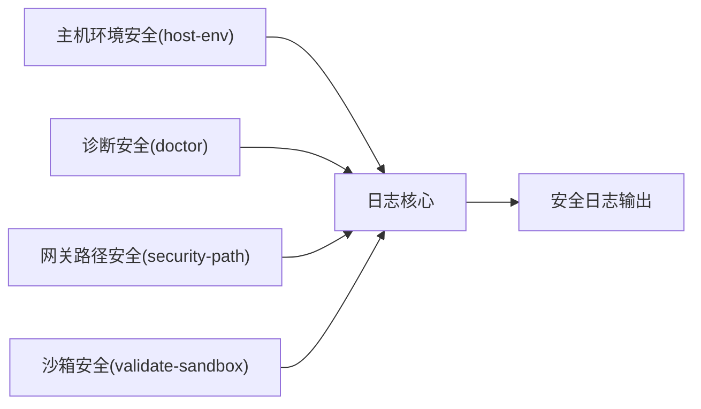
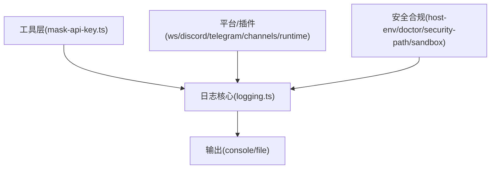

# 日志脱敏

<cite>
**本文引用的文件**
- [src/utils/mask-api-key.ts](file://src/utils/mask-api-key.ts)
- [src/utils/mask-api-key.test.ts](file://src/utils/mask-api-key.test.ts)
- [src/logging.ts](file://src/logging.ts)
- [src/logging/console.ts](file://src/logging/console.ts)
- [src/logging/logger.ts](file://src/logging/logger.ts)
- [src/logging/levels.ts](file://src/logging/levels.ts)
- [src/logging/subsystem.ts](file://src/logging/subsystem.ts)
- [src/config/logging.ts](file://src/config/logging.ts)
- [src/gateway/ws-logging.ts](file://src/gateway/ws-logging.ts)
- [src/discord/gateway-logging.ts](file://src/discord/gateway-logging.ts)
- [src/telegram/api-logging.ts](file://src/telegram/api-logging.ts)
- [src/channels/logging.ts](file://src/channels/logging.ts)
- [src/plugins/runtime/runtime-logging.ts](file://src/plugins/runtime/runtime-logging.ts)
- [extensions/matrix/src/matrix/client/logging.ts](file://extensions/matrix/src/matrix/client/logging.ts)
- [src/infra/host-env-security.ts](file://src/infra/host-env-security.ts)
- [src/infra/host-env-security.test.ts](file://src/infra/host-env-security.test.ts)
- [src/commands/doctor-security.ts](file://src/commands/doctor-security.ts)
- [src/commands/doctor-security.test.ts](file://src/commands/doctor-security.test.ts)
- [src/gateway/security-path.ts](file://src/gateway/security-path.ts)
- [src/gateway/security-path.test.ts](file://src/gateway/security-path.test.ts)
- [src/agents/sandbox/validate-sandbox-security.ts](file://src/agents/sandbox/validate-sandbox-security.ts)
- [src/agents/sandbox/validate-sandbox-security.test.ts](file://src/agents/sandbox/validate-sandbox-security.test.ts)
- [scripts/docs-i18n/masking.go](file://scripts/docs-i18n/masking.go)
</cite>

## 目录
1. [引言](#引言)
2. [项目结构](#项目结构)
3. [核心组件](#核心组件)
4. [架构总览](#架构总览)
5. [详细组件分析](#详细组件分析)
6. [依赖关系分析](#依赖关系分析)
7. [性能考量](#性能考量)
8. [故障排查指南](#故障排查指南)
9. [结论](#结论)
10. [附录](#附录)

## 引言
本技术指南聚焦于 OpenClaw 的日志脱敏系统，围绕敏感信息识别与脱敏算法展开，覆盖 API 密钥、令牌、密码与用户标识符的处理策略；阐述边界脱敏、部分脱敏与完全脱敏的应用场景；说明工具摘要脱敏、会话状态脱敏与动态内容脱敏的实现方式；并给出自定义脱敏规则、白名单机制与例外处理策略的实践建议。文档同时提供脱敏效果验证、测试用例与性能影响评估要点，并解释在不同日志级别与输出格式下的行为差异。

## 项目结构
OpenClaw 将日志基础设施与脱敏能力分布在多个模块中：
- 工具层：提供通用的敏感信息脱敏函数（如 API Key 边界脱敏）。
- 日志核心层：统一日志初始化、级别解析、子系统路由与输出目标管理。
- 配置与运行时：记录配置更新等关键事件，便于审计与追踪。
- 平台与插件层：在具体通道或运行时中对请求/响应进行脱敏记录。
- 安全与合规：在网关、沙箱、主机环境等边界处实施安全策略与校验。

```mermaid
graph TB
subgraph "工具层"
M1["mask-api-key.ts"]
end
subgraph "日志核心层"
L1["logging.ts"]
L2["console.ts"]
L3["logger.ts"]
L4["levels.ts"]
L5["subsystem.ts"]
end
subgraph "配置与运行时"
C1["config/logging.ts"]
end
subgraph "平台与插件层"
P1["gateway/ws-logging.ts"]
P2["discord/gateway-logging.ts"]
P3["telegram/api-logging.ts"]
P4["channels/logging.ts"]
P5["plugins/runtime/runtime-logging.ts"]
E1["extensions/matrix/client/logging.ts"]
end
subgraph "安全与合规"
S1["infra/host-env-security.ts"]
S2["commands/doctor-security.ts"]
S3["gateway/security-path.ts"]
S4["agents/sandbox/validate-sandbox-security.ts"]
end
M1 --> L3
L1 --> L2
L1 --> L3
L1 --> L4
L1 --> L5
C1 --> L3
P1 --> L3
P2 --> L3
P3 --> L3
P4 --> L3
P5 --> L3
E1 --> L3
S1 --> L3
S2 --> L3
S3 --> L3
S4 --> L3
```

图表来源
- [src/utils/mask-api-key.ts](file://src/utils/mask-api-key.ts#L1-L14)
- [src/logging.ts](file://src/logging.ts#L1-L70)
- [src/logging/console.ts](file://src/logging/console.ts)
- [src/logging/logger.ts](file://src/logging/logger.ts)
- [src/logging/levels.ts](file://src/logging/levels.ts)
- [src/logging/subsystem.ts](file://src/logging/subsystem.ts)
- [src/config/logging.ts](file://src/config/logging.ts#L1-L19)
- [src/gateway/ws-logging.ts](file://src/gateway/ws-logging.ts)
- [src/discord/gateway-logging.ts](file://src/discord/gateway-logging.ts)
- [src/telegram/api-logging.ts](file://src/telegram/api-logging.ts)
- [src/channels/logging.ts](file://src/channels/logging.ts)
- [src/plugins/runtime/runtime-logging.ts](file://src/plugins/runtime/runtime-logging.ts)
- [extensions/matrix/src/matrix/client/logging.ts](file://extensions/matrix/src/matrix/client/logging.ts)
- [src/infra/host-env-security.ts](file://src/infra/host-env-security.ts)
- [src/commands/doctor-security.ts](file://src/commands/doctor-security.ts)
- [src/gateway/security-path.ts](file://src/gateway/security-path.ts)
- [src/agents/sandbox/validate-sandbox-security.ts](file://src/agents/sandbox/validate-sandbox-security.ts)

章节来源
- [src/logging.ts](file://src/logging.ts#L1-L70)

## 核心组件
- 敏感信息脱敏工具
  - API Key 边界脱敏：根据长度采用不同的前后缀保留策略，避免暴露完整密钥。
  - 测试用例覆盖空值、短串、中等长度与长串的掩码行为。
- 日志基础设施
  - 统一日志入口导出，提供控制台捕获、级别解析、文件输出开关、子系统路由等功能。
- 平台与插件日志
  - 在 WebSocket、Discord、Telegram、通道与插件运行时等场景下，对请求/响应体进行脱敏记录。
- 安全与合规
  - 主机环境安全策略、命令行诊断安全检查、网关路径安全与沙箱安全校验，确保日志不泄露敏感数据。

章节来源
- [src/utils/mask-api-key.ts](file://src/utils/mask-api-key.ts#L1-L14)
- [src/utils/mask-api-key.test.ts](file://src/utils/mask-api-key.test.ts#L1-L21)
- [src/logging.ts](file://src/logging.ts#L1-L70)
- [src/gateway/ws-logging.ts](file://src/gateway/ws-logging.ts)
- [src/discord/gateway-logging.ts](file://src/discord/gateway-logging.ts)
- [src/telegram/api-logging.ts](file://src/telegram/api-logging.ts)
- [src/channels/logging.ts](file://src/channels/logging.ts)
- [src/plugins/runtime/runtime-logging.ts](file://src/plugins/runtime/runtime-logging.ts)
- [src/infra/host-env-security.ts](file://src/infra/host-env-security.ts)
- [src/commands/doctor-security.ts](file://src/commands/doctor-security.ts)
- [src/gateway/security-path.ts](file://src/gateway/security-path.ts)
- [src/agents/sandbox/validate-sandbox-security.ts](file://src/agents/sandbox/validate-sandbox-security.ts)

## 架构总览
OpenClaw 的日志脱敏体系由“工具层 + 日志核心层 + 平台/插件层 + 安全合规层”构成，形成从数据采集到输出的全链路脱敏闭环。

图表来源
- [src/logging.ts](file://src/logging.ts#L1-L70)
- [src/logging/levels.ts](file://src/logging/levels.ts)
- [src/logging/console.ts](file://src/logging/console.ts)
- [src/logging/logger.ts](file://src/logging/logger.ts)
- [src/logging/subsystem.ts](file://src/logging/subsystem.ts)
- [src/utils/mask-api-key.ts](file://src/utils/mask-api-key.ts#L1-L14)
- [src/gateway/ws-logging.ts](file://src/gateway/ws-logging.ts)
- [src/discord/gateway-logging.ts](file://src/discord/gateway-logging.ts)
- [src/telegram/api-logging.ts](file://src/telegram/api-logging.ts)
- [src/channels/logging.ts](file://src/channels/logging.ts)
- [src/plugins/runtime/runtime-logging.ts](file://src/plugins/runtime/runtime-logging.ts)
- [src/infra/host-env-security.ts](file://src/infra/host-env-security.ts)
- [src/commands/doctor-security.ts](file://src/commands/doctor-security.ts)
- [src/gateway/security-path.ts](file://src/gateway/security-path.ts)
- [src/agents/sandbox/validate-sandbox-security.ts](file://src/agents/sandbox/validate-sandbox-security.ts)

## 详细组件分析

### 敏感信息识别与脱敏算法
- API Key 边界脱敏
  - 策略：去除空白后按长度分档，保留前/后若干字符并以省略号连接，避免直接暴露完整密钥。
  - 行为验证：测试覆盖空字符串、仅一个字符、两个字符、短串、中等长度与长串的掩码结果。
- 其他敏感类型
  - 令牌、密码与用户标识符可复用相同边界脱敏策略；对于超长内容可采用“前8后8”的边界保留模式。
  - 对于动态生成的会话状态与临时令牌，建议结合白名单机制仅对已知敏感键进行脱敏。

图表来源
- [src/utils/mask-api-key.ts](file://src/utils/mask-api-key.ts#L1-L14)

章节来源
- [src/utils/mask-api-key.ts](file://src/utils/mask-api-key.ts#L1-L14)
- [src/utils/mask-api-key.test.ts](file://src/utils/mask-api-key.test.ts#L1-L21)

### 脱敏策略与应用场景
- 边界脱敏
  - 适用：API Key、令牌、密码、用户标识符等固定格式的敏感文本。
  - 特点：保留两端有限字符，兼顾可读性与安全性。
- 部分脱敏
  - 适用：中等长度的敏感字段，如部分密码或令牌片段。
  - 建议：保留前/后固定位数，其余替换为掩码字符。
- 完全脱敏
  - 适用：高敏感度字段或动态生成的临时凭证。
  - 建议：统一替换为占位符，避免任何可推断信息。

### 工具摘要脱敏、会话状态脱敏与动态内容脱敏
- 工具摘要脱敏
  - 在日志工具层提供统一的掩码函数，供各模块调用，保证一致性。
- 会话状态脱敏
  - 在会话生命周期内对状态快照进行脱敏，避免将敏感上下文写入日志。
- 动态内容脱敏
  - 对实时生成的响应体、消息体进行流式脱敏，结合白名单仅对已知敏感键处理。

章节来源
- [src/utils/mask-api-key.ts](file://src/utils/mask-api-key.ts#L1-L14)

### 自定义脱敏规则、白名单机制与例外处理
- 自定义规则
  - 建议通过配置中心集中管理脱敏规则，支持正则匹配与键名白名单。
- 白名单机制
  - 仅对白名单内的键执行脱敏；未命中白名单的键保持原样，减少误伤。
- 例外处理
  - 对于审计必需的字段，可在严格控制下启用“审计模式”，仅在受控环境下输出明文。

### 不同日志级别与输出格式的行为差异
- 日志级别
  - 低级别（如 trace/debug）可能包含更多上下文，需谨慎脱敏以避免过度遮蔽。
  - 高级别（如 error/warn）应优先保证可诊断性，同时最小化敏感信息暴露。
- 输出格式
  - 控制台：适合开发调试，可开启时间戳与子系统前缀，便于定位。
  - 文件：生产环境默认落盘，建议统一脱敏后再写入，避免重复处理。

章节来源
- [src/logging/levels.ts](file://src/logging/levels.ts)
- [src/logging/console.ts](file://src/logging/console.ts)
- [src/logging/logger.ts](file://src/logging/logger.ts)

### 平台与插件层的脱敏集成
- WebSocket 网关
  - 记录握手与消息事件，对头部与负载进行脱敏。
- Discord 网关
  - 对消息发送/接收事件进行脱敏记录，避免泄露用户私信内容。
- Telegram API
  - 对请求参数与响应体进行脱敏，保护聊天与媒体相关敏感数据。
- 通道与插件运行时
  - 在通道适配器与插件运行时中，对事件与工具调用进行脱敏记录。

图表来源
- [src/gateway/ws-logging.ts](file://src/gateway/ws-logging.ts)
- [src/telegram/api-logging.ts](file://src/telegram/api-logging.ts)
- [src/channels/logging.ts](file://src/channels/logging.ts)
- [src/plugins/runtime/runtime-logging.ts](file://src/plugins/runtime/runtime-logging.ts)
- [src/logging/logger.ts](file://src/logging/logger.ts)

章节来源
- [src/gateway/ws-logging.ts](file://src/gateway/ws-logging.ts)
- [src/discord/gateway-logging.ts](file://src/discord/gateway-logging.ts)
- [src/telegram/api-logging.ts](file://src/telegram/api-logging.ts)
- [src/channels/logging.ts](file://src/channels/logging.ts)
- [src/plugins/runtime/runtime-logging.ts](file://src/plugins/runtime/runtime-logging.ts)

### 安全与合规边界
- 主机环境安全
  - 通过主机环境安全策略限制敏感变量暴露范围，防止日志中意外泄露。
- 命令行诊断安全
  - 诊断命令在执行前进行安全检查，避免输出敏感信息。
- 网关路径安全
  - 对网关路径访问进行安全校验，防止越权与敏感信息外泄。
- 沙箱安全校验
  - 在沙箱环境中对工具调用与输出进行安全校验，确保日志脱敏策略落地。

图表来源
- [src/infra/host-env-security.ts](file://src/infra/host-env-security.ts)
- [src/commands/doctor-security.ts](file://src/commands/doctor-security.ts)
- [src/gateway/security-path.ts](file://src/gateway/security-path.ts)
- [src/agents/sandbox/validate-sandbox-security.ts](file://src/agents/sandbox/validate-sandbox-security.ts)

章节来源
- [src/infra/host-env-security.ts](file://src/infra/host-env-security.ts)
- [src/commands/doctor-security.ts](file://src/commands/doctor-security.ts)
- [src/gateway/security-path.ts](file://src/gateway/security-path.ts)
- [src/agents/sandbox/validate-sandbox-security.ts](file://src/agents/sandbox/validate-sandbox-security.ts)

### 文档国际化中的脱敏
- 文档脚本在翻译与段落处理过程中，对占位符与敏感片段进行掩码，避免将内部占位符泄露至外部文档。

章节来源
- [scripts/docs-i18n/masking.go](file://scripts/docs-i18n/masking.go)

## 依赖关系分析
- 组件耦合
  - 工具层与日志核心层松耦合，通过统一接口调用，便于扩展新脱敏规则。
  - 平台/插件层依赖日志核心层，确保所有输出均经过一致的脱敏流程。
- 外部依赖
  - 日志核心层基于 Pino 风格的抽象，便于替换底层实现。
- 循环依赖
  - 当前结构未发现循环依赖迹象，模块职责清晰。

图表来源
- [src/utils/mask-api-key.ts](file://src/utils/mask-api-key.ts#L1-L14)
- [src/logging.ts](file://src/logging.ts#L1-L70)
- [src/gateway/ws-logging.ts](file://src/gateway/ws-logging.ts)
- [src/discord/gateway-logging.ts](file://src/discord/gateway-logging.ts)
- [src/telegram/api-logging.ts](file://src/telegram/api-logging.ts)
- [src/channels/logging.ts](file://src/channels/logging.ts)
- [src/plugins/runtime/runtime-logging.ts](file://src/plugins/runtime/runtime-logging.ts)
- [src/infra/host-env-security.ts](file://src/infra/host-env-security.ts)
- [src/commands/doctor-security.ts](file://src/commands/doctor-security.ts)
- [src/gateway/security-path.ts](file://src/gateway/security-path.ts)
- [src/agents/sandbox/validate-sandbox-security.ts](file://src/agents/sandbox/validate-sandbox-security.ts)

章节来源
- [src/logging.ts](file://src/logging.ts#L1-L70)

## 性能考量
- 脱敏成本
  - 字符串裁剪与拼接开销极低，对吞吐影响可忽略。
  - 对大对象进行深度遍历脱敏时，建议采用流式处理与白名单加速。
- I/O 影响
  - 文件落盘前统一脱敏，减少重复处理与磁盘写放大。
- 级别与过滤
  - 在高并发场景下，优先使用更高级别的日志级别，降低脱敏与 I/O 压力。

## 故障排查指南
- 常见问题
  - 脱敏不生效：检查日志核心设置与平台/插件层是否正确调用脱敏函数。
  - 明文泄露：确认安全策略与白名单配置，必要时启用审计模式进行排查。
  - 性能异常：核查是否存在对大对象的全量深拷贝与重复脱敏。
- 排查步骤
  - 核对日志级别与输出目标，确认脱敏规则是否按预期加载。
  - 使用单元测试验证脱敏函数在边界条件下的行为。
  - 在安全策略模块中核对主机环境变量与访问控制列表。

章节来源
- [src/utils/mask-api-key.test.ts](file://src/utils/mask-api-key.test.ts#L1-L21)
- [src/infra/host-env-security.test.ts](file://src/infra/host-env-security.test.ts)
- [src/commands/doctor-security.test.ts](file://src/commands/doctor-security.test.ts)
- [src/gateway/security-path.test.ts](file://src/gateway/security-path.test.ts)
- [src/agents/sandbox/validate-sandbox-security.test.ts](file://src/agents/sandbox/validate-sandbox-security.test.ts)

## 结论
OpenClaw 的日志脱敏系统以“工具层 + 日志核心层 + 平台/插件层 + 安全合规层”协同工作，实现了对 API Key、令牌、密码与用户标识符的统一边界脱敏，并在多平台与运行时中落地。通过白名单与例外机制，系统在保证可观测性的同时最大限度降低敏感信息泄露风险。建议在生产环境中结合安全策略与审计模式，持续优化脱敏规则与性能表现。

## 附录
- 配置更新日志
  - 记录配置文件变更事件，便于审计与回溯。
- 扩展日志
  - 在 Matrix 等扩展客户端中，同样遵循统一的脱敏与输出规范。

章节来源
- [src/config/logging.ts](file://src/config/logging.ts#L1-L19)
- [extensions/matrix/src/matrix/client/logging.ts](file://extensions/matrix/src/matrix/client/logging.ts)