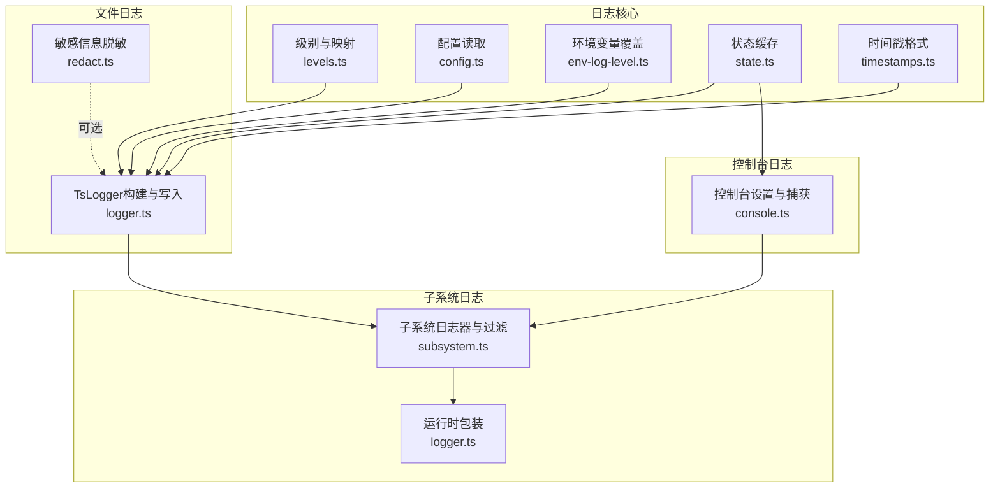
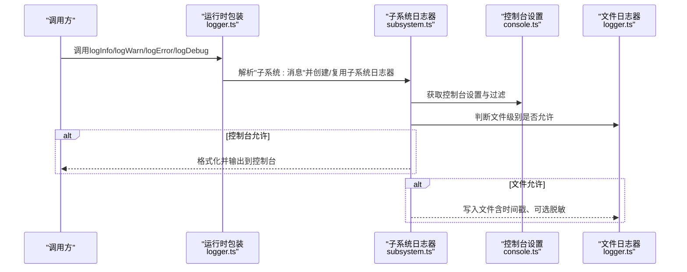
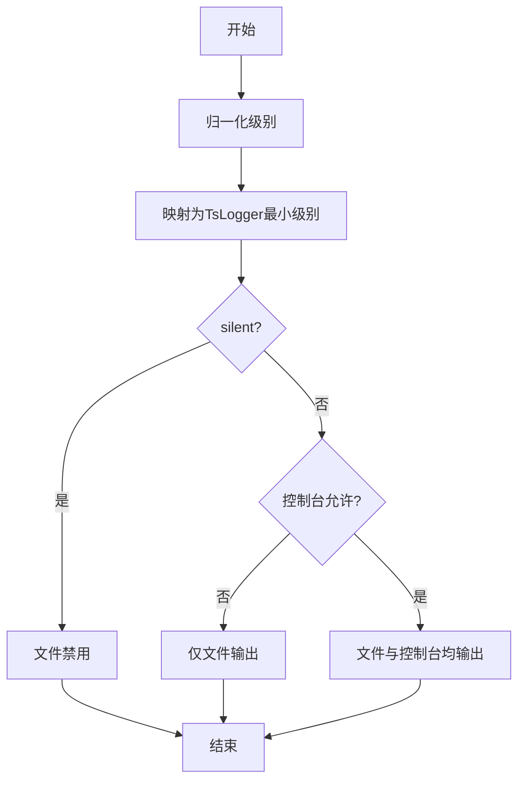
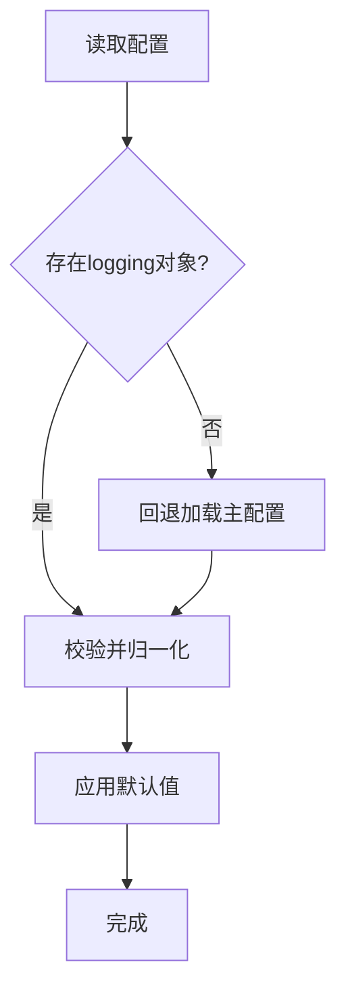
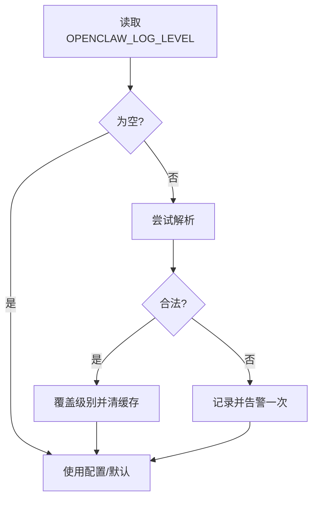
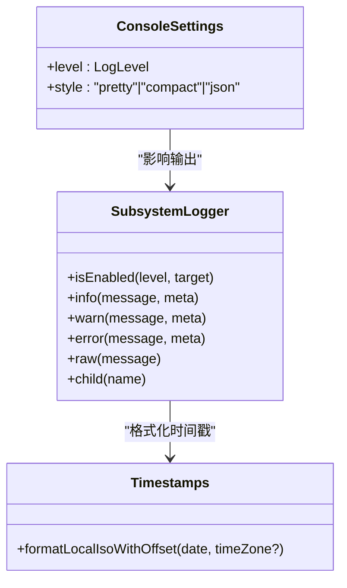
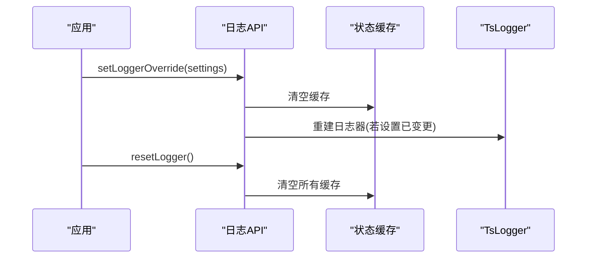
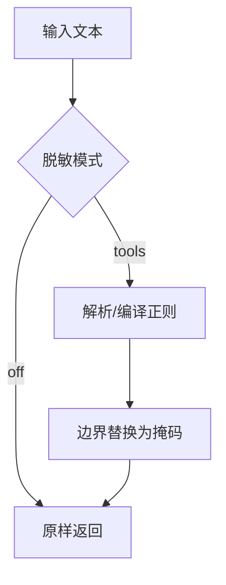
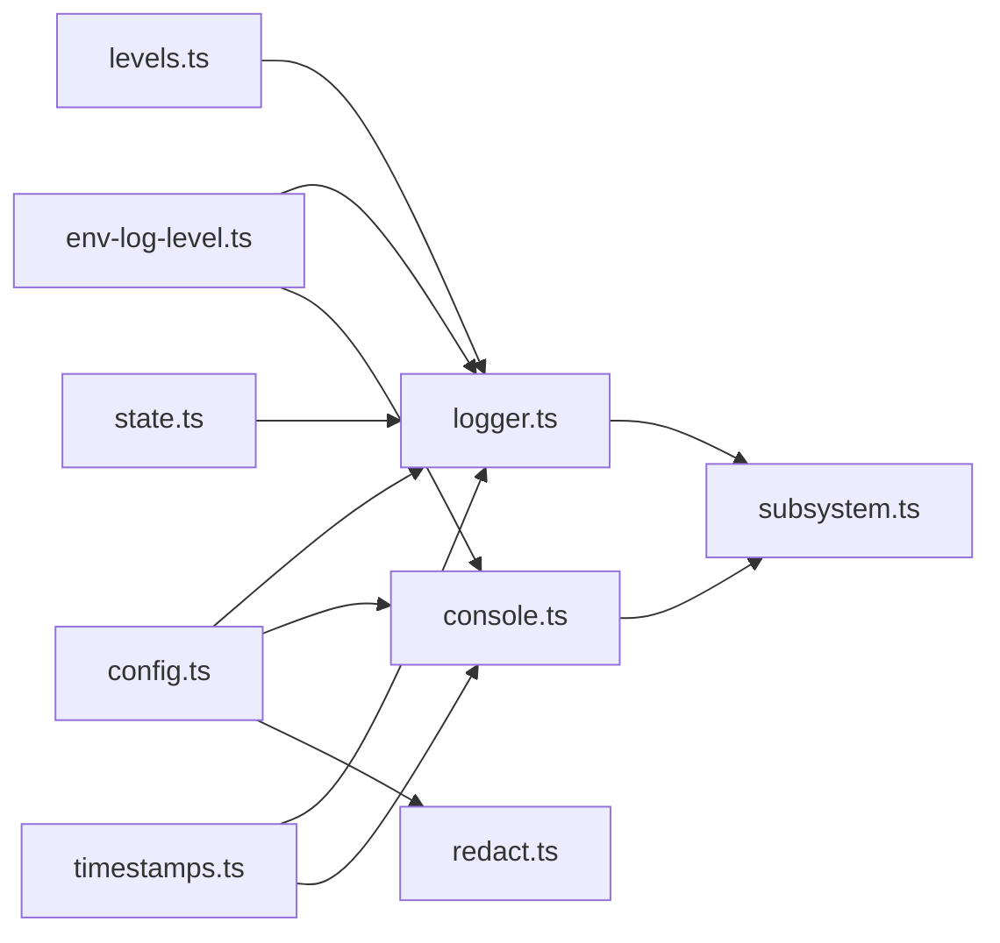

# 日志配置

<cite>
**本文引用的文件**
- [src/logger.ts](file://src/logger.ts)
- [src/logging.ts](file://src/logging.ts)
- [src/logging/logger.ts](file://src/logging/logger.ts)
- [src/logging/levels.ts](file://src/logging/levels.ts)
- [src/logging/console.ts](file://src/logging/console.ts)
- [src/logging/config.ts](file://src/logging/config.ts)
- [src/logging/env-log-level.ts](file://src/logging/env-log-level.ts)
- [src/logging/subsystem.ts](file://src/logging/subsystem.ts)
- [src/logging/state.ts](file://src/logging/state.ts)
- [src/logging/timestamps.ts](file://src/logging/timestamps.ts)
- [src/logging/redact.ts](file://src/logging/redact.ts)
- [src/config/logging.ts](file://src/config/logging.ts)
</cite>

## 目录
1. [简介](#简介)
2. [项目结构](#项目结构)
3. [核心组件](#核心组件)
4. [架构总览](#架构总览)
5. [详细组件分析](#详细组件分析)
6. [依赖分析](#依赖分析)
7. [性能考虑](#性能考虑)
8. [故障排查指南](#故障排查指南)
9. [结论](#结论)
10. [附录](#附录)

## 简介
本文件面向OpenClaw日志配置系统，提供从配置文件到运行时行为的全栈技术文档。内容覆盖：
- 日志级别定义与继承（silent、fatal、error、warn、info、debug、trace）
- 配置文件格式、环境变量覆盖与默认值策略
- 时间戳格式、子系统标识与控制台输出样式
- 运行时动态调整、配置热重载与迁移方案
- 性能影响与最佳实践

## 项目结构
日志配置系统主要由以下模块组成：
- 级别与映射：定义允许级别、归一化与最小级别映射
- 文件日志：基于TsLogger的文件写入、滚动与大小限制
- 控制台日志：统一捕获console.*并按级别/样式输出
- 子系统日志：带子系统前缀、颜色、过滤与元数据支持
- 配置读取：从配置文件读取日志设置，支持回退加载
- 环境变量：OPENCLAW_LOG_LEVEL覆盖级别解析与告警
- 时间戳：本地时区ISO格式输出
- 敏感信息脱敏：可配置模式与正则模式匹配
- 状态缓存：避免重复解析与重建日志器

**图表来源**
- [src/logging/logger.ts](file://src/logging/logger.ts#L1-L348)
- [src/logging/levels.ts](file://src/logging/levels.ts#L1-L38)
- [src/logging/config.ts](file://src/logging/config.ts#L1-L25)
- [src/logging/env-log-level.ts](file://src/logging/env-log-level.ts#L1-L24)
- [src/logging/console.ts](file://src/logging/console.ts#L1-L327)
- [src/logging/subsystem.ts](file://src/logging/subsystem.ts#L1-L395)
- [src/logging/state.ts](file://src/logging/state.ts#L1-L20)
- [src/logging/timestamps.ts](file://src/logging/timestamps.ts#L1-L37)
- [src/logging/redact.ts](file://src/logging/redact.ts#L1-L152)
- [src/logger.ts](file://src/logger.ts#L1-L86)

**章节来源**
- [src/logging.ts](file://src/logging.ts#L1-L70)

## 核心组件
- 日志级别与映射
  - 允许级别：silent、fatal、error、warn、info、debug、trace
  - 归一化与最小级别映射，用于TsLogger的minLevel
- 文件日志
  - 默认目录与滚动文件名（按日期），默认最大文件字节
  - 写入失败不阻塞；达到大小上限时发出警告并抑制后续写入
  - 支持外部传输注册与适配pino风格接口
- 控制台日志
  - 统一捕获console.*，映射到文件日志；可路由至stderr保持stdout纯净
  - 支持样式：pretty/compact/json；子系统过滤；时间戳前缀
- 子系统日志
  - 自动识别“子系统: 消息”格式，自动剥离冗余前缀
  - 子系统颜色、层级裁剪、通道前缀特殊处理
  - 支持meta字段透传，控制台可覆盖消息
- 配置与环境
  - 从配置文件读取，支持回退加载；环境变量OPENCLAW_LOG_LEVEL覆盖
  - 测试场景快速路径：静默或跳过配置读取
- 时间戳与脱敏
  - 本地时区ISO格式输出（含毫秒与偏移）
  - 可配置脱敏模式与正则模式，工具详情脱敏等

**章节来源**
- [src/logging/levels.ts](file://src/logging/levels.ts#L1-L38)
- [src/logging/logger.ts](file://src/logging/logger.ts#L1-L348)
- [src/logging/console.ts](file://src/logging/console.ts#L1-L327)
- [src/logging/subsystem.ts](file://src/logging/subsystem.ts#L1-L395)
- [src/logging/config.ts](file://src/logging/config.ts#L1-L25)
- [src/logging/env-log-level.ts](file://src/logging/env-log-level.ts#L1-L24)
- [src/logging/timestamps.ts](file://src/logging/timestamps.ts#L1-L37)
- [src/logging/redact.ts](file://src/logging/redact.ts#L1-L152)
- [src/logging/state.ts](file://src/logging/state.ts#L1-L20)

## 架构总览
下图展示从调用入口到最终输出的关键流程：用户通过通用日志API调用，内部根据子系统前缀分派到子系统日志器，再分别决定是否写入控制台与文件，并在必要时进行脱敏与时间戳处理。

**图表来源**
- [src/logger.ts](file://src/logger.ts#L1-L86)
- [src/logging/subsystem.ts](file://src/logging/subsystem.ts#L1-L395)
- [src/logging/console.ts](file://src/logging/console.ts#L1-L327)
- [src/logging/logger.ts](file://src/logging/logger.ts#L1-L348)

## 详细组件分析

### 日志级别定义与继承
- 允许级别集合与归一化
  - 通过归一化函数将字符串级别映射到允许集合，否则使用默认级别
  - 最小级别映射用于TsLogger的minLevel，形成“包含关系”：级别越高，包含更低级别
- 继承与过滤规则
  - 文件级别：isFileLogLevelEnabled按最小级别比较，silent直接禁用文件写入
  - 控制台级别：按控制台设置的最小级别比较，结合子系统过滤
  - 两者均需满足才会输出

**图表来源**
- [src/logging/levels.ts](file://src/logging/levels.ts#L1-L38)
- [src/logging/logger.ts](file://src/logging/logger.ts#L115-L124)
- [src/logging/subsystem.ts](file://src/logging/subsystem.ts#L30-L37)

**章节来源**
- [src/logging/levels.ts](file://src/logging/levels.ts#L1-L38)
- [src/logging/logger.ts](file://src/logging/logger.ts#L115-L124)
- [src/logging/subsystem.ts](file://src/logging/subsystem.ts#L30-L37)

### 配置文件格式与默认值
- 配置读取
  - 从配置路径读取JSON5，提取logging对象
  - 若无配置且非特定命令，尝试回退加载主配置中的logging
- 默认值策略
  - 文件级别：测试环境silent或info（受环境变量与覆盖影响）
  - 控制台级别：verbose时为debug，否则info；测试静默
  - 控制台样式：TTY时pretty，否则compact；显式json
  - 文件路径：默认滚动文件（按日期），默认最大文件字节数
- 验证与错误恢复
  - 非法配置返回undefined，按默认值继续
  - 回退加载异常被吞掉，不影响启动

**图表来源**
- [src/logging/config.ts](file://src/logging/config.ts#L1-L25)
- [src/logging/logger.ts](file://src/logging/logger.ts#L73-L106)
- [src/logging/console.ts](file://src/logging/console.ts#L60-L91)

**章节来源**
- [src/logging/config.ts](file://src/logging/config.ts#L1-L25)
- [src/logging/logger.ts](file://src/logging/logger.ts#L73-L106)
- [src/logging/console.ts](file://src/logging/console.ts#L60-L91)

### 环境变量覆盖与无效值处理
- OPENCLAW_LOG_LEVEL
  - 去除空白后尝试解析；合法则覆盖配置级别
  - 首次遇到非法值会向stderr发出一次性告警
- 测试快速路径
  - VITEST=true且未开启文件/控制台日志时，跳过配置读取与构建

**图表来源**
- [src/logging/env-log-level.ts](file://src/logging/env-log-level.ts#L1-L24)
- [src/logging/logger.ts](file://src/logging/logger.ts#L74-L83)

**章节来源**
- [src/logging/env-log-level.ts](file://src/logging/env-log-level.ts#L1-L24)
- [src/logging/logger.ts](file://src/logging/logger.ts#L74-L83)

### 时间戳格式、子系统标识与输出样式
- 时间戳
  - 本地时区ISO格式，含毫秒与偏移
  - 控制台样式不同，pretty显示本地时钟，json显示ISO
- 子系统标识
  - 自动识别“子系统: 消息”，颜色区分，前缀裁剪
  - 支持子系统过滤，仅输出命中过滤器的消息
- 输出样式
  - pretty：彩色、带时间戳、带子系统前缀
  - compact：无颜色、简洁文本
  - json：结构化输出，便于机器解析

**图表来源**
- [src/logging/console.ts](file://src/logging/console.ts#L13-L18)
- [src/logging/subsystem.ts](file://src/logging/subsystem.ts#L17-L28)
- [src/logging/timestamps.ts](file://src/logging/timestamps.ts#L10-L36)

**章节来源**
- [src/logging/timestamps.ts](file://src/logging/timestamps.ts#L10-L36)
- [src/logging/subsystem.ts](file://src/logging/subsystem.ts#L126-L235)
- [src/logging/console.ts](file://src/logging/console.ts#L169-L178)

### 运行时动态调整与热重载
- 动态调整
  - 设置覆盖：setLoggerOverride可临时改变日志器设置，触发重建
  - 重置：resetLogger清除缓存与覆盖，重新解析配置
- 热重载
  - 当设置变更（级别/文件/大小）时，重建TsLogger并保留外部传输
  - 控制台设置变化时，仅更新缓存，不重建TsLogger
- 外部传输
  - registerLogTransport注册外部传输，新旧日志器均接入

**图表来源**
- [src/logging/logger.ts](file://src/logging/logger.ts#L273-L285)
- [src/logging/logger.ts](file://src/logging/logger.ts#L287-L296)
- [src/logging/state.ts](file://src/logging/state.ts#L1-L20)

**章节来源**
- [src/logging/logger.ts](file://src/logging/logger.ts#L210-L219)
- [src/logging/logger.ts](file://src/logging/logger.ts#L273-L285)
- [src/logging/logger.ts](file://src/logging/logger.ts#L287-L296)
- [src/logging/state.ts](file://src/logging/state.ts#L1-L20)

### 配置迁移与兼容性
- 配置迁移
  - 从单文件日志迁移到滚动日志：默认滚动文件名按日期生成
  - 旧配置未指定级别时，按默认级别生效；控制台样式按终端能力自动选择
- 兼容性
  - 通过回退加载主配置获取logging段，保证旧版本配置仍可用
  - 严格校验配置类型，非法结构返回undefined，避免崩溃

**章节来源**
- [src/logging/logger.ts](file://src/logging/logger.ts#L15-L21)
- [src/logging/logger.ts](file://src/logging/logger.ts#L309-L321)
- [src/logging/config.ts](file://src/logging/config.ts#L1-L25)

### 敏感信息脱敏
- 模式
  - off：关闭脱敏
  - tools：仅对工具详情脱敏
- 规则
  - 默认内置多种常见令牌与证书模式
  - 支持自定义正则列表（带/分隔符可带标志）
- 应用
  - 文本脱敏与工具详情脱敏两条路径，按配置启用

**图表来源**
- [src/logging/redact.ts](file://src/logging/redact.ts#L8-L147)

**章节来源**
- [src/logging/redact.ts](file://src/logging/redact.ts#L1-L152)

### 多环境配置管理
- 开发/生产
  - 生产默认info；verbose时debug；silent用于CI或测试
- 终端能力
  - 非TTY自动compact；TTY时pretty；强制json可由配置指定
- 运行时路由
  - routeLogsToStderr确保RPC/JSON模式下stdout干净

**章节来源**
- [src/logging/console.ts](file://src/logging/console.ts#L40-L58)
- [src/logging/console.ts](file://src/logging/console.ts#L113-L117)

## 依赖分析
- 组件耦合
  - logger.ts依赖levels.ts、config.ts、env-log-level.ts、timestamps.ts、state.ts
  - subsystem.ts依赖console.ts、levels.ts、logger.ts、state.ts
  - console.ts依赖config.ts、env-log-level.ts、timestamps.ts、state.ts
  - redact.ts依赖config.ts与安全正则工具
- 关键依赖链
  - 配置→级别→TsLogger构建→文件写入
  - 控制台设置→子系统过滤→控制台输出
  - 环境变量→级别覆盖→缓存失效与重建

**图表来源**
- [src/logging/logger.ts](file://src/logging/logger.ts#L1-L348)
- [src/logging/console.ts](file://src/logging/console.ts#L1-L327)
- [src/logging/subsystem.ts](file://src/logging/subsystem.ts#L1-L395)
- [src/logging/config.ts](file://src/logging/config.ts#L1-L25)
- [src/logging/env-log-level.ts](file://src/logging/env-log-level.ts#L1-L24)
- [src/logging/levels.ts](file://src/logging/levels.ts#L1-L38)
- [src/logging/timestamps.ts](file://src/logging/timestamps.ts#L1-L37)
- [src/logging/state.ts](file://src/logging/state.ts#L1-L20)
- [src/logging/redact.ts](file://src/logging/redact.ts#L1-L152)

**章节来源**
- [src/logging/logger.ts](file://src/logging/logger.ts#L1-L348)
- [src/logging/console.ts](file://src/logging/console.ts#L1-L327)
- [src/logging/subsystem.ts](file://src/logging/subsystem.ts#L1-L395)
- [src/logging/config.ts](file://src/logging/config.ts#L1-L25)
- [src/logging/env-log-level.ts](file://src/logging/env-log-level.ts#L1-L24)
- [src/logging/levels.ts](file://src/logging/levels.ts#L1-L38)
- [src/logging/timestamps.ts](file://src/logging/timestamps.ts#L1-L37)
- [src/logging/state.ts](file://src/logging/state.ts#L1-L20)
- [src/logging/redact.ts](file://src/logging/redact.ts#L1-L152)

## 性能考虑
- 启动期优化
  - 测试环境silent快速路径：避免读取配置与构建日志器
  - 控制台设置在无显式配置时也走快速路径
- 运行期优化
  - 缓存TsLogger与设置，仅在设置变更时重建
  - 控制台捕获使用lazy获取文件日志器，避免不必要的初始化
  - 写入失败与管道断开（EPIPE/EIO）不抛出，保证稳定性
- I/O与磁盘
  - 按日滚动文件，定期清理过期日志
  - 达到大小上限时发出警告并抑制写入，防止磁盘膨胀
- 建议
  - CI/测试使用silent或精简控制台级别
  - 生产环境启用滚动与大小限制，避免单文件过大
  - 使用json样式便于日志聚合与检索

[本节为通用指导，无需列出具体文件来源]

## 故障排查指南
- 无效环境变量
  - 现象：OPENCLAW_LOG_LEVEL非法值被忽略并告警
  - 排查：检查环境变量拼写与允许级别集合
- 控制台无输出
  - 现象：stdout被路由到stderr，或级别过低
  - 排查：确认routeLogsToStderr调用、控制台级别与子系统过滤
- 文件未写入
  - 现象：silent级别或文件大小已达上限
  - 排查：检查级别、maxFileBytes与滚动文件路径
- 脱敏效果异常
  - 现象：敏感信息未被遮蔽
  - 排查：确认脱敏模式与自定义正则是否正确
- 配置未生效
  - 现象：修改配置后仍使用旧设置
  - 排查：调用setLoggerOverride或resetLogger触发重建

**章节来源**
- [src/logging/env-log-level.ts](file://src/logging/env-log-level.ts#L16-L23)
- [src/logging/console.ts](file://src/logging/console.ts#L113-L117)
- [src/logging/logger.ts](file://src/logging/logger.ts#L156-L178)
- [src/logging/redact.ts](file://src/logging/redact.ts#L126-L139)
- [src/logging/logger.ts](file://src/logging/logger.ts#L273-L285)

## 结论
OpenClaw日志配置系统以清晰的级别体系、灵活的配置与环境变量覆盖、可控的输出样式与子系统标识为核心，辅以滚动文件、大小限制、时间戳与脱敏等工程化特性。通过缓存与快速路径优化，兼顾启动性能与运行稳定性；通过外部传输与热重载，满足多环境与动态运维需求。

[本节为总结性内容，无需列出具体文件来源]

## 附录

### 配置项与默认值速览
- 文件日志
  - 级别：默认info（测试silent）
  - 文件：默认滚动文件（按日期）
  - 最大文件字节：默认500MB
- 控制台日志
  - 级别：默认info（verbose时debug）
  - 样式：TTY时pretty，否则compact（可强制json）
- 子系统日志
  - 自动识别“子系统: 消息”
  - 颜色与前缀裁剪，支持子系统过滤
- 环境变量
  - OPENCLAW_LOG_LEVEL：覆盖级别（非法值告警一次）

**章节来源**
- [src/logging/logger.ts](file://src/logging/logger.ts#L15-L21)
- [src/logging/logger.ts](file://src/logging/logger.ts#L99-L105)
- [src/logging/console.ts](file://src/logging/console.ts#L40-L58)
- [src/logging/console.ts](file://src/logging/console.ts#L88-L90)
- [src/logging/env-log-level.ts](file://src/logging/env-log-level.ts#L1-L24)
- [src/logging/subsystem.ts](file://src/logging/subsystem.ts#L126-L145)