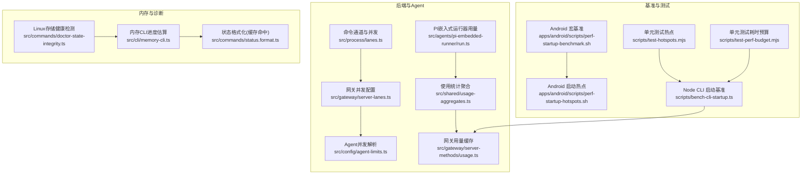
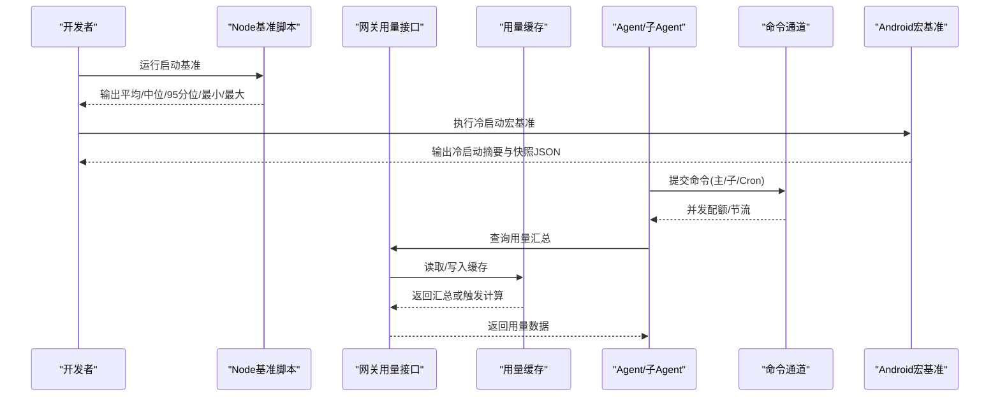
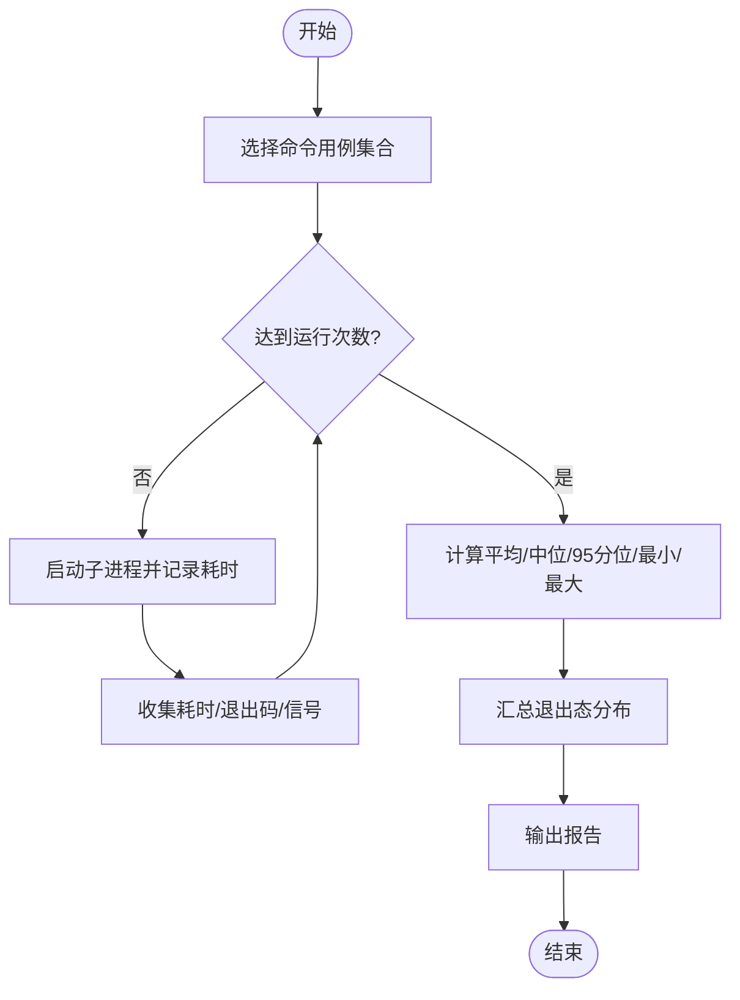
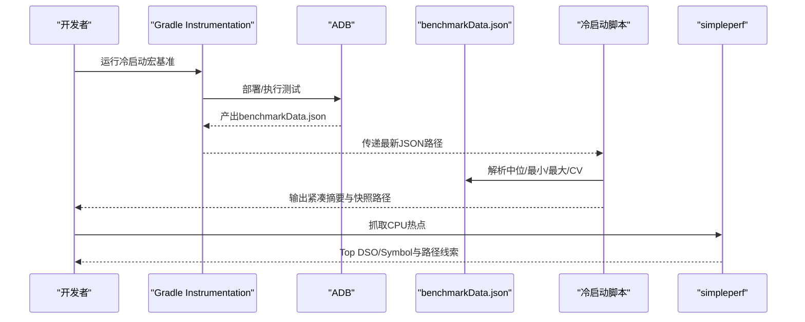
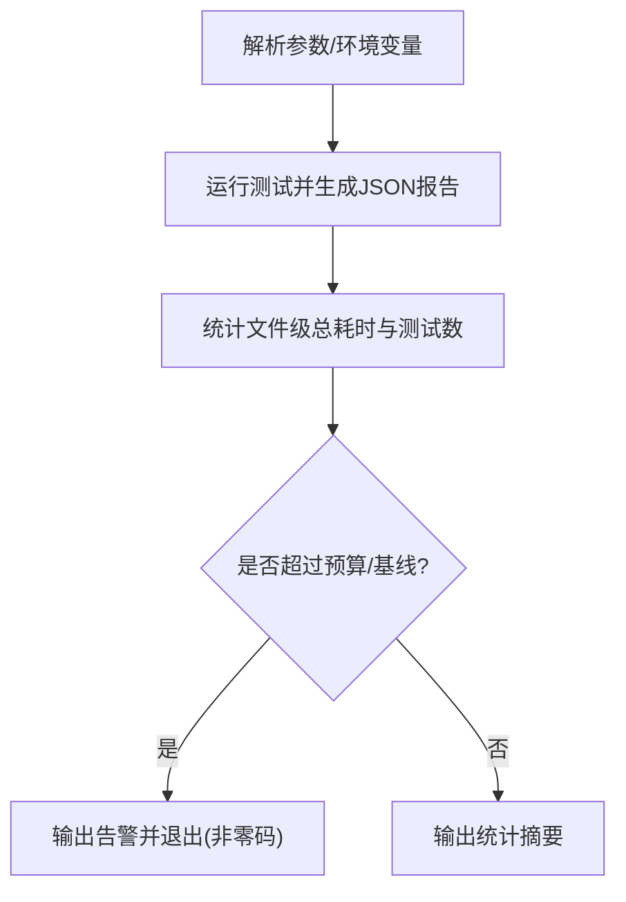
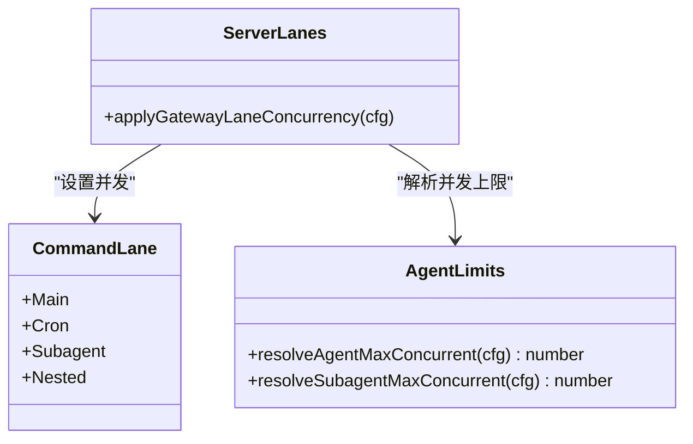
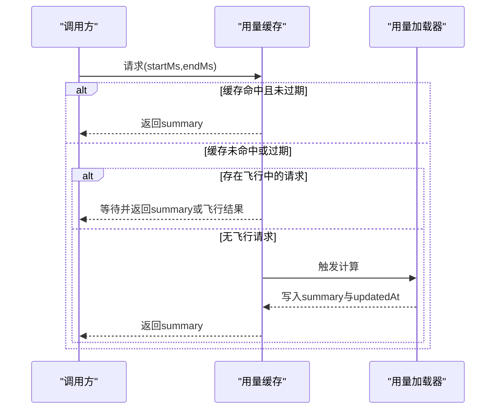
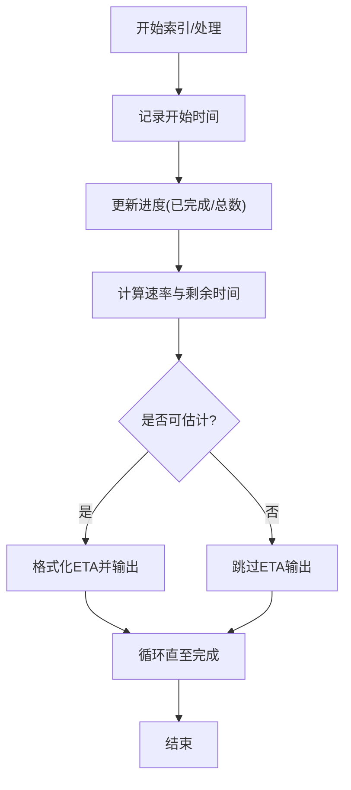
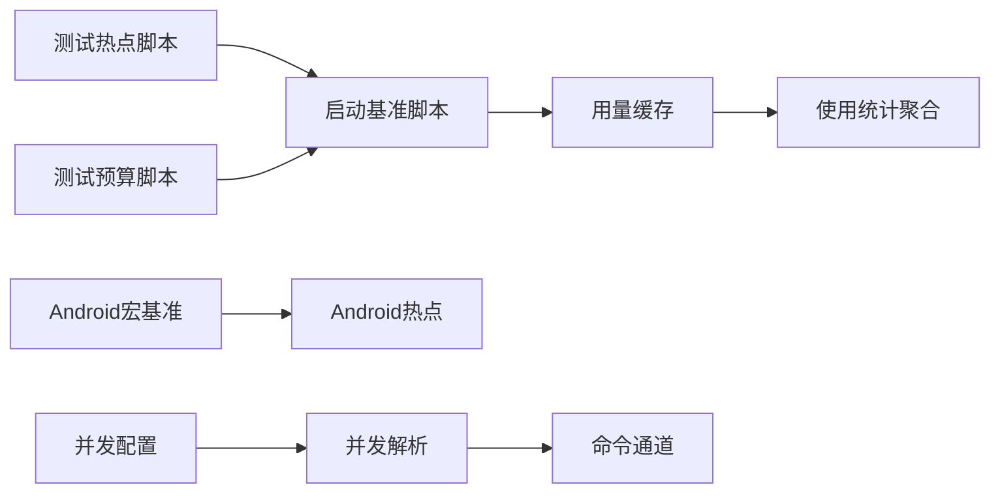

# 性能监控

<cite>
**本文引用的文件**   
- [scripts/bench-cli-startup.ts](file://scripts/bench-cli-startup.ts)
- [scripts/test-hotspots.mjs](file://scripts/test-hotspots.mjs)
- [scripts/test-perf-budget.mjs](file://scripts/test-perf-budget.mjs)
- [apps/android/scripts/perf-startup-benchmark.sh](file://apps/android/scripts/perf-startup-benchmark.sh)
- [apps/android/scripts/perf-startup-hotspots.sh](file://apps/android/scripts/perf-startup-hotspots.sh)
- [src/shared/usage-aggregates.ts](file://src/shared/usage-aggregates.ts)
- [src/gateway/server-lanes.ts](file://src/gateway/server-lanes.ts)
- [src/config/agent-limits.ts](file://src/config/agent-limits.ts)
- [src/process/lanes.ts](file://src/process/lanes.ts)
- [src/gateway/server-methods/usage.ts](file://src/gateway/server-methods/usage.ts)
- [src/agents/pi-embedded-runner/run.ts](file://src/agents/pi-embedded-runner/run.ts)
- [src/cli/memory-cli.ts](file://src/cli/memory-cli.ts)
- [src/commands/status.format.ts](file://src/commands/status.format.ts)
- [src/commands/doctor-state-integrity.ts](file://src/commands/doctor-state-integrity.ts)
- [src/commands/doctor-state-integrity.linux-storage.test.ts](file://src/commands/doctor-state-integrity.linux-storage.test.ts)
- [src/gateway/control-plane-rate-limit.ts](file://src/gateway/control-plane-rate-limit.ts)
- [src/agents/tool-loop-detection.ts](file://src/agents/tool-loop-detection.ts)
- [apps/android/README.md](file://apps/android/README.md)
</cite>

## 目录
1. [简介](#简介)
2. [项目结构](#项目结构)
3. [核心组件](#核心组件)
4. [架构总览](#架构总览)
5. [组件详解](#组件详解)
6. [依赖关系分析](#依赖关系分析)
7. [性能考量](#性能考量)
8. [故障排查指南](#故障排查指南)
9. [结论](#结论)
10. [附录](#附录)

## 简介
本技术指南聚焦于OpenClaw的性能监控体系，围绕Agent使用统计、内存使用监控、启动性能分析展开，系统性说明性能指标采集方法、计算公式与基准测试流程，并给出CPU使用率、内存占用、磁盘I/O与网络延迟的监控实现思路。同时提供性能瓶颈识别、热点分析与优化建议，覆盖系统资源限制、并发控制与负载均衡策略，以及不同环境下的性能调优与容量规划方法。

## 项目结构
OpenClaw在多语言与多平台下提供了完善的性能监控与基准测试能力：
- 跨平台CLI启动性能基准：通过Node脚本对关键命令进行多次采样并输出统计摘要。
- Android端冷启动宏基准与CPU热点捕获：基于Gradle Instrumentation测试与simpleperf抓取CPU热点。
- 后端网关与Agent并发控制：通过命令通道与限流策略控制资源占用与吞吐。
- 使用统计聚合：对延迟与用量进行合并与日汇总处理。
- 内存与状态诊断：CLI进度估算、缓存命中率展示与Linux存储健康检测。

图表来源
- [scripts/bench-cli-startup.ts](file://scripts/bench-cli-startup.ts#L1-L201)
- [apps/android/scripts/perf-startup-benchmark.sh](file://apps/android/scripts/perf-startup-benchmark.sh#L1-L125)
- [apps/android/scripts/perf-startup-hotspots.sh](file://apps/android/scripts/perf-startup-hotspots.sh#L1-L155)
- [scripts/test-hotspots.mjs](file://scripts/test-hotspots.mjs#L1-L84)
- [scripts/test-perf-budget.mjs](file://scripts/test-perf-budget.mjs#L1-L128)
- [src/process/lanes.ts](file://src/process/lanes.ts#L1-L7)
- [src/gateway/server-lanes.ts](file://src/gateway/server-lanes.ts#L1-L10)
- [src/config/agent-limits.ts](file://src/config/agent-limits.ts#L1-L23)
- [src/shared/usage-aggregates.ts](file://src/shared/usage-aggregates.ts#L1-L66)
- [src/gateway/server-methods/usage.ts](file://src/gateway/server-methods/usage.ts#L282-L332)
- [src/agents/pi-embedded-runner/run.ts](file://src/agents/pi-embedded-runner/run.ts#L119-L153)
- [src/cli/memory-cli.ts](file://src/cli/memory-cli.ts#L652-L681)
- [src/commands/status.format.ts](file://src/commands/status.format.ts#L37-L73)
- [src/commands/doctor-state-integrity.ts](file://src/commands/doctor-state-integrity.ts#L206-L343)

章节来源
- [apps/android/README.md](file://apps/android/README.md#L70-L132)

## 核心组件
- 启动性能基准（Node CLI）
  - 多命令用例采样，统计平均值、中位数、95分位、最小/最大耗时；支持主次入口对比与回归百分比评估。
- Android冷启动宏基准与热点
  - 仅执行冷启动宏基准，输出紧凑摘要并保存快照JSON；可与历史快照对比；支持simpleperf抓取CPU热点并输出Top DSO/Symbol与路径线索。
- 并发控制与命令通道
  - 命令通道枚举区分主Agent、子Agent、Cron等；网关根据配置设置各通道并发上限；默认并发值可由配置解析。
- 使用统计聚合
  - 对延迟与每日用量进行加权合并，维护计数、求和、最值与P95最大值，便于跨时间维度聚合。
- 网关用量缓存
  - 按时间窗口缓存用量汇总，避免重复计算；并发请求去重，缓存TTL控制。
- 内存与状态诊断
  - 内存索引过程显示ETA与耗时；状态格式化展示缓存命中率；Linux存储检测识别SD卡类慢盘并生成警告。

章节来源
- [scripts/bench-cli-startup.ts](file://scripts/bench-cli-startup.ts#L1-L201)
- [apps/android/scripts/perf-startup-benchmark.sh](file://apps/android/scripts/perf-startup-benchmark.sh#L1-L125)
- [apps/android/scripts/perf-startup-hotspots.sh](file://apps/android/scripts/perf-startup-hotspots.sh#L1-L155)
- [src/process/lanes.ts](file://src/process/lanes.ts#L1-L7)
- [src/gateway/server-lanes.ts](file://src/gateway/server-lanes.ts#L1-L10)
- [src/config/agent-limits.ts](file://src/config/agent-limits.ts#L1-L23)
- [src/shared/usage-aggregates.ts](file://src/shared/usage-aggregates.ts#L1-L66)
- [src/gateway/server-methods/usage.ts](file://src/gateway/server-methods/usage.ts#L282-L332)
- [src/cli/memory-cli.ts](file://src/cli/memory-cli.ts#L652-L681)
- [src/commands/status.format.ts](file://src/commands/status.format.ts#L37-L73)
- [src/commands/doctor-state-integrity.ts](file://src/commands/doctor-state-integrity.ts#L206-L343)

## 架构总览
OpenClaw的性能监控贯穿前端（Android）与后端（Node/TypeScript），形成“采集-聚合-缓存-展示”的闭环。

图表来源
- [scripts/bench-cli-startup.ts](file://scripts/bench-cli-startup.ts#L1-L201)
- [apps/android/scripts/perf-startup-benchmark.sh](file://apps/android/scripts/perf-startup-benchmark.sh#L1-L125)
- [src/gateway/server-methods/usage.ts](file://src/gateway/server-methods/usage.ts#L282-L332)
- [src/gateway/server-lanes.ts](file://src/gateway/server-lanes.ts#L1-L10)
- [src/process/lanes.ts](file://src/process/lanes.ts#L1-L7)

## 组件详解

### 启动性能基准（Node CLI）
- 采集方法
  - 多命令用例（如版本、帮助、健康检查、状态）重复运行，记录每次进程启动耗时。
  - 使用高精度时间戳测量单次运行耗时，收集退出码/信号用于异常分析。
- 计算公式
  - 平均值：所有样本耗时之和除以样本数。
  - 中位数：排序后取中间值（偶数个样本取中间两数平均）。
  - 95分位：排序后位置约等于样本数的95%。
  - 最小/最大：样本集极值。
  - 退出态分布：按信号/退出码分组计数。
- 基准测试
  - 支持指定运行次数与超时；可对比两个入口（主/次）的平均耗时差异与百分比变化。
- 典型用途
  - 回归检测、构建优化验证、入口函数热路径优化。

图表来源
- [scripts/bench-cli-startup.ts](file://scripts/bench-cli-startup.ts#L68-L154)

章节来源
- [scripts/bench-cli-startup.ts](file://scripts/bench-cli-startup.ts#L1-L201)

### Android冷启动宏基准与热点
- 采集方法
  - 仅运行冷启动宏基准（固定迭代次数），输出紧凑摘要（中位/最小/最大/Coefficient of Variation/设备信息/SDK/迭代次数）。
  - 自动保存带时间戳的JSON快照；可与最近历史快照对比，计算绝对差值与百分比变化。
  - 可选参数：自定义包名/Activity、采样时长、输出perf数据路径。
- 热点分析
  - 使用simpleperf抓取CPU热点，输出Top DSO、Top Symbol与关键应用路径线索（Compose/MainActivity/WebView等）。
- 典型用途
  - 移动端启动体验评估、渲染与初始化路径优化、UI线程阻塞定位。

图表来源
- [apps/android/scripts/perf-startup-benchmark.sh](file://apps/android/scripts/perf-startup-benchmark.sh#L62-L124)
- [apps/android/scripts/perf-startup-hotspots.sh](file://apps/android/scripts/perf-startup-hotspots.sh#L104-L154)
- [apps/android/README.md](file://apps/android/README.md#L70-L132)

章节来源
- [apps/android/scripts/perf-startup-benchmark.sh](file://apps/android/scripts/perf-startup-benchmark.sh#L1-L125)
- [apps/android/scripts/perf-startup-hotspots.sh](file://apps/android/scripts/perf-startup-hotspots.sh#L1-L155)
- [apps/android/README.md](file://apps/android/README.md#L70-L132)

### 单元测试热点与耗时预算
- 热点提取
  - 运行测试套件并输出JSON报告，按文件维度统计总时长与测试数量，打印前N个最耗时文件。
- 耗时预算
  - 基于墙钟时间与可选基线预算进行回归阈值判定，失败时输出详细告警。
- 典型用途
  - CI性能回归防护、测试套件热点定位、持续集成性能门禁。

图表来源
- [scripts/test-hotspots.mjs](file://scripts/test-hotspots.mjs#L40-L84)
- [scripts/test-perf-budget.mjs](file://scripts/test-perf-budget.mjs#L62-L127)

章节来源
- [scripts/test-hotspots.mjs](file://scripts/test-hotspots.mjs#L1-L84)
- [scripts/test-perf-budget.mjs](file://scripts/test-perf-budget.mjs#L1-L128)

### 并发控制与命令通道
- 命令通道
  - 主通道（Main）、子Agent通道（Subagent）、Cron通道（Cron）、嵌套通道（Nested）。
- 网关并发配置
  - 根据配置设置各通道并发度；默认主Agent并发与子Agent并发由配置解析函数决定。
- 作用
  - 控制资源占用与吞吐，避免过载；在高负载场景下通过降低并发缓解抖动。

图表来源
- [src/process/lanes.ts](file://src/process/lanes.ts#L1-L7)
- [src/gateway/server-lanes.ts](file://src/gateway/server-lanes.ts#L1-L10)
- [src/config/agent-limits.ts](file://src/config/agent-limits.ts#L1-L23)

章节来源
- [src/process/lanes.ts](file://src/process/lanes.ts#L1-L7)
- [src/gateway/server-lanes.ts](file://src/gateway/server-lanes.ts#L1-L10)
- [src/config/agent-limits.ts](file://src/config/agent-limits.ts#L1-L23)

### 使用统计聚合与用量缓存
- 延迟与用量聚合
  - 合并多个时段的延迟统计，维护计数、加权求和、全局最值与P95最大值，便于跨天/跨周期对比。
- 网关用量缓存
  - 按起止时间构造缓存键，TTL内复用；若存在飞行中的计算则等待并复用结果，失败时回退到已有缓存。
- 适用场景
  - 成本与用量报表、SLA基线设定、容量规划与成本预测。

图表来源
- [src/gateway/server-methods/usage.ts](file://src/gateway/server-methods/usage.ts#L282-L332)
- [src/shared/usage-aggregates.ts](file://src/shared/usage-aggregates.ts#L32-L66)

章节来源
- [src/shared/usage-aggregates.ts](file://src/shared/usage-aggregates.ts#L1-L66)
- [src/gateway/server-methods/usage.ts](file://src/gateway/server-methods/usage.ts#L282-L332)

### 内存使用监控与状态诊断
- 内存CLI进度估算
  - 显示已用/剩余/完成比例与ETA，辅助长任务的可观测性与用户反馈。
- 状态格式化（缓存命中率）
  - 在可用用量存在时计算缓存命中率，直观反映缓存效果。
- Linux存储健康检测
  - 识别基于SD卡的慢盘挂载，生成警告提示，避免因存储性能导致的系统抖动。

图表来源
- [src/cli/memory-cli.ts](file://src/cli/memory-cli.ts#L652-L681)
- [src/commands/status.format.ts](file://src/commands/status.format.ts#L37-L73)
- [src/commands/doctor-state-integrity.ts](file://src/commands/doctor-state-integrity.ts#L206-L343)

章节来源
- [src/cli/memory-cli.ts](file://src/cli/memory-cli.ts#L652-L681)
- [src/commands/status.format.ts](file://src/commands/status.format.ts#L37-L73)
- [src/commands/doctor-state-integrity.ts](file://src/commands/doctor-state-integrity.ts#L206-L343)

## 依赖关系分析
- 组件耦合
  - 基准脚本与测试脚本相互独立，分别面向启动性能与测试耗时；Android脚本与simpleperf解耦，便于替换分析工具。
  - 网关用量缓存与使用统计模块松耦合，通过接口暴露与缓存键管理实现。
  - 并发控制通过配置解析与命令通道枚举实现，便于集中治理。
- 外部依赖
  - Android宏基准依赖ADB与Gradle Instrumentation；热点分析依赖NDK simpleperf工具链。
  - 测试热点与预算脚本依赖测试框架JSON报告输出。

图表来源
- [scripts/bench-cli-startup.ts](file://scripts/bench-cli-startup.ts#L1-L201)
- [scripts/test-hotspots.mjs](file://scripts/test-hotspots.mjs#L1-L84)
- [scripts/test-perf-budget.mjs](file://scripts/test-perf-budget.mjs#L1-L128)
- [apps/android/scripts/perf-startup-benchmark.sh](file://apps/android/scripts/perf-startup-benchmark.sh#L1-L125)
- [apps/android/scripts/perf-startup-hotspots.sh](file://apps/android/scripts/perf-startup-hotspots.sh#L1-L155)
- [src/gateway/server-lanes.ts](file://src/gateway/server-lanes.ts#L1-L10)
- [src/config/agent-limits.ts](file://src/config/agent-limits.ts#L1-L23)
- [src/process/lanes.ts](file://src/process/lanes.ts#L1-L7)
- [src/gateway/server-methods/usage.ts](file://src/gateway/server-methods/usage.ts#L282-L332)
- [src/shared/usage-aggregates.ts](file://src/shared/usage-aggregates.ts#L1-L66)

章节来源
- [src/gateway/server-lanes.ts](file://src/gateway/server-lanes.ts#L1-L10)
- [src/config/agent-limits.ts](file://src/config/agent-limits.ts#L1-L23)
- [src/process/lanes.ts](file://src/process/lanes.ts#L1-L7)
- [src/gateway/server-methods/usage.ts](file://src/gateway/server-methods/usage.ts#L282-L332)
- [src/shared/usage-aggregates.ts](file://src/shared/usage-aggregates.ts#L1-L66)

## 性能考量
- CPU使用率
  - 通过Android宏基准与simpleperf热点分析定位CPU热点；结合Node基准脚本观察启动阶段CPU占用峰值与分布。
- 内存占用
  - 使用内存CLI进度估算与缓存命中率展示，关注长时间运行任务的内存增长趋势；必要时引入GC日志与堆快照分析。
- 磁盘I/O
  - Linux存储健康检测可识别慢盘；结合文件系统监控（如inode使用、块设备队列深度）评估I/O瓶颈。
- 网络延迟
  - 网关侧可通过用量缓存与并发控制减少请求堆积；对上游模型服务可引入连接池与超时重试策略，并记录往返时延。

## 故障排查指南
- 启动基准异常
  - 检查Node版本、运行次数与超时设置；确认入口文件可访问；查看退出态分布定位异常原因。
- Android宏基准失败
  - 确认ADB设备在线、NDK安装完整、simpleperf可用；检查Gradle构建与测试执行日志。
- 热点分析无输出
  - 确认simpleperf抓取成功、报告生成正常；核对包名/Activity与采样时长。
- 并发过高导致抖动
  - 降低网关各通道并发上限；检查Cron与主Agent任务密度；必要时启用全局节流。
- 用量缓存不生效
  - 检查缓存键构造与TTL；确认飞行请求去重逻辑；观察错误回退行为。
- 缓存命中率低
  - 评估数据访问模式与缓存策略；检查热点数据预热与失效策略。

章节来源
- [scripts/bench-cli-startup.ts](file://scripts/bench-cli-startup.ts#L1-L201)
- [apps/android/scripts/perf-startup-benchmark.sh](file://apps/android/scripts/perf-startup-benchmark.sh#L1-L125)
- [apps/android/scripts/perf-startup-hotspots.sh](file://apps/android/scripts/perf-startup-hotspots.sh#L1-L155)
- [src/gateway/server-methods/usage.ts](file://src/gateway/server-methods/usage.ts#L282-L332)
- [src/gateway/server-lanes.ts](file://src/gateway/server-lanes.ts#L1-L10)
- [src/config/agent-limits.ts](file://src/config/agent-limits.ts#L1-L23)

## 结论
OpenClaw提供了从CLI启动、移动端冷启动到后端用量缓存与并发控制的全栈性能监控方案。通过基准脚本与热点分析工具，可快速定位瓶颈；通过并发与缓存策略，可在高负载下保持稳定；通过状态与存储诊断，可提前规避硬件层面的性能陷阱。建议在CI中引入耗时预算与热点报告，在生产环境中结合用量缓存与并发治理实现可持续的性能保障。

## 附录
- 不同环境下的调优与容量规划
  - 开发环境：优先使用热点脚本与宏基准快速迭代；限制并发以保证本地响应。
  - 测试环境：启用耗时预算门禁，确保回归不恶化；定期跑Android热点分析。
  - 生产环境：开启用量缓存与并发上限；结合SLA设定缓存TTL；对慢盘与网络延迟进行专项治理。
- 关键配置参考
  - 并发上限：主Agent与子Agent并发由配置解析函数决定，默认值见并发解析模块。
  - 命令通道：明确Main/Cron/Subagent/Nested职责边界，按业务特性调整并发权重。
  - 用量缓存：合理设置TTL与飞行请求去重，平衡实时性与性能。

章节来源
- [src/config/agent-limits.ts](file://src/config/agent-limits.ts#L1-L23)
- [src/process/lanes.ts](file://src/process/lanes.ts#L1-L7)
- [src/gateway/server-methods/usage.ts](file://src/gateway/server-methods/usage.ts#L282-L332)