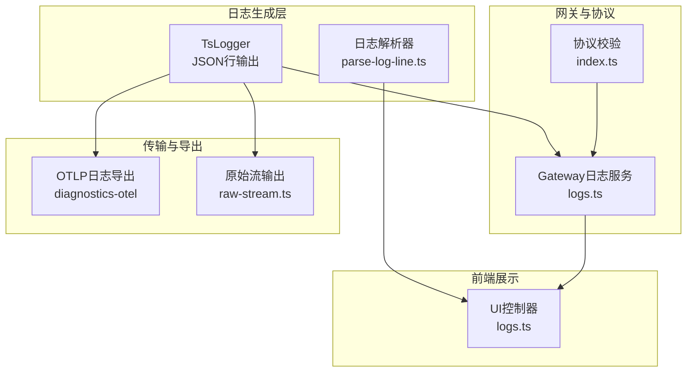
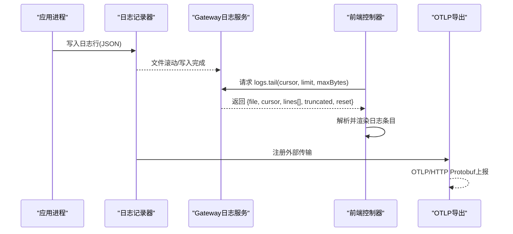
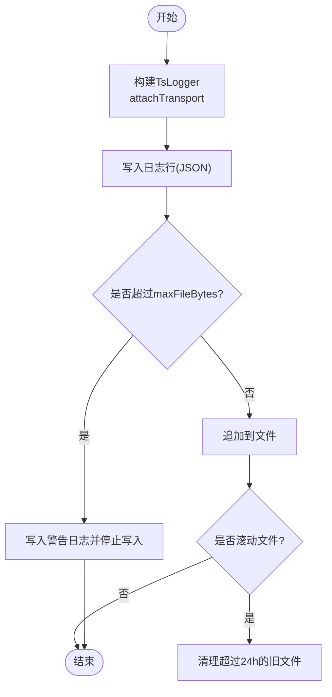
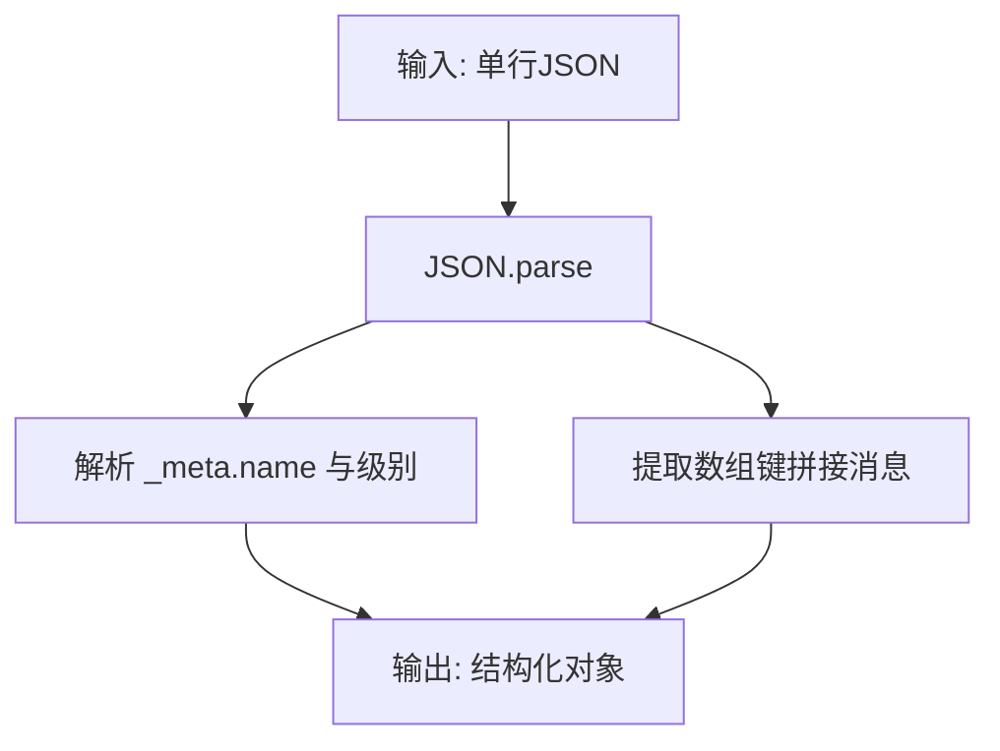
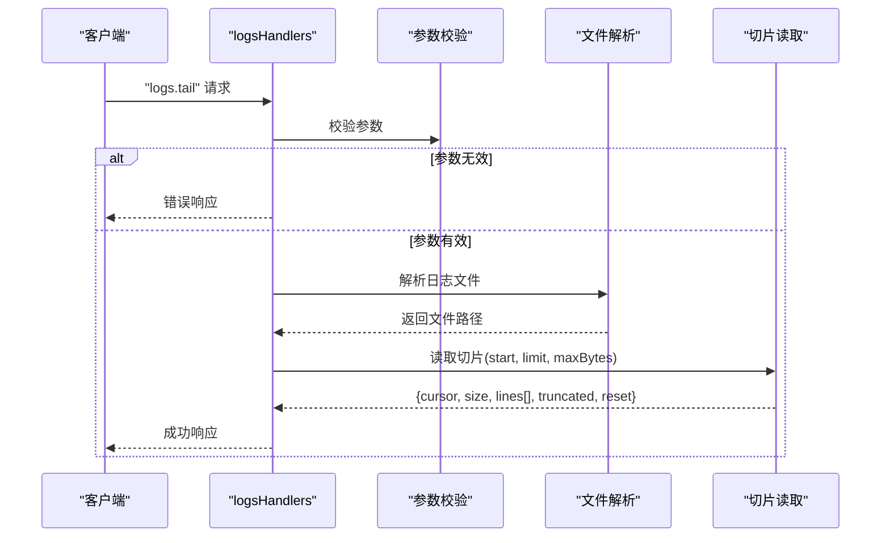
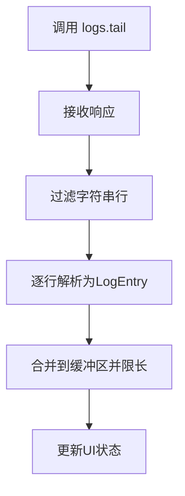
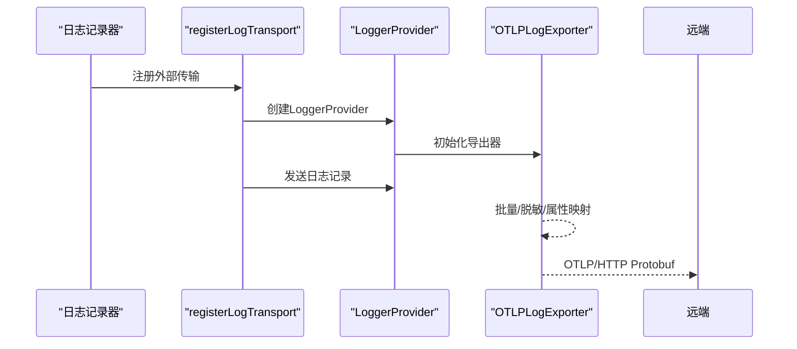
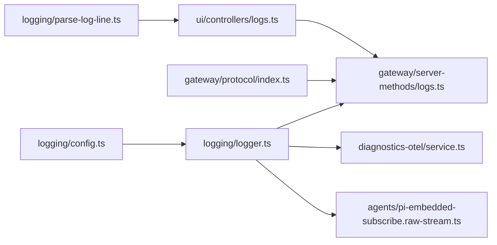

# 日志聚合

<cite>
**本文引用的文件**   
- [src/logging/logger.ts](file://src/logging/logger.ts)
- [src/logging/parse-log-line.ts](file://src/logging/parse-log-line.ts)
- [src/gateway/server-methods/logs.ts](file://src/gateway/server-methods/logs.ts)
- [src/gateway/protocol/index.ts](file://src/gateway/protocol/index.ts)
- [extensions/diagnostics-otel/src/service.ts](file://extensions/diagnostics-otel/src/service.ts)
- [ui/src/ui/controllers/logs.ts](file://ui/src/ui/controllers/logs.ts)
- [src/agents/pi-embedded-subscribe.raw-stream.ts](file://src/agents/pi-embedded-subscribe.raw-stream.ts)
- [docs/zh-CN/logging.md](file://docs/zh-CN/logging.md)
- [docs/zh-CN/diagnostics/flags.md](file://docs/zh-CN/diagnostics/flags.md)
- [src/logging/config.ts](file://src/logging/config.ts)
</cite>

## 目录
1. [简介](#简介)
2. [项目结构](#项目结构)
3. [核心组件](#核心组件)
4. [架构总览](#架构总览)
5. [组件详解](#组件详解)
6. [依赖关系分析](#依赖关系分析)
7. [性能考量](#性能考量)
8. [故障排查指南](#故障排查指南)
9. [结论](#结论)
10. [附录](#附录)

## 简介
本文件面向OpenClaw日志聚合系统，系统性阐述多节点日志收集、集中存储与实时转发机制，包括日志格式标准化、字段提取与索引构建思路、传输协议与网络优化策略、查询与过滤方法、备份与归档策略以及与ELK Stack、Prometheus等第三方监控系统的集成方案。文档基于仓库现有实现进行归纳总结，并提供可视化图示帮助理解。

## 项目结构
围绕日志聚合的关键目录与文件如下：
- 日志核心与格式化：src/logging/logger.ts、src/logging/parse-log-line.ts、src/logging/config.ts
- 网关日志接口：src/gateway/server-methods/logs.ts、src/gateway/protocol/index.ts
- 实时UI展示：ui/src/ui/controllers/logs.ts
- 传输与导出：extensions/diagnostics-otel/src/service.ts
- 原始流输出：src/agents/pi-embedded-subscribe.raw-stream.ts
- 文档参考：docs/zh-CN/logging.md、docs/zh-CN/diagnostics/flags.md

图表来源
- [src/logging/logger.ts](file://src/logging/logger.ts#L126-L184)
- [src/logging/parse-log-line.ts](file://src/logging/parse-log-line.ts#L41-L63)
- [src/gateway/server-methods/logs.ts](file://src/gateway/server-methods/logs.ts#L147-L180)
- [src/gateway/protocol/index.ts](file://src/gateway/protocol/index.ts#L393-L393)
- [extensions/diagnostics-otel/src/service.ts](file://extensions/diagnostics-otel/src/service.ts#L243-L366)
- [ui/src/ui/controllers/logs.ts](file://ui/src/ui/controllers/logs.ts#L99-L147)
- [src/agents/pi-embedded-subscribe.raw-stream.ts](file://src/agents/pi-embedded-subscribe.raw-stream.ts#L13-L30)

章节来源
- [src/logging/logger.ts](file://src/logging/logger.ts#L1-L348)
- [src/logging/parse-log-line.ts](file://src/logging/parse-log-line.ts#L1-L64)
- [src/gateway/server-methods/logs.ts](file://src/gateway/server-methods/logs.ts#L1-L181)
- [src/gateway/protocol/index.ts](file://src/gateway/protocol/index.ts#L1-L644)
- [extensions/diagnostics-otel/src/service.ts](file://extensions/diagnostics-otel/src/service.ts#L1-L686)
- [ui/src/ui/controllers/logs.ts](file://ui/src/ui/controllers/logs.ts#L1-L148)
- [src/agents/pi-embedded-subscribe.raw-stream.ts](file://src/agents/pi-embedded-subscribe.raw-stream.ts#L1-L30)
- [docs/zh-CN/logging.md](file://docs/zh-CN/logging.md#L186-L252)
- [docs/zh-CN/diagnostics/flags.md](file://docs/zh-CN/diagnostics/flags.md#L86-L99)
- [src/logging/config.ts](file://src/logging/config.ts#L1-L25)

## 核心组件
- 日志记录器与滚动文件
  - 使用TsLogger统一输出JSON行日志，自动注入时间戳，按配置写入滚动文件，支持大小上限与过期清理。
- 日志解析器
  - 将JSON行解析为结构化对象，提取时间、级别、子系统、模块与消息字段，兼容多种元数据形态。
- 网关日志服务
  - 提供“尾随日志”RPC接口，支持游标、限制与最大字节控制，自动定位当前滚动日志文件并读取片段。
- 协议与参数校验
  - 使用Ajv对“logs.tail”请求参数进行严格校验，保证边界与类型安全。
- UI控制器
  - 调用网关RPC获取日志切片，解析为前端可渲染条目，维护游标与截断标记。
- OTLP日志导出
  - 将OpenClaw日志通过OTLP/HTTP Protobuf发送至外部收集器，支持批量处理器与属性映射。
- 原始流输出
  - 可选将原始日志写入独立JSONL文件，便于外部采集器接入。

章节来源
- [src/logging/logger.ts](file://src/logging/logger.ts#L126-L184)
- [src/logging/parse-log-line.ts](file://src/logging/parse-log-line.ts#L41-L63)
- [src/gateway/server-methods/logs.ts](file://src/gateway/server-methods/logs.ts#L147-L180)
- [src/gateway/protocol/index.ts](file://src/gateway/protocol/index.ts#L393-L393)
- [ui/src/ui/controllers/logs.ts](file://ui/src/ui/controllers/logs.ts#L99-L147)
- [extensions/diagnostics-otel/src/service.ts](file://extensions/diagnostics-otel/src/service.ts#L243-L366)
- [src/agents/pi-embedded-subscribe.raw-stream.ts](file://src/agents/pi-embedded-subscribe.raw-stream.ts#L13-L30)

## 架构总览
OpenClaw的日志聚合采用“本地标准化+集中读取+可选外部导出”的三层架构：
- 本地标准化：所有日志统一为JSON行，包含时间、级别、元信息与消息体。
- 集中读取：Gateway提供RPC接口，客户端按需拉取日志切片，支持游标续读。
- 外部导出：可选启用OTLP导出，将日志转发至ELK、Grafana等后端；也可写入原始流文件供外部采集。

图表来源
- [src/logging/logger.ts](file://src/logging/logger.ts#L126-L184)
- [src/gateway/server-methods/logs.ts](file://src/gateway/server-methods/logs.ts#L147-L180)
- [ui/src/ui/controllers/logs.ts](file://ui/src/ui/controllers/logs.ts#L99-L147)
- [extensions/diagnostics-otel/src/service.ts](file://extensions/diagnostics-otel/src/service.ts#L243-L366)

## 组件详解

### 日志记录器与滚动文件
- JSON行格式：每条日志包含时间戳与原始日志对象，便于下游解析与检索。
- 滚动文件：按日期命名的滚动文件，自动清理超过24小时的历史文件。
- 大小上限：当累计写入字节数超过阈值时，停止写入并输出警告，避免磁盘膨胀。
- 外部传输：支持注册外部传输函数，用于OTLP导出或其他自定义处理。

图表来源
- [src/logging/logger.ts](file://src/logging/logger.ts#L126-L184)
- [src/logging/logger.ts](file://src/logging/logger.ts#L323-L347)

章节来源
- [src/logging/logger.ts](file://src/logging/logger.ts#L15-L106)
- [src/logging/logger.ts](file://src/logging/logger.ts#L126-L184)
- [src/logging/logger.ts](file://src/logging/logger.ts#L323-L347)

### 日志解析器
- 输入：单行JSON字符串
- 输出：结构化对象，包含时间、级别、子系统、模块、消息与原始行
- 元数据解析：从_meta.name中提取subsystem/module，从_meta.logLevelName或level中提取级别
- 消息拼接：将数组位置键对应的值拼接为消息正文

图表来源
- [src/logging/parse-log-line.ts](file://src/logging/parse-log-line.ts#L41-L63)

章节来源
- [src/logging/parse-log-line.ts](file://src/logging/parse-log-line.ts#L1-L64)

### 网关日志服务
- RPC方法：logs.tail
- 参数校验：使用Ajv Schema对cursor/limit/maxBytes进行严格校验
- 文件解析：优先使用配置文件路径，若为滚动文件则选择最新文件
- 切片读取：支持游标续读、最大字节数与行数限制，返回截断与重置标记

图表来源
- [src/gateway/server-methods/logs.ts](file://src/gateway/server-methods/logs.ts#L147-L180)
- [src/gateway/protocol/index.ts](file://src/gateway/protocol/index.ts#L393-L393)

章节来源
- [src/gateway/server-methods/logs.ts](file://src/gateway/server-methods/logs.ts#L1-L181)
- [src/gateway/protocol/index.ts](file://src/gateway/protocol/index.ts#L393-L393)

### 前端日志控制器
- 调用Gateway RPC获取日志切片
- 解析每行日志为结构化条目，维护游标、截断标记与最后刷新时间
- 控制缓冲区长度，避免内存膨胀

图表来源
- [ui/src/ui/controllers/logs.ts](file://ui/src/ui/controllers/logs.ts#L99-L147)

章节来源
- [ui/src/ui/controllers/logs.ts](file://ui/src/ui/controllers/logs.ts#L1-L148)

### OTLP日志导出与第三方集成
- 导出器：OTLPLogExporter，支持批量处理器与刷新间隔
- 属性映射：将日志级别、logger名称、父链、代码位置等映射为OTLP属性
- 敏感信息脱敏：对字符串属性与消息进行脱敏处理
- 协议与端点：支持http/protobuf协议，自动补全/v1/logs路径

图表来源
- [extensions/diagnostics-otel/src/service.ts](file://extensions/diagnostics-otel/src/service.ts#L243-L366)

章节来源
- [extensions/diagnostics-otel/src/service.ts](file://extensions/diagnostics-otel/src/service.ts#L1-L686)
- [docs/zh-CN/logging.md](file://docs/zh-CN/logging.md#L223-L252)

### 原始流输出
- 可选开关与路径：通过环境变量控制是否启用与输出路径
- 写入策略：首次使用时创建目录，失败静默忽略，保证不影响主流程

章节来源
- [src/agents/pi-embedded-subscribe.raw-stream.ts](file://src/agents/pi-embedded-subscribe.raw-stream.ts#L1-L30)

## 依赖关系分析
- 日志记录器依赖配置解析与时间格式化，输出到滚动文件并可注册外部传输
- 网关日志服务依赖协议校验与文件系统操作，向上提供RPC接口
- 前端控制器依赖网关RPC与日志解析器
- OTLP导出依赖OpenTelemetry SDK与外部传输注册

图表来源
- [src/logging/config.ts](file://src/logging/config.ts#L1-L25)
- [src/logging/logger.ts](file://src/logging/logger.ts#L1-L348)
- [src/gateway/server-methods/logs.ts](file://src/gateway/server-methods/logs.ts#L1-L181)
- [src/gateway/protocol/index.ts](file://src/gateway/protocol/index.ts#L1-L644)
- [src/logging/parse-log-line.ts](file://src/logging/parse-log-line.ts#L1-L64)
- [ui/src/ui/controllers/logs.ts](file://ui/src/ui/controllers/logs.ts#L1-L148)
- [src/agents/pi-embedded-subscribe.raw-stream.ts](file://src/agents/pi-embedded-subscribe.raw-stream.ts#L1-L30)
- [extensions/diagnostics-otel/src/service.ts](file://extensions/diagnostics-otel/src/service.ts#L1-L686)

章节来源
- [src/logging/config.ts](file://src/logging/config.ts#L1-L25)
- [src/logging/logger.ts](file://src/logging/logger.ts#L1-L348)
- [src/gateway/server-methods/logs.ts](file://src/gateway/server-methods/logs.ts#L1-L181)
- [src/gateway/protocol/index.ts](file://src/gateway/protocol/index.ts#L1-L644)
- [src/logging/parse-log-line.ts](file://src/logging/parse-log-line.ts#L1-L64)
- [ui/src/ui/controllers/logs.ts](file://ui/src/ui/controllers/logs.ts#L1-L148)
- [src/agents/pi-embedded-subscribe.raw-stream.ts](file://src/agents/pi-embedded-subscribe.raw-stream.ts#L1-L30)
- [extensions/diagnostics-otel/src/service.ts](file://extensions/diagnostics-otel/src/service.ts#L1-L686)

## 性能考量
- 文件滚动与清理：按天滚动并清理超期文件，避免单文件过大
- 写入上限保护：达到阈值后停止写入并发出警告，防止磁盘耗尽
- 切片读取：支持游标续读与最大字节限制，避免一次性读取过多内容
- 批量导出：OTLP导出使用批量处理器与可配置刷新间隔，平衡延迟与吞吐
- 前端缓冲：限制日志缓冲区长度，避免内存占用过高

章节来源
- [src/logging/logger.ts](file://src/logging/logger.ts#L186-L191)
- [src/logging/logger.ts](file://src/logging/logger.ts#L156-L178)
- [src/gateway/server-methods/logs.ts](file://src/gateway/server-methods/logs.ts#L71-L97)
- [extensions/diagnostics-otel/src/service.ts](file://extensions/diagnostics-otel/src/service.ts#L248-L253)
- [ui/src/ui/controllers/logs.ts](file://ui/src/ui/controllers/logs.ts#L18-L18)

## 故障排查指南
- 日志级别与输出抑制
  - 若logging.level高于warn，部分日志可能被抑制；默认info级别即可满足大多数场景
- 滚动文件定位
  - 当指定滚动文件时，服务会自动选择最新文件；如无法定位，回退到配置路径
- 参数校验错误
  - logs.tail参数非法时，服务返回错误响应，检查cursor/limit/maxBytes范围
- OTLP导出失败
  - 导出器初始化或发送异常会被捕获并记录；检查端点、协议与认证头
- 原始流写入失败
  - 写入失败静默忽略，不影响主流程；可通过环境变量启用与调整路径

章节来源
- [docs/zh-CN/diagnostics/flags.md](file://docs/zh-CN/diagnostics/flags.md#L94-L99)
- [src/gateway/server-methods/logs.ts](file://src/gateway/server-methods/logs.ts#L23-L51)
- [src/gateway/protocol/index.ts](file://src/gateway/protocol/index.ts#L404-L438)
- [extensions/diagnostics-otel/src/service.ts](file://extensions/diagnostics-otel/src/service.ts#L150-L156)
- [src/agents/pi-embedded-subscribe.raw-stream.ts](file://src/agents/pi-embedded-subscribe.raw-stream.ts#L25-L29)

## 结论
OpenClaw的日志聚合体系以标准化JSON行输出为核心，结合滚动文件、参数校验与批量导出，实现了多节点日志的高效收集、集中读取与灵活转发。通过OTLP导出可无缝对接ELK、Grafana等生态，同时保留原始流输出能力以适配多样化采集需求。建议在生产环境中合理设置日志级别、大小上限与导出刷新间隔，并配合定期归档与合规策略保障长期可用性。

## 附录

### 日志格式标准化与字段提取
- 标准格式：每行JSON，包含时间戳、级别、元信息与消息体
- 字段提取：时间(time或_meta.date)、级别(_meta.logLevelName或level)、子系统与模块(_meta.name中的JSON对象)、消息(数组键拼接)
- 兼容性：解析器对非JSON或缺失字段进行降级处理，保证鲁棒性

章节来源
- [src/logging/parse-log-line.ts](file://src/logging/parse-log-line.ts#L41-L63)

### 查询语言与过滤条件
- 前端过滤：支持按时间范围、角色、工具、查询文本等条件筛选
- 聚合函数：前端对令牌用量、时延等指标进行聚合统计（示例：输入/输出/缓存读写累加）

章节来源
- [ui/src/ui/controllers/logs.ts](file://ui/src/ui/controllers/logs.ts#L48-L97)
- [ui/src/ui/views/usage-render-details.ts](file://ui/src/ui/views/usage-render-details.ts#L948-L968)

### 备份、归档与合规
- 备份规则：Android应用包含全量备份规则，确保文件系统层面的备份能力
- 归档策略：滚动文件按天命名并清理超期文件；建议结合外部归档系统进行长期保存
- 合规要求：OTLP导出支持敏感信息脱敏，减少敏感数据外泄风险

章节来源
- [apps/android/app/src/main/res/xml/backup_rules.xml](file://apps/android/app/src/main/res/xml/backup_rules.xml#L1-L4)
- [src/logging/logger.ts](file://src/logging/logger.ts#L323-L347)
- [extensions/diagnostics-otel/src/service.ts](file://extensions/diagnostics-otel/src/service.ts#L64-L70)

### 与ELK Stack、Prometheus的集成
- ELK Stack：通过OTLP/HTTP接收日志，利用Kibana进行可视化与检索
- Prometheus：可将指标通过OTLP/Metrics导出，由Prometheus抓取；当前实现侧重日志导出，指标导出亦可扩展

章节来源
- [docs/zh-CN/logging.md](file://docs/zh-CN/logging.md#L223-L252)
- [extensions/diagnostics-otel/src/service.ts](file://extensions/diagnostics-otel/src/service.ts#L109-L134)
- [extensions/diagnostics-otel/src/service.ts](file://extensions/diagnostics-otel/src/service.ts#L167-L242)