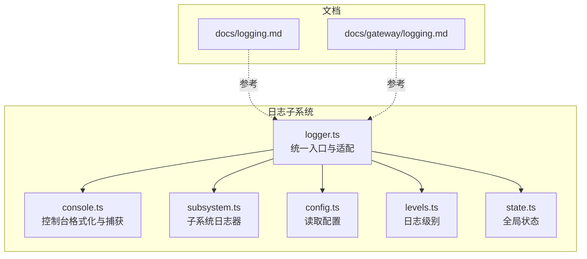
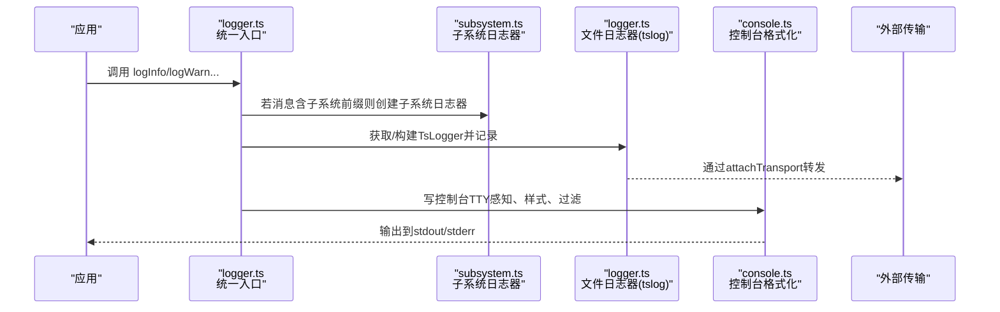
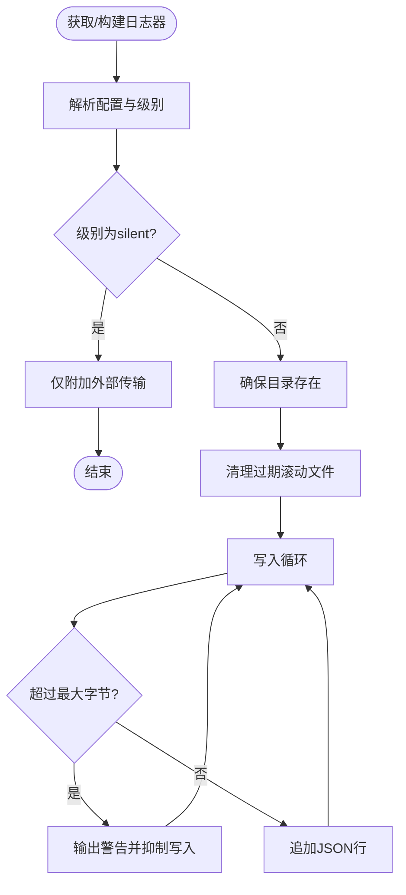
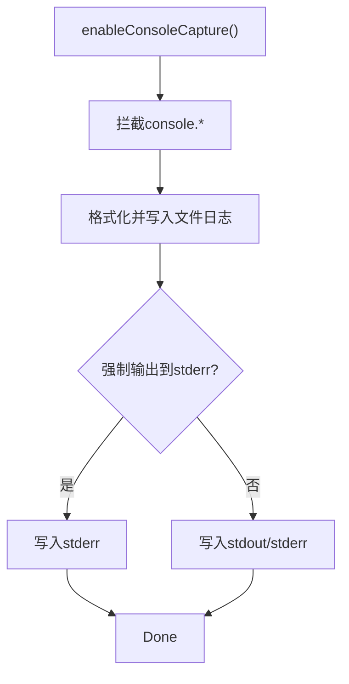
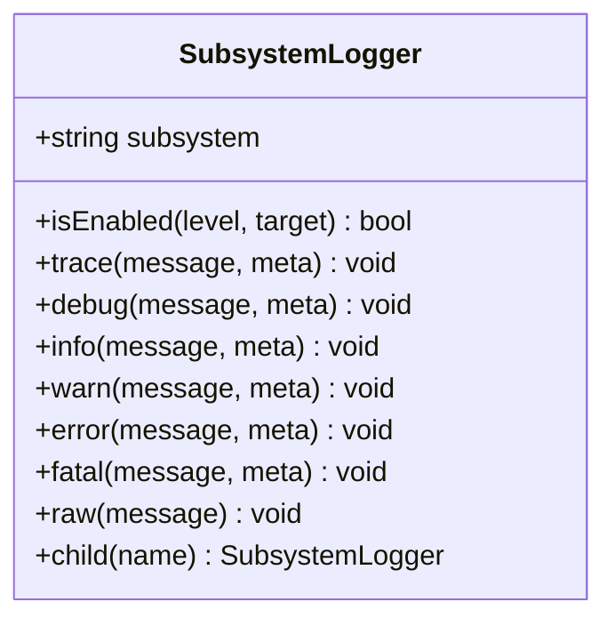
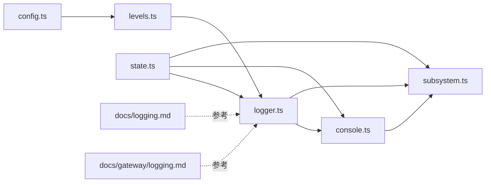

# 监控和日志

<cite>
**本文引用的文件**
- [src/logger.ts](file://src/logger.ts)
- [src/logging.ts](file://src/logging.ts)
- [src/logging/logger.ts](file://src/logging/logger.ts)
- [src/logging/console.ts](file://src/logging/console.ts)
- [src/logging/levels.ts](file://src/logging/levels.ts)
- [src/logging/config.ts](file://src/logging/config.ts)
- [src/logging/subsystem.ts](file://src/logging/subsystem.ts)
- [src/logging/state.ts](file://src/logging/state.ts)
- [docs/logging.md](file://docs/logging.md)
- [docs/gateway/logging.md](file://docs/gateway/logging.md)
</cite>

## 目录
1. [简介](#简介)
2. [项目结构](#项目结构)
3. [核心组件](#核心组件)
4. [架构总览](#架构总览)
5. [详细组件分析](#详细组件分析)
6. [依赖关系分析](#依赖关系分析)
7. [性能考量](#性能考量)
8. [故障排查指南](#故障排查指南)
9. [结论](#结论)
10. [附录](#附录)

## 简介
本指南面向OpenClaw系统的监控与日志管理，覆盖以下主题：
- 系统级监控指标采集与性能指标定义
- 告警规则配置建议
- 日志结构设计、日志轮转策略与存储优化
- 分布式追踪（OpenTelemetry）、链路监控与用户体验监控
- 日志聚合、搜索与可视化工具集成方案
- 系统健康检查、故障检测与自动恢复机制
- 不同环境下的监控配置差异与性能影响

## 项目结构
OpenClaw的日志与监控能力由“文件日志（JSON Lines）+ 控制台输出（TTY感知）+ 可选OTLP导出”三部分构成，并通过子系统（subsystem）分层组织，支持按级别与样式控制输出。

**图表来源**
- [src/logging/logger.ts](file://src/logging/logger.ts#L1-L348)
- [src/logging/console.ts](file://src/logging/console.ts#L1-L327)
- [src/logging/subsystem.ts](file://src/logging/subsystem.ts#L1-L395)
- [src/logging/config.ts](file://src/logging/config.ts#L1-L25)
- [src/logging/levels.ts](file://src/logging/levels.ts#L1-L38)
- [src/logging/state.ts](file://src/logging/state.ts#L1-L20)
- [src/logging.ts](file://src/logging.ts#L1-L70)
- [src/logger.ts](file://src/logger.ts#L1-L86)
- [docs/logging.md](file://docs/logging.md#L1-L353)
- [docs/gateway/logging.md](file://docs/gateway/logging.md#L1-L114)

**章节来源**
- [src/logging/logger.ts](file://src/logging/logger.ts#L1-L348)
- [src/logging/console.ts](file://src/logging/console.ts#L1-L327)
- [src/logging/subsystem.ts](file://src/logging/subsystem.ts#L1-L395)
- [src/logging/config.ts](file://src/logging/config.ts#L1-L25)
- [src/logging/levels.ts](file://src/logging/levels.ts#L1-L38)
- [src/logging/state.ts](file://src/logging/state.ts#L1-L20)
- [src/logging.ts](file://src/logging.ts#L1-L70)
- [src/logger.ts](file://src/logger.ts#L1-L86)
- [docs/logging.md](file://docs/logging.md#L1-L353)
- [docs/gateway/logging.md](file://docs/gateway/logging.md#L1-L114)

## 核心组件
- 文件日志器：基于tslog，输出JSON Lines，支持滚动文件、大小上限、过期清理、外部传输注册。
- 控制台日志器：TTY感知、彩色/紧凑/JSON三种风格、可过滤子系统、可强制输出到stderr。
- 子系统日志器：按子系统前缀分组、颜色稳定、元数据透传、独立启用/禁用策略。
- 配置与级别：从配置文件或环境变量解析日志级别与样式；支持静默模式与测试快速路径。
- 全局状态：缓存已解析设置、是否已打补丁、过滤器等，避免重复计算与副作用。

**章节来源**
- [src/logging/logger.ts](file://src/logging/logger.ts#L1-L348)
- [src/logging/console.ts](file://src/logging/console.ts#L1-L327)
- [src/logging/subsystem.ts](file://src/logging/subsystem.ts#L1-L395)
- [src/logging/config.ts](file://src/logging/config.ts#L1-L25)
- [src/logging/levels.ts](file://src/logging/levels.ts#L1-L38)
- [src/logging/state.ts](file://src/logging/state.ts#L1-L20)
- [src/logging.ts](file://src/logging.ts#L1-L70)
- [src/logger.ts](file://src/logger.ts#L1-L86)

## 架构总览
OpenClaw的日志与监控架构分为三层：
- 输入层：应用调用统一入口函数（如info/warn/error/debug），内部根据消息是否带子系统前缀分流至子系统日志器或通用日志器。
- 处理层：控制台日志器负责TTY感知与格式化；文件日志器负责写入JSON Lines文件并进行滚动与大小限制。
- 导出层：可注册外部传输，将日志事件转发至OTLP收集器（通过插件实现）。

**图表来源**
- [src/logger.ts](file://src/logger.ts#L1-L86)
- [src/logging/subsystem.ts](file://src/logging/subsystem.ts#L1-L395)
- [src/logging/logger.ts](file://src/logging/logger.ts#L1-L348)
- [src/logging/console.ts](file://src/logging/console.ts#L1-L327)

## 详细组件分析

### 文件日志器（logger.ts）
- 默认滚动文件路径：按日期生成文件名，默认位于临时目录下。
- 设置解析：优先使用环境变量覆盖，其次读取配置文件，再回退到主配置加载器。
- 文件写入：逐条JSON Lines追加，UTF-8编码；在达到最大字节后抑制写入并输出警告。
- 过期清理：保留最近24小时内的滚动文件，其余删除。
- 外部传输：可注册多个传输回调，用于OTLP导出等场景。
- 测试优化：在特定测试环境下跳过配置读取与文件写入，提升启动速度。

**图表来源**
- [src/logging/logger.ts](file://src/logging/logger.ts#L73-L106)
- [src/logging/logger.ts](file://src/logging/logger.ts#L126-L184)
- [src/logging/logger.ts](file://src/logging/logger.ts#L323-L347)

**章节来源**
- [src/logging/logger.ts](file://src/logging/logger.ts#L1-L348)

### 控制台日志器（console.ts）
- 控制台级别与样式：TTY时默认pretty，非TTY时compact；可通过配置或环境变量调整。
- 消息捕获：拦截console.*调用，同时写入文件日志并输出到stdout/stderr。
- 过滤与抑制：支持子系统过滤、时间戳前缀、对特定消息进行抑制以降低噪音。
- 安全处理：监听stdout/stderr的异步EPIPE错误，避免崩溃。
- 强制输出到stderr：用于RPC/JSON模式，保证stdout纯净。

**图表来源**
- [src/logging/console.ts](file://src/logging/console.ts#L203-L326)

**章节来源**
- [src/logging/console.ts](file://src/logging/console.ts#L1-L327)

### 子系统日志器（subsystem.ts）
- 子系统前缀：自动去除冗余前缀（如gateway/channels），保留最后若干段，便于扫描。
- 彩色输出：基于子系统哈希选择稳定颜色，支持少量覆盖。
- 启用策略：分别判断控制台与文件输出的启用状态，支持按级别与目标筛选。
- 元数据透传：允许在meta中传递consoleMessage覆盖显示内容，以及其它字段透传到文件日志。
- 运行时适配：提供将子系统日志器适配为运行时环境的方法，便于命令行工具使用。

**图表来源**
- [src/logging/subsystem.ts](file://src/logging/subsystem.ts#L17-L28)

**章节来源**
- [src/logging/subsystem.ts](file://src/logging/subsystem.ts#L1-L395)

### 配置与级别（config.ts、levels.ts、state.ts）
- 配置读取：从用户配置路径读取JSON5配置，提取logging节。
- 级别解析：支持silent/fatal/error/warn/info/debug/trace，映射为tslog最小级别。
- 环境变量覆盖：OPENCLAW_LOG_LEVEL优先于配置文件；CLI全局选项可进一步覆盖。
- 全局状态：缓存解析结果、是否已打补丁、过滤器、强制stderr等，减少重复计算与副作用。

**章节来源**
- [src/logging/config.ts](file://src/logging/config.ts#L1-L25)
- [src/logging/levels.ts](file://src/logging/levels.ts#L1-L38)
- [src/logging/state.ts](file://src/logging/state.ts#L1-L20)

### 统一入口（logger.ts、logging.ts）
- 统一入口：对外暴露logInfo/logWarn/logSuccess/logError/logDebug等方法。
- 子系统分流：若消息以“子系统: ”开头，则创建对应子系统日志器并记录。
- 运行时适配：将子系统日志器适配为运行时环境，便于命令行工具与UI使用。

**章节来源**
- [src/logger.ts](file://src/logger.ts#L1-L86)
- [src/logging.ts](file://src/logging.ts#L1-L70)

## 依赖关系分析
- logger.ts依赖：config.ts（读取配置）、levels.ts（级别映射）、timestamps.ts（时间戳）、state.ts（全局状态）、console.ts（TTY感知）。
- console.ts依赖：config.ts（读取配置）、levels.ts（级别映射）、logger.ts（获取文件日志器）、state.ts（全局状态）。
- subsystem.ts依赖：console.ts（控制台设置）、levels.ts（级别映射）、logger.ts（文件日志器）、state.ts（全局状态）。
- 文档层：docs/logging.md与docs/gateway/logging.md提供用户侧配置与使用说明。

**图表来源**
- [src/logging/logger.ts](file://src/logging/logger.ts#L1-L348)
- [src/logging/console.ts](file://src/logging/console.ts#L1-L327)
- [src/logging/subsystem.ts](file://src/logging/subsystem.ts#L1-L395)
- [src/logging/config.ts](file://src/logging/config.ts#L1-L25)
- [src/logging/levels.ts](file://src/logging/levels.ts#L1-L38)
- [src/logging/state.ts](file://src/logging/state.ts#L1-L20)
- [docs/logging.md](file://docs/logging.md#L1-L353)
- [docs/gateway/logging.md](file://docs/gateway/logging.md#L1-L114)

**章节来源**
- [src/logging/logger.ts](file://src/logging/logger.ts#L1-L348)
- [src/logging/console.ts](file://src/logging/console.ts#L1-L327)
- [src/logging/subsystem.ts](file://src/logging/subsystem.ts#L1-L395)
- [src/logging/config.ts](file://src/logging/config.ts#L1-L25)
- [src/logging/levels.ts](file://src/logging/levels.ts#L1-L38)
- [src/logging/state.ts](file://src/logging/state.ts#L1-L20)
- [docs/logging.md](file://docs/logging.md#L1-L353)
- [docs/gateway/logging.md](file://docs/gateway/logging.md#L1-L114)

## 性能考量
- 测试快速路径：在测试环境中，若未显式开启文件日志与环境变量覆盖，直接进入silent模式，跳过配置读取与文件写入，显著降低启动开销。
- 缓存策略：日志器与设置在进程内缓存，避免重复构建与解析。
- I/O优化：逐条JSON Lines追加，尽量减少同步I/O阻塞；在达到上限时抑制写入并输出警告，防止磁盘压力过大。
- 控制台输出：TTY感知与颜色处理在非TTY时降级，减少渲染成本。
- 外部传输：注册传输回调不阻塞主流程，异常被捕获不中断日志写入。

**章节来源**
- [src/logging/logger.ts](file://src/logging/logger.ts#L64-L83)
- [src/logging/logger.ts](file://src/logging/logger.ts#L210-L219)
- [src/logging/console.ts](file://src/logging/console.ts#L40-L72)
- [src/logging/console.ts](file://src/logging/console.ts#L203-L326)

## 故障排查指南
- 网关不可达：使用诊断命令检查网关状态与日志路径。
- 日志为空：确认网关正在运行且写入到配置中的文件路径。
- 需要更详细信息：将文件日志级别提升至debug或trace。
- 控制台噪音：通过子系统过滤、时间戳前缀与样式切换降低干扰。
- EPIPE错误：控制台捕获逻辑已处理异步EPIPE，避免崩溃。

**章节来源**
- [docs/logging.md](file://docs/logging.md#L347-L353)
- [src/logging/console.ts](file://src/logging/console.ts#L164-L167)
- [src/logging/console.ts](file://src/logging/console.ts#L215-L225)

## 结论
OpenClaw的日志体系以“文件日志+控制台输出+可选OTLP导出”为核心，结合子系统分层与TTY感知，既满足开发调试需求，又兼顾生产环境的可观测性与性能。通过合理的配置与传输扩展，可轻松对接各类监控与日志平台，实现端到端的链路监控与用户体验监控。

## 附录

### 监控与日志管理最佳实践
- 指标采集与性能指标
  - 使用诊断事件（diagnostics）作为指标来源，结合OTLP导出到集中式监控系统。
  - 关注模型用量、消息队列、会话状态等关键指标，设置采样率与刷新间隔。
- 告警规则配置
  - 基于会话卡住、队列深度、Webhook错误、消息处理时延等事件设置阈值告警。
  - 对高基数标签（如会话ID）进行聚合或抽样，避免告警风暴。
- 日志结构与轮转
  - 采用JSON Lines结构，确保解析一致性；启用滚动与过期清理，控制单日文件大小。
  - 在高吞吐场景下，优先在收集器侧进行采样与过滤，降低网络与存储压力。
- 分布式追踪与链路监控
  - 通过OTLP/HTTP导出OpenTelemetry追踪与指标，覆盖模型调用、Webhook处理与消息队列。
  - 为每个关键跨度添加属性（如通道、会话、模型），便于检索与聚合。
- 用户体验监控
  - 将用户交互与工具执行摘要纳入日志，结合敏感信息脱敏策略保护隐私。
  - 使用子系统前缀与颜色区分不同模块，提升问题定位效率。
- 工具集成
  - CLI与控制UI支持实时tail与多种输出模式；结合日志聚合平台实现全文检索与可视化。
- 健康检查与自动恢复
  - 通过诊断事件与指标观察系统健康状况；在资源受限或磁盘空间不足时，自动降级日志级别或关闭非关键输出。
- 环境差异
  - 开发环境可开启详细日志与TTY美化；生产环境建议使用紧凑模式与滚动策略，并在收集器侧进行采样与过滤。

**章节来源**
- [docs/logging.md](file://docs/logging.md#L142-L353)
- [docs/gateway/logging.md](file://docs/gateway/logging.md#L1-L114)