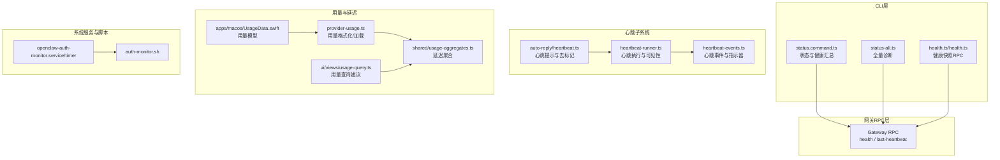
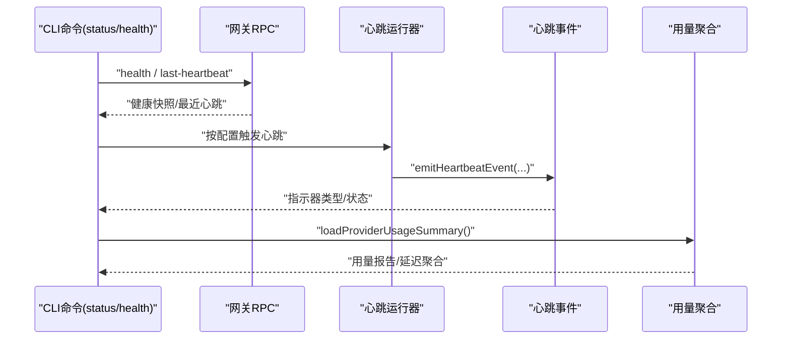
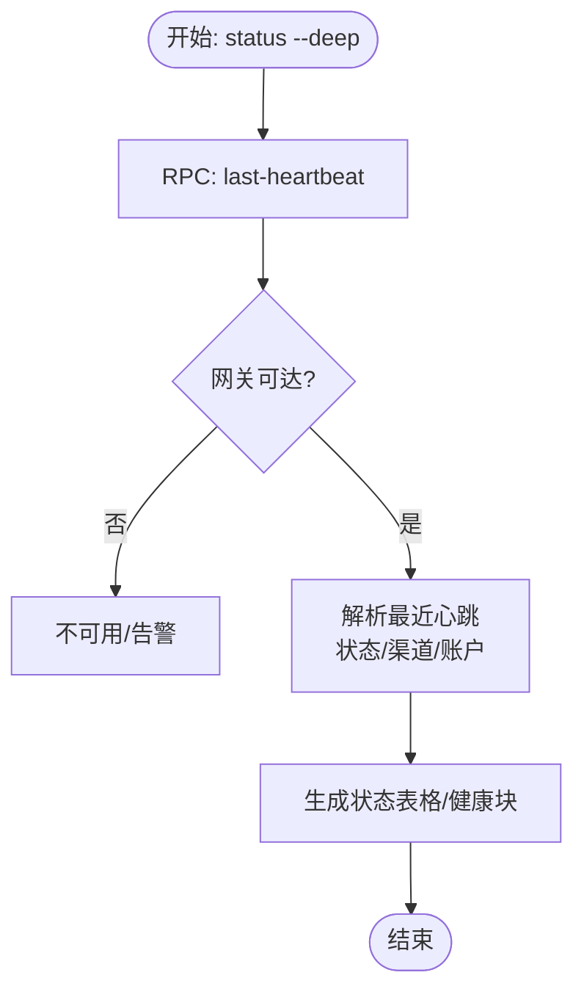
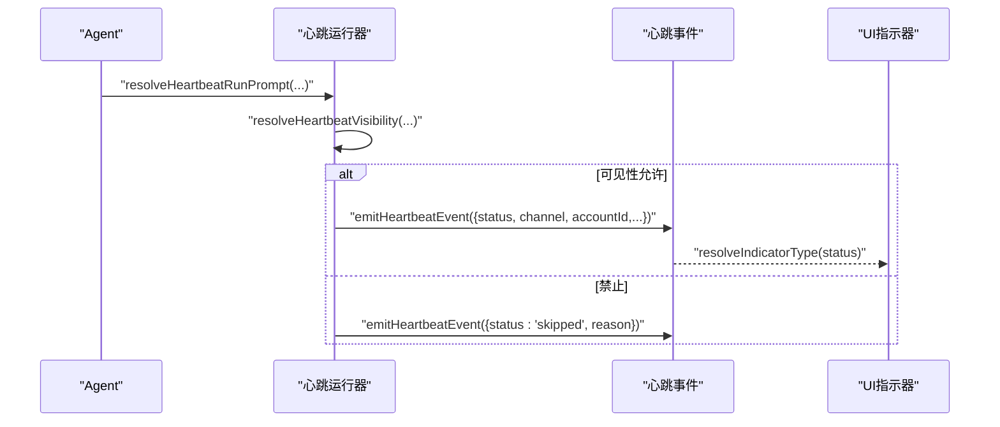
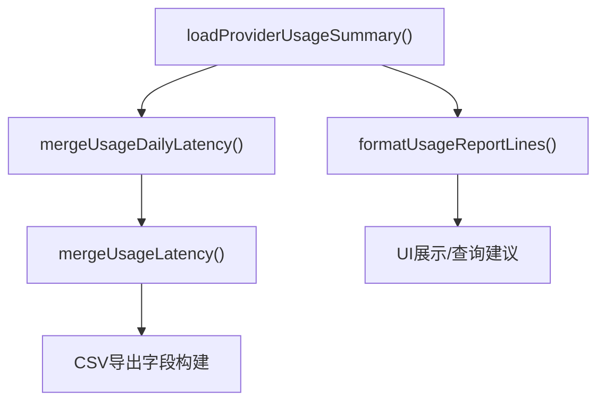
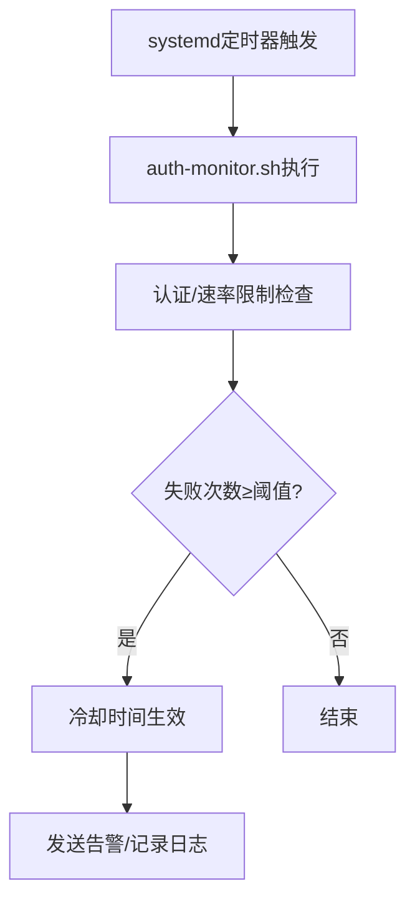
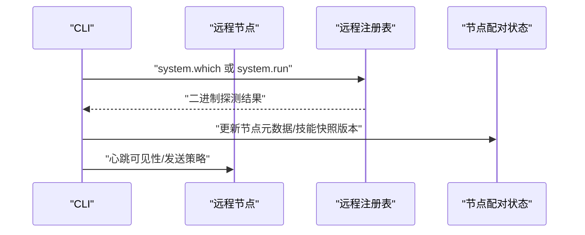
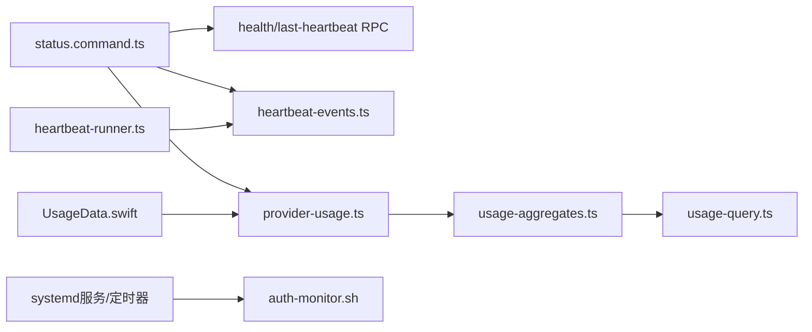

# 系统监控

<cite>
**本文引用的文件**
- [src/commands/status.command.ts](file://src/commands/status.command.ts)
- [src/commands/status-all.ts](file://src/commands/status-all.ts)
- [src/commands/health.ts/health.ts](file://src/commands/health.ts/health.ts)
- [src/infra/heartbeat-events.ts](file://src/infra/heartbeat-events.ts)
- [src/auto-reply/heartbeat.ts](file://src/auto-reply/heartbeat.ts)
- [src/infra/heartbeat-runner.ts](file://src/infra/heartbeat-runner.ts)
- [src/infra/provider-usage.ts](file://src/infra/provider-usage.ts)
- [src/shared/usage-aggregates.ts](file://src/shared/usage-aggregates.ts)
- [apps/macos/Sources/OpenClaw/UsageData.swift](file://apps/macos/Sources/OpenClaw/UsageData.swift)
- [ui/src/ui/views/usage-query.ts](file://ui/src/ui/views/usage-query.ts)
- [scripts/systemd/openclaw-auth-monitor.service](file://scripts/systemd/openclaw-auth-monitor.service)
- [scripts/systemd/openclaw-auth-monitor.timer](file://scripts/systemd/openclaw-auth-monitor.timer)
- [scripts/auth-monitor.sh](file://scripts/auth-monitor.sh)
- [docs/cli/health.md](file://docs/cli/health.md)
- [docs/gateway/health.md](file://docs/gateway/health.md)
- [docs/platforms/mac/health.md](file://docs/platforms/mac/health.md)
</cite>

## 目录
1. [简介](#简介)
2. [项目结构](#项目结构)
3. [核心组件](#核心组件)
4. [架构总览](#架构总览)
5. [详细组件分析](#详细组件分析)
6. [依赖关系分析](#依赖关系分析)
7. [性能考量](#性能考量)
8. [故障排查指南](#故障排查指南)
9. [结论](#结论)
10. [附录](#附录)

## 简介
本技术文档面向OpenClaw系统监控与运维场景，聚焦以下目标：
- 系统健康检查机制：通过CLI命令与网关RPC接口获取健康快照，支持深度探测与通道连通性验证。
- 心跳监控：自动化心跳任务的触发、可见性控制、事件上报与UI指示器类型解析。
- 性能指标采集：令牌用量、延迟聚合、成本统计与按日聚合的查询导出能力。
- 网关服务器健康状态检测：网关可达性、认证状态、最近一次心跳信息与代理模式诊断。
- 资源使用监控与异常告警：基于系统服务单元与脚本的认证速率限制监控，以及告警冷却与失败次数阈值配置。
- 分布式环境监控拓扑：多节点配对、远程节点二进制探测与技能快照更新，支撑跨节点协调。

## 项目结构
OpenClaw的监控能力由CLI命令层、网关RPC层、心跳事件与运行器、用量与延迟聚合模块、平台与UI展示以及系统服务脚本共同组成。下图给出与监控相关的关键模块关系：

图表来源
- [src/commands/status.command.ts](file://src/commands/status.command.ts#L1-L684)
- [src/commands/status-all.ts](file://src/commands/status-all.ts#L238-L272)
- [src/commands/health.ts/health.ts](file://src/commands/health.ts/health.ts)
- [src/infra/heartbeat-runner.ts](file://src/infra/heartbeat-runner.ts#L670-L713)
- [src/infra/heartbeat-events.ts](file://src/infra/heartbeat-events.ts#L1-L59)
- [src/auto-reply/heartbeat.ts](file://src/auto-reply/heartbeat.ts#L1-L172)
- [src/infra/provider-usage.ts](file://src/infra/provider-usage.ts#L1-L14)
- [src/shared/usage-aggregates.ts](file://src/shared/usage-aggregates.ts#L1-L66)
- [ui/src/ui/views/usage-query.ts](file://ui/src/ui/views/usage-query.ts#L100-L152)
- [apps/macos/Sources/OpenClaw/UsageData.swift](file://apps/macos/Sources/OpenClaw/UsageData.swift#L1-L45)
- [scripts/systemd/openclaw-auth-monitor.service](file://scripts/systemd/openclaw-auth-monitor.service)
- [scripts/systemd/openclaw-auth-monitor.timer](file://scripts/systemd/openclaw-auth-monitor.timer)
- [scripts/auth-monitor.sh](file://scripts/auth-monitor.sh)

章节来源
- [src/commands/status.command.ts](file://src/commands/status.command.ts#L1-L684)
- [src/commands/status-all.ts](file://src/commands/status-all.ts#L238-L272)
- [src/commands/health.ts/health.ts](file://src/commands/health.ts/health.ts)
- [src/infra/heartbeat-runner.ts](file://src/infra/heartbeat-runner.ts#L670-L713)
- [src/infra/heartbeat-events.ts](file://src/infra/heartbeat-events.ts#L1-L59)
- [src/auto-reply/heartbeat.ts](file://src/auto-reply/heartbeat.ts#L1-L172)
- [src/infra/provider-usage.ts](file://src/infra/provider-usage.ts#L1-L14)
- [src/shared/usage-aggregates.ts](file://src/shared/usage-aggregates.ts#L1-L66)
- [ui/src/ui/views/usage-query.ts](file://ui/src/ui/views/usage-query.ts#L100-L152)
- [apps/macos/Sources/OpenClaw/UsageData.swift](file://apps/macos/Sources/OpenClaw/UsageData.swift#L1-L45)
- [scripts/systemd/openclaw-auth-monitor.service](file://scripts/systemd/openclaw-auth-monitor.service)
- [scripts/systemd/openclaw-auth-monitor.timer](file://scripts/systemd/openclaw-auth-monitor.timer)
- [scripts/auth-monitor.sh](file://scripts/auth-monitor.sh)

## 核心组件
- 健康快照与状态汇总
  - CLI命令通过RPC向网关请求健康快照，并在深度模式下拉取最近心跳事件，用于诊断通道连通性与网关可用性。
  - 全量诊断命令提供更广泛的系统状态、网关模式、认证状态与最近心跳详情。
- 心跳监控
  - 心跳运行器根据可见性策略决定是否发送心跳；事件携带状态、渠道、账户等元信息，并映射为UI指示器类型。
  - 心跳提示与消息去标记逻辑确保仅在必要时输出冗余内容。
- 用量与延迟聚合
  - 提供用量快照加载与格式化、延迟聚合工具函数，支持按日合并与加权平均计算。
  - UI侧提供用量查询建议与CSV导出字段，便于审计与成本分析。
- 系统服务与脚本
  - systemd服务单元与定时器负责周期性执行认证监控脚本，结合失败次数阈值与冷却时间实现告警节流。

章节来源
- [src/commands/status.command.ts](file://src/commands/status.command.ts#L144-L166)
- [src/commands/status-all.ts](file://src/commands/status-all.ts#L238-L272)
- [src/infra/heartbeat-events.ts](file://src/infra/heartbeat-events.ts#L1-L59)
- [src/auto-reply/heartbeat.ts](file://src/auto-reply/heartbeat.ts#L1-L172)
- [src/infra/provider-usage.ts](file://src/infra/provider-usage.ts#L1-L14)
- [src/shared/usage-aggregates.ts](file://src/shared/usage-aggregates.ts#L1-L66)
- [ui/src/ui/views/usage-query.ts](file://ui/src/ui/views/usage-query.ts#L100-L152)
- [scripts/systemd/openclaw-auth-monitor.service](file://scripts/systemd/openclaw-auth-monitor.service)
- [scripts/systemd/openclaw-auth-monitor.timer](file://scripts/systemd/openclaw-auth-monitor.timer)

## 架构总览
下图展示从CLI到网关RPC、心跳事件与用量聚合的整体调用链路与数据流向：

图表来源
- [src/commands/status.command.ts](file://src/commands/status.command.ts#L144-L166)
- [src/infra/heartbeat-runner.ts](file://src/infra/heartbeat-runner.ts#L670-L713)
- [src/infra/heartbeat-events.ts](file://src/infra/heartbeat-events.ts#L36-L59)
- [src/infra/provider-usage.ts](file://src/infra/provider-usage.ts#L1-L14)

## 详细组件分析

### 健康检查与状态汇总
- CLI健康命令
  - 支持JSON输出与深度探测，通过RPC向网关请求健康快照并打印通道探针摘要、会话存储摘要与探测耗时。
- 状态命令
  - 在深度模式下拉取最近心跳事件，显示状态、年龄、渠道与账户标识；同时汇总代理模式、网关可达性、认证状态与最近心跳详情。
- 全量诊断
  - 提供网关自检信息、存活代理数量阈值与控制面板链接等综合视图。

图表来源
- [src/commands/status.command.ts](file://src/commands/status.command.ts#L144-L166)
- [src/commands/status-all.ts](file://src/commands/status-all.ts#L238-L272)

章节来源
- [docs/cli/health.md](file://docs/cli/health.md#L1-L22)
- [docs/gateway/health.md](file://docs/gateway/health.md#L1-L36)
- [src/commands/status.command.ts](file://src/commands/status.command.ts#L144-L166)
- [src/commands/status-all.ts](file://src/commands/status-all.ts#L238-L272)

### 心跳监控与事件指示器
- 心跳可见性与发送策略
  - 运行器依据可见性配置决定是否发送心跳；当禁用告警或显示开关时，记录“跳过”事件并返回。
- 事件载荷与指示器类型
  - 事件包含时间戳、状态（发送/成功/空响应/失败/跳过）、渠道、账户、静默标志与指示器类型；指示器类型根据状态映射为“正常/告警/错误”。
- 心跳提示与消息处理
  - 心跳提示默认严格遵循工作区上下文；消息去标记逻辑可剥离心跳标记并限制ACK长度，避免重复与噪音。

图表来源
- [src/infra/heartbeat-runner.ts](file://src/infra/heartbeat-runner.ts#L670-L713)
- [src/infra/heartbeat-events.ts](file://src/infra/heartbeat-events.ts#L20-L34)
- [src/auto-reply/heartbeat.ts](file://src/auto-reply/heartbeat.ts#L55-L172)

章节来源
- [src/infra/heartbeat-runner.ts](file://src/infra/heartbeat-runner.ts#L670-L713)
- [src/infra/heartbeat-events.ts](file://src/infra/heartbeat-events.ts#L1-L59)
- [src/auto-reply/heartbeat.ts](file://src/auto-reply/heartbeat.ts#L1-L172)

### 性能指标采集与用量聚合
- 用量快照与格式化
  - 提供用量快照加载与格式化函数，支持多提供商窗口与计划信息展示。
- 延迟聚合
  - 合并总量延迟与按日延迟，计算加权平均与分位数上限，支持多条目聚合。
- UI查询与导出
  - UI侧提供用量查询建议与CSV导出字段，便于审计与成本分析。
- 平台用量模型
  - macOS平台定义用量窗口、提供商与摘要的数据结构，支持错误与重置时间展示。

图表来源
- [src/infra/provider-usage.ts](file://src/infra/provider-usage.ts#L1-L14)
- [src/shared/usage-aggregates.ts](file://src/shared/usage-aggregates.ts#L32-L66)
- [ui/src/ui/views/usage-query.ts](file://ui/src/ui/views/usage-query.ts#L100-L152)
- [apps/macos/Sources/OpenClaw/UsageData.swift](file://apps/macos/Sources/OpenClaw/UsageData.swift#L1-L45)

章节来源
- [src/infra/provider-usage.ts](file://src/infra/provider-usage.ts#L1-L14)
- [src/shared/usage-aggregates.ts](file://src/shared/usage-aggregates.ts#L1-L66)
- [ui/src/ui/views/usage-query.ts](file://ui/src/ui/views/usage-query.ts#L100-L152)
- [apps/macos/Sources/OpenClaw/UsageData.swift](file://apps/macos/Sources/OpenClaw/UsageData.swift#L1-L45)

### 网关服务器健康状态检测与异常告警
- 网关可达性与认证状态
  - 状态命令汇总网关模式、URL、可达性、连接延迟与认证状态；在深度模式下显示最近心跳详情。
- 异常告警机制
  - 系统服务单元与定时器周期执行认证监控脚本；通过失败次数阈值与冷却时间实现告警节流，避免风暴。
- 配置参考
  - 文档提供健康检查快速步骤、深度诊断与故障处理指引，包括凭证与会话存储位置、重新配对流程等。

图表来源
- [scripts/systemd/openclaw-auth-monitor.service](file://scripts/systemd/openclaw-auth-monitor.service)
- [scripts/systemd/openclaw-auth-monitor.timer](file://scripts/systemd/openclaw-auth-monitor.timer)
- [scripts/auth-monitor.sh](file://scripts/auth-monitor.sh)

章节来源
- [src/commands/status.command.ts](file://src/commands/status.command.ts#L254-L280)
- [src/commands/status-all.ts](file://src/commands/status-all.ts#L238-L272)
- [scripts/systemd/openclaw-auth-monitor.service](file://scripts/systemd/openclaw-auth-monitor.service)
- [scripts/systemd/openclaw-auth-monitor.timer](file://scripts/systemd/openclaw-auth-monitor.timer)
- [docs/gateway/health.md](file://docs/gateway/health.md#L1-L36)

### 分布式环境监控拓扑与跨节点协调
- 多节点配对与状态持久化
  - 节点配对状态文件包含待审批与已配对节点列表，定期清理过期待审批项，支持并发锁保护。
- 远程节点能力探测
  - 通过远程注册表调用系统命令探测远端节点二进制集合，变更后更新配对节点元数据并触发技能快照版本提升。
- 心跳与可观测性
  - 心跳运行器在跨节点场景中仍遵循可见性与指示器策略，保证统一的可观测性体验。

图表来源
- [src/infra/node-pairing.ts](file://src/infra/node-pairing.ts#L57-L126)
- [src/infra/skills-remote.ts](file://src/infra/skills-remote.ts#L273-L309)
- [src/infra/heartbeat-runner.ts](file://src/infra/heartbeat-runner.ts#L670-L713)

章节来源
- [src/infra/node-pairing.ts](file://src/infra/node-pairing.ts#L57-L126)
- [src/infra/skills-remote.ts](file://src/infra/skills-remote.ts#L273-L309)
- [src/infra/heartbeat-runner.ts](file://src/infra/heartbeat-runner.ts#L670-L713)

## 依赖关系分析
- 组件耦合
  - CLI命令依赖网关RPC以获取健康与心跳信息；心跳运行器依赖可见性配置与事件模块；用量聚合被UI与CLI共享。
- 外部集成
  - systemd服务单元与定时器提供周期性任务调度；macOS平台定义用量数据模型并与UI交互。
- 潜在循环依赖
  - 当前模块间通过清晰的导入边界组织，未发现直接循环依赖；事件模块采用发布订阅模式降低耦合。

图表来源
- [src/commands/status.command.ts](file://src/commands/status.command.ts#L144-L166)
- [src/infra/heartbeat-events.ts](file://src/infra/heartbeat-events.ts#L36-L59)
- [src/infra/heartbeat-runner.ts](file://src/infra/heartbeat-runner.ts#L670-L713)
- [src/infra/provider-usage.ts](file://src/infra/provider-usage.ts#L1-L14)
- [src/shared/usage-aggregates.ts](file://src/shared/usage-aggregates.ts#L1-L66)
- [ui/src/ui/views/usage-query.ts](file://ui/src/ui/views/usage-query.ts#L100-L152)
- [apps/macos/Sources/OpenClaw/UsageData.swift](file://apps/macos/Sources/OpenClaw/UsageData.swift#L1-L45)
- [scripts/systemd/openclaw-auth-monitor.service](file://scripts/systemd/openclaw-auth-monitor.service)
- [scripts/systemd/openclaw-auth-monitor.timer](file://scripts/systemd/openclaw-auth-monitor.timer)
- [scripts/auth-monitor.sh](file://scripts/auth-monitor.sh)

## 性能考量
- 探测超时与并发
  - CLI命令支持超时参数覆盖默认值，避免长时间阻塞；RPC调用与并发任务通过Promise并行处理提升效率。
- 心跳频率与可见性
  - 心跳提示与可见性策略减少无效消息传输；事件指示器类型帮助UI快速识别状态。
- 用量与延迟聚合
  - 加权平均与按日聚合减少大体量数据的重复计算；CSV导出字段精简，便于离线分析。

[本节为通用指导，不直接分析具体文件]

## 故障排查指南
- 健康检查与通道诊断
  - 使用健康命令与状态命令的深度模式，查看网关可达性、认证状态与最近心跳详情；关注日志中的心跳与重连标记。
- 网关不可达与认证问题
  - 若出现“未登录”或状态码409–515，执行重新登录流程；若网关不可达，启动网关并使用强制模式修复端口占用。
- 认证速率限制与告警
  - systemd定时器周期执行认证监控脚本；根据失败次数阈值与冷却时间调整告警策略，避免频繁告警。

章节来源
- [docs/gateway/health.md](file://docs/gateway/health.md#L27-L36)
- [src/commands/status.command.ts](file://src/commands/status.command.ts#L254-L280)
- [scripts/systemd/openclaw-auth-monitor.service](file://scripts/systemd/openclaw-auth-monitor.service)
- [scripts/systemd/openclaw-auth-monitor.timer](file://scripts/systemd/openclaw-auth-monitor.timer)

## 结论
OpenClaw的监控体系通过CLI命令、网关RPC、心跳事件与用量聚合形成闭环，配合systemd服务与脚本实现自动化告警与节流。分布式场景下，节点配对与远程探测保障了跨节点可观测性与一致性。建议在生产环境中合理设置心跳频率、告警阈值与冷却时间，并结合用量与延迟聚合进行成本与性能分析。

[本节为总结性内容，不直接分析具体文件]

## 附录
- CLI健康命令参考
  - 健康命令支持JSON输出与深度探测，适用于自动化与调试场景。
- 网关健康检查文档
  - 提供快速检查、深度诊断与故障处理指引，覆盖凭证、会话与重新配对流程。

章节来源
- [docs/cli/health.md](file://docs/cli/health.md#L1-L22)
- [docs/gateway/health.md](file://docs/gateway/health.md#L1-L36)
- [docs/platforms/mac/health.md](file://docs/platforms/mac/health.md)