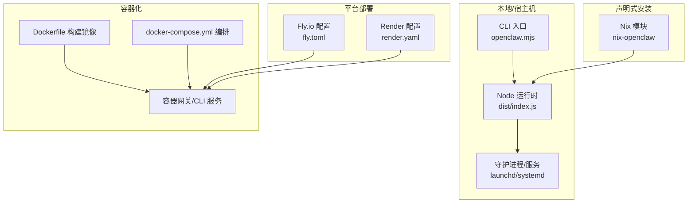
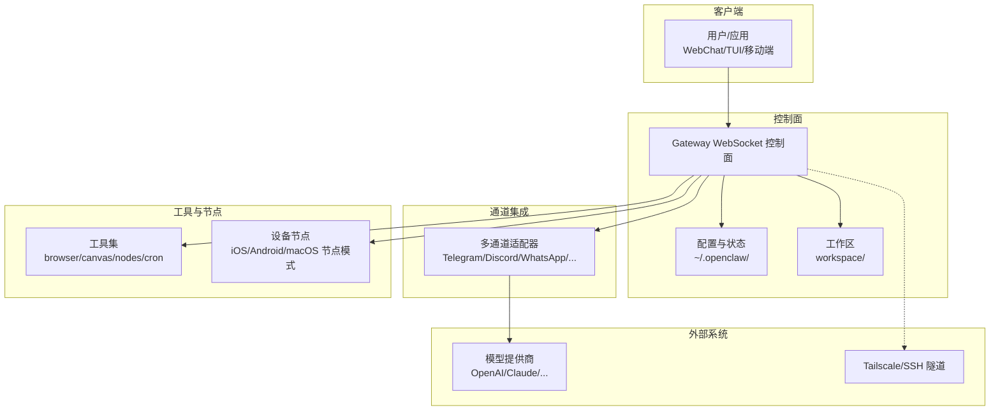
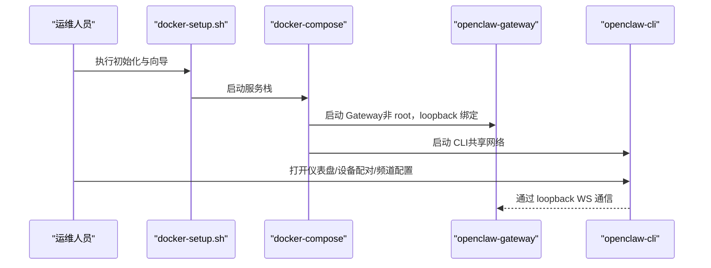
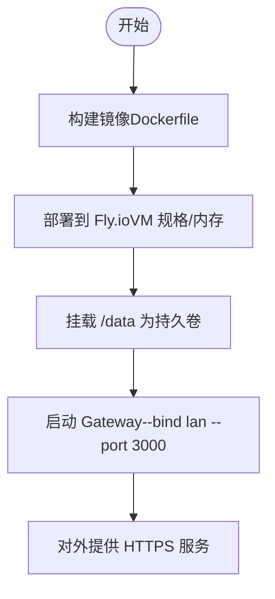
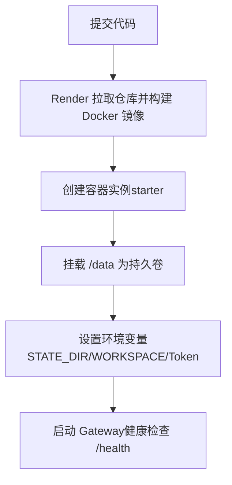
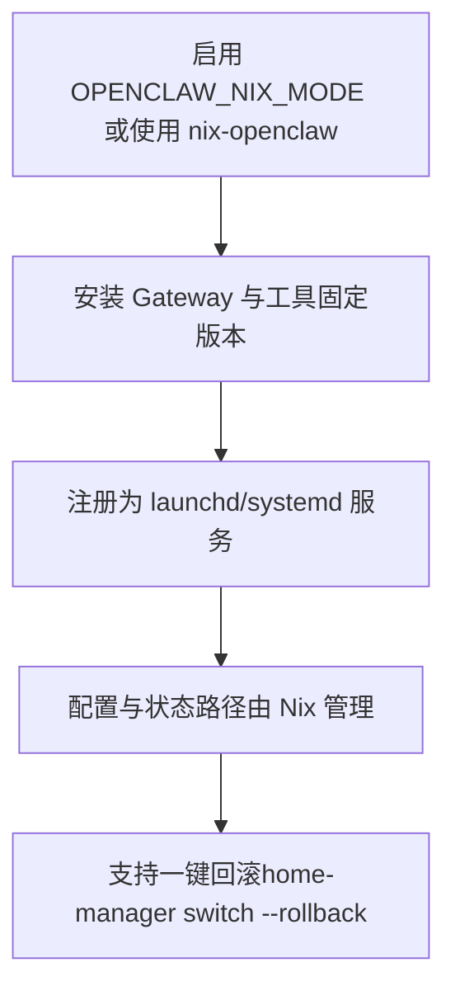
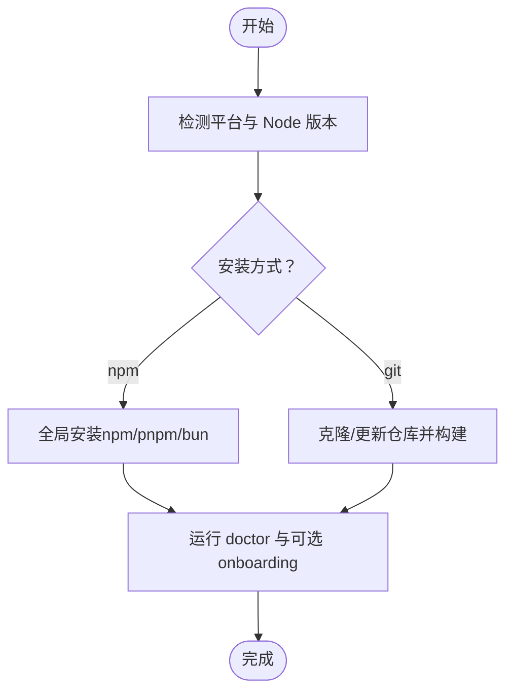
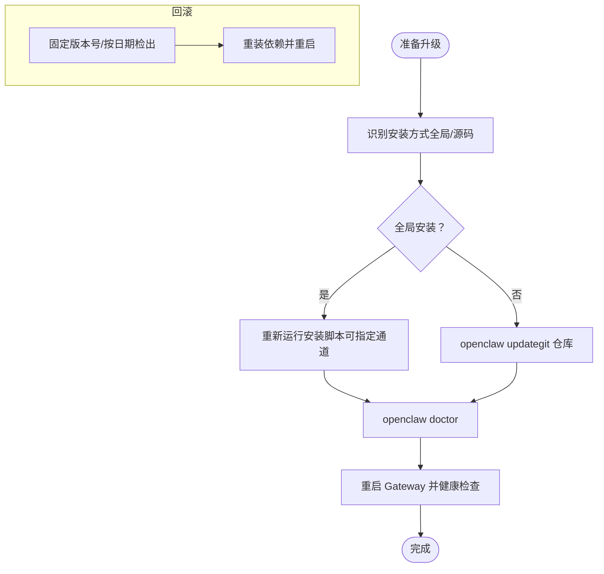
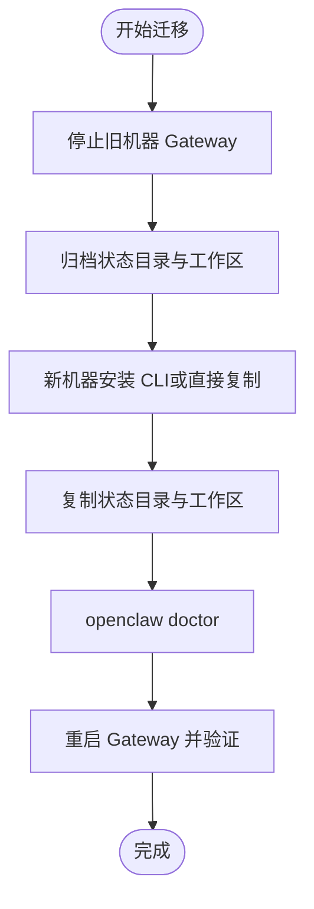
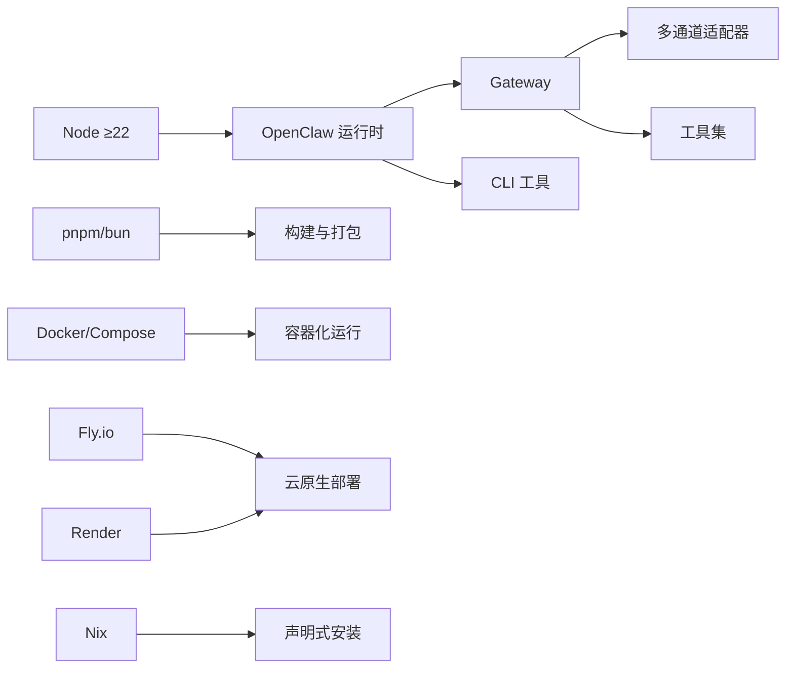

# 部署和运维

<cite>
**本文引用的文件**
- [README.md](file://README.md)
- [Dockerfile](file://Dockerfile)
- [docker-compose.yml](file://docker-compose.yml)
- [package.json](file://package.json)
- [fly.toml](file://fly.toml)
- [render.yaml](file://render.yaml)
- [setup-podman.sh](file://setup-podman.sh)
- [docs/install/docker.md](file://docs/install/docker.md)
- [docs/install/nix.md](file://docs/install/nix.md)
- [docs/install/installer.md](file://docs/install/installer.md)
- [docs/install/updating.md](file://docs/install/updating.md)
- [docs/install/uninstall.md](file://docs/install/uninstall.md)
- [docs/install/migrating.md](file://docs/install/migrating.md)
</cite>

## 目录
1. [简介](#简介)
2. [项目结构](#项目结构)
3. [核心组件](#核心组件)
4. [架构总览](#架构总览)
5. [详细组件分析](#详细组件分析)
6. [依赖关系分析](#依赖关系分析)
7. [性能考量](#性能考量)
8. [故障排除指南](#故障排除指南)
9. [结论](#结论)
10. [附录](#附录)

## 简介
本指南面向系统管理员与开发团队，提供 OpenClaw 在生产环境中的部署与运维实践，覆盖以下主题：
- 生产环境部署策略：Docker 容器化、Nix 声明式安装、传统安装（npm/pnpm/bun）
- 监控与日志：健康检查端点、日志路径与轮转建议
- 故障排除：常见错误定位、权限与网络暴露问题
- 运维自动化：升级、回滚、备份与迁移
- 性能优化：资源限制、浏览器缓存、沙箱隔离
- 安全加固：非 root 运行、最小权限、网络绑定与认证

## 项目结构
OpenClaw 提供多种安装与运行方式，核心入口与产物包括：
- CLI 可执行入口与打包产物：通过二进制或 Node 运行 dist/index.js
- Docker 镜像与编排：Dockerfile、docker-compose.yml
- 平台化部署配置：Fly.io（fly.toml）、Render（render.yaml）
- 安装脚本与文档：install.sh、install-cli.sh、install.ps1 以及相关文档
- Nix 声明式安装：nix-openclaw 模块与行为说明

图示来源
- [Dockerfile](file://Dockerfile#L1-L155)
- [docker-compose.yml](file://docker-compose.yml#L1-L77)
- [fly.toml](file://fly.toml#L1-L35)
- [render.yaml](file://render.yaml#L1-L22)
- [docs/install/nix.md](file://docs/install/nix.md#L1-L99)

章节来源
- [README.md](file://README.md#L1-L560)
- [package.json](file://package.json#L1-L444)

## 核心组件
- 网关控制平面（Gateway）：WebSocket 控制面，承载会话、通道、工具与事件；支持远程访问（Tailscale/SSH 隧道）
- CLI 工具链：openclaw 命令，用于引导、健康检查、设备配对、频道配置等
- 容器镜像与编排：基于 Node 22 的多阶段构建，内置健康检查端点与非 root 运行
- 平台部署：Fly.io Render 提供一键容器化部署与持久化存储
- 声明式安装：Nix 模块确保可复现、可回滚的安装与服务管理
- 安装脚本：install.sh、install-cli.sh、install.ps1 支持自动化与 CI 场景

章节来源
- [README.md](file://README.md#L180-L238)
- [package.json](file://package.json#L16-L36)
- [Dockerfile](file://Dockerfile#L135-L155)
- [docker-compose.yml](file://docker-compose.yml#L1-L77)
- [fly.toml](file://fly.toml#L1-L35)
- [render.yaml](file://render.yaml#L1-L22)
- [docs/install/nix.md](file://docs/install/nix.md#L1-L99)
- [docs/install/installer.md](file://docs/install/installer.md#L1-L406)

## 架构总览
下图展示 OpenClaw 在不同部署形态下的关键交互与数据流。

图示来源
- [README.md](file://README.md#L180-L238)
- [docs/install/docker.md](file://docs/install/docker.md#L1-L843)

## 详细组件分析

### Docker 容器化部署
- 镜像构建：基于 node:22-bookworm，启用 Bun 与 Corepack；支持在构建期预装 apt 包、Playwright 浏览器、Docker CLI（用于沙箱）
- 运行参数：默认以非 root 用户运行，绑定 loopback（127.0.0.1），内置 /healthz 与 /readyz 健康检查
- 编排：docker-compose.yml 同时启动 openclaw-gateway 与 openclaw-cli，并挂载配置与工作区目录
- 沙箱：可通过 OPENCLAW_SANDBOX=1 自动引导 agents.defaults.sandbox.*，并挂载 /var/run/docker.sock（需镜像含 Docker CLI）

图示来源
- [docs/install/docker.md](file://docs/install/docker.md#L35-L129)
- [Dockerfile](file://Dockerfile#L1-L155)
- [docker-compose.yml](file://docker-compose.yml#L1-L77)
- [setup-podman.sh](file://setup-podman.sh#L1-L308)

章节来源
- [docs/install/docker.md](file://docs/install/docker.md#L1-L843)
- [Dockerfile](file://Dockerfile#L1-L155)
- [docker-compose.yml](file://docker-compose.yml#L1-L77)
- [setup-podman.sh](file://setup-podman.sh#L1-L308)

### Fly.io 平台部署
- 使用 fly.toml 指定 Dockerfile、内存与 VM 规格，启用持久化磁盘（/data）
- 内部端口 3000，强制 HTTPS，保持机器常驻以维持持久连接
- 通过环境变量设置 Node 选项与状态目录

图示来源
- [fly.toml](file://fly.toml#L1-L35)

章节来源
- [fly.toml](file://fly.toml#L1-L35)

### Render 平台部署
- 使用 render.yaml 指定 Docker 运行时、starter 规格与健康检查路径
- 设置 OPENCLAW_STATE_DIR 与 OPENCLAW_WORKSPACE_DIR 指向 /data 下子目录
- 提供自动生成的 OPENCLAW_GATEWAY_TOKEN

图示来源
- [render.yaml](file://render.yaml#L1-L22)

章节来源
- [render.yaml](file://render.yaml#L1-L22)

### Nix 声明式安装
- 推荐使用 nix-openclaw 模块，实现可复现、可回滚的安装与服务管理
- Nix 模式下禁用自动安装与自更新流程，强调显式配置与状态路径可控
- macOS 应用打包流程依赖确定性模板与版本信息

图示来源
- [docs/install/nix.md](file://docs/install/nix.md#L1-L99)

章节来源
- [docs/install/nix.md](file://docs/install/nix.md#L1-L99)

### 传统安装（npm/pnpm/bun）
- install.sh：检测 OS、安装 Node、选择 npm 或 git 安装方式，支持跳过引导与干跑
- install-cli.sh：在本地前缀下安装 Node 与 OpenClaw，适合无系统 Node 的环境
- install.ps1：Windows 平台安装脚本，支持 npm/git 安装与路径修复

图示来源
- [docs/install/installer.md](file://docs/install/installer.md#L1-L406)

章节来源
- [docs/install/installer.md](file://docs/install/installer.md#L1-L406)

### 升级与回滚策略
- 全局安装：推荐重新运行网站安装脚本进行原地升级；或使用 openclaw update 切换通道
- 源码安装：openclaw update 执行安全更新流程（clean 工作树、rebase、doctor、重启）
- 回滚：固定版本号或按日期检出历史提交；必要时清理工作区后重建

图示来源
- [docs/install/updating.md](file://docs/install/updating.md#L1-L258)

章节来源
- [docs/install/updating.md](file://docs/install/updating.md#L1-L258)

### 备份与迁移
- 迁移目标：状态目录（~/.openclaw/）与工作区（workspace/）
- 注意事项：多配置文件/多状态目录（profile）的一致性、权限与所有权、远端模式下的网关主机迁移
- 验证清单：状态显示运行、频道仍连接、仪表盘可见会话、工作区文件存在

图示来源
- [docs/install/migrating.md](file://docs/install/migrating.md#L1-L193)

章节来源
- [docs/install/migrating.md](file://docs/install/migrating.md#L1-L193)

## 依赖关系分析
- 运行时依赖：Node ≥22；包管理器（pnpm/bun）；可选 Playwright 浏览器与 Docker CLI（沙箱）
- 平台依赖：Docker/Docker Compose、Fly.io CLI、Render CLI、Nix 生态
- 网络与安全：Docker 防火墙策略、Loopback 绑定、Tailscale/SSH 隧道、Token 认证

图示来源
- [package.json](file://package.json#L410-L413)
- [Dockerfile](file://Dockerfile#L1-L155)
- [fly.toml](file://fly.toml#L1-L35)
- [render.yaml](file://render.yaml#L1-L22)
- [docs/install/nix.md](file://docs/install/nix.md#L1-L99)

章节来源
- [package.json](file://package.json#L410-L413)
- [Dockerfile](file://Dockerfile#L1-L155)
- [fly.toml](file://fly.toml#L1-L35)
- [render.yaml](file://render.yaml#L1-L22)
- [docs/install/nix.md](file://docs/install/nix.md#L1-L99)

## 性能考量
- 容器内存与 CPU：Fly.io 示例使用 shared-cpu-2x 与 2GB 内存；根据并发与模型负载调整
- 浏览器缓存：在容器中预装 Playwright 浏览器并持久化缓存目录，减少启动时延
- 沙箱隔离：按会话/代理粒度隔离工具执行，避免跨会话污染；合理设置资源上限与网络策略
- 日志与磁盘：关注 media/、sessions/、cron/runs/ 与 rolling 文件日志增长，制定轮转策略

章节来源
- [docs/install/docker.md](file://docs/install/docker.md#L542-L543)
- [fly.toml](file://fly.toml#L28-L31)

## 故障排除指南
- 权限与所有权：容器内 node 用户 UID 为 1000，确保宿主挂载目录属主正确
- 网络暴露：Docker 默认 loopback 绑定可能无法从主机访问，需改为 lan 并设置认证
- 健康检查：使用 /healthz 与 /readyz 快速判断容器存活与就绪状态
- 设备配对与仪表盘：若出现“未授权/断开”，通过 CLI 获取仪表盘链接并批准设备
- 远端访问：Tailscale Serve/Funnel 与 SSH 隧道需配合正确的绑定与认证策略

章节来源
- [docs/install/docker.md](file://docs/install/docker.md#L468-L531)
- [Dockerfile](file://Dockerfile#L148-L154)

## 结论
OpenClaw 提供灵活的部署与运维路径：传统安装适合快速迭代与本地开发；容器化与平台部署满足生产稳定性与弹性；Nix 声明式安装保障可复现与可回滚。结合健康检查、日志轮转、沙箱隔离与最小权限原则，可在多环境中实现安全、可观测、可维护的运行。

## 附录
- 常用命令速查
  - 容器：docker compose up/down、docker compose run openclaw-cli
  - 平台：fly deploy、render redeploy
  - 升级：openclaw update、openclaw doctor、openclaw gateway restart
  - 迁移：归档状态目录与工作区、校验权限与所有权、doctor 与重启