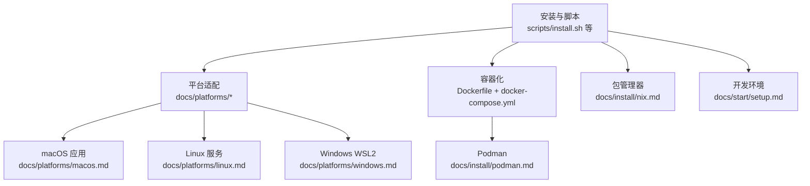
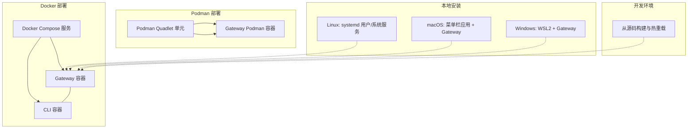
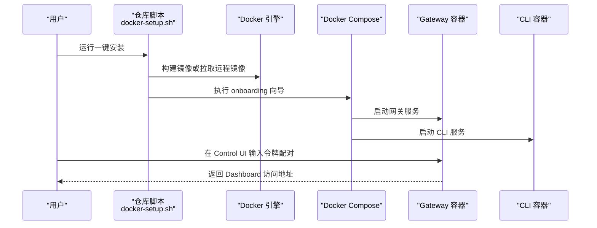
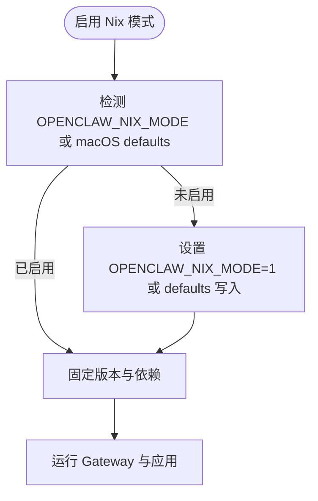
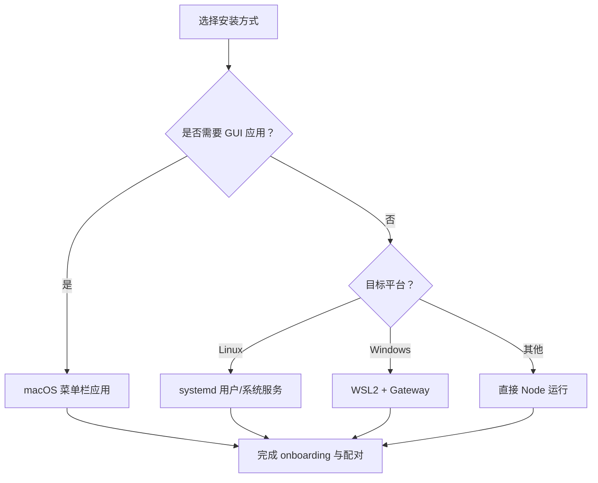
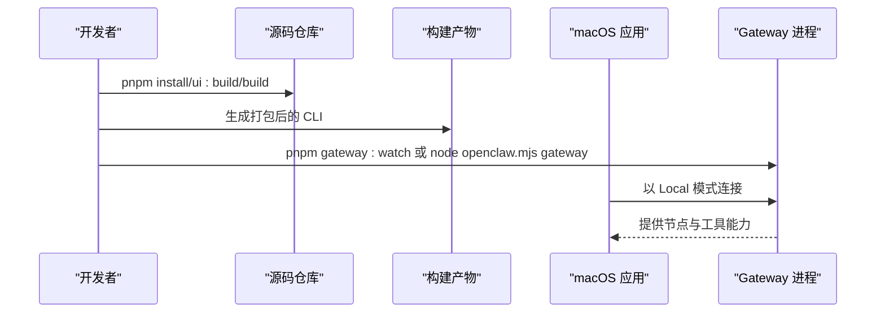
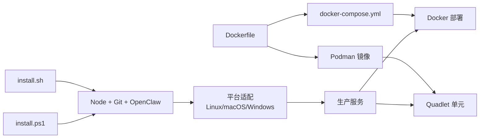

# 部署策略

<cite>
**本文引用的文件**
- [docs/install/docker.md](file://docs/install/docker.md)
- [docs/install/nix.md](file://docs/install/nix.md)
- [docs/install/index.md](file://docs/install/index.md)
- [Dockerfile](file://Dockerfile)
- [docker-compose.yml](file://docker-compose.yml)
- [scripts/install.sh](file://scripts/install.sh)
- [docs/platforms/linux.md](file://docs/platforms/linux.md)
- [docs/platforms/macos.md](file://docs/platforms/macos.md)
- [docs/platforms/windows.md](file://docs/platforms/windows.md)
- [docs/start/setup.md](file://docs/start/setup.md)
- [docs/install/installer.md](file://docs/install/installer.md)
- [docs/install/podman.md](file://docs/install/podman.md)
- [scripts/podman/openclaw.container.in](file://scripts/podman/openclaw.container.in)
</cite>

## 目录
1. [引言](#引言)
2. [项目结构](#项目结构)
3. [核心组件](#核心组件)
4. [架构总览](#架构总览)
5. [详细组件分析](#详细组件分析)
6. [依赖关系分析](#依赖关系分析)
7. [性能考量](#性能考量)
8. [故障排查指南](#故障排查指南)
9. [结论](#结论)
10. [附录](#附录)

## 引言
本指南面向在不同环境中部署 OpenClaw 的工程与运维人员，系统性对比并梳理以下四种部署策略：Docker 容器化部署、Nix 包管理器部署、传统本地安装、开发环境部署。内容覆盖环境准备、依赖安装、配置设置、启动步骤、生产最佳实践、资源规划与网络配置，并针对 Linux、macOS、Windows 的差异给出具体操作建议与注意事项。

## 项目结构
OpenClaw 提供多条安装路径与运行模式，核心包括：
- 官方安装脚本与文档：统一的安装体验与自动化流程
- 容器镜像与编排：Docker 与 Podman 的镜像构建与服务编排
- 平台适配：macOS 菜单栏应用、Linux systemd 用户服务、Windows WSL2
- 开发工作流：从源码构建到热重载调试

**图表来源**
- [scripts/install.sh](file://scripts/install.sh#L1-L800)
- [docs/platforms/linux.md](file://docs/platforms/linux.md#L1-L95)
- [docs/platforms/macos.md](file://docs/platforms/macos.md#L1-L227)
- [docs/platforms/windows.md](file://docs/platforms/windows.md#L1-L204)
- [docs/install/docker.md](file://docs/install/docker.md#L1-L843)
- [Dockerfile](file://Dockerfile#L1-L155)
- [docker-compose.yml](file://docker-compose.yml#L1-L77)
- [docs/install/podman.md](file://docs/install/podman.md#L1-L123)
- [docs/start/setup.md](file://docs/start/setup.md#L1-L166)

**章节来源**
- [docs/install/index.md](file://docs/install/index.md#L1-L219)
- [docs/install/docker.md](file://docs/install/docker.md#L1-L843)
- [docs/install/nix.md](file://docs/install/nix.md#L1-L99)
- [docs/install/podman.md](file://docs/install/podman.md#L1-L123)
- [docs/platforms/linux.md](file://docs/platforms/linux.md#L1-L95)
- [docs/platforms/macos.md](file://docs/platforms/macos.md#L1-L227)
- [docs/platforms/windows.md](file://docs/platforms/windows.md#L1-L204)
- [docs/start/setup.md](file://docs/start/setup.md#L1-L166)

## 核心组件
- 安装脚本与自动化
  - install.sh：自动检测系统、安装 Node 与依赖、选择 npm 或 git 安装方式、可选运行向导与诊断
  - install-cli.sh：将 Node 与 OpenClaw 安装到本地前缀，适合无系统 Node 的环境
  - install.ps1：Windows PowerShell 安装脚本，支持 npm/git 两种方式
- 容器镜像与编排
  - Dockerfile：基于 node:22-bookworm 构建，支持扩展依赖预装、浏览器与 Docker CLI 可选安装
  - docker-compose.yml：定义网关与 CLI 服务、端口映射、健康检查、卷挂载与安全限制
- 平台与服务
  - Linux：systemd 用户服务或系统服务；支持通过 openclaw 命令安装与管理
  - macOS：菜单栏应用负责权限与节点桥接，可本地或远程连接 Gateway
  - Windows：推荐 WSL2，提供开机自启与端口转发等高级配置
- 开发环境
  - 从源码构建、热重载调试、macOS 应用联动、凭据与会话存储位置

**章节来源**
- [docs/install/installer.md](file://docs/install/installer.md#L1-L406)
- [Dockerfile](file://Dockerfile#L1-L155)
- [docker-compose.yml](file://docker-compose.yml#L1-L77)
- [docs/platforms/linux.md](file://docs/platforms/linux.md#L1-L95)
- [docs/platforms/macos.md](file://docs/platforms/macos.md#L1-L227)
- [docs/platforms/windows.md](file://docs/platforms/windows.md#L1-L204)
- [docs/start/setup.md](file://docs/start/setup.md#L1-L166)

## 架构总览
下图展示四种部署方式的总体架构与交互关系，帮助理解各方案的边界与职责：

**图表来源**
- [docker-compose.yml](file://docker-compose.yml#L1-L77)
- [Dockerfile](file://Dockerfile#L1-L155)
- [docs/install/podman.md](file://docs/install/podman.md#L1-L123)
- [scripts/podman/openclaw.container.in](file://scripts/podman/openclaw.container.in#L1-L29)
- [docs/platforms/linux.md](file://docs/platforms/linux.md#L1-L95)
- [docs/platforms/macos.md](file://docs/platforms/macos.md#L1-L227)
- [docs/platforms/windows.md](file://docs/platforms/windows.md#L1-L204)
- [docs/start/setup.md](file://docs/start/setup.md#L1-L166)

## 详细组件分析

### Docker 容器化部署
- 适用场景
  - 需要隔离的网关环境、快速验证 Docker 流程、CI/CD 场景
  - 与 agent sandbox 结合使用时，可在 Docker 中运行工具沙箱
- 环境准备
  - Docker Desktop 或 Docker Engine + Docker Compose v2
  - 至少 2GB 内存，避免 pnpm 安装 OOM（退出码 137）
  - 公有云主机需参考网络安全加固（含 DOCKER-USER 策略）
- 一键安装与引导
  - 使用仓库根目录脚本进行镜像构建、向导、启动与令牌生成
  - 支持远程镜像（GHCR）跳过本地构建
- 关键参数与变量
  - OPENCLAW_IMAGE：远程镜像名
  - OPENCLAW_DOCKER_APT_PACKAGES：构建期安装系统包
  - OPENCLAW_EXTENSIONS：预装扩展依赖
  - OPENCLAW_EXTRA_MOUNTS：额外挂载
  - OPENCLAW_HOME_VOLUME：持久化 /home/node
  - OPENCLAW_SANDBOX：启用 Docker 网关沙箱引导
  - OPENCLAW_DOCKER_SOCKET：Docker 套接字路径
  - OPENCLAW_ALLOW_INSECURE_PRIVATE_WS：允许受信私网 ws://
  - OPENCLAW_BROWSER_*：浏览器相关标志控制
- 启动与访问
  - 默认绑定模式为 lan，发布端口 18789/18790
  - 通过 Control UI 输入令牌完成配对
- 沙箱与安全
  - 支持 per-session agent sandbox，非主会话工具在独立容器中执行
  - 默认网络为 none，可按需放宽或限制
- 健康检查与探针
  - /healthz（存活）、/readyz（就绪），Compose 内置 HEALTHCHECK
- 存储模型
  - 主机持久化：~/.openclaw 与 ~/.openclaw/workspace
  - 沙箱临时文件：tmpfs /tmp、/var/tmp、/run
- 生产建议
  - 绑定模式优先使用 lan，配合鉴权与防火墙
  - 使用 named volume 或 extra mounts 确保状态持久
  - 限制容器能力、cap-drop、no-new-privileges
  - 为 Playwright 浏览器与缓存设置持久化路径

**图表来源**
- [docs/install/docker.md](file://docs/install/docker.md#L35-L238)
- [docker-compose.yml](file://docker-compose.yml#L1-L77)
- [Dockerfile](file://Dockerfile#L1-L155)

**章节来源**
- [docs/install/docker.md](file://docs/install/docker.md#L1-L843)
- [docker-compose.yml](file://docker-compose.yml#L1-L77)
- [Dockerfile](file://Dockerfile#L1-L155)

### Nix 包管理器部署
- 适用场景
  - 追求声明式、可复现、可回滚的安装
  - 已在使用 Nix/NixOS/Home Manager 的团队
- 快速开始
  - 推荐使用 nix-openclaw（Home Manager 模块）
  - 提供 Gateway + macOS 应用 + 工具的全量固定版本
- Nix 模式行为
  - 通过 OPENCLAW_NIX_MODE=1 或 macOS defaults 开启
  - 禁用自动安装与自变更流程，配置确定性
  - 运行时状态与配置需指向 Nix 管理路径
- 配置与状态路径
  - OPENCLAW_HOME、OPENCLAW_STATE_DIR、OPENCLCLAW_CONFIG_PATH
- 生产建议
  - 使用 Home Manager 管理服务与配置
  - 利用 Nix 的原子切换与回滚能力

**图表来源**
- [docs/install/nix.md](file://docs/install/nix.md#L46-L99)

**章节来源**
- [docs/install/nix.md](file://docs/install/nix.md#L1-L99)

### 传统本地安装
- 适用场景
  - 开发者直接在宿主机运行，追求最小延迟与最大灵活性
  - 需要与本地工具链深度集成
- 安装方式
  - 官方安装脚本（install.sh）：自动检测 Node、安装 OpenClaw、可选 onboarding
  - npm/pnpm：全局安装后运行 openclaw onboard --install-daemon
  - 从源码：pnpm install/ui:build/build 后链接 CLI 或使用 pnpm openclaw
- 平台差异
  - Linux：systemd 用户服务或系统服务；默认用户服务，必要时开启 lingering
  - macOS：菜单栏应用负责权限与 Gateway 生命周期管理
  - Windows：强烈建议 WSL2，提供开机自启与端口转发等高级配置
- 环境变量与路径
  - OPENCLAW_HOME、OPENCLAW_STATE_DIR、OPENCLAW_CONFIG_PATH 控制运行时路径
- 生产建议
  - 使用 systemd 用户服务或系统服务确保开机自启
  - 为浏览器与工具缓存设置持久化路径
  - 严格控制权限与日志轮转

**图表来源**
- [docs/platforms/linux.md](file://docs/platforms/linux.md#L37-L95)
- [docs/platforms/macos.md](file://docs/platforms/macos.md#L26-L50)
- [docs/platforms/windows.md](file://docs/platforms/windows.md#L19-L100)
- [docs/install/installer.md](file://docs/install/installer.md#L67-L125)

**章节来源**
- [docs/install/index.md](file://docs/install/index.md#L24-L161)
- [docs/install/installer.md](file://docs/install/installer.md#L1-L406)
- [docs/platforms/linux.md](file://docs/platforms/linux.md#L1-L95)
- [docs/platforms/macos.md](file://docs/platforms/macos.md#L1-L227)
- [docs/platforms/windows.md](file://docs/platforms/windows.md#L1-L204)

### 开发环境部署
- 适用场景
  - 贡献者与核心开发者，需要热重载与调试
- 工作流
  - 从源码构建：pnpm install → ui:build → build
  - 运行 Gateway：node openclaw.mjs gateway 或 pnpm gateway:watch
  - macOS 应用以 Local 模式连接正在运行的 Gateway
- 凭据与会话
  - 凭据存储于 ~/.openclaw/credentials/
  - 会话数据位于 ~/.openclaw/agents/<agentId>/sessions/
  - 日志位于 /tmp/openclaw/
- 生产建议
  - 将个性化配置与工作区置于 ~/.openclaw/workspace
  - 更新时保持工作区与配置独立，避免被上游更新覆盖

**图表来源**
- [docs/start/setup.md](file://docs/start/setup.md#L51-L124)

**章节来源**
- [docs/start/setup.md](file://docs/start/setup.md#L1-L166)

## 依赖关系分析
- 安装脚本与平台
  - install.sh 作为统一入口，根据平台选择 Node 安装与 Git 安装策略
  - Windows 使用 install.ps1，Linux/macOS 使用 install.sh
- 容器与平台
  - Dockerfile 与 docker-compose.yml 为 Docker 部署提供镜像与编排
  - Podman 使用相同镜像，通过 Quadlet 文件实现 systemd 管理
- 平台服务
  - Linux 使用 systemd 用户服务；macOS 使用菜单栏应用；Windows 使用 WSL2
- 开发与生产
  - 开发环境强调热重载与调试；生产环境强调稳定性、持久化与安全

**图表来源**
- [scripts/install.sh](file://scripts/install.sh#L1-L800)
- [docs/install/installer.md](file://docs/install/installer.md#L1-L406)
- [Dockerfile](file://Dockerfile#L1-L155)
- [docker-compose.yml](file://docker-compose.yml#L1-L77)
- [docs/install/podman.md](file://docs/install/podman.md#L1-L123)
- [scripts/podman/openclaw.container.in](file://scripts/podman/openclaw.container.in#L1-L29)

**章节来源**
- [scripts/install.sh](file://scripts/install.sh#L1-L800)
- [docs/install/installer.md](file://docs/install/installer.md#L1-L406)
- [Dockerfile](file://Dockerfile#L1-L155)
- [docker-compose.yml](file://docker-compose.yml#L1-L77)
- [docs/install/podman.md](file://docs/install/podman.md#L1-L123)
- [scripts/podman/openclaw.container.in](file://scripts/podman/openclaw.container.in#L1-L29)

## 性能考量
- 容器化部署
  - 非 root 用户运行降低逃逸风险，但限制系统包安装与浏览器预装
  - 通过预装浏览器与持久化缓存减少冷启动时间
  - 按需放宽网络与资源限制，避免过度宽松导致的安全隐患
- 本地安装
  - 直接运行减少容器层开销，适合高频迭代与本地调试
  - 注意 sharp/libvips 与构建工具链的兼容性
- 平台差异
  - macOS 应用在 UI/TCC 上下文执行 system.run，注意权限与提示
  - Windows WSL2 提供一致的 Linux 运行时，但需处理端口转发与开机自启
- 资源规划
  - 观察媒体、会话、转录与日志等热点目录，合理分配磁盘空间
  - 对高并发场景适当提升内存与 CPU 限额

[本节为通用指导，无需特定文件引用]

## 故障排查指南
- Docker
  - 权限问题：确保主机挂载目录属主为 uid 1000
  - 端口冲突：确认 18789/18790 未被占用
  - 绑定模式：如出现配对失败，检查 gateway.bind 与 gateway.mode
  - 沙箱：缺少 docker.sock 或镜像未包含 Docker CLI 会导致沙箱初始化失败
- Nix
  - Nix 模式禁用自动安装，需手动提供依赖与配置路径
  - 通过 defaults 或环境变量启用 Nix 模式
- 本地安装
  - PATH 问题：确保 npm prefix -g/bin 在 PATH 中
  - Linux lingering：systemd 用户服务在注销后可能停止，需启用 lingering
  - Windows WSL2：确保 systemd 启用、开机自启任务与端口转发正确
- 开发环境
  - 热重载：确认 pnpm gateway:watch 正常运行并与 macOS 应用连接
  - 凭据与会话：检查 ~/.openclaw 下的 credentials 与 sessions 目录

**章节来源**
- [docs/install/docker.md](file://docs/install/docker.md#L391-L537)
- [docs/install/nix.md](file://docs/install/nix.md#L46-L99)
- [docs/platforms/linux.md](file://docs/platforms/linux.md#L65-L95)
- [docs/platforms/windows.md](file://docs/platforms/windows.md#L58-L146)
- [docs/start/setup.md](file://docs/start/setup.md#L117-L140)

## 结论
- Docker 适合需要隔离与可移植性的场景，结合沙箱可进一步强化工具执行安全
- Nix 适合追求声明式与可复现的团队，具备强大的回滚能力
- 传统本地安装在开发与调试阶段最具灵活性，生产中建议配合 systemd 与持久化策略
- 开发环境强调热重载与调试效率，生产环境强调稳定性与可观测性

[本节为总结，无需特定文件引用]

## 附录
- 生产环境最佳实践
  - 网络与安全：仅暴露必要端口，启用鉴权与防火墙；容器内限制能力与权限
  - 存储与备份：持久化 ~/.openclaw 与 workspace；定期备份凭据与会话
  - 监控与日志：启用健康检查与日志轮转；在容器与 systemd 中统一收集
- 不同操作系统差异
  - Linux：systemd 用户/系统服务；注意 lingering 与服务重启策略
  - macOS：菜单栏应用负责权限与生命周期；注意 iCloud 同步路径
  - Windows：WSL2 提供一致 Linux 运行时；处理开机自启与端口转发

[本节为通用指导，无需特定文件引用]