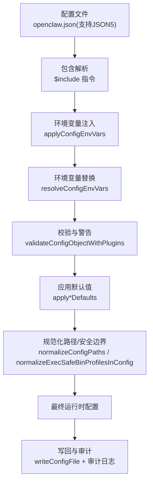
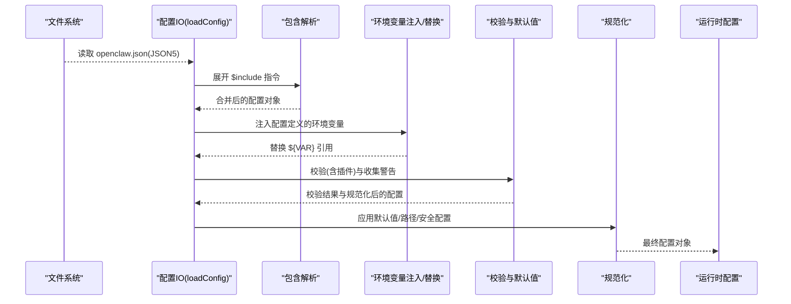
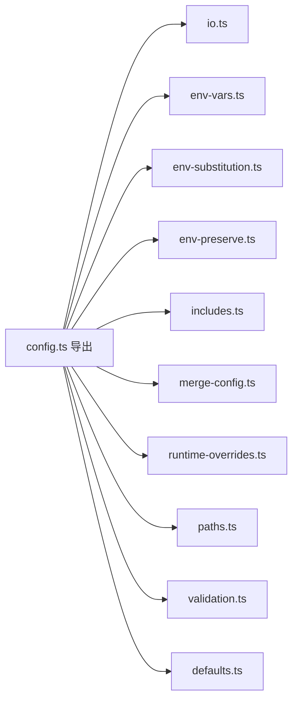

# 运行时配置

<cite>
**本文引用的文件**
- [src/config/config.ts](file://src/config/config.ts)
- [src/config/io.ts](file://src/config/io.ts)
- [src/config/env-vars.ts](file://src/config/env-vars.ts)
- [src/config/env-substitution.ts](file://src/config/env-substitution.ts)
- [src/config/env-preserve.ts](file://src/config/env-preserve.ts)
- [src/config/merge-config.ts](file://src/config/merge-config.ts)
- [src/config/runtime-overrides.ts](file://src/config/runtime-overrides.ts)
- [src/config/paths.ts](file://src/config/paths.ts)
- [src/config/includes.ts](file://src/config/includes.ts)
- [src/config/validation.ts](file://src/config/validation.ts)
- [src/config/defaults.ts](file://src/config/defaults.ts)
</cite>

## 目录
1. [简介](#简介)
2. [项目结构](#项目结构)
3. [核心组件](#核心组件)
4. [架构总览](#架构总览)
5. [详细组件分析](#详细组件分析)
6. [依赖关系分析](#依赖关系分析)
7. [性能考量](#性能考量)
8. [故障排查指南](#故障排查指南)
9. [结论](#结论)
10. [附录](#附录)

## 简介
本文件系统性阐述 OpenClaw 的运行时配置系统，涵盖配置加载机制、环境变量注入与保留、配置合并策略、覆盖顺序与优先级、冲突解决、值替换语法、条件配置、热重载与增量更新、状态同步以及最佳实践。目标是帮助开发者与运维人员在不同平台与场景下可靠地管理配置。

## 项目结构
OpenClaw 的配置系统主要位于 src/config 目录，围绕“解析—包含—替换—校验—默认值—写回”闭环构建，辅以路径解析、运行时覆盖、增量合并等能力，形成可扩展、可审计、可回滚的配置生命周期。

图表来源
- [src/config/io.ts](file://src/config/io.ts#L682-L800)
- [src/config/includes.ts](file://src/config/includes.ts#L340-L347)
- [src/config/env-vars.ts](file://src/config/env-vars.ts#L69-L81)
- [src/config/env-substitution.ts](file://src/config/env-substitution.ts#L169-L172)
- [src/config/validation.ts](file://src/config/validation.ts#L288-L314)
- [src/config/defaults.ts](file://src/config/defaults.ts#L130-L531)

章节来源
- [src/config/config.ts](file://src/config/config.ts#L1-L24)
- [src/config/io.ts](file://src/config/io.ts#L682-L800)
- [src/config/paths.ts](file://src/config/paths.ts#L118-L194)

## 核心组件
- 配置加载与写回：负责定位配置文件、读取/解析、包含展开、环境变量替换、校验、默认值填充、路径规范化、写回与审计。
- 环境变量注入与保留：在读取前注入配置定义的环境变量，在写回时保留原始的 ${VAR} 引用。
- 值替换语法：支持 ${VAR} 注入与 $${VAR} 转义；缺失变量会抛出错误。
- 包含与合并：$include 支持单文件或多文件合并，深度限制与安全检查；提供增量合并工具函数。
- 运行时覆盖：通过路径表达式设置/取消覆盖，与基础配置进行安全合并。
- 默认值与规范化：按模型、代理、会话、日志、上下文修剪、压缩等维度填充默认值，并进行路径与安全配置规范化。
- 路径解析：统一解析状态目录、配置文件路径、端口、OAuth 存储位置等。
- 校验与兼容：基于 Zod Schema 的强类型校验，插件配置校验，遗留配置检测与迁移提示。

章节来源
- [src/config/env-vars.ts](file://src/config/env-vars.ts#L12-L81)
- [src/config/env-substitution.ts](file://src/config/env-substitution.ts#L1-L172)
- [src/config/env-preserve.ts](file://src/config/env-preserve.ts#L1-L135)
- [src/config/includes.ts](file://src/config/includes.ts#L1-L347)
- [src/config/merge-config.ts](file://src/config/merge-config.ts#L1-L39)
- [src/config/runtime-overrides.ts](file://src/config/runtime-overrides.ts#L1-L92)
- [src/config/defaults.ts](file://src/config/defaults.ts#L1-L536)
- [src/config/paths.ts](file://src/config/paths.ts#L1-L285)
- [src/config/validation.ts](file://src/config/validation.ts#L1-L623)

## 架构总览
下图展示了从磁盘到运行时配置的关键流程，包括包含解析、环境变量注入与替换、校验与默认值、写回与审计。

图表来源
- [src/config/io.ts](file://src/config/io.ts#L682-L780)
- [src/config/includes.ts](file://src/config/includes.ts#L340-L347)
- [src/config/env-vars.ts](file://src/config/env-vars.ts#L69-L81)
- [src/config/env-substitution.ts](file://src/config/env-substitution.ts#L169-L172)
- [src/config/validation.ts](file://src/config/validation.ts#L288-L314)
- [src/config/defaults.ts](file://src/config/defaults.ts#L130-L531)

## 详细组件分析

### 配置加载与写回（loadConfig/writeConfigFile）
- 加载流程要点
  - 自动加载 .env（仅主进程），避免测试隔离。
  - 若配置文件不存在且允许，尝试 Shell 环境回退（可配置超时）。
  - 解析 JSON5，展开 $include，注入配置内 env，再进行 ${VAR} 替换。
  - 校验（含插件）、收集警告、版本提示、应用默认值、路径与安全配置规范化。
  - 再次注入环境变量，触发 Shell 环境回退（如启用）。
  - 生成或持久化 owner display secret（必要时写回）。
- 写回与审计
  - 支持传入 env 快照用于恢复 ${VAR} 引用。
  - 可指定必须移除的路径（即使规范化会重新引入）。
  - 记录配置写入审计日志（变更摘要、可疑行为标记等）。

章节来源
- [src/config/io.ts](file://src/config/io.ts#L682-L800)
- [src/config/io.ts](file://src/config/io.ts#L117-L134)
- [src/config/io.ts](file://src/config/io.ts#L277-L291)
- [src/config/io.ts](file://src/config/io.ts#L489-L536)

### 环境变量注入与保留
- 注入
  - 在替换前将配置内的 env 字段注入到 process.env，确保 ${VAR} 可解析。
  - 支持 vars 与顶层键（字符串）两类，过滤空值、危险键与非法键名。
- 保留
  - 写回时，若某值与当前环境变量替换结果一致，则恢复为原 ${VAR} 引用，避免丢失环境化意图。
  - 对转义 $${VAR} 与普通 ${VAR} 的解析语义保持一致。

章节来源
- [src/config/env-vars.ts](file://src/config/env-vars.ts#L12-L81)
- [src/config/env-substitution.ts](file://src/config/env-substitution.ts#L1-L172)
- [src/config/env-preserve.ts](file://src/config/env-preserve.ts#L1-L135)

### 值替换语法与条件配置
- 语法
  - ${VAR_NAME}：注入环境变量值（仅大写/下划线/数字，首字符为字母或下划线）。
  - $${VAR_NAME}：输出字面量 ${VAR_NAME}（转义）。
- 条件配置
  - 通过 $include 支持模块化拆分与多文件合并，结合路径选择器与运行时覆盖实现条件装配。
  - ${VAR} 可用于敏感字段（如 API Key），在不同环境以环境变量注入。

章节来源
- [src/config/env-substitution.ts](file://src/config/env-substitution.ts#L1-L172)
- [src/config/includes.ts](file://src/config/includes.ts#L1-L347)

### 包含与合并策略
- $include
  - 支持单文件或数组多文件合并；递归处理嵌套包含，限制最大深度与文件大小。
  - 安全检查：禁止逃逸根目录、禁止硬链接、禁止符号链接绕过，必要时使用边界打开。
- 增量合并
  - 提供 mergeConfigSection 与 mergeWhatsAppConfig 等工具，支持 unsetOnUndefined 控制 undefined 行为。
  - 与运行时覆盖配合，实现细粒度增量更新。

章节来源
- [src/config/includes.ts](file://src/config/includes.ts#L1-L347)
- [src/config/merge-config.ts](file://src/config/merge-config.ts#L1-L39)

### 运行时覆盖与优先级
- 覆盖机制
  - 通过路径表达式设置/取消覆盖，内部进行键名校验与循环引用防护。
  - applyConfigOverrides 将覆盖树与基础配置进行安全合并（仅允许普通对象与安全键）。
- 优先级与顺序
  - 基础配置 ← 运行时覆盖 ← 环境变量注入（先于替换） ← Shell 环境回退（可选）。
  - 未显式设置的 undefined 值可通过 unsetOnUndefined 影响合并结果。

章节来源
- [src/config/runtime-overrides.ts](file://src/config/runtime-overrides.ts#L1-L92)
- [src/config/merge-config.ts](file://src/config/merge-config.ts#L1-L39)

### 默认值与规范化
- 默认值
  - 消息、会话、代理并发、日志、模型、上下文修剪、压缩、心跳等维度的默认值自动填充。
  - Talk Provider 的 API Key 与默认 Provider 选择逻辑。
- 规范化
  - 路径规范化、执行安全二进制配置规范化、会话主键标准化等。

章节来源
- [src/config/defaults.ts](file://src/config/defaults.ts#L130-L531)
- [src/config/io.ts](file://src/config/io.ts#L746-L747)

### 路径解析与定位
- 状态目录与配置文件路径解析
  - 支持 OPENCLAW_STATE_DIR、OPENCLAW_CONFIG_PATH 等环境变量覆盖。
  - 兼容历史状态目录与配置文件名，自动迁移与回退。
- 端口与 OAuth 目录
  - 端口解析优先环境变量，其次配置，最后默认值。
  - OAuth 凭据存储目录可独立覆盖。

章节来源
- [src/config/paths.ts](file://src/config/paths.ts#L60-L285)

### 校验与冲突解决
- 校验
  - 基于 Zod Schema 的强类型校验，插件配置校验，通道与心跳目标校验，遗留配置问题检测。
- 冲突解决
  - 未知通道 ID、未知心跳目标、重复代理工作空间目录、遗留键误用等，均给出明确修复建议与替代方案。

章节来源
- [src/config/validation.ts](file://src/config/validation.ts#L229-L286)
- [src/config/validation.ts](file://src/config/validation.ts#L288-L623)

### 写回与审计
- 写回策略
  - 支持 unsetPaths 在写回时剔除特定路径，保证持久化一致性。
  - 通过 env 快照决定是否恢复 ${VAR} 引用，避免无意中固化环境变量值。
- 审计
  - 记录写入事件、前后哈希、字节数变化、网关模式变化、可疑行为等，便于追踪与回滚。

章节来源
- [src/config/io.ts](file://src/config/io.ts#L117-L134)
- [src/config/io.ts](file://src/config/io.ts#L489-L536)
- [src/config/env-preserve.ts](file://src/config/env-preserve.ts#L89-L135)

## 依赖关系分析
配置系统各模块职责清晰、耦合度低，通过统一的导出入口集中暴露能力。

图表来源
- [src/config/config.ts](file://src/config/config.ts#L1-L24)

章节来源
- [src/config/config.ts](file://src/config/config.ts#L1-L24)

## 性能考量
- I/O 与解析
  - JSON5 解析与包含展开成本与文件规模线性相关；合理拆分 $include 文件，避免单文件过大。
  - 包含深度与文件大小限制可防止极端情况下的资源消耗。
- 环境变量替换
  - 仅对字符串进行扫描与替换，复杂度与字符串长度成正比；建议减少不必要的 ${VAR} 嵌套。
- 校验与默认值
  - 校验与默认值填充为一次性开销；对频繁热重载场景，建议使用运行时覆盖与增量合并，减少全量重建。
- 写回与审计
  - 写回时的哈希计算与审计日志写入为轻量操作；unsetPaths 与 env 快照恢复可降低冗余写入。

## 故障排查指南
- 缺失环境变量
  - 症状：加载时报错，提示缺少 ${VAR}。
  - 处理：设置对应环境变量或在配置 env 中提供默认值；使用 $${VAR} 转义字面量。
- 循环包含
  - 症状：报错包含链路循环。
  - 处理：检查 $include 关系，避免相互引用；调整文件结构。
- 路径逃逸与安全拒绝
  - 症状：包含文件被拒绝，提示逃逸或不合规。
  - 处理：确保包含路径位于配置根目录内，避免符号链接绕过。
- 插件配置无效或缺失
  - 症状：插件未启用但配置存在，或插件不存在。
  - 处理：根据警告/错误信息清理或修正插件条目；必要时移除插件配置。
- 写回后环境变量丢失
  - 症状：写回后配置固化为字面量而非 ${VAR}。
  - 处理：调用写回时传入 env 快照，或在写回前保留原始引用；避免直接覆盖与类型不匹配。

章节来源
- [src/config/env-substitution.ts](file://src/config/env-substitution.ts#L29-L37)
- [src/config/includes.ts](file://src/config/includes.ts#L197-L222)
- [src/config/validation.ts](file://src/config/validation.ts#L485-L518)
- [src/config/env-preserve.ts](file://src/config/env-preserve.ts#L89-L135)

## 结论
OpenClaw 的运行时配置系统以“可包含、可替换、可校验、可默认、可覆盖、可写回”的设计实现了高可用与高可控性。通过明确的优先级与覆盖顺序、严格的包含安全策略、完善的审计与回滚能力，以及对环境变量的注入与保留，系统能够在多平台、多场景下稳定运行并支持持续演进。

## 附录

### 配置覆盖顺序与优先级（从低到高）
- 基础配置（磁盘 JSON5）
- 运行时覆盖（路径表达式设置）
- 环境变量注入（配置 env → process.env）
- 环境变量替换（${VAR}）
- Shell 环境回退（可选）
- 默认值填充与规范化

章节来源
- [src/config/io.ts](file://src/config/io.ts#L682-L780)
- [src/config/runtime-overrides.ts](file://src/config/runtime-overrides.ts#L86-L92)
- [src/config/env-vars.ts](file://src/config/env-vars.ts#L69-L81)
- [src/config/env-substitution.ts](file://src/config/env-substitution.ts#L169-L172)
- [src/config/defaults.ts](file://src/config/defaults.ts#L130-L531)

### 环境变量命名规范与值替换语法
- 命名规范
  - 仅支持大写字母、数字、下划线，且首字符为字母或下划线。
- 替换语法
  - ${VAR_NAME}：注入环境变量值。
  - $${VAR_NAME}：输出字面量 ${VAR_NAME}。
- 危险键过滤
  - 配置 env 中的危险键会被忽略，避免破坏宿主环境。

章节来源
- [src/config/env-substitution.ts](file://src/config/env-substitution.ts#L23-L27)
- [src/config/env-substitution.ts](file://src/config/env-substitution.ts#L78-L113)
- [src/config/env-vars.ts](file://src/config/env-vars.ts#L8-L10)

### 条件配置与热重载
- 条件配置
  - 使用 $include 拆分不同环境的片段，按需合并；通过运行时覆盖实现动态切换。
- 热重载与增量更新
  - 通过 setConfigOverride/unsetConfigOverride 设置/移除覆盖，无需重启即可生效。
  - 写回时使用 unsetPaths 与 env 快照恢复，减少对生产环境的影响。

章节来源
- [src/config/includes.ts](file://src/config/includes.ts#L340-L347)
- [src/config/runtime-overrides.ts](file://src/config/runtime-overrides.ts#L54-L84)
- [src/config/io.ts](file://src/config/io.ts#L117-L134)

### 实际应用场景最佳实践
- 开发环境
  - 使用 .env 与配置 env 注入 API Key；通过 $include 引入本地开发片段。
- 生产环境
  - 将敏感信息全部通过环境变量注入；避免在仓库中提交 ${VAR} 或明文密钥。
  - 使用运行时覆盖进行灰度发布，逐步扩大影响范围。
- 多租户/多实例
  - 通过 OPENCLAW_STATE_DIR/OPENCLAW_CONFIG_PATH 独立配置；使用 $include 组织共享与私有片段。
- 审计与回滚
  - 写回前记录快照；利用审计日志定位异常；必要时回滚至上一个哈希版本。

章节来源
- [src/config/paths.ts](file://src/config/paths.ts#L118-L194)
- [src/config/io.ts](file://src/config/io.ts#L489-L536)