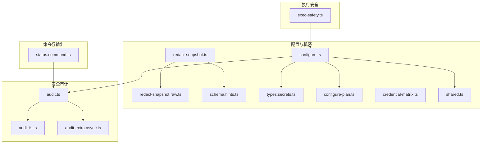
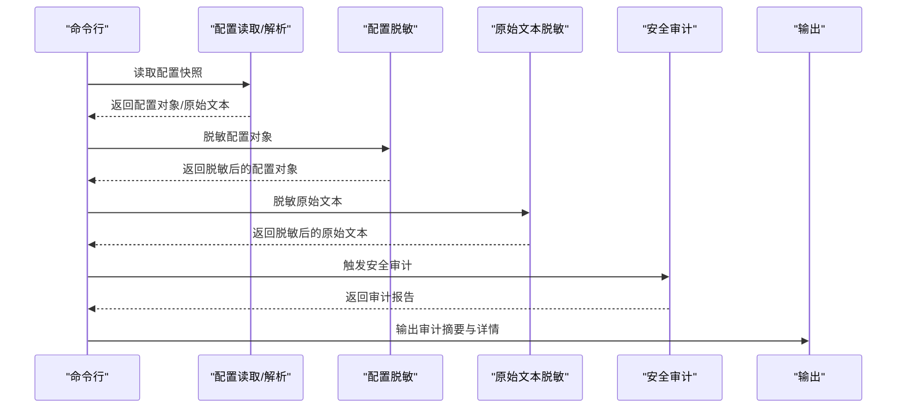
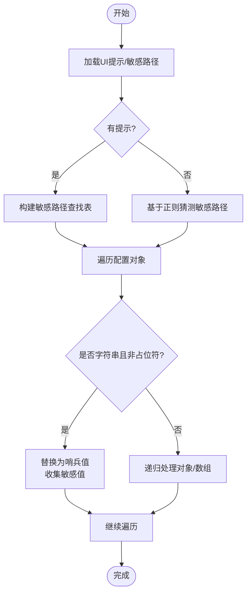
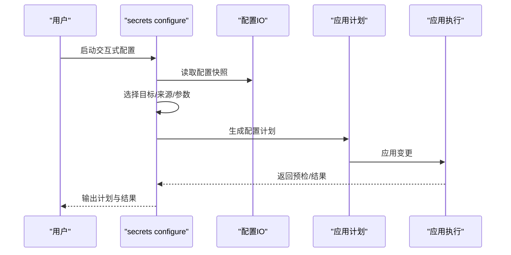
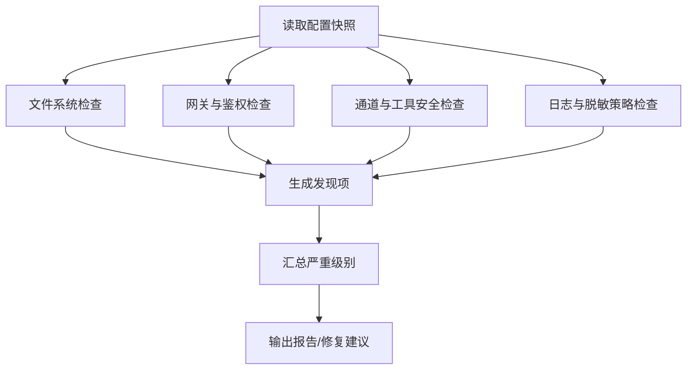
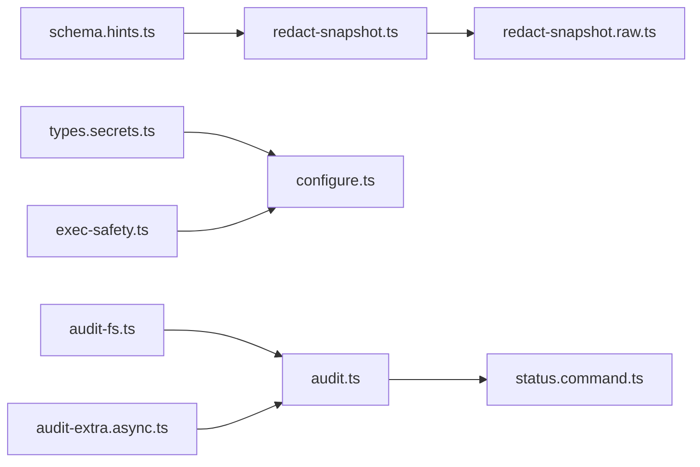

# 配置安全

<cite>
**本文引用的文件**
- [redact-snapshot.ts](file://src/config/redact-snapshot.ts)
- [redact-snapshot.raw.ts](file://src/config/redact-snapshot.raw.ts)
- [schema.hints.ts](file://src/config/schema.hints.ts)
- [types.secrets.ts](file://src/config/types.secrets.ts)
- [configure.ts](file://src/secrets/configure.ts)
- [configure-plan.ts](file://src/secrets/configure-plan.ts)
- [credential-matrix.ts](file://src/secrets/credential-matrix.ts)
- [shared.ts](file://src/secrets/shared.ts)
- [exec-safety.ts](file://src/infra/exec-safety.ts)
- [audit.ts](file://src/security/audit.ts)
- [audit-extra.async.ts](file://src/security/audit-extra.async.ts)
- [audit-fs.ts](file://src/security/audit-fs.ts)
- [secret-equal.ts](file://src/security/secret-equal.ts)
- [status.command.ts](file://src/commands/status.command.ts)
- [SECURITY.md](file://SECURITY.md)
</cite>

## 目录
1. [简介](#简介)
2. [项目结构](#项目结构)
3. [核心组件](#核心组件)
4. [架构总览](#架构总览)
5. [详细组件分析](#详细组件分析)
6. [依赖关系分析](#依赖关系分析)
7. [性能考量](#性能考量)
8. [故障排查指南](#故障排查指南)
9. [结论](#结论)
10. [附录](#附录)

## 简介
本文件面向OpenClaw的配置安全，系统性阐述敏感配置信息的保护策略、密钥管理与访问控制、配置快照脱敏、环境变量保护与执行安全边界，并提供安全审计、漏洞检测与威胁防护的技术实现路径。目标是帮助运维与开发人员在遵循最小权限原则的前提下，建立“加密存储与传输、最小暴露面、可审计可追溯”的安全配置体系。

## 项目结构
围绕配置安全的关键模块分布如下：
- 配置脱敏与快照：redact-snapshot系列负责对配置对象与原始文本进行敏感字段识别与替换，确保输出不泄露凭证。
- 配置模式与提示：schema.hints定义敏感字段识别规则与UI提示，辅助交互式配置时的敏感性标注。
- 密钥与机密：secrets系列负责机密来源（env/file/exec）、解析与应用计划生成、认证资料矩阵等。
- 安全审计：security模块对网关绑定、鉴权、日志、文件系统权限、通道安全等进行扫描与风险评估。
- 执行安全：exec-safety对命令与可执行输入进行白名单校验，降低注入与越权风险。
- 命令行输出：status.command将安全审计结果以人类可读方式呈现。

**图表来源**
- [redact-snapshot.ts](file://src/config/redact-snapshot.ts#L1-L689)
- [redact-snapshot.raw.ts](file://src/config/redact-snapshot.raw.ts#L1-L33)
- [schema.hints.ts](file://src/config/schema.hints.ts#L1-L239)
- [types.secrets.ts](file://src/config/types.secrets.ts#L1-L225)
- [configure.ts](file://src/secrets/configure.ts#L1-L978)
- [configure-plan.ts](file://src/secrets/configure-plan.ts#L227-L259)
- [credential-matrix.ts](file://src/secrets/credential-matrix.ts#L35-L60)
- [shared.ts](file://src/secrets/shared.ts#L45-L64)
- [audit.ts](file://src/security/audit.ts#L1-L800)
- [audit-fs.ts](file://src/security/audit-fs.ts#L1-L60)
- [audit-extra.async.ts](file://src/security/audit-extra.async.ts#L1095-L1137)
- [exec-safety.ts](file://src/infra/exec-safety.ts#L1-L45)
- [status.command.ts](file://src/commands/status.command.ts#L471-L506)

**章节来源**
- [redact-snapshot.ts](file://src/config/redact-snapshot.ts#L1-L689)
- [audit.ts](file://src/security/audit.ts#L1-L800)

## 核心组件
- 配置脱敏与恢复
  - 使用基于Schema的敏感路径识别与通配匹配，对字符串值进行哨兵替换；同时对原始JSON5文本进行敏感值替换，保证解析后与结构化结果一致。
  - 提供“还原”逻辑，使Web UI轮询写入不破坏原始凭证。
- 机密来源与解析
  - 支持env/file/exec三种来源，提供交互式配置流程，严格校验命令与路径合法性，限制可执行输入范围。
  - 通过“凭证矩阵”约束用户提供的凭据路径，避免运行时自动生成或轮换的凭据被误用。
- 安全审计
  - 对网关绑定、鉴权、反向代理、日志脱敏、文件系统权限、通道安全等维度进行扫描，输出严重级别与修复建议。
- 执行安全
  - 对可执行输入进行字符集与路径模式白名单校验，拒绝包含危险元字符、控制字符、引号等的输入，降低注入风险。

**章节来源**
- [redact-snapshot.ts](file://src/config/redact-snapshot.ts#L116-L402)
- [configure.ts](file://src/secrets/configure.ts#L34-L617)
- [audit.ts](file://src/security/audit.ts#L339-L687)
- [exec-safety.ts](file://src/infra/exec-safety.ts#L16-L44)

## 架构总览
下图展示了从配置读取到脱敏输出、再到安全审计与命令行呈现的整体流程。

**图表来源**
- [redact-snapshot.ts](file://src/config/redact-snapshot.ts#L353-L402)
- [redact-snapshot.raw.ts](file://src/config/redact-snapshot.raw.ts#L4-L15)
- [audit.ts](file://src/security/audit.ts#L115-L132)
- [status.command.ts](file://src/commands/status.command.ts#L471-L506)

## 详细组件分析

### 组件A：配置脱敏与恢复（redact-snapshot）
- 敏感路径识别
  - 基于Schema提示构建敏感路径集合，支持点路径、数组索引与记录通配符；未提供Schema时回退到正则模式匹配。
  - 对整对象敏感路径采用整体脱敏，避免部分字段泄露。
- 文本脱敏
  - 先收集所有敏感字符串，再按最长优先替换原始JSON5文本，确保结构化解析一致性。
- 还原机制
  - 在写入前将哨兵值还原为原始值，保证Web UI轮询修改不丢失凭证。

**图表来源**
- [redact-snapshot.ts](file://src/config/redact-snapshot.ts#L116-L306)
- [redact-snapshot.raw.ts](file://src/config/redact-snapshot.raw.ts#L4-L15)

**章节来源**
- [redact-snapshot.ts](file://src/config/redact-snapshot.ts#L116-L402)
- [redact-snapshot.raw.ts](file://src/config/redact-snapshot.raw.ts#L1-L33)

### 组件B：机密来源与交互式配置（secrets.configure）
- 来源与提供者
  - 支持env/file/exec三种来源，分别对应环境变量、文件与外部进程；提供者别名与来源类型需满足格式要求。
- 交互式配置流程
  - 逐项选择目标（openclaw.json或auth-profiles.json），选择来源（env/file/exec），填写参数（如允许列表、文件路径、命令、超时、可信目录等）。
  - 对命令路径进行安全校验，拒绝包含危险字符、控制字符、引号以及以“-”开头的参数；路径必须为绝对路径。
- 计划生成与应用
  - 生成应用计划，包含目标、引用、提供者变更等；默认启用多项脱敏选项（如清理环境变量、认证资料、旧版认证JSON）。

**图表来源**
- [configure.ts](file://src/secrets/configure.ts#L740-L879)
- [configure-plan.ts](file://src/secrets/configure-plan.ts#L227-L259)
- [exec-safety.ts](file://src/infra/exec-safety.ts#L16-L44)

**章节来源**
- [configure.ts](file://src/secrets/configure.ts#L34-L617)
- [configure-plan.ts](file://src/secrets/configure-plan.ts#L227-L259)
- [exec-safety.ts](file://src/infra/exec-safety.ts#L16-L44)

### 组件C：凭证矩阵与最小暴露面（credential-matrix）
- 凭证矩阵
  - 列举所有用户直接提供的凭据路径，限定其形态与可选范围，避免运行时凭据被误用。
- 排除运行时可变项
  - 明确排除由运行时自动生成或轮换的凭据，确保矩阵聚焦“用户显式提供”的凭据面。

**章节来源**
- [credential-matrix.ts](file://src/secrets/credential-matrix.ts#L35-L60)

### 组件D：安全审计与修复建议（security.audit）
- 审计范围
  - 文件系统权限（状态目录、配置文件、包含文件）、网关绑定与鉴权、反向代理信任、日志脱敏策略、通道安全、模型与工具安全等。
- 结果输出
  - 按严重级别统计，输出发现项与修复建议；支持深度探测（如网关连通性探测）。

**图表来源**
- [audit.ts](file://src/security/audit.ts#L208-L800)
- [audit-fs.ts](file://src/security/audit-fs.ts#L30-L60)
- [audit-extra.async.ts](file://src/security/audit-extra.async.ts#L1095-L1137)

**章节来源**
- [audit.ts](file://src/security/audit.ts#L1-L800)
- [audit-fs.ts](file://src/security/audit-fs.ts#L1-L60)
- [audit-extra.async.ts](file://src/security/audit-extra.async.ts#L1095-L1137)

### 组件E：命令行安全审计输出（status.command）
- 将安全审计结果以分级摘要形式输出，筛选并展示关键发现，便于快速定位高危问题。

**章节来源**
- [status.command.ts](file://src/commands/status.command.ts#L471-L506)

## 依赖关系分析
- 配置脱敏依赖Schema提示与敏感路径规则，确保覆盖动态键与扩展插件配置。
- 机密配置依赖执行安全校验，防止不可信输入进入命令行或路径。
- 安全审计依赖文件系统权限检查与网关探测，形成端到端的安全视图。
- 命令行输出依赖审计模块，统一呈现安全状态。

**图表来源**
- [schema.hints.ts](file://src/config/schema.hints.ts#L124-L146)
- [redact-snapshot.ts](file://src/config/redact-snapshot.ts#L116-L125)
- [redact-snapshot.raw.ts](file://src/config/redact-snapshot.raw.ts#L4-L15)
- [types.secrets.ts](file://src/config/types.secrets.ts#L106-L111)
- [configure.ts](file://src/secrets/configure.ts#L34-L617)
- [exec-safety.ts](file://src/infra/exec-safety.ts#L16-L44)
- [audit-fs.ts](file://src/security/audit-fs.ts#L30-L60)
- [audit.ts](file://src/security/audit.ts#L208-L800)
- [audit-extra.async.ts](file://src/security/audit-extra.async.ts#L1095-L1137)
- [status.command.ts](file://src/commands/status.command.ts#L471-L506)

**章节来源**
- [schema.hints.ts](file://src/config/schema.hints.ts#L124-L146)
- [audit.ts](file://src/security/audit.ts#L1-L800)

## 性能考量
- 脱敏算法复杂度
  - 基于查找表的路径匹配为O(N)遍历，字符串替换按最长优先策略进行，整体复杂度与敏感值数量线性相关。
  - 原始文本脱敏先收集敏感值再替换，避免重复扫描。
- 审计扫描
  - 文件系统权限检查与网关探测可能涉及磁盘与网络I/O，建议在CI或离线场景中使用缓存与并行策略。
- 写入恢复
  - 还原过程需要与原始配置结构保持一致，避免因数组截断导致的数据丢失风险。

[本节为通用指导，无需特定文件引用]

## 故障排查指南
- 配置脱敏后无法写回
  - 检查是否存在哨兵值未正确还原，确认UI提示与敏感路径映射是否完整。
- 审计报告出现“配置无效”
  - 当配置无效时，脱敏模块会拒绝输出原始文本，避免泄漏；请先修复配置语法错误。
- 文件权限告警
  - 关注“世界可读/可写”“组可读/可写”等告警，按修复建议调整权限或路径所有权。
- 网关暴露风险
  - 若绑定非本地地址但未配置鉴权，审计会标记为高危；请设置强令牌或密码，并限制允许来源。

**章节来源**
- [redact-snapshot.ts](file://src/config/redact-snapshot.ts#L353-L402)
- [audit.ts](file://src/security/audit.ts#L208-L337)
- [audit-extra.async.ts](file://src/security/audit-extra.async.ts#L1095-L1137)

## 结论
OpenClaw通过“Schema驱动的敏感路径识别、结构化与原始文本双重脱敏、严格的机密来源与交互式配置、全面的安全审计与修复建议、以及对可执行输入的白名单校验”，构建了覆盖配置生命周期的配置安全体系。建议在生产环境中坚持最小权限、最小暴露面与最小持久化原则，配合定期安全审计与自动化扫描，持续提升整体安全基线。

[本节为总结性内容，无需特定文件引用]

## 附录

### 安全配置最佳实践清单
- 最小权限原则
  - 仅授予必要权限；对文件与目录设置最小必要权限（例如0o600）。
- 加密存储与传输
  - 将敏感数据存储在受控的机密管理系统中，避免明文保存在配置文件中。
- 配置快照脱敏
  - 输出前对配置对象与原始文本进行脱敏；保留哈希以便身份识别，但不泄露内容。
- 环境变量保护
  - 限制环境变量白名单；避免在命令行或日志中直接打印敏感值。
- 执行安全边界
  - 对命令与路径进行白名单校验；拒绝包含危险字符与控制字符的输入。
- 安全审计与修复
  - 定期运行安全审计，关注文件系统权限、网关鉴权、日志脱敏与通道安全；按严重级别优先修复。

**章节来源**
- [shared.ts](file://src/secrets/shared.ts#L45-L64)
- [exec-safety.ts](file://src/infra/exec-safety.ts#L16-L44)
- [audit.ts](file://src/security/audit.ts#L339-L687)
- [SECURITY.md](file://SECURITY.md#L203-L284)