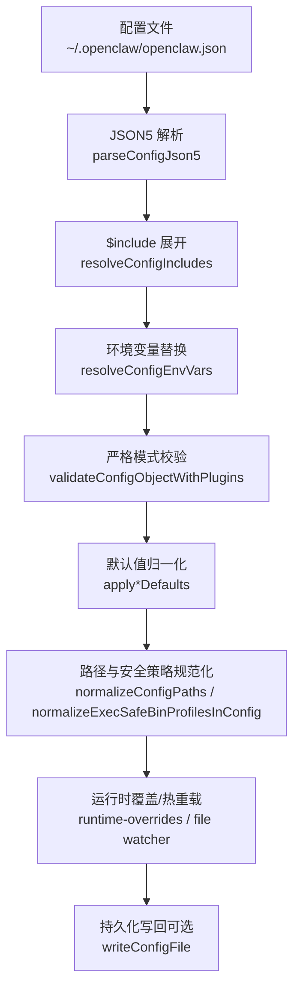
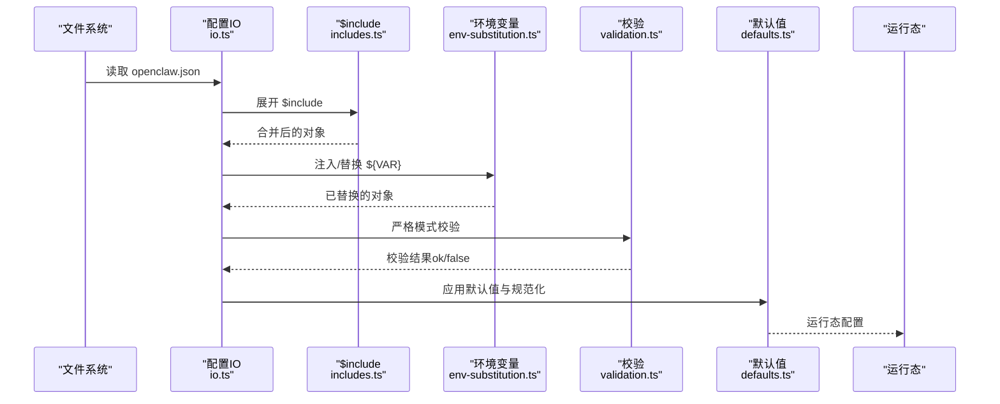
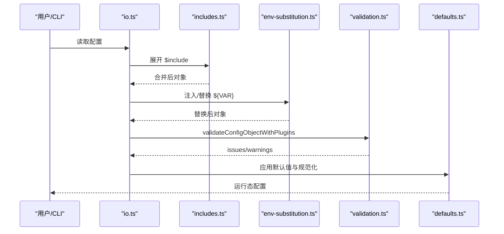
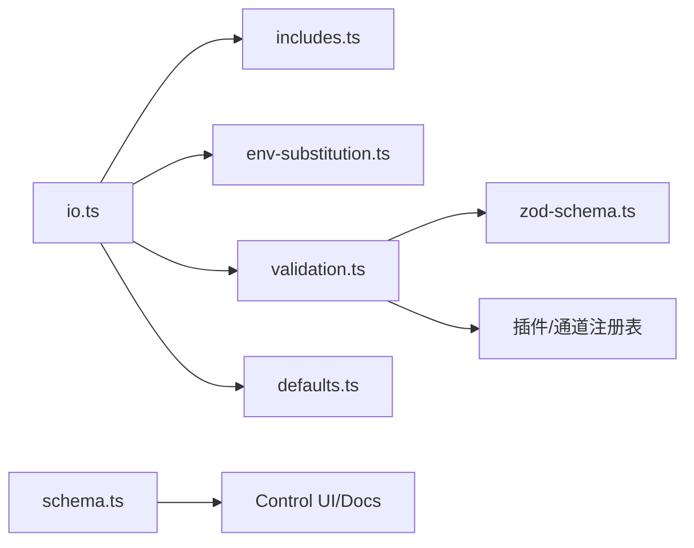
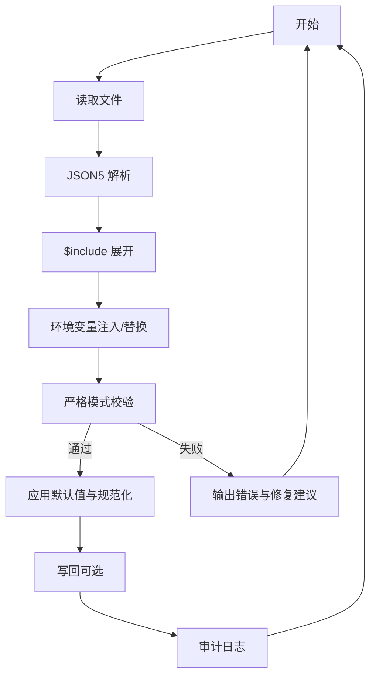

# 配置文件格式

<cite>
**本文引用的文件**
- [src/config/config.ts](file://src/config/config.ts)
- [src/config/io.ts](file://src/config/io.ts)
- [src/config/validation.ts](file://src/config/validation.ts)
- [src/config/schema.ts](file://src/config/schema.ts)
- [src/config/zod-schema.ts](file://src/config/zod-schema.ts)
- [src/config/defaults.ts](file://src/config/defaults.ts)
- [src/config/includes.ts](file://src/config/includes.ts)
- [src/config/merge-patch.ts](file://src/config/merge-patch.ts)
- [docs/gateway/configuration.md](file://docs/gateway/configuration.md)
- [docs/gateway/configuration-reference.md](file://docs/gateway/configuration-reference.md)
- [docs/gateway/configuration-examples.md](file://docs/gateway/configuration-examples.md)
</cite>

## 目录
1. [简介](#简介)
2. [项目结构](#项目结构)
3. [核心组件](#核心组件)
4. [架构总览](#架构总览)
5. [详细组件分析](#详细组件分析)
6. [依赖关系分析](#依赖关系分析)
7. [性能考量](#性能考量)
8. [故障排查指南](#故障排查指南)
9. [结论](#结论)
10. [附录](#附录)

## 简介
本文件系统性阐述 OpenClaw 的 JSON5 配置文件格式与解析流程，覆盖以下方面：
- JSON5 语法与扩展特性（注释、尾随逗号等）
- 字段类型、默认值与结构约束
- 层次结构与字段定义
- 解析、校验、合并与写入流程
- 错误处理与诊断
- 完整配置示例与最佳实践
- 配置模板与常用片段

## 项目结构
OpenClaw 的配置子系统由“读取/解析/校验/默认值应用/写回”链路构成，并通过 JSON5 支持注释与尾随逗号，同时提供 $include 模块化组织能力。

图表来源
- [src/config/io.ts](file://src/config/io.ts#L682-L800)
- [src/config/includes.ts](file://src/config/includes.ts#L340-L347)
- [src/config/validation.ts](file://src/config/validation.ts#L275-L286)
- [src/config/defaults.ts](file://src/config/defaults.ts#L348-L387)

章节来源
- [src/config/io.ts](file://src/config/io.ts#L618-L800)
- [src/config/includes.ts](file://src/config/includes.ts#L1-L347)
- [src/config/validation.ts](file://src/config/validation.ts#L229-L286)
- [src/config/defaults.ts](file://src/config/defaults.ts#L1-L536)

## 核心组件
- 配置入口与导出
  - 导出加载、解析、校验、快照、写回等能力，供上层使用。
- JSON5 解析
  - 使用 JSON5 解析器，支持注释与尾随逗号；解析失败返回错误。
- 包含文件展开（$include）
  - 支持单文件或数组多文件深合并，限制最大嵌套深度与文件大小，防止路径穿越与符号链接绕过。
- 环境变量注入与替换
  - 允许在配置中声明 env 变量，支持从当前工作目录与全局目录加载 .env；字符串值中可引用 ${VAR}，缺失将报错。
- 严格模式校验
  - 基于 Zod Schema 的强类型校验，拒绝未知键；对插件、通道、心跳目标等进行专项校验。
- 默认值归一化
  - 对模型、代理、会话、日志等关键域自动填充默认值，确保运行一致性。
- 写回与审计
  - 写回时生成哈希、记录审计日志，支持按路径删除字段、生成补丁等。

章节来源
- [src/config/config.ts](file://src/config/config.ts#L1-L24)
- [src/config/io.ts](file://src/config/io.ts#L618-L800)
- [src/config/includes.ts](file://src/config/includes.ts#L1-L347)
- [src/config/validation.ts](file://src/config/validation.ts#L229-L286)
- [src/config/defaults.ts](file://src/config/defaults.ts#L1-L536)

## 架构总览
下图展示配置从磁盘到运行态的关键步骤与职责边界。

图表来源
- [src/config/io.ts](file://src/config/io.ts#L682-L770)
- [src/config/includes.ts](file://src/config/includes.ts#L340-L347)
- [src/config/validation.ts](file://src/config/validation.ts#L275-L286)
- [src/config/defaults.ts](file://src/config/defaults.ts#L348-L387)

## 详细组件分析

### JSON5 语法与扩展
- 支持注释与尾随逗号，提升可读性与迭代效率。
- 解析失败将返回错误信息，便于定位问题。
- 与 $include 结合使用时，被包含文件同样遵循 JSON5 规范。

章节来源
- [docs/gateway/configuration.md](file://docs/gateway/configuration.md#L12-L12)
- [src/config/io.ts](file://src/config/io.ts#L618-L627)

### $include 模块化与安全
- 语法：顶层或任意层级对象可包含 "$include"，值为字符串或字符串数组。
- 行为：
  - 单文件：直接替换当前对象；
  - 数组：按顺序深合并（后者覆盖前者），数组元素为对象时递归合并。
- 安全与限制：
  - 最大嵌套深度限制；
  - 文件大小上限；
  - 路径必须位于配置根目录内，禁止符号链接逃逸；
  - 检测循环包含并报错。
- 错误类型：ConfigIncludeError、CircularIncludeError。

章节来源
- [src/config/includes.ts](file://src/config/includes.ts#L1-L347)

### 环境变量注入与替换
- 在配置中声明 env.vars 或 env.shellEnv，允许从 .env 与进程环境注入变量。
- 字符串值中可使用 ${VAR} 引用变量，缺失将触发 MissingEnvVarError。
- 写回时可恢复原始 ${VAR} 引用，避免凭空暴露敏感值。

章节来源
- [src/config/io.ts](file://src/config/io.ts#L609-L616)
- [src/config/env-substitution.ts](file://src/config/env-substitution.ts#L32-L35)
- [src/config/env-preserve.ts](file://src/config/env-preserve.ts#L1-L50)

### 严格模式校验与错误处理
- 使用 Zod Schema 进行强类型校验，拒绝未知键（除 $schema 外）。
- 插件与通道校验：
  - 未知插件/通道 ID 报错；
  - 心跳目标校验（支持内置与插件通道）。
- 重复代理工作区目录检测、身份头像路径合法性检查等专项规则。
- 返回 issues/warnings，支持修复建议与提示。

章节来源
- [src/config/validation.ts](file://src/config/validation.ts#L229-L286)
- [src/config/validation.ts](file://src/config/validation.ts#L316-L622)

### 默认值归一化与运行态一致性
- 自动填充模型、代理并发、日志脱敏级别、上下文修剪与心跳周期等默认值。
- 归一化 Talk 配置、路径与执行安全策略，保证跨平台一致性。

章节来源
- [src/config/defaults.ts](file://src/config/defaults.ts#L348-L387)
- [src/config/defaults.ts](file://src/config/defaults.ts#L1-L536)

### 写回与补丁合并
- 支持按路径删除字段（unsetPaths），生成最小变更补丁。
- JSON Merge Patch 语义：对象递归合并、数组整体替换、null 删除键。
- 写回前生成哈希、记录审计日志，便于追踪变更。

章节来源
- [src/config/io.ts](file://src/config/io.ts#L188-L275)
- [src/config/merge-patch.ts](file://src/config/merge-patch.ts#L62-L97)

### 配置结构与字段定义（概览）
- 根级字段概览（非完整列表）：
  - meta、env、wizard、diagnostics、logging、cli、update、browser、ui、secrets、auth、acp、models、nodeHost、agents、tools、bindings、broadcast、audio、media、messages、commands、approvals、session、cron、hooks、web、channels、discovery、canvasHost、talk、gateway、memory、skills 等。
- 关键域要点：
  - channels.*：各通道配置（如 whatsapp、telegram、discord、slack、signal、imessage、googlechat、msteams、irc 等），支持 DM/群组策略、提及门控、媒体限制、重试策略等。
  - agents.defaults.*：代理默认行为（工作区、模型、并发、超时、打字间隔、心跳、内存搜索、沙箱等）。
  - gateway.*：端口、绑定、鉴权、TLS、远程、重载模式等。
  - hooks/cron/skills/tools/models 等：自动化、工具集、模型提供商与认证等。

章节来源
- [src/config/zod-schema.ts](file://src/config/zod-schema.ts#L162-L889)
- [docs/gateway/configuration-reference.md](file://docs/gateway/configuration-reference.md#L1-L800)

### 配置解析与验证流程（时序）

图表来源
- [src/config/io.ts](file://src/config/io.ts#L682-L770)
- [src/config/includes.ts](file://src/config/includes.ts#L340-L347)
- [src/config/validation.ts](file://src/config/validation.ts#L275-L286)
- [src/config/defaults.ts](file://src/config/defaults.ts#L348-L387)

## 依赖关系分析
- 组件耦合
  - io.ts 作为门面，串联 includes、env-substitution、validation、defaults 等模块；
  - validation.ts 依赖 zod-schema.ts 与插件/通道注册表进行专项校验；
  - schema.ts 提供 JSON Schema 与 UI 提示，服务于控制面板与诊断。
- 外部依赖
  - JSON5 解析器；
  - Node 内置 fs/path/os；
  - 插件清单与通道注册表（运行时动态发现）。

图表来源
- [src/config/io.ts](file://src/config/io.ts#L673-L800)
- [src/config/validation.ts](file://src/config/validation.ts#L316-L622)
- [src/config/schema.ts](file://src/config/schema.ts#L449-L484)

章节来源
- [src/config/io.ts](file://src/config/io.ts#L673-L800)
- [src/config/validation.ts](file://src/config/validation.ts#L316-L622)
- [src/config/schema.ts](file://src/config/schema.ts#L449-L484)

## 性能考量
- $include 展开与深合并为 O(N) 级别（N 为节点数），但受嵌套深度与文件大小限制；
- 校验阶段基于 Zod Schema，复杂度与字段数量线性相关；
- 默认值归一化仅在必要时修改，避免重复计算；
- 写回采用最小补丁策略，减少磁盘写入与序列化成本。

## 故障排查指南
- 常见错误
  - 未知键/类型不匹配：严格模式拒绝，需对照 schema；
  - $include 循环/越界：检查路径与深度限制；
  - ${VAR} 缺失：确认 .env 或进程环境已设置；
  - 通道/插件不存在：核对 ID 是否在注册表中；
  - 心跳目标无效：仅允许内置或已安装插件通道。
- 诊断命令
  - 使用诊断命令查看具体字段与建议；
  - 查看配置审计日志定位变更来源。
- 修复建议
  - 使用修复开关自动修复部分问题；
  - 逐步缩小配置范围定位冲突项。

章节来源
- [docs/gateway/configuration.md](file://docs/gateway/configuration.md#L61-L73)
- [src/config/validation.ts](file://src/config/validation.ts#L117-L140)
- [src/config/includes.ts](file://src/config/includes.ts#L58-L63)
- [src/config/io.ts](file://src/config/io.ts#L522-L536)

## 结论
OpenClaw 的配置体系以 JSON5 为基础，结合 $include、环境变量替换与严格的 Zod 校验，提供了高可读性、强约束与良好扩展性的配置体验。通过默认值归一化与运行时覆盖，确保配置在不同环境下的一致性与稳定性。建议在大型配置中使用 $include 拆分模块，并配合诊断与审计工具保障可维护性。

## 附录

### 配置文件模板与常用片段
- 绝对最小配置
  - 示例路径：[docs/gateway/configuration-examples.md](file://docs/gateway/configuration-examples.md#L18-L25)
- 推荐入门配置
  - 示例路径：[docs/gateway/configuration-examples.md](file://docs/gateway/configuration-examples.md#L29-L47)
- 扩展示例（含环境、认证、路由、工具、会话、通道、代理、自动化、网关、技能等）
  - 示例路径：[docs/gateway/configuration-examples.md](file://docs/gateway/configuration-examples.md#L53-L446)
- 多平台/安全/OAuth/本地模型等常见模式
  - 示例路径：[docs/gateway/configuration-examples.md](file://docs/gateway/configuration-examples.md#L450-L638)

### 字段参考与默认值
- 字段参考（按主题分节）
  - 通道与访问控制、模型与认证、代理默认、会话与消息、自动化与钩子、网关与网络、媒体与工具、UI 与日志等
  - 参考路径：[docs/gateway/configuration-reference.md](file://docs/gateway/configuration-reference.md#L1-L800)
- 默认值应用逻辑
  - 参考路径：[src/config/defaults.ts](file://src/config/defaults.ts#L348-L387)

### 解析与写回流程图

图表来源
- [src/config/io.ts](file://src/config/io.ts#L682-L770)
- [src/config/includes.ts](file://src/config/includes.ts#L340-L347)
- [src/config/validation.ts](file://src/config/validation.ts#L275-L286)
- [src/config/defaults.ts](file://src/config/defaults.ts#L348-L387)