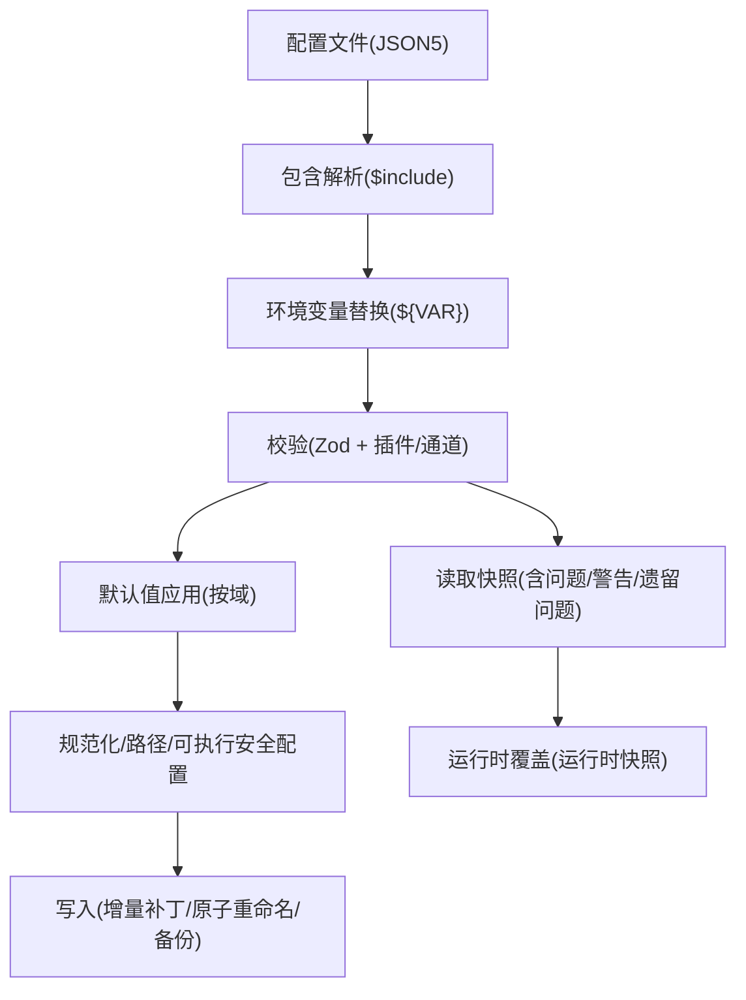
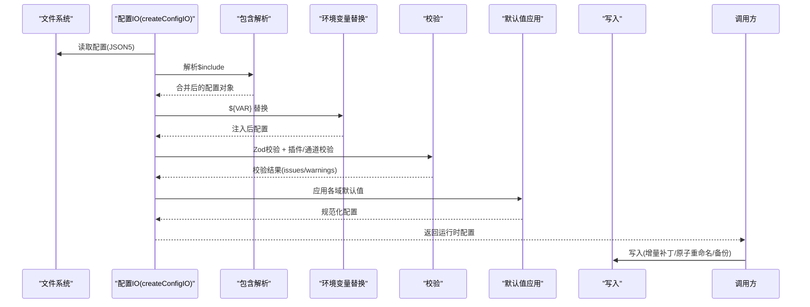
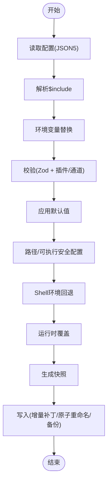
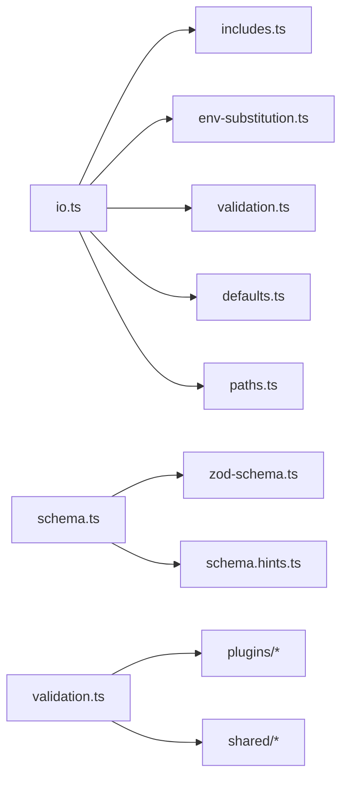

# 配置管理

<cite>
**本文引用的文件**
- [src/config/config.ts](file://src/config/config.ts)
- [src/config/io.ts](file://src/config/io.ts)
- [src/config/env-vars.ts](file://src/config/env-vars.ts)
- [src/config/types.ts](file://src/config/types.ts)
- [src/config/types.openclaw.ts](file://src/config/types.openclaw.ts)
- [src/config/schema.ts](file://src/config/schema.ts)
- [src/config/defaults.ts](file://src/config/defaults.ts)
- [src/config/validation.ts](file://src/config/validation.ts)
- [src/config/paths.ts](file://src/config/paths.ts)
- [src/config/includes.ts](file://src/config/includes.ts)
- [src/config/env-substitution.ts](file://src/config/env-substitution.ts)
- [src/config/legacy-migrate.ts](file://src/config/legacy-migrate.ts)
- [src/config/legacy.ts](file://src/config/legacy.ts)
</cite>

## 目录
1. [简介](#简介)
2. [项目结构](#项目结构)
3. [核心组件](#核心组件)
4. [架构总览](#架构总览)
5. [详细组件分析](#详细组件分析)
6. [依赖分析](#依赖分析)
7. [性能考量](#性能考量)
8. [故障排查指南](#故障排查指南)
9. [结论](#结论)
10. [附录：配置参考手册](#附录配置参考手册)

## 简介
本文件系统化阐述 OpenClaw 的配置管理系统，覆盖配置文件格式、运行时配置机制、环境变量处理、配置验证规则、层次结构（包含与继承）、覆盖与合并策略、迁移与版本兼容、安全与最佳实践等。目标读者包括系统管理员与开发者：既满足运维层面的部署与排障需求，也满足定制化扩展与二次开发的深度使用。

## 项目结构
OpenClaw 的配置子系统以“声明式 JSON5 + 运行时归一化 + 强约束校验”为核心，围绕以下模块协同工作：
- 路径解析：确定配置文件位置、状态目录、OAuth 存储目录等
- 包含机制：$include 指令支持模块化拆分与多文件合并
- 环境变量：支持 ${VAR} 替换与安全白名单注入
- 默认值：按功能域应用运行时默认值与模型/会话/代理等默认策略
- 校验：基于 Zod Schema 的强类型校验，并扩展插件与通道校验
- 写入：增量补丁、原子写入、备份轮转、审计日志
- 迁移：遗留键检测与自动迁移，保障版本演进

图表来源
- [src/config/io.ts](file://src/config/io.ts#L673-L1286)
- [src/config/includes.ts](file://src/config/includes.ts#L340-L347)
- [src/config/env-substitution.ts](file://src/config/env-substitution.ts#L169-L172)
- [src/config/validation.ts](file://src/config/validation.ts#L229-L286)
- [src/config/defaults.ts](file://src/config/defaults.ts#L212-L346)
- [src/config/paths.ts](file://src/config/paths.ts#L118-L194)

章节来源
- [src/config/paths.ts](file://src/config/paths.ts#L118-L194)
- [src/config/includes.ts](file://src/config/includes.ts#L340-L347)
- [src/config/env-substitution.ts](file://src/config/env-substitution.ts#L169-L172)
- [src/config/validation.ts](file://src/config/validation.ts#L229-L286)
- [src/config/defaults.ts](file://src/config/defaults.ts#L212-L346)
- [src/config/io.ts](file://src/config/io.ts#L673-L1286)

## 核心组件
- 配置 IO 与缓存：负责加载、快照、写入、缓存与运行时覆盖
- 路径解析：解析状态目录、配置文件候选路径、端口等
- 包含解析：$include 指令的安全解析与递归合并
- 环境变量：${VAR} 替换、安全注入、Shell 回退
- 默认值：消息、会话、模型、代理、日志、上下文修剪、压缩等默认策略
- 校验：Zod Schema + 插件/通道 + 特定业务规则
- 迁移：遗留键检测与自动迁移

章节来源
- [src/config/config.ts](file://src/config/config.ts#L1-L24)
- [src/config/io.ts](file://src/config/io.ts#L673-L1286)
- [src/config/paths.ts](file://src/config/paths.ts#L118-L194)
- [src/config/includes.ts](file://src/config/includes.ts#L340-L347)
- [src/config/env-vars.ts](file://src/config/env-vars.ts#L69-L81)
- [src/config/env-substitution.ts](file://src/config/env-substitution.ts#L169-L172)
- [src/config/defaults.ts](file://src/config/defaults.ts#L212-L346)
- [src/config/validation.ts](file://src/config/validation.ts#L229-L286)
- [src/config/legacy-migrate.ts](file://src/config/legacy-migrate.ts#L5-L20)
- [src/config/legacy.ts](file://src/config/legacy.ts#L42-L59)

## 架构总览
下图展示从配置文件到最终运行时配置的关键流程与模块交互：

图表来源
- [src/config/io.ts](file://src/config/io.ts#L682-L818)
- [src/config/includes.ts](file://src/config/includes.ts#L340-L347)
- [src/config/env-substitution.ts](file://src/config/env-substitution.ts#L169-L172)
- [src/config/validation.ts](file://src/config/validation.ts#L229-L286)
- [src/config/defaults.ts](file://src/config/defaults.ts#L212-L346)
- [src/config/io.ts](file://src/config/io.ts#L1036-L1277)

## 详细组件分析

### 组件A：配置 IO 与缓存
- 加载流程：读取 JSON5 → 解析 $include → 环境变量替换 → 校验 → 应用默认值 → 安全路径与可执行安全配置 → Shell 环境回退 → 运行时覆盖
- 快照：提供只读快照，包含原始/解析/校验/遗留问题等信息，用于 set/unset 操作
- 写入：基于增量补丁生成最小变更，原子重命名或回退复制；写前备份轮转；审计日志记录
- 缓存：可配置缓存时间，避免频繁磁盘 IO；支持运行时快照覆盖

图表来源
- [src/config/io.ts](file://src/config/io.ts#L682-L818)
- [src/config/io.ts](file://src/config/io.ts#L1036-L1277)

章节来源
- [src/config/io.ts](file://src/config/io.ts#L673-L1286)

### 组件B：配置路径解析
- 状态目录优先级：OPENCLAW_STATE_DIR > 兼容旧目录(.clawdbot/.moldbot/.moltbot) > 新目录(~/.openclaw)
- 配置文件候选：OPENCLAW_CONFIG_PATH > $STATE_DIR/openclaw.json > 兼容旧名(clawdbot/moldbot/moltbot).json
- 端口解析：OPENCLAW_GATEWAY_PORT > config.gateway.port > 默认端口
- OAuth 目录：OPENCLAW_OAUTH_DIR > $STATE_DIR/credentials

章节来源
- [src/config/paths.ts](file://src/config/paths.ts#L60-L89)
- [src/config/paths.ts](file://src/config/paths.ts#L118-L194)
- [src/config/paths.ts](file://src/config/paths.ts#L248-L264)

### 组件C：配置包含与继承
- $include 支持字符串或数组，递归解析，最大深度限制，防止环形包含
- 安全边界：仅允许在根目录内访问，禁止符号链接逃逸，限制单文件大小
- 合并策略：对象递归合并，数组拼接，原始值覆盖；兄弟键存在时要求被包含内容为对象
- 与运行时快照结合：set/unset 操作基于 resolved 配置（不含运行时默认），避免污染用户文件

章节来源
- [src/config/includes.ts](file://src/config/includes.ts#L340-L347)
- [src/config/includes.ts](file://src/config/includes.ts#L131-L176)
- [src/config/includes.ts](file://src/config/includes.ts#L190-L222)
- [src/config/io.ts](file://src/config/io.ts#L964-L981)

### 组件D：环境变量处理
- 变量替换：${VAR} 语法，仅匹配大写模式；支持转义 $${VAR}
- 注入策略：config.env.vars 与 config.env 下的字符串键直接注入进程环境，若已存在则跳过
- Shell 回退：可选启用，从登录 shell 导入缺失的密钥，超时可控
- 安全过滤：阻断危险环境变量键，避免注入风险

章节来源
- [src/config/env-substitution.ts](file://src/config/env-substitution.ts#L169-L172)
- [src/config/env-vars.ts](file://src/config/env-vars.ts#L69-L81)
- [src/config/io.ts](file://src/config/io.ts#L686-L768)

### 组件E：默认值与规范化
- 消息：ackReactionScope 默认值
- 会话：mainKey 归一为主会话(main)，并给出兼容提示
- Talk：默认 Provider 与 API Key 自动注入
- 模型：默认 API、输入类型、成本、上下文窗口、最大输出令牌、别名映射
- 代理：并发默认值、上下文修剪模式/周期、心跳周期、缓存保留策略
- 日志：敏感信息脱敏策略
- 路径与可执行安全：规范化路径、可执行安全配置文件 Profile

章节来源
- [src/config/defaults.ts](file://src/config/defaults.ts#L130-L143)
- [src/config/defaults.ts](file://src/config/defaults.ts#L145-L169)
- [src/config/defaults.ts](file://src/config/defaults.ts#L171-L206)
- [src/config/defaults.ts](file://src/config/defaults.ts#L212-L346)
- [src/config/defaults.ts](file://src/config/defaults.ts#L348-L387)
- [src/config/defaults.ts](file://src/config/defaults.ts#L389-L404)
- [src/config/defaults.ts](file://src/config/defaults.ts#L406-L506)
- [src/config/defaults.ts](file://src/config/defaults.ts#L508-L531)

### 组件F：配置验证与 UI 帮助
- Zod Schema：基于 OpenClawSchema 生成 JSON Schema，支持导出与 UI 提示
- 插件/通道扩展：动态合并插件与通道的 Schema 与 UI Hint
- 业务规则：身份头像路径校验、Tailscale 绑定约束、心跳目标校验、重复代理目录检测
- 允许值提示：将枚举/联合类型的允许值汇总并附加到错误消息

章节来源
- [src/config/schema.ts](file://src/config/schema.ts#L449-L484)
- [src/config/validation.ts](file://src/config/validation.ts#L229-L286)
- [src/config/validation.ts](file://src/config/validation.ts#L148-L196)
- [src/config/validation.ts](file://src/config/validation.ts#L198-L223)
- [src/config/validation.ts](file://src/config/validation.ts#L427-L473)

### 组件G：配置迁移与版本兼容
- 遗留键检测：对历史键与不推荐用法给出迁移建议
- 自动迁移：应用一系列迁移步骤，返回变更清单
- 校验与兜底：迁移后再次校验，若仍无效，返回变更列表与提示

章节来源
- [src/config/legacy.ts](file://src/config/legacy.ts#L16-L40)
- [src/config/legacy.ts](file://src/config/legacy.ts#L42-L59)
- [src/config/legacy-migrate.ts](file://src/config/legacy-migrate.ts#L5-L20)

## 依赖分析
- 模块耦合
  - io.ts 依赖 includes.ts、env-substitution.ts、validation.ts、defaults.ts、paths.ts、runtime-overrides.ts
  - schema.ts 依赖 zod-schema 与 hints/tags，动态合并插件/通道 Schema
  - validation.ts 依赖 plugins/config-state、plugins/manifest-registry、shared/avatar-policy 等
- 外部依赖
  - JSON5 解析、Node FS、路径工具、版本比较
- 循环依赖
  - 通过导出函数而非直接导入模块避免循环

图表来源
- [src/config/io.ts](file://src/config/io.ts#L1-L54)
- [src/config/schema.ts](file://src/config/schema.ts#L1-L11)
- [src/config/validation.ts](file://src/config/validation.ts#L1-L25)

章节来源
- [src/config/io.ts](file://src/config/io.ts#L1-L54)
- [src/config/schema.ts](file://src/config/schema.ts#L1-L11)
- [src/config/validation.ts](file://src/config/validation.ts#L1-L25)

## 性能考量
- 缓存策略：可通过环境变量控制缓存时长，默认短缓存提升热更新响应；禁用缓存可保证一致性
- 增量写入：基于补丁生成最小变更，减少磁盘写入与锁竞争
- 原子写入：优先 rename，失败回退 copy+chmod，避免部分写入
- 并发与权限：容器场景注意文件权限与所有权，避免 EACCES 重试与降级

章节来源
- [src/config/io.ts](file://src/config/io.ts#L1303-L1323)
- [src/config/io.ts](file://src/config/io.ts#L1036-L1277)
- [src/config/io.ts](file://src/config/io.ts#L985-L1001)

## 故障排查指南
- 读取失败
  - JSON5 解析失败：检查语法与注释合法性
  - 环境变量缺失：根据错误定位路径，设置对应环境变量或使用 config.env 注入
  - 权限不足：在容器中修正文件属主与权限
- 校验失败
  - 使用快照 issues/warnings 定位字段与允许值
  - 插件/通道校验：确认插件 ID、通道 ID 是否有效
- 写入异常
  - 审计日志：查看 config-audit.jsonl 中事件与可疑原因
  - 备份轮转：确认 .bak 文件是否存在
- 迁移与版本
  - migrateLegacyConfig 输出变更清单，修复剩余问题后重新校验

章节来源
- [src/config/io.ts](file://src/config/io.ts#L858-L874)
- [src/config/io.ts](file://src/config/io.ts#L903-L925)
- [src/config/io.ts](file://src/config/io.ts#L985-L1001)
- [src/config/validation.ts](file://src/config/validation.ts#L117-L140)
- [src/config/legacy-migrate.ts](file://src/config/legacy-migrate.ts#L5-L20)

## 结论
OpenClaw 的配置系统以“可读、可维护、可迁移、可审计”为目标，通过 JSON5、$include、${VAR}、Zod Schema 与默认值体系，构建了高可靠、强约束且易扩展的配置生态。配合缓存、原子写入与审计日志，既能满足生产环境的稳定性，也能为开发者提供强大的自定义能力。

## 附录：配置参考手册

### 配置文件格式与层次
- 文件格式：JSON5（支持注释、尾随逗号等）
- 层次结构：顶层键包括 meta、auth、env、wizard、diagnostics、logging、cli、update、browser、ui、secrets、skills、plugins、models、nodeHost、agents、tools、bindings、broadcast、audio、media、messages、commands、approvals、session、web、channels、cron、hooks、discovery、canvasHost、talk、gateway、memory 等
- 包含机制：$include 支持字符串或数组，递归合并；禁止环形包含与越界访问

章节来源
- [src/config/types.openclaw.ts](file://src/config/types.openclaw.ts#L31-L123)
- [src/config/includes.ts](file://src/config/includes.ts#L340-L347)

### 运行时配置机制
- 加载顺序：$include → ${VAR} → 校验 → 默认值 → 路径/安全配置 → Shell 回退 → 运行时覆盖
- 快照：包含 raw/parsed/resolved/config/hash/issues/warnings/legacyIssues
- 缓存：OPENCLAW_CONFIG_CACHE_MS 控制缓存时长；OPENCLAW_DISABLE_CONFIG_CACHE 可禁用
- 运行时覆盖：setRuntimeConfigSnapshot/getRuntimeConfigSnapshot 清除缓存并优先于文件

章节来源
- [src/config/io.ts](file://src/config/io.ts#L682-L818)
- [src/config/io.ts](file://src/config/io.ts#L1325-L1373)
- [src/config/io.ts](file://src/config/io.ts#L1329-L1346)

### 环境变量处理
- 变量替换：${VAR}（仅大写）；$${VAR} 转义
- 安全注入：config.env.vars 与 config.env 下的字符串键注入进程环境；阻断危险键
- Shell 回退：可选启用，从登录 shell 导入缺失密钥，超时可配置

章节来源
- [src/config/env-substitution.ts](file://src/config/env-substitution.ts#L169-L172)
- [src/config/env-vars.ts](file://src/config/env-vars.ts#L69-L81)
- [src/config/io.ts](file://src/config/io.ts#L686-L768)

### 配置验证规则
- 类型校验：基于 OpenClawSchema 的 Zod 校验
- 插件/通道：校验插件 ID、通道 ID、插件 Schema
- 业务规则：身份头像路径、Tailscale 绑定约束、心跳目标、重复代理目录
- 允许值提示：自动汇总枚举/联合类型允许值并附加到错误消息

章节来源
- [src/config/validation.ts](file://src/config/validation.ts#L229-L286)
- [src/config/validation.ts](file://src/config/validation.ts#L148-L196)
- [src/config/validation.ts](file://src/config/validation.ts#L198-L223)
- [src/config/validation.ts](file://src/config/validation.ts#L427-L473)

### 默认值与规范化
- 消息：ackReactionScope 默认
- 会话：mainKey 归一
- Talk：Provider 与 API Key 自动注入
- 模型：默认 API、输入类型、成本、上下文窗口、最大输出令牌、别名映射
- 代理：并发默认、上下文修剪、心跳、缓存保留
- 日志：敏感信息脱敏策略
- 路径与可执行安全：规范化路径、可执行安全配置文件 Profile

章节来源
- [src/config/defaults.ts](file://src/config/defaults.ts#L130-L143)
- [src/config/defaults.ts](file://src/config/defaults.ts#L145-L169)
- [src/config/defaults.ts](file://src/config/defaults.ts#L171-L206)
- [src/config/defaults.ts](file://src/config/defaults.ts#L212-L346)
- [src/config/defaults.ts](file://src/config/defaults.ts#L348-L387)
- [src/config/defaults.ts](file://src/config/defaults.ts#L389-L404)
- [src/config/defaults.ts](file://src/config/defaults.ts#L406-L506)
- [src/config/defaults.ts](file://src/config/defaults.ts#L508-L531)

### 配置迁移与版本兼容
- 遗留键检测：对历史键与不推荐用法给出迁移建议
- 自动迁移：应用迁移步骤，返回变更清单
- 校验兜底：迁移后再次校验，若仍无效，返回变更列表与提示

章节来源
- [src/config/legacy.ts](file://src/config/legacy.ts#L16-L40)
- [src/config/legacy.ts](file://src/config/legacy.ts#L42-L59)
- [src/config/legacy-migrate.ts](file://src/config/legacy-migrate.ts#L5-L20)

### 安全与最佳实践
- 安全读取：$include 使用边界文件打开，限制大小与硬链接，拒绝越界路径与符号链接逃逸
- 环境变量：仅大写变量名参与替换；避免在配置中直接暴露明文密钥，优先使用 config.env 注入或 Shell 回退
- 写入安全：原子重命名优先，失败回退复制；写前备份轮转；审计日志记录
- 最佳实践：将敏感配置放入 config.env.vars 或通过 Shell 回退注入；使用 $include 拆分基础配置与环境差异；定期校验与迁移遗留键；合理设置缓存时长以平衡一致性与性能

章节来源
- [src/config/includes.ts](file://src/config/includes.ts#L289-L324)
- [src/config/includes.ts](file://src/config/includes.ts#L190-L222)
- [src/config/env-substitution.ts](file://src/config/env-substitution.ts#L169-L172)
- [src/config/env-vars.ts](file://src/config/env-vars.ts#L69-L81)
- [src/config/io.ts](file://src/config/io.ts#L1232-L1277)