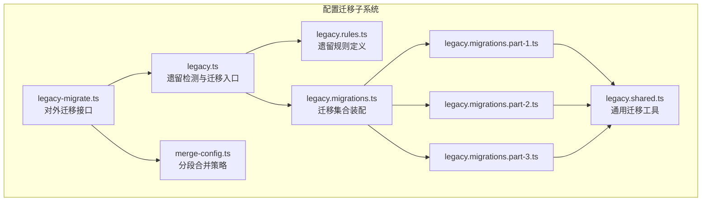
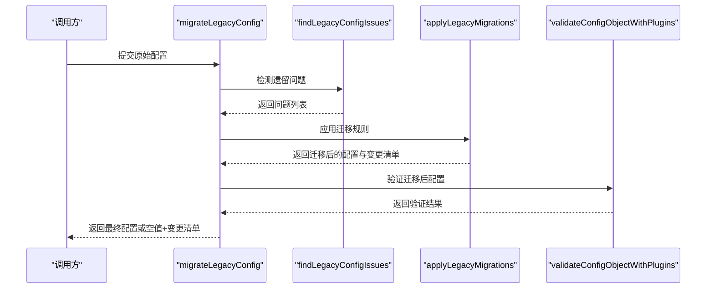
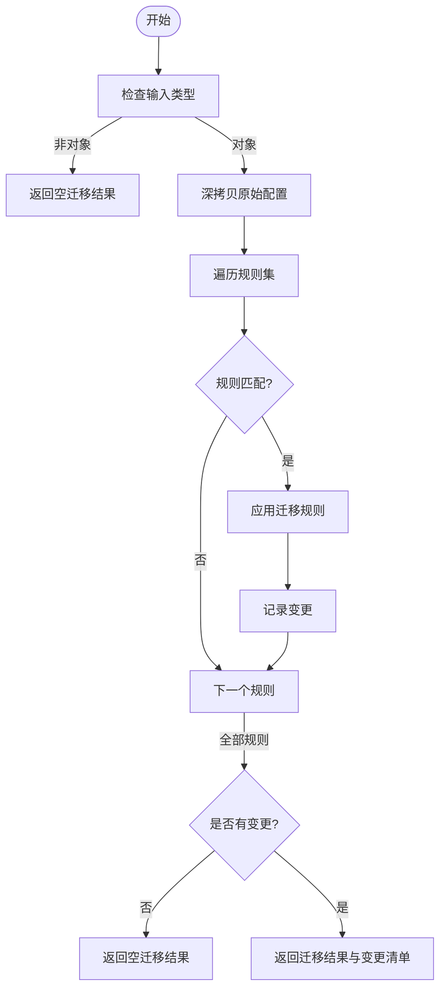
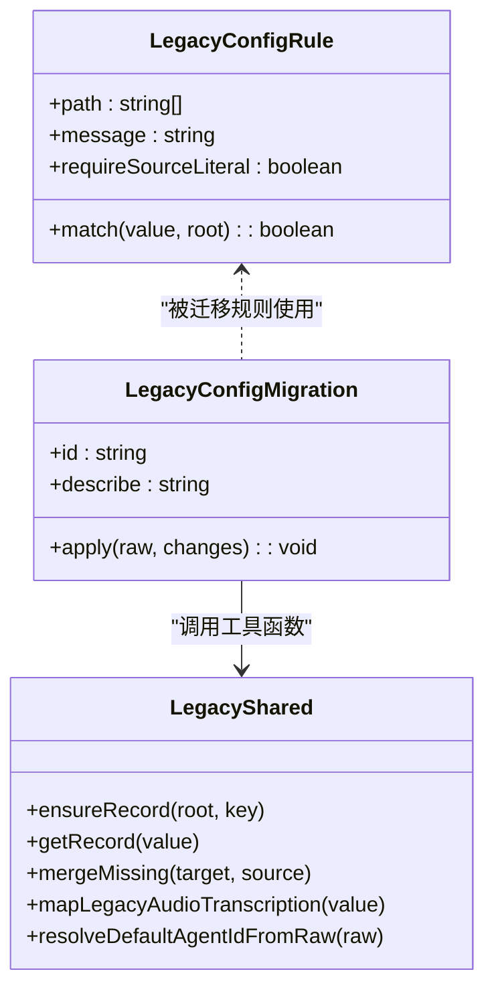
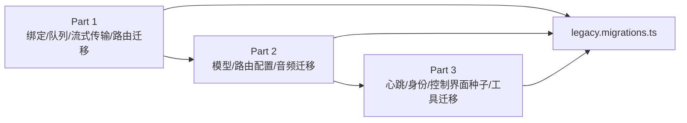
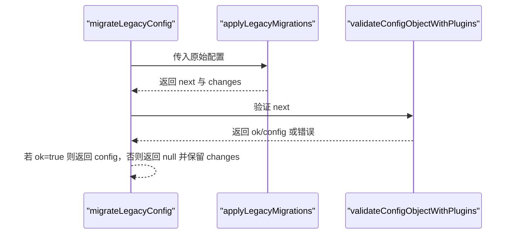
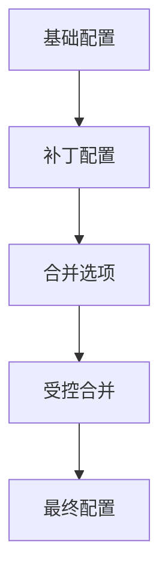
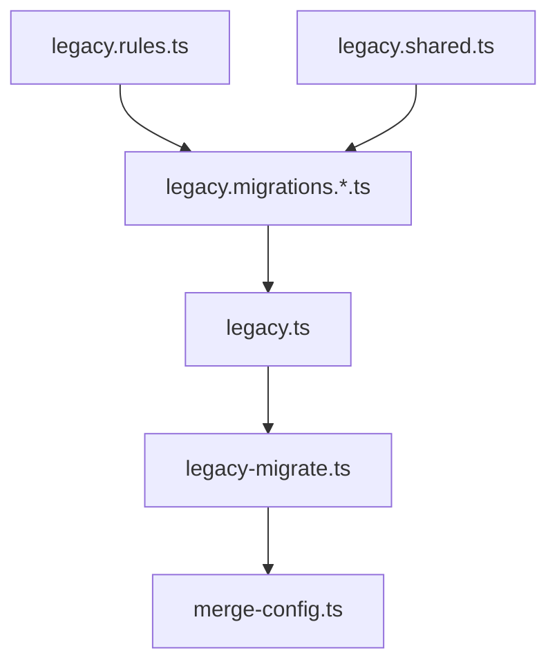
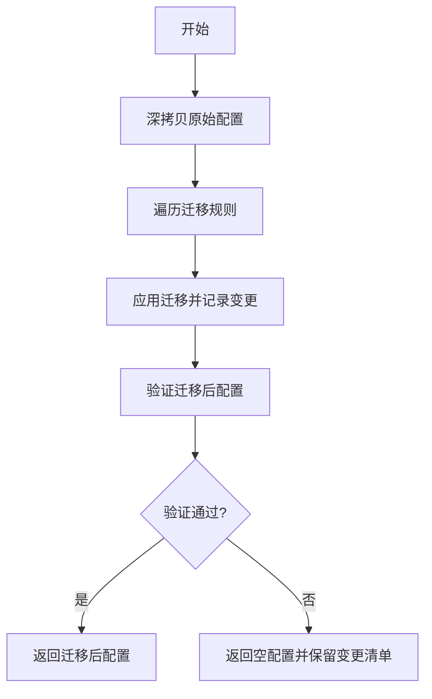
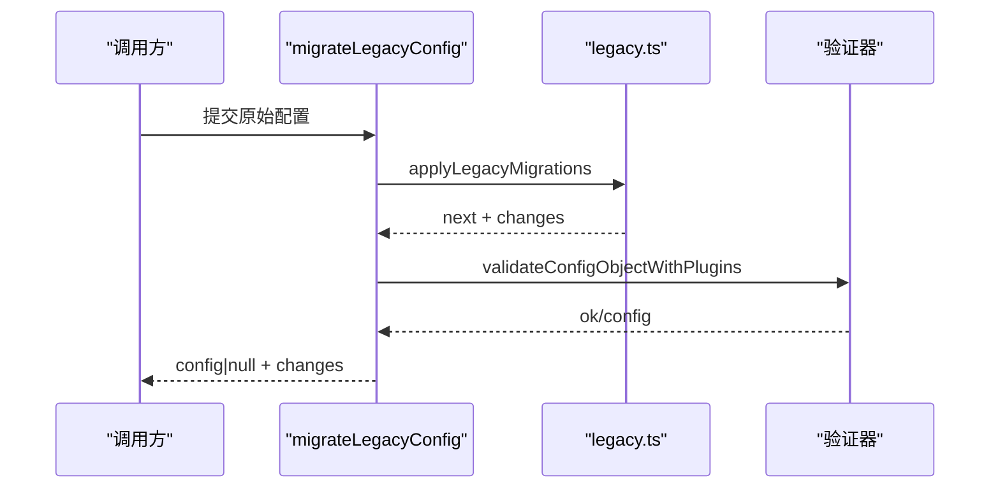

# 配置迁移

<cite>
**本文引用的文件**
- [src/config/legacy-migrate.ts](file://src/config/legacy-migrate.ts)
- [src/config/legacy.ts](file://src/config/legacy.ts)
- [src/config/legacy.migrations.ts](file://src/config/legacy.migrations.ts)
- [src/config/legacy.migrations.part-1.ts](file://src/config/legacy.migrations.part-1.ts)
- [src/config/legacy.migrations.part-2.ts](file://src/config/legacy.migrations.part-2.ts)
- [src/config/legacy.migrations.part-3.ts](file://src/config/legacy.migrations.part-3.ts)
- [src/config/legacy.rules.ts](file://src/config/legacy.rules.ts)
- [src/config/legacy.shared.ts](file://src/config/legacy.shared.ts)
- [src/config/merge-config.ts](file://src/config/merge-config.ts)
- [src/config/legacy-migrate.test.ts](file://src/config/legacy-migrate.test.ts)
- [src/config/legacy.shared.test.ts](file://src/config/legacy.shared.test.ts)
</cite>

## 目录
1. [简介](#简介)
2. [项目结构](#项目结构)
3. [核心组件](#核心组件)
4. [架构总览](#架构总览)
5. [详细组件分析](#详细组件分析)
6. [依赖关系分析](#依赖关系分析)
7. [性能考量](#性能考量)
8. [故障排查指南](#故障排查指南)
9. [结论](#结论)
10. [附录](#附录)

## 简介
本文件面向 OpenClaw 的配置迁移系统，系统性阐述配置版本管理、自动迁移机制与回滚策略，覆盖遗留配置检测、转换规则与兼容性处理，并提供完整的迁移流程图与时序图，展示从旧版到新版的升级路径。同时给出备份策略、数据完整性校验与迁移失败恢复方案，以及迁移脚本示例与手动迁移指南，确保用户在升级过程中获得平滑体验。

## 项目结构
OpenClaw 的配置迁移能力集中在 src/config 目录下，围绕“遗留配置检测”“迁移规则与应用”“验证与输出”三大模块构建，辅以工具函数与合并策略，保证迁移过程安全、可追踪且可回退。

图表来源
- [src/config/legacy.ts](file://src/config/legacy.ts#L1-L59)
- [src/config/legacy.rules.ts](file://src/config/legacy.rules.ts#L1-L213)
- [src/config/legacy.migrations.ts](file://src/config/legacy.migrations.ts#L1-L10)
- [src/config/legacy.migrations.part-1.ts](file://src/config/legacy.migrations.part-1.ts#L1-L616)
- [src/config/legacy.migrations.part-2.ts](file://src/config/legacy.migrations.part-2.ts#L1-L427)
- [src/config/legacy.migrations.part-3.ts](file://src/config/legacy.migrations.part-3.ts#L1-L384)
- [src/config/legacy.shared.ts](file://src/config/legacy.shared.ts#L1-L134)
- [src/config/legacy-migrate.ts](file://src/config/legacy-migrate.ts#L1-L20)
- [src/config/merge-config.ts](file://src/config/merge-config.ts#L1-L39)

章节来源
- [src/config/legacy.ts](file://src/config/legacy.ts#L1-L59)
- [src/config/legacy.rules.ts](file://src/config/legacy.rules.ts#L1-L213)
- [src/config/legacy.migrations.ts](file://src/config/legacy.migrations.ts#L1-L10)
- [src/config/legacy.migrations.part-1.ts](file://src/config/legacy.migrations.part-1.ts#L1-L616)
- [src/config/legacy.migrations.part-2.ts](file://src/config/legacy.migrations.part-2.ts#L1-L427)
- [src/config/legacy.migrations.part-3.ts](file://src/config/legacy.migrations.part-3.ts#L1-L384)
- [src/config/legacy.shared.ts](file://src/config/legacy.shared.ts#L1-L134)
- [src/config/merge-config.ts](file://src/config/merge-config.ts#L1-L39)

## 核心组件
- 遗留配置检测器：扫描配置树，依据规则集识别遗留字段并生成问题列表，用于提示与审计。
- 迁移执行器：对原始配置进行结构化深拷贝，按顺序应用迁移规则，记录变更日志。
- 对外迁移接口：将迁移结果与验证结合，返回最终配置与变更清单；若验证失败，保留变更清单以便人工修复。
- 迁移工具与合并策略：提供路径访问、对象合并、默认值填充、键重命名等通用能力，保障迁移幂等与兼容。
- 分段合并策略：针对特定子树（如通道配置）提供受控合并选项，支持显式删除未定义字段。

章节来源
- [src/config/legacy.ts](file://src/config/legacy.ts#L16-L59)
- [src/config/legacy-migrate.ts](file://src/config/legacy-migrate.ts#L5-L19)
- [src/config/legacy.shared.ts](file://src/config/legacy.shared.ts#L21-L134)
- [src/config/merge-config.ts](file://src/config/merge-config.ts#L8-L39)

## 架构总览
迁移流程由“检测—迁移—验证—输出”构成，贯穿多阶段迁移与规则匹配，确保兼容性与安全性。

图表来源
- [src/config/legacy-migrate.ts](file://src/config/legacy-migrate.ts#L1-L20)
- [src/config/legacy.ts](file://src/config/legacy.ts#L16-L59)

章节来源
- [src/config/legacy-migrate.ts](file://src/config/legacy-migrate.ts#L1-L20)
- [src/config/legacy.ts](file://src/config/legacy.ts#L1-L59)

## 详细组件分析

### 组件A：遗留配置检测与迁移入口
- 功能要点
  - 遗留检测：遍历规则集，按路径与匹配条件判断是否存在遗留字段；支持仅基于原始解析源的严格匹配。
  - 迁移入口：对原始配置深拷贝，顺序应用迁移规则，记录每一步变更；若无变更则返回空。
  - 变更追踪：所有迁移均写入变更清单，便于审计与回滚说明。
- 关键实现
  - 规则匹配：通过路径定位与可选匹配函数判断是否命中。
  - 原始源匹配：当 requireSourceLiteral 为真时，仅在原始解析源存在该字段时才报告。
  - 迁移应用：遍历迁移集合，逐条 apply，必要时修改原配置树并追加变更描述。

图表来源
- [src/config/legacy.ts](file://src/config/legacy.ts#L16-L59)

章节来源
- [src/config/legacy.ts](file://src/config/legacy.ts#L16-L59)

### 组件B：迁移规则与工具
- 规则定义
  - 路径迁移：如将 channels.*、session.threadBindings、routing.* 等从旧位置迁移到新位置。
  - 键重命名：如 ttlHours → idleHours、requireMention 合并到 groups.* 等。
  - 结构规范化：如 streaming、bind 模式标准化、模型配置扁平化等。
- 工具函数
  - 记录访问与创建：ensureRecord、getRecord。
  - 缺失字段合并：mergeMissing，避免污染原型链。
  - 默认代理与解析：resolveDefaultAgentIdFromRaw、mapLegacyAudioTranscription 等。
  - 安全性与健壮性：对命令行参数、键名进行安全校验与过滤。

图表来源
- [src/config/legacy.rules.ts](file://src/config/legacy.rules.ts#L1-L213)
- [src/config/legacy.shared.ts](file://src/config/legacy.shared.ts#L1-L134)

章节来源
- [src/config/legacy.rules.ts](file://src/config/legacy.rules.ts#L1-L213)
- [src/config/legacy.shared.ts](file://src/config/legacy.shared.ts#L1-L134)

### 组件C：迁移集合与阶段化实现
- 集合装配
  - 将三部分迁移集合拼接为统一数组，按顺序执行。
- 阶段化迁移
  - Part 1：绑定、队列、通道流式传输、路由迁移、网关绑定模式等。
  - Part 2：模型配置扁平化、路由 agents 与默认代理迁移、音频转录迁移等。
  - Part 3：心跳拆分、身份与默认项迁移、控制界面允许来源种子、工具别名迁移等。

图表来源
- [src/config/legacy.migrations.ts](file://src/config/legacy.migrations.ts#L1-L10)
- [src/config/legacy.migrations.part-1.ts](file://src/config/legacy.migrations.part-1.ts#L1-L616)
- [src/config/legacy.migrations.part-2.ts](file://src/config/legacy.migrations.part-2.ts#L1-L427)
- [src/config/legacy.migrations.part-3.ts](file://src/config/legacy.migrations.part-3.ts#L1-L384)

章节来源
- [src/config/legacy.migrations.ts](file://src/config/legacy.migrations.ts#L1-L10)
- [src/config/legacy.migrations.part-1.ts](file://src/config/legacy.migrations.part-1.ts#L1-L616)
- [src/config/legacy.migrations.part-2.ts](file://src/config/legacy.migrations.part-2.ts#L1-L427)
- [src/config/legacy.migrations.part-3.ts](file://src/config/legacy.migrations.part-3.ts#L1-L384)

### 组件D：对外迁移接口与验证
- 接口职责
  - 执行迁移：调用迁移执行器获取 next 与变更清单。
  - 验证配置：对迁移后的配置进行插件感知的验证。
  - 失败处理：若验证失败，保留变更清单并返回空配置，提示用户手动修复。
- 输出约定
  - 成功：返回迁移后的配置与变更清单。
  - 失败：返回空配置与变更清单（含“仍无效”的提示）。

图表来源
- [src/config/legacy-migrate.ts](file://src/config/legacy-migrate.ts#L5-L19)

章节来源
- [src/config/legacy-migrate.ts](file://src/config/legacy-migrate.ts#L1-L20)

### 组件E：分段合并策略与兼容性处理
- 分段合并
  - 支持对特定子树（如通道配置）进行受控合并，允许在 patch 中显式删除未定义字段。
- 兼容性处理
  - 通过 mergeMissing 实现“默认值填充”，避免覆盖已存在的显式设置。
  - 对命令行参数、键名进行安全校验，防止注入与原型污染。

图表来源
- [src/config/merge-config.ts](file://src/config/merge-config.ts#L8-L39)
- [src/config/legacy.shared.ts](file://src/config/legacy.shared.ts#L37-L51)

章节来源
- [src/config/merge-config.ts](file://src/config/merge-config.ts#L1-L39)
- [src/config/legacy.shared.ts](file://src/config/legacy.shared.ts#L37-L51)

## 依赖关系分析
- 松耦合设计：规则与迁移相互独立，通过统一的迁移集合装配；工具函数集中于 shared 模块，降低重复与副作用。
- 可扩展性：新增迁移只需实现 LegacyConfigMigration 接口并加入对应部分集合。
- 安全性：共享工具对原型污染与非法键名进行防护，验证阶段确保迁移后配置符合 schema。

图表来源
- [src/config/legacy.rules.ts](file://src/config/legacy.rules.ts#L1-L213)
- [src/config/legacy.migrations.ts](file://src/config/legacy.migrations.ts#L1-L10)
- [src/config/legacy.shared.ts](file://src/config/legacy.shared.ts#L1-L134)
- [src/config/legacy.ts](file://src/config/legacy.ts#L1-L59)
- [src/config/legacy-migrate.ts](file://src/config/legacy-migrate.ts#L1-L20)
- [src/config/merge-config.ts](file://src/config/merge-config.ts#L1-L39)

章节来源
- [src/config/legacy.ts](file://src/config/legacy.ts#L1-L59)
- [src/config/legacy-migrations.ts](file://src/config/legacy.migrations.ts#L1-L10)
- [src/config/legacy.shared.ts](file://src/config/legacy.shared.ts#L1-L134)
- [src/config/merge-config.ts](file://src/config/merge-config.ts#L1-L39)

## 性能考量
- 时间复杂度
  - 遗留检测：O(R × P)，R 为规则数，P 为路径遍历成本。
  - 迁移应用：O(M × N)，M 为迁移数，N 为配置树规模（平均常数因子）。
- 空间复杂度
  - 深拷贝带来 O(N) 额外空间；工具函数尽量复用结构，减少中间对象分配。
- 优化建议
  - 对大型配置采用增量迁移与懒加载策略。
  - 在规则匹配中优先短路与早期返回，减少不必要的遍历。

## 故障排查指南
- 常见问题
  - 迁移后配置仍无效：验证阶段会返回错误，此时应根据变更清单中的提示逐项修正。
  - 迁移未发生：若 changes 为空，表示未命中任何规则或已处于最新格式。
  - 控制界面访问受限：对于非回环绑定，需确保已正确生成 allowedOrigins。
- 定位方法
  - 查看变更清单：确认具体迁移步骤与覆盖范围。
  - 使用测试用例思路：构造最小可复现配置，逐步缩小问题范围。
  - 原始源匹配：若 requireSourceLiteral 的规则未触发，检查原始解析源是否包含该字段。

章节来源
- [src/config/legacy-migrate.ts](file://src/config/legacy-migrate.ts#L13-L18)
- [src/config/legacy-migrate.test.ts](file://src/config/legacy-migrate.test.ts#L239-L347)

## 结论
OpenClaw 的配置迁移系统通过“规则驱动 + 工具支撑 + 验证兜底”的方式，实现了从旧版配置到新版结构的自动化、可追溯与可回退升级。借助严格的匹配与合并策略，系统在保证兼容性的同时，显著降低了升级风险与维护成本。

## 附录

### 迁移流程图与时序图
- 流程图（迁移执行）

图表来源
- [src/config/legacy.ts](file://src/config/legacy.ts#L42-L58)
- [src/config/legacy-migrate.ts](file://src/config/legacy-migrate.ts#L5-L19)

- 时序图（对外迁移接口）

图表来源
- [src/config/legacy-migrate.ts](file://src/config/legacy-migrate.ts#L1-L20)
- [src/config/legacy.ts](file://src/config/legacy.ts#L42-L58)

### 备份策略与回滚方案
- 备份策略
  - 升级前：保存当前配置文件副本，命名包含时间戳与版本号。
  - 升级中：迁移过程不直接写盘，验证通过后再持久化。
- 回滚方案
  - 若验证失败：保留变更清单，使用备份副本恢复；随后根据变更清单手工修正。
  - 若验证通过：保留变更清单作为回滚依据；如需撤销，可再次运行迁移以恢复到旧结构（需自定义脚本配合）。

### 数据完整性检查
- 原型污染防护：mergeMissing 与工具函数对 __proto__ 等键进行过滤，避免污染。
- 命令行参数校验：对可执行命令进行类型与安全校验，拒绝非法输入。
- 字段合并策略：默认值填充但不覆盖显式设置，确保用户意图不被覆盖。

章节来源
- [src/config/legacy.shared.test.ts](file://src/config/legacy.shared.test.ts#L1-L24)
- [src/config/legacy.shared.ts](file://src/config/legacy.shared.ts#L37-L51)

### 迁移脚本示例与手动迁移指南
- 自动迁移脚本（概念性）
  - 步骤
    1) 读取配置文件为对象。
    2) 调用迁移接口获取迁移后配置与变更清单。
    3) 若验证失败，打印变更清单并退出。
    4) 若验证成功，将迁移后配置写回文件。
  - 注意事项
    - 保持原子写入，失败时回滚至备份。
    - 对于控制界面访问受限场景，确保已生成 allowedOrigins。
- 手动迁移指南（概念性）
  - 识别遗留字段：参考变更清单与规则描述。
  - 手工调整：将字段移动到新位置、重命名键、规范化结构。
  - 验证配置：使用内置验证工具检查 schema 与插件兼容性。
  - 回滚准备：保留原始配置快照，以便必要时恢复。