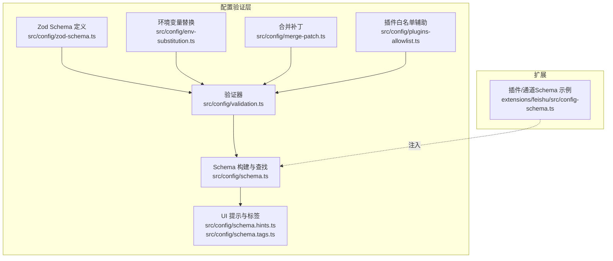
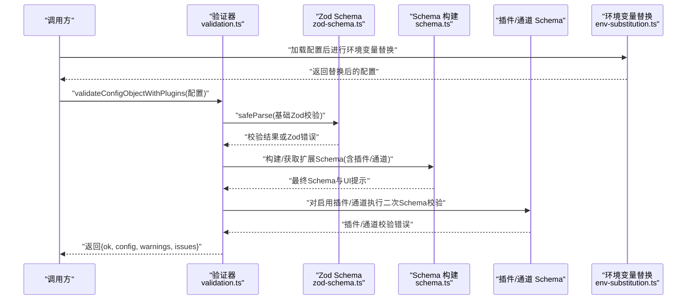
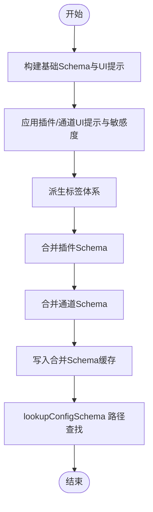
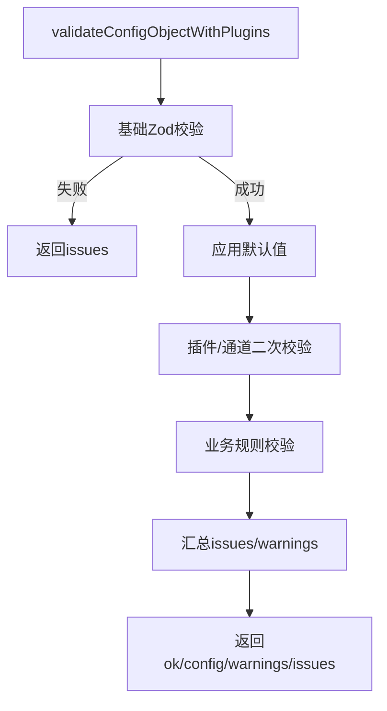
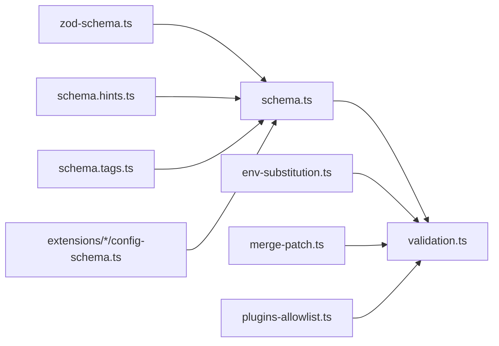

# 配置验证

<cite>
**本文引用的文件**
- [src/config/schema.ts](file://src/config/schema.ts)
- [src/config/validation.ts](file://src/config/validation.ts)
- [src/config/zod-schema.ts](file://src/config/zod-schema.ts)
- [src/config/types.openclaw.ts](file://src/config/types.openclaw.ts)
- [src/config/schema.hints.ts](file://src/config/schema.hints.ts)
- [src/config/schema.tags.ts](file://src/config/schema.tags.ts)
- [src/config/env-substitution.ts](file://src/config/env-substitution.ts)
- [src/config/merge-patch.ts](file://src/config/merge-patch.ts)
- [extensions/feishu/src/config-schema.ts](file://extensions/feishu/src/config-schema.ts)
- [src/config/plugins-allowlist.ts](file://src/config/plugins-allowlist.ts)
</cite>

## 目录
1. [简介](#简介)
2. [项目结构](#项目结构)
3. [核心组件](#核心组件)
4. [架构总览](#架构总览)
5. [详细组件分析](#详细组件分析)
6. [依赖关系分析](#依赖关系分析)
7. [性能考量](#性能考量)
8. [故障排查指南](#故障排查指南)
9. [结论](#结论)
10. [附录：验证规则参考](#附录验证规则参考)

## 简介
本文件面向OpenClaw配置验证系统，提供从架构到实现细节的完整技术文档。内容涵盖：
- 架构设计：基于Zod Schema的强类型校验、UI提示与标签派生、插件与通道Schema动态合并、查找与子节点枚举能力。
- Zod模式定义：核心配置Schema、敏感字段标记、插件/通道Schema注入与合并策略。
- 自定义验证规则：内置业务规则（如心跳目标、网关绑定约束、头像路径安全等）与插件Schema二次校验。
- 验证流程：原始校验、应用默认值、插件与通道扩展校验、错误收集与报告。
- 性能优化：Schema构建缓存、查找路径解析与剪裁、最小化UI提示生成。
- 错误恢复：环境变量替换失败抛错、插件缺失容忍性、允许白名单自动补全。

## 项目结构
OpenClaw配置验证系统主要由以下模块构成：
- 核心Schema与类型：定义全局配置结构与类型约束。
- 验证器：执行Zod校验、业务规则校验、插件与通道Schema二次校验。
- UI提示与标签：从Schema中派生UI标签、敏感度与分组信息。
- 环境变量替换：在加载阶段对字符串中的${VAR}进行替换。
- 合并补丁：对数组对象按id合并，避免破坏性覆盖。
- 插件与通道扩展：动态注入插件/通道Schema，并生成可交互的表单Schema。

图表来源
- [src/config/zod-schema.ts](file://src/config/zod-schema.ts#L162-L889)
- [src/config/validation.ts](file://src/config/validation.ts#L229-L622)
- [src/config/schema.ts](file://src/config/schema.ts#L449-L484)
- [src/config/schema.hints.ts](file://src/config/schema.hints.ts#L124-L239)
- [src/config/schema.tags.ts](file://src/config/schema.tags.ts#L177-L187)
- [src/config/env-substitution.ts](file://src/config/env-substitution.ts#L169-L172)
- [src/config/merge-patch.ts](file://src/config/merge-patch.ts#L62-L98)
- [src/config/plugins-allowlist.ts](file://src/config/plugins-allowlist.ts#L3-L15)
- [extensions/feishu/src/config-schema.ts](file://extensions/feishu/src/config-schema.ts#L200-L286)

章节来源
- [src/config/schema.ts](file://src/config/schema.ts#L1-L712)
- [src/config/validation.ts](file://src/config/validation.ts#L1-L623)
- [src/config/zod-schema.ts](file://src/config/zod-schema.ts#L1-L889)
- [src/config/types.openclaw.ts](file://src/config/types.openclaw.ts#L1-L155)
- [src/config/schema.hints.ts](file://src/config/schema.hints.ts#L1-L239)
- [src/config/schema.tags.ts](file://src/config/schema.tags.ts#L1-L187)
- [src/config/env-substitution.ts](file://src/config/env-substitution.ts#L1-L172)
- [src/config/merge-patch.ts](file://src/config/merge-patch.ts#L1-L98)
- [src/config/plugins-allowlist.ts](file://src/config/plugins-allowlist.ts#L1-L16)
- [extensions/feishu/src/config-schema.ts](file://extensions/feishu/src/config-schema.ts#L1-L286)

## 核心组件
- Zod Schema 定义：集中于zod-schema.ts，采用严格模式与superRefine自定义校验，确保类型安全与业务规则一致性。
- 验证器：validation.ts负责原始Zod校验、应用默认值、插件与通道Schema二次校验、业务规则校验与错误汇总。
- Schema 构建与查找：schema.ts提供基础Schema与UI提示构建、插件/通道Schema注入与合并、Schema查找与子节点枚举、缓存策略。
- UI提示与标签：schema.hints.ts与schema.tags.ts从Schema与Zod注解中派生UI标签、敏感度与标签体系。
- 环境变量替换：env-substitution.ts在加载阶段解析${VAR}，缺失时抛出明确错误。
- 合并补丁：merge-patch.ts对数组对象按id合并，避免破坏性替换。
- 插件白名单辅助：plugins-allowlist.ts在运行时自动补全allow列表，提升健壮性。

章节来源
- [src/config/zod-schema.ts](file://src/config/zod-schema.ts#L162-L889)
- [src/config/validation.ts](file://src/config/validation.ts#L229-L622)
- [src/config/schema.ts](file://src/config/schema.ts#L449-L484)
- [src/config/schema.hints.ts](file://src/config/schema.hints.ts#L124-L239)
- [src/config/schema.tags.ts](file://src/config/schema.tags.ts#L177-L187)
- [src/config/env-substitution.ts](file://src/config/env-substitution.ts#L169-L172)
- [src/config/merge-patch.ts](file://src/config/merge-patch.ts#L62-L98)
- [src/config/plugins-allowlist.ts](file://src/config/plugins-allowlist.ts#L3-L15)

## 架构总览
OpenClaw配置验证系统采用“Schema驱动 + 动态扩展 + 缓存优化”的架构：
- 基础Schema：由OpenClawSchema统一定义，覆盖所有核心配置域。
- 扩展Schema：通过buildConfigSchema动态注入插件与通道Schema，生成最终用于UI与校验的Schema。
- 验证流水线：先执行Zod基础校验，再应用默认值，最后对启用的插件与通道执行二次Schema校验与业务规则校验。
- 错误报告：统一映射为ConfigValidationIssue，包含路径、消息、可选的允许值集合与隐藏数量。

图表来源
- [src/config/validation.ts](file://src/config/validation.ts#L288-L622)
- [src/config/zod-schema.ts](file://src/config/zod-schema.ts#L162-L889)
- [src/config/schema.ts](file://src/config/schema.ts#L449-L484)
- [src/config/env-substitution.ts](file://src/config/env-substitution.ts#L169-L172)

## 详细组件分析

### 组件A：Schema 构建与查找（schema.ts）
职责与特性：
- 基础Schema构建：缓存基础Schema与UI提示，避免重复计算。
- 插件/通道Schema注入：将插件与通道的Schema合并到基础Schema中，形成最终Schema。
- UI提示与标签：应用插件/通道提示、敏感度标记、派生标签。
- Schema查找：支持路径解析、通配符匹配、子节点枚举、剪裁无关键值。
- 缓存策略：基于参数哈希的LRU式缓存，限制最大容量。

图表来源
- [src/config/schema.ts](file://src/config/schema.ts#L449-L484)
- [src/config/schema.ts](file://src/config/schema.ts#L678-L711)

章节来源
- [src/config/schema.ts](file://src/config/schema.ts#L430-L484)
- [src/config/schema.ts](file://src/config/schema.ts#L678-L711)

### 组件B：验证器（validation.ts）
职责与特性：
- 原始校验：使用OpenClawSchema.safeParse进行基础类型与格式校验。
- 应用默认值：在非原始校验场景下应用模型、代理、会话默认值。
- 插件与通道校验：加载插件清单、规范化插件配置、对启用插件执行二次Schema校验。
- 业务规则校验：心跳目标合法性、网关绑定与Tailscale模式一致性、头像路径安全性、重复代理目录检测等。
- 错误收集：统一映射为ConfigValidationIssue，支持允许值摘要与提示拼接。

图表来源
- [src/config/validation.ts](file://src/config/validation.ts#L288-L622)

章节来源
- [src/config/validation.ts](file://src/config/validation.ts#L229-L622)

### 组件C：Zod 模式定义（zod-schema.ts）
职责与特性：
- 全局配置Schema：定义meta、env、wizard、logging、cli、update、browser、ui、secrets、skills、plugins、models、nodeHost、agents、tools、bindings、broadcast、audio、media、messages、commands、approvals、session、web、channels、cron、hooks、discovery、canvasHost、talk、gateway、memory等域的结构与约束。
- 类型转换与超集校验：如时间戳转换、URL协议限定、时长/大小解析等。
- 自定义校验：如广播目标未知校验、cron会话保留与日志大小解析、心跳目标合法性等。

章节来源
- [src/config/zod-schema.ts](file://src/config/zod-schema.ts#L162-L889)

### 组件D：UI提示与标签（schema.hints.ts、schema.tags.ts）
职责与特性：
- 基础提示：从标签、帮助文本、占位符构建初始UI提示。
- 敏感度标记：根据路径模式与白名单规则标记敏感字段。
- 标签派生：基于前缀、关键字、路径模式与敏感度派生标签，支持覆盖与优先级排序。

章节来源
- [src/config/schema.hints.ts](file://src/config/schema.hints.ts#L124-L239)
- [src/config/schema.tags.ts](file://src/config/schema.tags.ts#L177-L187)

### 组件E：环境变量替换（env-substitution.ts）
职责与特性：
- 支持${VAR_NAME}语法，仅识别大写环境变量名。
- 对${$${VAR}}进行转义输出。
- 缺失或空值时抛出MissingEnvVarError，包含变量名与配置路径。

章节来源
- [src/config/env-substitution.ts](file://src/config/env-substitution.ts#L1-L172)

### 组件F：合并补丁（merge-patch.ts）
职责与特性：
- 对象数组按id合并，保持基数组完整性；非id条目直接追加。
- 递归合并对象，避免破坏性替换。
- 可选选项控制数组合并行为。

章节来源
- [src/config/merge-patch.ts](file://src/config/merge-patch.ts#L62-L98)

### 组件G：插件白名单辅助（plugins-allowlist.ts）
职责与特性：
- 在运行时自动将缺失的插件ID加入plugins.allow，提升启动容错。

章节来源
- [src/config/plugins-allowlist.ts](file://src/config/plugins-allowlist.ts#L3-L15)

### 组件H：插件/通道Schema示例（Feishu）
职责与特性：
- 使用Zod定义通道配置Schema，包含策略、工具、会话作用域、连接模式、Webhook令牌等。
- 通过superRefine实现跨字段约束（如Webhook模式必须提供令牌）与默认值设置。

章节来源
- [extensions/feishu/src/config-schema.ts](file://extensions/feishu/src/config-schema.ts#L200-L286)

## 依赖关系分析
- schema.ts依赖zod-schema.ts提供的OpenClawSchema，并通过UI提示与标签模块派生最终Schema与提示。
- validation.ts依赖schema.ts生成的最终Schema，同时依赖插件清单与插件Schema进行二次校验。
- env-substitution.ts在验证前对配置进行环境变量替换，缺失时抛错。
- merge-patch.ts与plugins-allowlist.ts在配置写回与运行时容错方面提供支撑。

图表来源
- [src/config/zod-schema.ts](file://src/config/zod-schema.ts#L162-L889)
- [src/config/schema.ts](file://src/config/schema.ts#L449-L484)
- [src/config/validation.ts](file://src/config/validation.ts#L288-L622)
- [src/config/schema.hints.ts](file://src/config/schema.hints.ts#L124-L239)
- [src/config/schema.tags.ts](file://src/config/schema.tags.ts#L177-L187)
- [src/config/env-substitution.ts](file://src/config/env-substitution.ts#L169-L172)
- [src/config/merge-patch.ts](file://src/config/merge-patch.ts#L62-L98)
- [src/config/plugins-allowlist.ts](file://src/config/plugins-allowlist.ts#L3-L15)
- [extensions/feishu/src/config-schema.ts](file://extensions/feishu/src/config-schema.ts#L200-L286)

章节来源
- [src/config/schema.ts](file://src/config/schema.ts#L449-L484)
- [src/config/validation.ts](file://src/config/validation.ts#L288-L622)

## 性能考量
- Schema构建缓存：基础Schema与合并Schema均采用缓存，减少重复构建开销。
- 查找路径剪裁：lookupConfigSchema仅保留必要键值，降低UI渲染与传输成本。
- 最小化提示生成：通过派生标签与敏感度标记，避免冗余提示。
- 二次校验按需：仅对启用插件与存在配置的插件执行Schema校验，减少无效工作量。

章节来源
- [src/config/schema.ts](file://src/config/schema.ts#L352-L406)
- [src/config/schema.ts](file://src/config/schema.ts#L588-L637)
- [src/config/validation.ts](file://src/config/validation.ts#L584-L607)

## 故障排查指南
常见问题与定位方法：
- 环境变量缺失：检查MissingEnvVarError，确认对应变量是否设置且非空。
- 插件不存在或已移除：验证器会区分错误与警告，建议清理stale配置或更新allow/deny列表。
- 心跳目标非法：检查agents.defaults.heartbeat.target与agents.list[*].heartbeat.target，确保为last/none/已知通道或插件通道。
- 网关绑定与Tailscale模式冲突：当gateway.tailscale.mode为serve或funnel时，gateway.bind必须为loopback或custom且指向127.0.0.1。
- 头像路径越界：identity.avatar必须位于代理工作区范围内，不支持~开头的相对路径或非工作区绝对路径。
- 重复代理目录：agents.list中禁止出现重复的agentDir，需修正后重试。

章节来源
- [src/config/validation.ts](file://src/config/validation.ts#L148-L196)
- [src/config/validation.ts](file://src/config/validation.ts#L198-L223)
- [src/config/validation.ts](file://src/config/validation.ts#L432-L463)
- [src/config/env-substitution.ts](file://src/config/env-substitution.ts#L29-L37)

## 结论
OpenClaw配置验证系统以Zod为核心，结合动态Schema注入、UI提示与标签派生、缓存优化与严格的业务规则校验，形成了高可靠性、可扩展、易维护的配置验证框架。通过插件与通道Schema的无缝集成，系统既能满足核心配置的强约束，又能灵活适配生态扩展，为用户提供了清晰的错误反馈与稳健的运行保障。

## 附录：验证规则参考

### 必填字段
- 基础Schema中使用strict()与required字段声明必填项，确保关键配置不为空。
- 插件/通道Schema同样采用strict()与显式required，避免遗漏。

章节来源
- [src/config/zod-schema.ts](file://src/config/zod-schema.ts#L162-L889)
- [extensions/feishu/src/config-schema.ts](file://extensions/feishu/src/config-schema.ts#L200-L286)

### 数据类型检查
- 字符串：url()、regex()、email()、ip()等专用校验器。
- 数字：int()、positive()、nonnegative()、min()/max()等范围约束。
- 枚举：literal()与enum()组合，确保取值合法。
- 对象：strict()限定字段，catchall()处理额外属性。

章节来源
- [src/config/zod-schema.ts](file://src/config/zod-schema.ts#L123-L130)
- [src/config/zod-schema.ts](file://src/config/zod-schema.ts#L90-L98)
- [src/config/zod-schema.ts](file://src/config/zod-schema.ts#L140-L160)

### 范围限制
- 时间/大小解析：parseDurationMs()与parseByteSize()用于时长与大小字段的解析与校验。
- 数值边界：min()/max()与int()组合，确保数值在合理区间内。

章节来源
- [src/config/zod-schema.ts](file://src/config/zod-schema.ts#L486-L509)

### 业务规则验证
- 心跳目标：支持last/none/通道ID，且通道ID需在预定义集合或插件注册中。
- 网关绑定与Tailscale：当mode为serve或funnel时，bind必须为loopback或指向127.0.0.1。
- 头像路径：仅允许工作区相对路径、http(s) URL或data URI，且不得越界。
- 代理目录：agents.list中禁止重复agentDir。

章节来源
- [src/config/validation.ts](file://src/config/validation.ts#L432-L463)
- [src/config/validation.ts](file://src/config/validation.ts#L198-L223)
- [src/config/validation.ts](file://src/config/validation.ts#L148-L196)
- [src/config/validation.ts](file://src/config/validation.ts#L249-L260)

### 错误收集与报告
- 统一映射：Zod错误映射为ConfigValidationIssue，支持允许值摘要与隐藏数量。
- 插件错误：插件Schema校验错误会被映射为plugins.entries.{id}.config下的路径。
- 警告与错误：区分错误（影响启动）与警告（可忽略），便于用户决策。

章节来源
- [src/config/validation.ts](file://src/config/validation.ts#L117-L140)
- [src/config/validation.ts](file://src/config/validation.ts#L592-L599)

### 扩展验证规则（自定义配置项）
- 插件Schema注入：通过buildConfigSchema合并插件configSchema，生成最终Schema。
- 通道Schema注入：将通道Schema合并到channels节点，支持动态扩展。
- 路径查找：lookupConfigSchema支持通配符与子节点枚举，便于UI与自动化工具使用。
- 允许值提示：collectAllowedValuesFromIssue()与summarizeAllowedValues()提供允许值摘要。

章节来源
- [src/config/schema.ts](file://src/config/schema.ts#L285-L350)
- [src/config/schema.ts](file://src/config/schema.ts#L678-L711)
- [src/config/validation.ts](file://src/config/validation.ts#L584-L607)