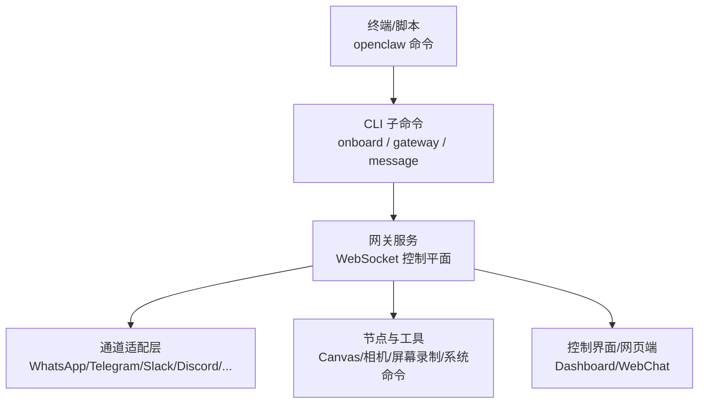
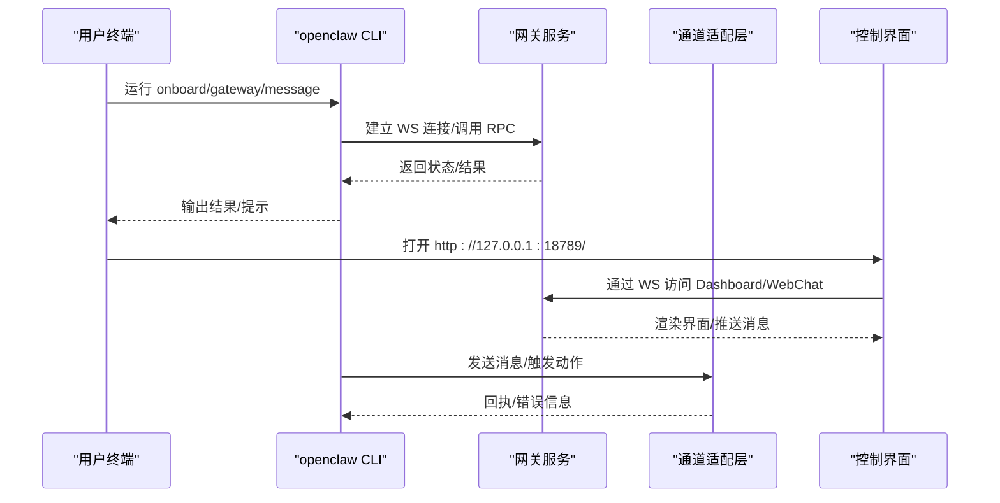
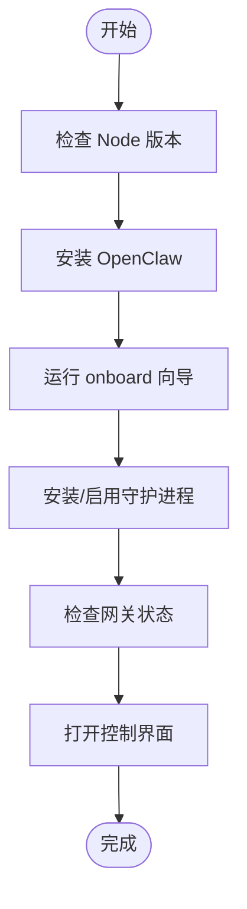
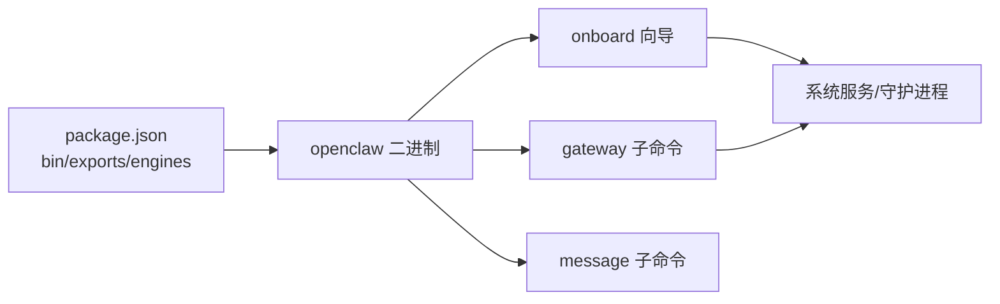

# 快速开始

<cite>
**本文引用的文件**
- [README.md](file://README.md)
- [package.json](file://package.json)
- [docs/start/getting-started.md](file://docs/start/getting-started.md)
- [docs/install/node.md](file://docs/install/node.md)
- [docs/platforms/macos.md](file://docs/platforms/macos.md)
- [docs/platforms/linux.md](file://docs/platforms/linux.md)
- [docs/platforms/windows.md](file://docs/platforms/windows.md)
- [docs/install/bun.md](file://docs/install/bun.md)
- [docs/cli/onboard.md](file://docs/cli/onboard.md)
- [docs/cli/gateway.md](file://docs/cli/gateway.md)
- [docs/cli/message.md](file://docs/cli/message.md)
</cite>

## 目录
1. [简介](#简介)
2. [项目结构](#项目结构)
3. [核心组件](#核心组件)
4. [架构总览](#架构总览)
5. [详细组件分析](#详细组件分析)
6. [依赖关系分析](#依赖关系分析)
7. [性能考虑](#性能考虑)
8. [故障排查指南](#故障排查指南)
9. [结论](#结论)
10. [附录](#附录)

## 简介
本指南面向首次接触 OpenClaw 的用户，带你从零完成安装与初始配置，快速跑通第一个 AI 助手实例：通过向导完成网关初始化、启动网关、打开控制界面进行聊天，并可选地发送一条消息测试通道连通性。文档覆盖 macOS、Linux、Windows WSL2 三大平台的差异与注意事项，并提供常见问题排查建议。

## 项目结构
- 根目录提供统一的 CLI 入口 openclaw，支持在 Node ≥22 环境下全局安装与使用。
- 文档目录提供分主题的安装、平台、CLI 参考与入门指南，便于按需查阅。
- 平台侧文档分别说明 macOS 菜单栏配套应用、Linux 守护进程与 systemd 集成、Windows WSL2 推荐路径及自动启动链路。

**图表来源**
- [package.json](file://package.json#L16-L18)
- [docs/cli/onboard.md](file://docs/cli/onboard.md#L20-L27)
- [docs/cli/gateway.md](file://docs/cli/gateway.md#L22-L34)
- [docs/cli/message.md](file://docs/cli/message.md#L14-L18)

**章节来源**
- [README.md](file://README.md#L28-L31)
- [package.json](file://package.json#L16-L18)

## 核心组件
- CLI 与子命令
  - openclaw onboard：交互式向导，完成认证、网关配置与可选通道设置。
  - openclaw gateway：运行/查询/发现网关，管理服务生命周期。
  - openclaw message：向指定通道发送消息或执行频道动作。
- 网关（Gateway）
  - 单一 WebSocket 控制平面，承载会话、节点、事件与钩子；默认端口 18789。
- 控制界面（Dashboard/WebChat）
  - 无需通道配置即可直接访问，适合首次体验与调试。

**章节来源**
- [docs/cli/onboard.md](file://docs/cli/onboard.md#L8-L27)
- [docs/cli/gateway.md](file://docs/cli/gateway.md#L10-L34)
- [docs/cli/message.md](file://docs/cli/message.md#L9-L18)
- [docs/start/getting-started.md](file://docs/start/getting-started.md#L13-L18)

## 架构总览
下图展示从命令行到网关、再到各通道与节点的典型调用链路，以及控制界面的接入方式。

**图表来源**
- [docs/cli/gateway.md](file://docs/cli/gateway.md#L84-L97)
- [docs/cli/message.md](file://docs/cli/message.md#L16-L18)
- [docs/start/getting-started.md](file://docs/start/getting-started.md#L72-L76)

## 详细组件分析

### 1) 环境要求与 Node.js 安装
- 版本要求：Node.js ≥22（推荐使用官方长期支持版本）。
- 安装方式：
  - macOS：Homebrew 或 nodejs.org 官方安装包。
  - Linux：Ubuntu/Debian 使用 nodesource 源；Fedora/RHEL 使用 dnf；也可使用 nvm/fnm/mise 等版本管理器。
  - Windows：winget 或 Chocolatey 安装 Node LTS，或使用 nodejs.org 官方安装包。
- 常见问题：
  - 命令未找到：检查 npm 全局前缀是否加入 PATH；在 macOS/Linux 下追加到 ~/.zshrc 或 ~/.bashrc；在 Windows 下通过系统设置添加到 PATH。
  - 权限错误（Linux）：将 npm 全局前缀切换至用户目录并更新 PATH。

**章节来源**
- [docs/install/node.md](file://docs/install/node.md#L12-L20)
- [docs/install/node.md](file://docs/install/node.md#L24-L68)
- [docs/install/node.md](file://docs/install/node.md#L89-L139)

### 2) 包管理器选择（npm/pnpm/bun）
- 推荐使用 pnpm 进行构建与打包；bun 可用于本地开发运行 TypeScript 文件（非生产网关运行）。
- 注意事项：
  - bun 无法使用 pnpm-lock.yaml，且部分依赖生命周期脚本可能被阻断，如遇问题可显式信任相关包。
  - 不建议在生产环境中使用 bun 运行网关（WhatsApp/Telegram 存在兼容性问题）。

**章节来源**
- [docs/install/bun.md](file://docs/install/bun.md#L11-L21)
- [docs/install/bun.md](file://docs/install/bun.md#L43-L56)

### 3) 安装与初始配置（onboard 向导）
- 安装 OpenClaw（推荐）：使用官方安装脚本一键安装。
- 运行向导：openclaw onboard --install-daemon 将引导你完成认证、网关配置与可选通道设置，并安装/启用系统级服务。
- 检查网关状态：openclaw gateway status。
- 打开控制界面：openclaw dashboard，浏览器访问 http://127.0.0.1:18789。

**图表来源**
- [docs/start/getting-started.md](file://docs/start/getting-started.md#L28-L77)
- [docs/cli/onboard.md](file://docs/cli/onboard.md#L20-L27)

**章节来源**
- [docs/start/getting-started.md](file://docs/start/getting-started.md#L28-L77)
- [docs/cli/onboard.md](file://docs/cli/onboard.md#L20-L27)

### 4) 网关启动与健康检查
- 前台运行：openclaw gateway --port 18789。
- 查询状态：openclaw gateway status。
- 健康探测：openclaw gateway health。
- 服务管理：openclaw gateway install/start/stop/restart/uninstall。

**章节来源**
- [docs/cli/gateway.md](file://docs/cli/gateway.md#L22-L62)
- [docs/cli/gateway.md](file://docs/cli/gateway.md#L84-L106)
- [docs/cli/gateway.md](file://docs/cli/gateway.md#L157-L175)

### 5) 发送第一条消息（可选）
- 在已配置通道的前提下，使用 openclaw message send 发送测试消息。
- 目标格式因通道而异（例如 E.164、@username、channel:user 等），请参考对应通道文档。

**章节来源**
- [docs/cli/message.md](file://docs/cli/message.md#L14-L37)
- [docs/cli/message.md](file://docs/cli/message.md#L55-L64)

### 6) 平台差异与注意事项

#### macOS
- 菜单栏配套应用负责权限管理、本地/远程模式下的网关连接、暴露 macOS 专属能力（Canvas/相机/屏幕录制/系统命令）。
- 默认使用 launchd 用户服务；可通过 openclaw gateway install 启用。
- 建议避免将状态目录置于 iCloud 或云同步路径，以减少锁争用与延迟风险。

**章节来源**
- [docs/platforms/macos.md](file://docs/platforms/macos.md#L9-L34)
- [docs/platforms/macos.md](file://docs/platforms/macos.md#L146-L164)

#### Linux
- 网关完全支持 Linux；推荐使用 Node 作为运行时。
- 可通过 openclaw onboard --install-daemon 或 systemd 用户服务安装网关。
- 提供最小 systemd 示例与启用命令，便于自托管与开机自启。

**章节来源**
- [docs/platforms/linux.md](file://docs/platforms/linux.md#L11-L14)
- [docs/platforms/linux.md](file://docs/platforms/linux.md#L37-L57)
- [docs/platforms/linux.md](file://docs/platforms/linux.md#L65-L95)

#### Windows（WSL2）
- 强烈推荐通过 WSL2（Ubuntu）安装与运行，获得完整的 Linux 工具链与兼容性。
- 支持开机自启链路：WSL 自动启动 → 用户服务启用 → 网关随服务启动。
- 如需在局域网内访问 WSL 内的服务，可使用 netsh portproxy 将 Windows 端口转发到 WSL IP。

**章节来源**
- [docs/platforms/windows.md](file://docs/platforms/windows.md#L9-L16)
- [docs/platforms/windows.md](file://docs/platforms/windows.md#L58-L101)
- [docs/platforms/windows.md](file://docs/platforms/windows.md#L102-L146)
- [docs/platforms/windows.md](file://docs/platforms/windows.md#L147-L198)

## 依赖关系分析
- CLI 入口与导出
  - openclaw 二进制入口位于 openclaw.mjs，通过 package.json 的 exports 字段对外提供插件 SDK 与 CLI 入口。
- 运行时与引擎
  - engines 指定 Node ≥22.12.0；packageManager 指定 pnpm@10.23.0。
- 平台与守护进程
  - macOS 使用 launchd；Linux 使用 systemd 用户服务；Windows 使用 schtasks + WSL 启动链。

**图表来源**
- [package.json](file://package.json#L16-L18)
- [package.json](file://package.json#L37-L216)
- [package.json](file://package.json#L410-L413)

**章节来源**
- [package.json](file://package.json#L16-L18)
- [package.json](file://package.json#L37-L216)
- [package.json](file://package.json#L410-L413)

## 性能考虑
- 首次体验优先使用控制界面（无需通道配置），可快速验证网关连通性与基础功能。
- 若需要多通道联动或自动化，建议在向导中按需开启通道，并合理设置会话与工具策略，避免不必要的资源占用。
- 在 Linux/WSL2 上运行网关时，优先使用 Node 作为运行时，确保与通道生态兼容。

[本节为通用指导，不直接分析具体文件]

## 故障排查指南
- 命令未找到（openclaw: command not found）
  - 检查 npm 全局前缀是否加入 PATH；在 macOS/Linux 下追加到 shell 启动文件；在 Windows 下通过系统设置添加。
- 权限错误（Linux）
  - 将 npm 全局前缀切换至用户目录并更新 PATH，避免使用 sudo 安装全局包。
- 网关无法绑定或拒绝启动
  - 绑定到非回环地址且未配置认证会被安全策略阻止；请配置认证或仅绑定回环。
- Windows WSL2 局域网访问失败
  - 使用 netsh interface portproxy 将 Windows 端口转发到 WSL IP，并允许防火墙规则；必要时刷新转发规则。
- macOS 状态目录位于 iCloud
  - 将 OPENCLAW_STATE_DIR 指向本地非同步路径，避免云同步带来的延迟与锁争用。

**章节来源**
- [docs/install/node.md](file://docs/install/node.md#L89-L139)
- [docs/cli/gateway.md](file://docs/cli/gateway.md#L36-L42)
- [docs/platforms/windows.md](file://docs/platforms/windows.md#L102-L146)
- [docs/platforms/macos.md](file://docs/platforms/macos.md#L146-L164)

## 结论
按照本指南，你可以在三分钟内完成 OpenClaw 的安装与初始配置，打开控制界面进行首次对话，并可选地通过向导配置通道与发送测试消息。针对不同平台，我们提供了具体的安装与服务管理建议，以及常见问题的排查步骤。建议在正式使用前，结合自身需求完善认证、通道与工具策略，并定期运行 doctor 检查配置健康度。

[本节为总结性内容，不直接分析具体文件]

## 附录
- 快速命令清单
  - 安装 OpenClaw：使用官方安装脚本。
  - 运行向导：openclaw onboard --install-daemon。
  - 检查网关：openclaw gateway status。
  - 打开控制界面：openclaw dashboard。
  - 发送测试消息：openclaw message send（需已配置通道）。

**章节来源**
- [docs/start/getting-started.md](file://docs/start/getting-started.md#L28-L102)
- [docs/cli/onboard.md](file://docs/cli/onboard.md#L20-L27)
- [docs/cli/gateway.md](file://docs/cli/gateway.md#L84-L106)
- [docs/cli/message.md](file://docs/cli/message.md#L55-L64)