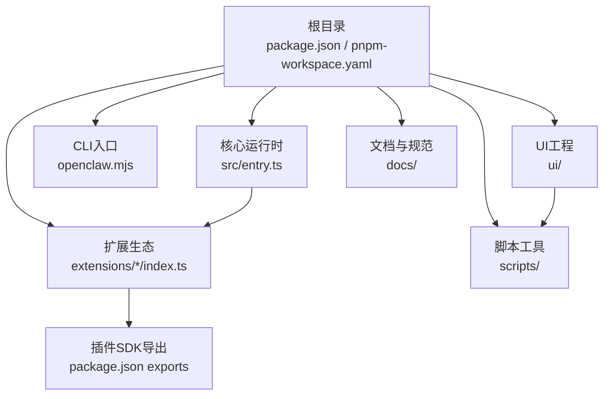
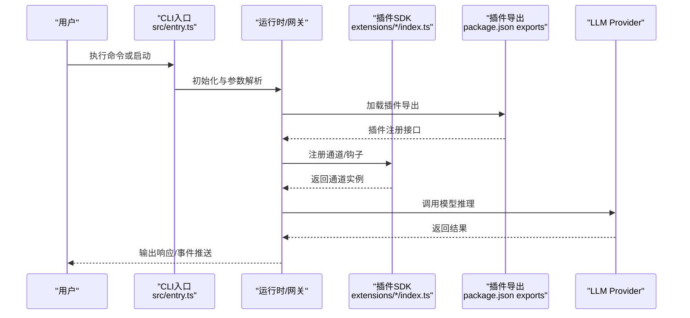
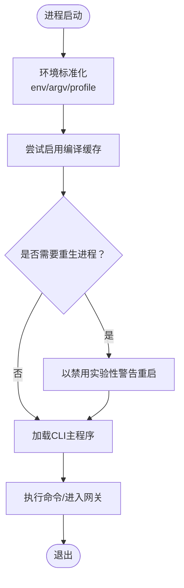
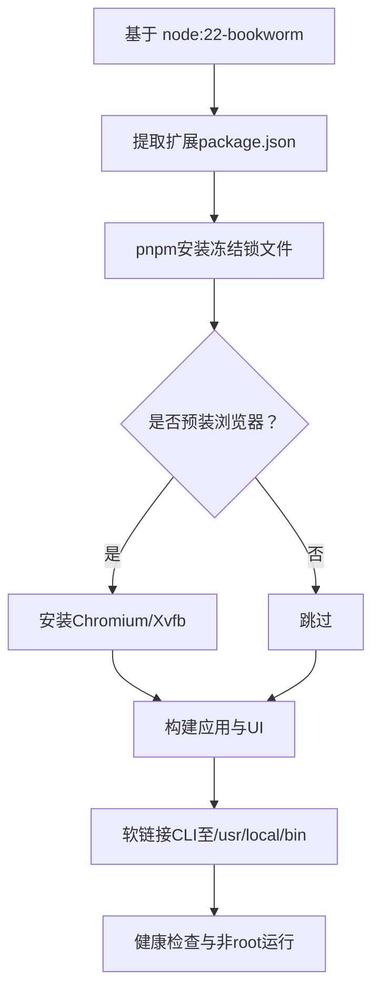
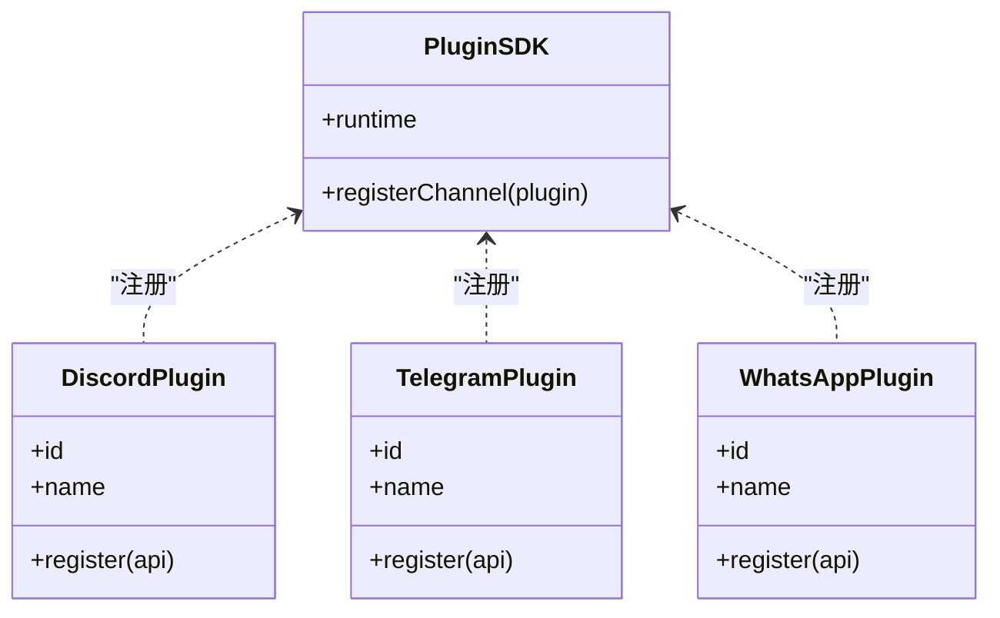
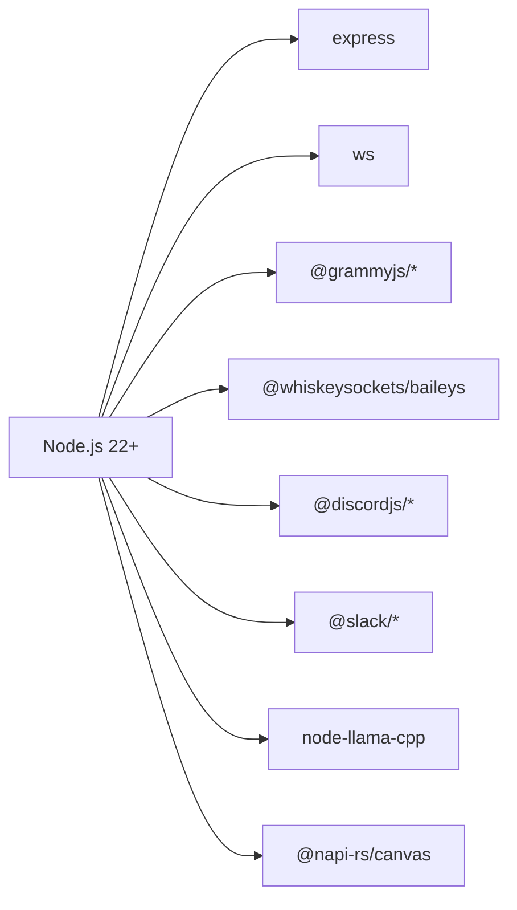

# 技术栈

<cite>
**本文引用的文件**
- [package.json](file://package.json)
- [pnpm-workspace.yaml](file://pnpm-workspace.yaml)
- [Dockerfile](file://Dockerfile)
- [tsconfig.json](file://tsconfig.json)
- [src/entry.ts](file://src/entry.ts)
- [extensions/discord/index.ts](file://extensions/discord/index.ts)
- [extensions/telegram/index.ts](file://extensions/telegram/index.ts)
- [extensions/whatsapp/index.ts](file://extensions/whatsapp/index.ts)
</cite>

## 目录
1. [引言](#引言)
2. [项目结构](#项目结构)
3. [核心组件](#核心组件)
4. [架构总览](#架构总览)
5. [详细组件分析](#详细组件分析)
6. [依赖关系分析](#依赖关系分析)
7. [性能考量](#性能考量)
8. [故障排查指南](#故障排查指南)
9. [结论](#结论)
10. [附录](#附录)

## 引言
本技术栈文档面向OpenClaw项目的开发者与运维人员，系统梳理项目所采用的核心技术与框架，包括Node.js 22+运行时、TypeScript语言、WebSocket通信协议、Docker容器化、多消息渠道SDK（Baileys、Grammy、discord.js等）、LLM提供商集成、monorepo架构与包管理策略、构建工具链等。文档同时解释技术选型的原因与优势，并给出版本要求与兼容性信息，帮助读者快速理解并搭建一致的开发与运行环境。

## 项目结构
OpenClaw采用monorepo组织方式，根目录通过工作区配置统一管理多个子包与扩展。整体结构围绕“核心运行时”“CLI入口”“插件生态（channels）”“UI与脚本工具”展开，配合Dockerfile实现跨平台容器化部署。

图表来源
- [package.json](file://package.json#L37-L216)
- [pnpm-workspace.yaml](file://pnpm-workspace.yaml#L1-L17)
- [src/entry.ts](file://src/entry.ts#L1-L191)

章节来源
- [package.json](file://package.json#L1-L444)
- [pnpm-workspace.yaml](file://pnpm-workspace.yaml#L1-L17)

## 核心组件
- 运行时与语言
  - Node.js 22+：满足高性能I/O与模块编译缓存能力；支持实验性特性与严格模式。
  - TypeScript：严格的类型系统与模块解析，结合路径映射提升大型项目可维护性。
- 容器化
  - Docker多阶段构建：按需提取扩展依赖，减少无关变更对镜像层的影响；内置健康检查与非root用户运行。
- 插件生态（消息渠道）
  - 基于统一插件SDK注册机制，各渠道以独立扩展形式接入（如Discord、Telegram、WhatsApp等）。
- 通信协议
  - WebSocket：用于网关与客户端之间的实时双向通信。
- LLM集成
  - 通过Provider抽象与SDK集成，支持多家模型服务（如OpenAI、Anthropic、Bedrock等），并提供本地模型与代理能力。
- 包管理与工作区
  - pnpm workspace：统一版本与依赖锁定，仅构建必要原生依赖，降低安装复杂度与内存占用。
- 构建与脚手架
  - tsdown、tsx、Vitest、oxlint/oxfmt等工具链，配合自定义脚本完成打包、校验、测试与发布流程。

章节来源
- [package.json](file://package.json#L332-L413)
- [Dockerfile](file://Dockerfile#L1-L155)
- [tsconfig.json](file://tsconfig.json#L1-L29)
- [src/entry.ts](file://src/entry.ts#L1-L191)

## 架构总览
下图展示从CLI入口到插件通道、再到网关与外部LLM Provider的整体调用链路与职责边界。

图表来源
- [src/entry.ts](file://src/entry.ts#L1-L191)
- [package.json](file://package.json#L37-L216)
- [extensions/discord/index.ts](file://extensions/discord/index.ts#L1-L20)
- [extensions/telegram/index.ts](file://extensions/telegram/index.ts#L1-L18)
- [extensions/whatsapp/index.ts](file://extensions/whatsapp/index.ts#L1-L18)

## 详细组件分析

### Node.js 22+ 运行时与启动流程
- 启动入口
  - CLI入口文件负责环境标准化、警告过滤、编译缓存启用与进程重生策略，确保稳定与一致的运行环境。
- 性能与稳定性
  - 启用模块编译缓存与严格模式，避免重复解析与潜在错误传播。
  - 提供“只读认证存储”“颜色控制”等运行时开关，便于调试与安全加固。

图表来源
- [src/entry.ts](file://src/entry.ts#L35-L191)

章节来源
- [src/entry.ts](file://src/entry.ts#L1-L191)

### TypeScript 与路径映射
- 编译目标与模块解析
  - 目标ES2023、模块解析NodeNext，开启严格模式与装饰器支持，适配现代Node生态。
- 路径映射
  - 通过路径别名将插件SDK统一指向src/plugin-sdk，简化导入与IDE提示。

章节来源
- [tsconfig.json](file://tsconfig.json#L1-L29)

### Docker 容器化与镜像构建
- 多阶段构建
  - 先提取指定扩展的package.json，再进行依赖安装与构建，避免无关源码变更导致层失效。
- 非root运行与健康检查
  - 使用node用户运行，暴露健康检查端点，便于容器编排与监控。
- 可选组件
  - 支持在构建时预装Chromium/Xvfb与Docker CLI，提升浏览器自动化与沙箱能力。

图表来源
- [Dockerfile](file://Dockerfile#L1-L155)

章节来源
- [Dockerfile](file://Dockerfile#L1-L155)

### 插件生态与消息渠道SDK
- 统一插件注册
  - 每个渠道扩展通过index.ts导出插件对象，注册通道与运行时设置，遵循统一的插件SDK接口。
- 典型渠道
  - Discord：基于grammy与discord.js生态，提供频道与子代理钩子。
  - Telegram：基于Baileys与grammy，提供频道与运行时设置。
  - WhatsApp：基于Baileys，提供频道与运行时设置。

图表来源
- [extensions/discord/index.ts](file://extensions/discord/index.ts#L1-L20)
- [extensions/telegram/index.ts](file://extensions/telegram/index.ts#L1-L18)
- [extensions/whatsapp/index.ts](file://extensions/whatsapp/index.ts#L1-L18)

章节来源
- [extensions/discord/index.ts](file://extensions/discord/index.ts#L1-L20)
- [extensions/telegram/index.ts](file://extensions/telegram/index.ts#L1-L18)
- [extensions/whatsapp/index.ts](file://extensions/whatsapp/index.ts#L1-L18)

### LLM提供商集成
- Provider抽象
  - 通过Provider层对接多家LLM服务，支持HTTP API、本地模型与代理网关，具备失败回退与用量追踪能力。
- 典型SDK
  - OpenAI、Anthropic、Bedrock、Hugging Face、Ollama、Together等，均以统一接口接入。

章节来源
- [package.json](file://package.json#L332-L384)

### monorepo 架构与包管理策略
- 工作区组织
  - 根工作区与UI、扩展、包目录共同构成多包体系，统一版本与依赖锁定。
- 仅构建依赖
  - 仅对必要原生依赖执行构建，减少安装时间与资源消耗。
- 脚本与工具链
  - pnpm脚本覆盖格式化、静态检查、构建、测试、覆盖率、文档生成与协议生成等环节。

章节来源
- [pnpm-workspace.yaml](file://pnpm-workspace.yaml#L1-L17)
- [package.json](file://package.json#L217-L444)

## 依赖关系分析
- 运行时依赖
  - express、ws、grammy、@whiskeysockets/baileys、@discordjs/voice、@slack/bolt 等，支撑Web服务、WebSocket通信与多渠道SDK。
- 开发依赖
  - TypeScript、Vitest、oxlint/oxfmt、tsx、lit等，保障类型安全、测试与代码质量。
- peer依赖
  - @napi-rs/canvas、node-llama-cpp等，作为可选增强能力，按需安装。

图表来源
- [package.json](file://package.json#L332-L384)

章节来源
- [package.json](file://package.json#L332-L413)

## 性能考量
- 启动与运行
  - 启用模块编译缓存与严格模式，减少冷启动与运行时错误。
- 构建与打包
  - 多阶段Docker构建与仅构建必要原生依赖，缩短CI/CD时间。
- 测试与质量
  - Vitest并行测试、覆盖率统计与静态检查，提升迭代效率与质量门禁。
- I/O与并发
  - 基于WebSocket与异步通道处理高并发消息；通道SDK采用队列与节流策略，避免阻塞。

## 故障排查指南
- 启动问题
  - 确认Node版本满足引擎要求；检查环境变量与颜色输出开关；查看编译缓存启用日志。
- Docker部署
  - 若容器无法访问网关，请确认绑定地址与网络模式；检查健康检查端点与权限。
- 插件加载
  - 核对插件导出与注册接口；确认插件SDK版本与路径映射；检查通道初始化日志。
- LLM调用
  - 校验Provider密钥与网络连通性；关注超时与重试策略；核对用量与配额限制。

章节来源
- [src/entry.ts](file://src/entry.ts#L46-L52)
- [Dockerfile](file://Dockerfile#L148-L155)
- [package.json](file://package.json#L332-L384)

## 结论
OpenClaw以Node.js 22+为核心运行时，结合TypeScript与严格的monorepo治理，构建了可扩展的消息网关与插件生态。通过Docker容器化与多阶段构建，实现一致、安全且高效的交付。插件SDK统一了多渠道接入方式，LLM Provider抽象提供了灵活的推理后端选择。整体技术栈在性能、可维护性与扩展性之间取得良好平衡，适合构建企业级多通道智能网关。

## 附录
- 版本与兼容性要点
  - Node.js：>= 22.12.0
  - TypeScript：~5.9.3
  - pnpm：workspace统一管理，仅构建必要原生依赖
  - Docker：基于node:22-bookworm，非root运行，内置健康检查
- 关键文件索引
  - CLI入口：src/entry.ts
  - 插件示例：extensions/discord/index.ts、extensions/telegram/index.ts、extensions/whatsapp/index.ts
  - 工作区与依赖：package.json、pnpm-workspace.yaml
  - 容器构建：Dockerfile
  - 类型配置：tsconfig.json