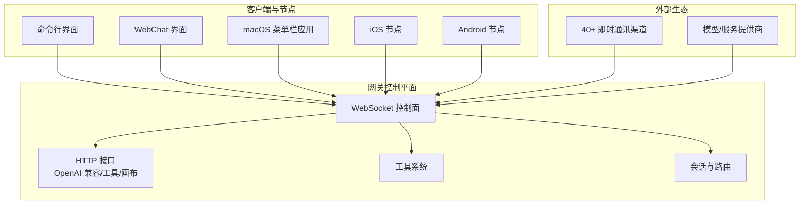
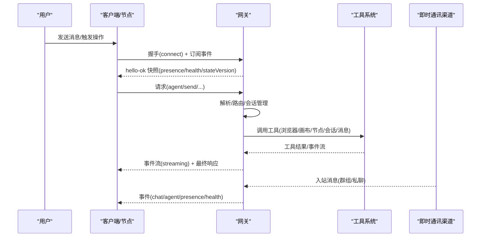
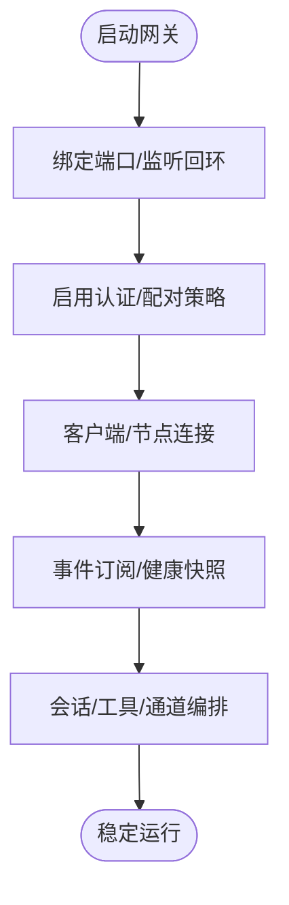
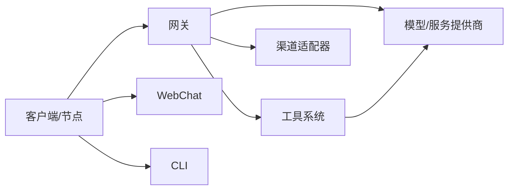

# 核心特性

<cite>
**本文引用的文件**
- [README.md](file://README.md)
- [VISION.md](file://VISION.md)
- [docs/concepts/architecture.md](file://docs/concepts/architecture.md)
- [docs/gateway/index.md](file://docs/gateway/index.md)
- [docs/concepts/agent.md](file://docs/concepts/agent.md)
- [docs/tools/index.md](file://docs/tools/index.md)
- [docs/platforms/macos.md](file://docs/platforms/macos.md)
</cite>

## 目录
1. [简介](#简介)
2. [项目结构](#项目结构)
3. [核心组件](#核心组件)
4. [架构总览](#架构总览)
5. [详细组件分析](#详细组件分析)
6. [依赖关系分析](#依赖关系分析)
7. [性能考量](#性能考量)
8. [故障排查指南](#故障排查指南)
9. [结论](#结论)
10. [附录](#附录)

## 简介
OpenClaw 是一款“个人 AI 助手”，可在你的设备上本地运行，接入你常用的即时通讯渠道，并以“网关优先”的控制平面统一调度会话、工具与事件。它强调本地优先、隐私保护与跨平台一致性，适合希望在真实设备上执行真实任务的用户。

- 本地优先：所有通道连接、会话管理、工具执行由单一网关负责，确保数据不出本地边界。
- 多渠道集成：支持 40+ 即时通讯渠道，覆盖 WhatsApp、Telegram、Discord、Slack、Google Chat、Signal、iMessage、BlueBubbles、IRC、Microsoft Teams、Matrix、Feishu、LINE、Mattermost、Nextcloud Talk、Nostr、Synology Chat、Tlon、Twitch、Zalo、Zalo Personal、WebChat 等。
- 多代理路由：可按通道/账号/群组隔离路由到独立代理工作区，保障安全与职责分离。
- 语音唤醒与通话：macOS/iOS 支持语音唤醒；Android 支持持续语音；可结合系统 TTS/第三方 TTS。
- 实时画布：通过 Canvas/A2UI 提供可视化协作与演示能力。
- 一等工具系统：内置浏览器、画布、节点、定时任务、会话工具等，替代旧式技能体系。
- 配套应用：macOS 菜单栏应用、iOS/Android 节点，提供权限管理与设备能力桥接。

这些特性共同构成 OpenClaw 的“产品即助手”的定位：既可作为终端用户的个人助理，也可作为开发者与运维团队的可扩展自动化平台。

章节来源
- file://README.md#L21-L26
- file://README.md#L126-L136

## 项目结构
从整体上看，OpenClaw 采用“网关控制平面 + 客户端/节点 + 工具与技能”的分层架构：
- 网关（Gateway）：WebSocket 控制面，承载会话、通道、工具与事件；同时提供 HTTP 接口（OpenAI 兼容、工具调用、Canvas/A2UI）。
- 客户端与节点：桌面端（macOS 应用）、移动端（iOS/Android 节点）、WebChat、CLI，均通过 WebSocket 连接到网关。
- 工具与技能：内置工具（浏览器、画布、节点、定时任务、会话工具等）与可插拔技能，统一通过工具策略与沙箱控制。

图表来源
- [docs/concepts/architecture.md](file://docs/concepts/architecture.md#L12-L26)
- [docs/gateway/index.md](file://docs/gateway/index.md#L68-L77)

章节来源
- file://docs/concepts/architecture.md#L12-L26
- file://docs/gateway/index.md#L68-L77

## 核心组件
- 网关（Gateway）
  - 单一长连接的控制平面，负责维护各渠道连接、会话状态、事件推送与工具调用。
  - 默认绑定回环地址，支持 Tailscale/SSH 隧道远程访问，具备严格的认证与配对机制。
- 客户端与节点
  - 桌面端（macOS 应用）：菜单栏状态、通知、权限管理、本地节点宿主；可作为节点向网关暴露 Canvas、Camera、Screen、System 等能力。
  - 移动端（iOS/Android 节点）：设备配对后作为节点接入，提供相机、屏幕录制、位置、通知等能力。
  - WebChat 与 CLI：通过 WebSocket 访问网关，进行状态查询、消息发送、配置变更等操作。
- 工具系统（Tools）
  - 内置工具：浏览器、画布、节点、定时任务、会话工具、消息发送、图片/PDF 分析、执行与进程管理等。
  - 工具策略：支持全局/按代理/按提供商的允许/拒绝列表与“组别”快捷方式，满足不同场景的安全需求。
- 技能与工作区（Skills & Workspace）
  - 代理工作区注入引导文件（如 AGENTS.md、SOUL.md、TOOLS.md），首次会话时注入上下文，形成稳定的“人格与边界”。
  - 技能来源：内建、受管（~/.openclaw/skills）与工作区（workspace/skills）三层，支持启用/禁用与权限控制。

章节来源
- file://docs/concepts/architecture.md#L27-L48
- file://docs/tools/index.md#L9-L14
- file://docs/concepts/agent.md#L12-L42

## 架构总览
下图展示了典型一次“消息进入—代理处理—工具调用—结果返回”的端到端流程，以及客户端/节点与网关之间的握手与事件订阅关系。

图表来源
- [docs/concepts/architecture.md](file://docs/concepts/architecture.md#L59-L78)
- [docs/gateway/index.md](file://docs/gateway/index.md#L202-L214)

章节来源
- file://docs/concepts/architecture.md#L59-L78
- file://docs/gateway/index.md#L202-L214

## 详细组件分析

### 组件A：本地优先的网关系统
- 价值主张
  - 单一控制平面：集中管理通道、会话、工具与事件，避免分散部署带来的复杂性与风险。
  - 本地运行：默认仅监听回环地址，敏感数据不外泄；通过 Tailscale/SSH 隧道安全暴露。
  - 可靠性：守护进程模式（launchd/systemd），健康检查与自动重启，便于生产环境长期运行。
- 技术实现
  - WebSocket 控制面：统一请求/响应与事件推送；首帧必须为 connect，后续支持幂等键去重。
  - 配对与信任：设备级配对（device token）、挑战签名、本地/远程区分审批、认证令牌。
  - 多实例隔离：同一主机可运行多个网关实例，端口、配置路径、状态目录、工作区需唯一化。
- 使用场景
  - 个人助理：在本地设备上运行，配合 macOS 菜单栏应用与 iOS/Android 节点，实现跨设备协同。
  - 运维自动化：在服务器上运行网关，通过隧道或 Tailscale 远程访问，节点在本地设备执行系统级动作。
- 最佳实践
  - 默认开启认证与配对；仅在可信网络中开放非回环绑定。
  - 使用命名配置文件与状态目录，避免多实例冲突。
  - 结合 doctor/status/logs 做日常健康巡检。

图表来源
- [docs/gateway/index.md](file://docs/gateway/index.md#L68-L77)
- [docs/concepts/architecture.md](file://docs/concepts/architecture.md#L93-L109)

章节来源
- file://docs/gateway/index.md#L68-L77
- file://docs/concepts/architecture.md#L93-L109

### 组件B：多渠道消息集成（40+ 渠道）
- 价值主张
  - 一站式接入：无需在多个平台间切换，统一在 OpenClaw 中完成沟通与执行。
  - 安全与可控：支持私聊配对策略、群组白名单、入站 DM 行为控制，降低未授权访问风险。
- 技术实现
  - 各渠道适配器：基于各自 SDK 或 API（如 Baileys、grammY、discord.js、Signal CLI 等）建立连接。
  - 路由与隔离：按账号/群组/频道路由到独立代理工作区，避免上下文泄漏。
  - 群组规则：提及门控、回复标签、分片与路由策略，提升大群管理效率。
- 使用场景
  - 团队协作：在 Slack/Discord/Teams 等平台同步执行任务与汇报进度。
  - 个人助理：通过 WhatsApp/Telegram/Signal/iMessage 等渠道接收指令并执行。
- 最佳实践
  - 明确私聊策略（配对/开放），群组使用白名单与提及门控。
  - 对高风险渠道启用沙箱或限制工具集。

章节来源
- file://README.md#L129-L130
- file://docs/concepts/architecture.md#L14-L21

### 组件C：多代理路由
- 价值主张
  - 隔离与安全：不同渠道/群组/账号路由到独立代理工作区，避免相互干扰。
  - 可扩展：按需为不同角色/用途配置专用代理与工具策略。
- 技术实现
  - 会话键与路由：根据来源账号/群组/频道生成稳定会话键，绑定代理工作区。
  - 工具策略：支持按代理/按提供商细化工具允许/拒绝列表。
- 使用场景
  - 支持代理：仅允许消息与会话工具，避免执行风险。
  - 开发代理：允许文件系统与运行时工具，用于代码与运维任务。
- 最佳实践
  - 为不同代理设置最小权限工具集；必要时启用沙箱。
  - 使用 sessions_list/sessions_send 在代理间协调任务。

章节来源
- file://docs/concepts/agent.md#L73-L99
- file://docs/tools/index.md#L32-L81

### 组件D：语音唤醒与通话
- 价值主张
  - 自然交互：macOS/iOS 支持语音唤醒；Android 支持持续语音输入。
  - 无障碍体验：结合系统 TTS/第三方 TTS，实现“听—说—看”的完整闭环。
- 技术实现
  - 语音节点：iOS/Android 节点转发语音触发与媒体事件至网关。
  - 系统集成：macOS 应用作为节点，暴露 Canvas、Camera、Screen、System 等能力。
- 使用场景
  - 语音指令：在移动场景下通过语音发起任务。
  - 会议演示：结合 Canvas/A2UI 进行可视化讲解与协作。
- 最佳实践
  - 在 macOS 上完成权限配置（通知、辅助功能、屏幕录制、麦克风等）。
  - 使用节点 describe/status 确认权限状态后再执行媒体相关操作。

章节来源
- file://README.md#L131-L132
- file://docs/platforms/macos.md#L15-L25
- file://docs/platforms/macos.md#L50-L60

### 组件E：实时画布（Canvas/A2UI）
- 价值主张
  - 即时可视化：通过 Canvas/A2UI 提供 HTML/CSS/JS 可编辑画布，支持演示与协作。
  - 低门槛：无需额外安装，网关内置 HTTP 服务提供画布与 A2UI 主机。
- 技术实现
  - 画布工具：present/hide/navigate/eval/snapshot/a2ui_push/a2ui_reset。
  - 节点桥接：macOS/iOS/Android 节点作为设备能力载体，通过 node.invoke 执行本地动作。
- 使用场景
  - 演示与汇报：在会议中动态展示内容，支持 A2UI 交互。
  - 即时截图：结合 snapshot 与截图能力，快速输出可视化证据。
- 最佳实践
  - 使用 a2ui_push/a2ui_reset 管理画布状态；注意 A2UI 版本兼容性。
  - 通过 nodes/status/describe 确认节点能力与权限。

章节来源
- file://README.md#L132-L133
- file://docs/tools/index.md#L331-L347
- file://docs/tools/index.md#L348-L383

### 组件F：一等工具系统
- 价值主张
  - 类型化与可追踪：工具以函数定义形式呈现给模型，支持块流式输出与事件追踪。
  - 安全可控：通过工具策略与沙箱限制高危操作，支持执行审批与权限映射。
- 技术实现
  - 工具清单：浏览器、画布、节点、定时任务、会话工具、消息发送、图片/PDF 分析、执行与进程管理等。
  - 策略体系：全局/按代理/按提供商的 allow/deny 与 group:* 快捷方式。
  - 安全护栏：循环检测、执行审批、权限映射、节点目标选择。
- 使用场景
  - 浏览器自动化：打开页面、截图、点击、填写表单、导出 PDF。
  - 文件与进程：读写文件、执行命令、后台会话管理、补丁应用。
  - 会话编排：在多个会话间传递消息、派生子代理、线程绑定与超时控制。
- 最佳实践
  - 从最小工具集开始，逐步放开；为不同代理设置差异化策略。
  - 使用 sessions_spawn 的线程绑定与超时参数，确保长任务可控。

章节来源
- file://README.md#L133-L134
- file://docs/tools/index.md#L9-L14
- file://docs/tools/index.md#L166-L178
- file://docs/tools/index.md#L179-L571

### 组件G：配套应用（macOS/ iOS/ Android）
- 价值主张
  - 权限与能力：macOS 应用统一管理 TCC 权限，作为节点向网关暴露本地能力。
  - 跨设备协同：iOS/Android 节点通过配对与 WebSocket 接入，实现跨设备的相机、屏幕录制、通知与系统命令。
- 技术实现
  - macOS：菜单栏状态、通知、Launchd 管理、节点服务、Exec 审批策略、SSH 隧道远程模式。
  - iOS/Android：节点配对、设备能力描述、权限映射、媒体采集与系统命令。
- 使用场景
  - 本地执行：macOS 上的 system.run、Canvas、Camera、Screen 录制。
  - 移动场景：Android 节点上的语音、相机、屏幕录制与设备命令。
- 最佳实践
  - 在 macOS 上完成权限提示与 Exec 审批配置。
  - 使用 nodes/status/describe 查看节点能力与权限状态。

章节来源
- file://README.md#L134-L135
- file://docs/platforms/macos.md#L9-L25
- file://docs/platforms/macos.md#L50-L60
- file://docs/platforms/macos.md#L165-L170

## 依赖关系分析
- 组件耦合
  - 网关是核心枢纽，客户端/节点与其强耦合；工具系统与会话管理弱耦合，通过策略解耦。
  - 渠道适配器与网关通过统一协议对接，彼此松耦合。
- 外部依赖
  - 模型/服务提供商：通过统一模型引用与失败回退策略对接多家供应商。
  - 第三方工具：浏览器（CDP）、节点能力（macOS TCC）、远程访问（Tailscale/SSH）。
- 循环依赖
  - 无直接循环依赖；工具策略与会话路由通过配置与运行时解析避免循环。

图表来源
- [docs/concepts/architecture.md](file://docs/concepts/architecture.md#L12-L26)
- [docs/tools/index.md](file://docs/tools/index.md#L166-L178)

章节来源
- file://docs/concepts/architecture.md#L12-L26
- file://docs/tools/index.md#L166-L178

## 性能考量
- 本地优先与回环绑定：减少网络往返与带宽占用，提升响应速度。
- 事件流与块流式输出：在支持的渠道启用块流式输出，降低延迟与提升用户体验。
- 工具策略与沙箱：通过最小权限与隔离，避免不必要的系统调用与资源消耗。
- 远程访问优化：Tailscale Serve/Funnel 与 SSH 隧道在保证安全的前提下，尽量复用连接与缓存。

## 故障排查指南
- 健康检查
  - 使用 openclaw gateway status/openclaw status/openclaw logs --follow 检查运行状态与日志。
  - 使用 openclaw channels status --probe 检查各渠道就绪状态。
- 常见问题
  - 无法绑定/未认证：确认非回环绑定是否配置了 token/password。
  - 端口冲突：检查是否存在另一个网关实例已在监听。
  - 连接未授权：核对客户端与网关的认证令牌一致。
- 运维建议
  - 使用 doctor 做迁移与配置审计；结合 supervisor（launchd/systemd）实现自启与自愈。
  - 多网关实例时，确保端口、配置路径、状态目录与工作区唯一化。

章节来源
- file://docs/gateway/index.md#L216-L244

## 结论
OpenClaw 以“本地优先、隐私保护、跨平台一致”为核心理念，通过单一网关控制平面整合多渠道、多代理、多工具与多节点，形成“产品即助手”的强大能力。其工具系统与安全策略使复杂任务在可控范围内高效执行；配套应用则打通桌面与移动场景，实现真正的“随身助理”。对于追求隐私与可控性的个人用户与团队，OpenClaw 提供了兼顾易用性与安全性的完整解决方案。

## 附录
- 安全默认与合规
  - 默认仅在本地运行，严格认证与配对；支持沙箱与工具策略，降低误操作风险。
- 开发与贡献
  - 采用 TypeScript，强调可读性与可扩展性；插件与技能以社区生态为主，核心保持精简。
- 视野与方向
  - 优先安全与稳定、Setup 可靠性与首用体验；持续完善模型供应商支持、渠道覆盖与性能测试基础设施。

章节来源
- file://VISION.md#L17-L33
- file://VISION.md#L41-L51
- file://VISION.md#L85-L92