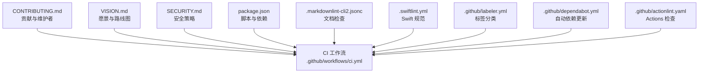
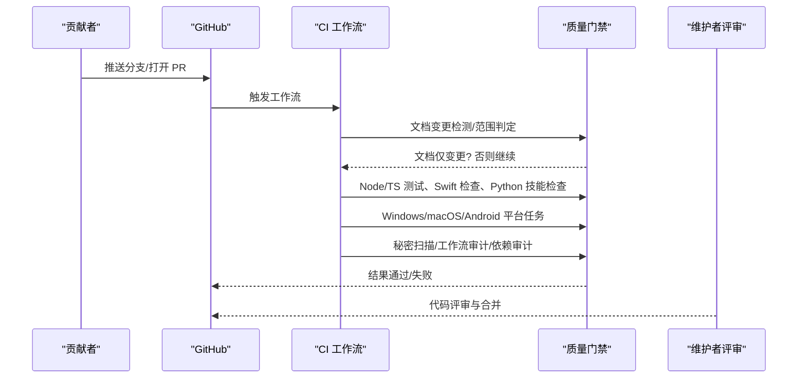
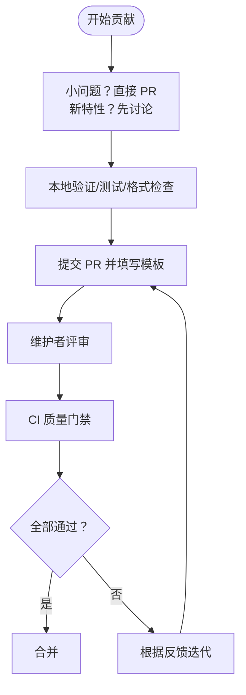
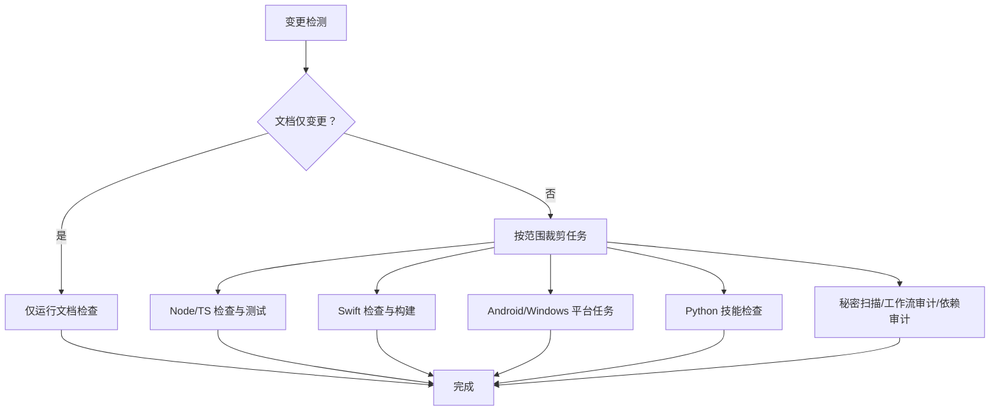
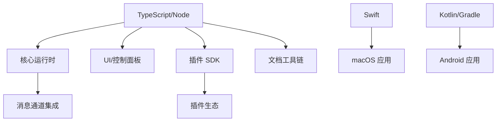

# 社区与贡献

<cite>
**本文引用的文件**   
- [CONTRIBUTING.md](file://CONTRIBUTING.md)
- [README.md](file://README.md)
- [.github/FUNDING.yml](file://.github/FUNDING.yml)
- [SECURITY.md](file://SECURITY.md)
- [VISION.md](file://VISION.md)
- [.github/workflows/ci.yml](file://.github/workflows/ci.yml)
- [.github/pull_request_template.md](file://.github/pull_request_template.md)
- [package.json](file://package.json)
- [tsconfig.json](file://tsconfig.json)
- [.github/dependabot.yml](file://.github/dependabot.yml)
- [.github/labeler.yml](file://.github/labeler.yml)
- [.markdownlint-cli2.jsonc](file://.markdownlint-cli2.jsonc)
- [.swiftlint.yml](file://.swiftlint.yml)
- [.github/actionlint.yaml](file://.github/actionlint.yaml)
</cite>

## 目录
1. [简介](#简介)
2. [项目结构](#项目结构)
3. [核心组件](#核心组件)
4. [架构总览](#架构总览)
5. [详细组件分析](#详细组件分析)
6. [依赖分析](#依赖分析)
7. [性能考虑](#性能考虑)
8. [故障排查指南](#故障排查指南)
9. [结论](#结论)
10. [附录](#附录)

## 简介
本指南面向所有希望参与 OpenClaw 开发与维护的社区成员，系统阐述贡献流程、代码与文档规范、测试与发布策略、安全与合规要求，以及社区治理与资源入口。OpenClaw 是一个在用户设备上运行的个人 AI 助手，支持多通道消息、多平台应用与可扩展插件生态。我们欢迎各类贡献：代码修复与特性、文档改进、问题反馈、功能建议、安全报告与社区运营。

## 项目结构
- 核心仓库包含多语言与多平台代码（TypeScript、Swift、Kotlin/Gradle）与丰富的文档、脚本与 CI 工作流。
- 贡献相关的关键位置：
  - 贡献说明与维护者列表：CONTRIBUTING.md
  - 项目愿景与方向：VISION.md
  - 安全策略与漏洞上报：SECURITY.md
  - CI/CD 与自动化：.github/workflows/ci.yml
  - 提交模板：.github/pull_request_template.md
  - 包管理与脚本：package.json
  - 类型与构建配置：tsconfig.json
  - 自动化依赖更新：.github/dependabot.yml
  - 标签与分类：.github/labeler.yml
  - 文档风格与检查：.markdownlint-cli2.jsonc
  - Swift 规范：.swiftlint.yml
  - GitHub Actions 静态检查：.github/actionlint.yaml

**图表来源**
- [CONTRIBUTING.md](file://CONTRIBUTING.md#L1-L163)
- [.github/workflows/ci.yml](file://.github/workflows/ci.yml#L1-L776)
- [VISION.md](file://VISION.md#L1-L111)
- [SECURITY.md](file://SECURITY.md#L1-L284)
- [package.json](file://package.json#L1-L444)
- [.markdownlint-cli2.jsonc](file://.markdownlint-cli2.jsonc#L1-L53)
- [.swiftlint.yml](file://.swiftlint.yml#L1-L149)
- [.github/labeler.yml](file://.github/labeler.yml#L1-L259)
- [.github/dependabot.yml](file://.github/dependabot.yml#L1-L128)
- [.github/actionlint.yaml](file://.github/actionlint.yaml#L1-L24)

**章节来源**
- [CONTRIBUTING.md](file://CONTRIBUTING.md#L1-L163)
- [README.md](file://README.md#L1-L560)
- [.github/workflows/ci.yml](file://.github/workflows/ci.yml#L1-L776)
- [package.json](file://package.json#L1-L444)

## 核心组件
- 贡献流程与治理
  - 维护者团队与职责分工，贡献类型与前置沟通渠道（讨论区、帮助频道）。
  - PR 前准备清单：本地验证、测试、格式与检查、聚焦单一主题、截图对比等。
  - AI 辅助 PR 的透明度要求与测试说明。
- 技术规范与质量门禁
  - CI 分层与按变更范围裁剪执行（文档、Node、Windows、macOS、Android、技能 Python）。
  - 多语言静态检查与格式化（TypeScript、Swift、Markdown）。
  - 死代码扫描与依赖审计。
- 安全与合规
  - 漏洞上报路径与所需信息清单。
  - 运行时与容器安全基线、信任模型与边界说明。
- 文档与国际化
  - 文档链接检查、拼写校对与风格约束。
  - 国际化与术语表处理流程。

**章节来源**
- [CONTRIBUTING.md](file://CONTRIBUTING.md#L64-L163)
- [.github/workflows/ci.yml](file://.github/workflows/ci.yml#L13-L776)
- [.markdownlint-cli2.jsonc](file://.markdownlint-cli2.jsonc#L1-L53)
- [.swiftlint.yml](file://.swiftlint.yml#L1-L149)
- [SECURITY.md](file://SECURITY.md#L1-L284)

## 架构总览
下图展示了从“提交 PR”到“CI 质量门禁”的端到端流程，涵盖文档、Node、Windows、macOS、Android、Python 技能与安全扫描等关键环节。

**图表来源**
- [.github/workflows/ci.yml](file://.github/workflows/ci.yml#L1-L776)
- [.github/pull_request_template.md](file://.github/pull_request_template.md#L1-L109)

**章节来源**
- [.github/workflows/ci.yml](file://.github/workflows/ci.yml#L1-L776)

## 详细组件分析

### 贡献流程与治理
- 维护者角色与职责
  - 项目由一位“至高维护者”领导，同时有多个子系统维护者（如 Discord、Telegram、iOS/Android、安全、UI/UX 等），负责各自领域。
- 贡献类型与前置沟通
  - 小问题/修复：直接开 PR。
  - 新特性/架构：先发起讨论或在社区频道沟通，再进入 PR。
  - 问题咨询：使用 Discord 帮助频道。
- PR 前准备与质量门禁
  - 在本地实例中验证；运行构建、检查与测试；确保 CI 通过；保持 PR 聚焦；提供前后对比截图（UI/可视化变更）。
- AI/情绪化 PR
  - 允许并鼓励使用 AI 协助编写代码，但需在 PR 中标注、说明测试程度、必要时附带提示词或会话日志，并确认理解代码。

**图表来源**
- [CONTRIBUTING.md](file://CONTRIBUTING.md#L64-L106)

**章节来源**
- [CONTRIBUTING.md](file://CONTRIBUTING.md#L12-L106)

### 代码规范与质量门禁
- CI 分层与按变更范围裁剪
  - 文档变更检测：仅跳过重型任务。
  - 变更范围检测：按 Node、Windows、macOS、Android、技能 Python 等维度裁剪执行。
  - 构建产物复用：Node 相关任务共享 dist 构件。
- 质量门禁清单
  - 类型检查、lint、格式化、协议生成与一致性检查。
  - 死代码扫描报告（Knip）作为“只读”报告，后续可转硬性门禁。
  - 文档检查：格式、链接、拼写。
  - 秘密扫描：detect-secrets、私钥扫描。
  - 工作流审计：zizmor 对变更的 GitHub Actions 进行安全审计。
  - 依赖审计：生产依赖安全扫描。
- 平台任务
  - Windows：分片并限制并发，避免 Defender 干扰。
  - macOS：统一运行 TS 测试、Swift lint/build/test。
  - Android：Gradle 构建与单元测试。

**图表来源**
- [.github/workflows/ci.yml](file://.github/workflows/ci.yml#L13-L776)

**章节来源**
- [.github/workflows/ci.yml](file://.github/workflows/ci.yml#L13-L776)

### 文档规范与国际化
- Markdown 风格与检查
  - 使用 markdownlint-cli2，忽略部分规则以适配文档内容结构。
  - 文档格式化工具与检查脚本。
- 国际化与术语
  - 文档目录包含多语言与术语表，遵循项目既定流程进行翻译与同步。
- 文档链接与拼写
  - 链接审计与拼写检查脚本，CI 中强制执行。

**章节来源**
- [.markdownlint-cli2.jsonc](file://.markdownlint-cli2.jsonc#L1-L53)
- [package.json](file://package.json#L244-L249)

### Swift 规范与质量
- SwiftLint 配置
  - 覆盖导入、声明、复杂度、长度等规则，结合 SwiftFormat 统一风格。
  - 忽略生成文件与特定目录，避免误报。
- 协议生成与一致性
  - 通过脚本生成 Swift 协议模型并与 TypeScript 生成的协议保持一致。

**章节来源**
- [.swiftlint.yml](file://.swiftlint.yml#L1-L149)
- [package.json](file://package.json#L291-L293)

### 安全策略与漏洞上报
- 上报路径
  - 按模块归属选择对应仓库，或通过邮件路由。
- 必备信息
  - 标题、严重性评估、影响、受影响组件、技术复现步骤、影响演示、环境、修复建议。
- 报告接受门槛
  - 包含精确路径、版本信息、可复现 PoC、影响与信任边界、凭证归属证明、非共用网关主机假设、范围说明等。
- 常见误报与出站范围
  - 明确不覆盖的场景（如仅提示注入、操作员授权行为、多租户隔离期望等）。
- 信任模型与边界
  - 强调“单用户受信操作员”模型，明确会话标识不是多用户授权边界。
- 运行时与容器安全
  - Node 版本要求、Docker 最佳实践与只读根文件系统、能力降级等。

**章节来源**
- [SECURITY.md](file://SECURITY.md#L1-L284)

### 开发环境与调试
- 运行时与安装
  - Node ≥22；推荐使用 pnpm；支持从源码构建与 UI 依赖自动安装。
- 开发循环
  - 构建后运行引导向导安装守护进程；热重载开发模式。
- 平台应用
  - macOS 应用打包与重启脚本；iOS/Android 通过命令行工具生成与运行。
- UI 与控制面板
  - 控制 UI 使用 Lit，装饰器采用“传统”语法；根 tsconfig 已配置兼容。

**章节来源**
- [README.md](file://README.md#L92-L111)
- [package.json](file://package.json#L257-L260)
- [tsconfig.json](file://tsconfig.json#L1-L29)

### 测试策略与覆盖率
- 测试矩阵
  - 单元测试、通道测试、端到端测试、实时测试、Docker 场景测试。
- 覆盖率与门禁
  - macOS 任务中包含覆盖率汇总与最低阈值门禁（示例：43%）。
- 性能与热点
  - 提供性能预算与热点分析脚本。

**章节来源**
- [.github/workflows/ci.yml](file://.github/workflows/ci.yml#L372-L776)
- [package.json](file://package.json#L296-L322)

### 自动化与运维
- 自动依赖更新
  - Dependabot 针对 npm、GitHub Actions、Swift、Gradle、Docker 分别配置更新策略与 PR 数上限。
- 标签与分类
  - 基于文件变更自动打标签，便于跨子系统追踪与评审。
- Actions 静态检查
  - actionlint 配置自定义 Runner 标签与忽略项，减少误报。

**章节来源**
- [.github/dependabot.yml](file://.github/dependabot.yml#L1-L128)
- [.github/labeler.yml](file://.github/labeler.yml#L1-L259)
- [.github/actionlint.yaml](file://.github/actionlint.yaml#L1-L24)

## 依赖分析
- 语言与工具链
  - TypeScript（严格模式）、Node ≥22、pnpm、Vitest、Oxlint/oxfmt、SwiftLint/SwiftFormat、Gradle/Android SDK。
- 关键依赖与覆盖范围
  - 消息通道集成（Telegram、Discord、Slack、Signal、WhatsApp、iMessage、Matrix、Mattermost、Feishu、LINE、Nostr、Synology Chat、Tlon、Twitch、Zalo、WebChat）。
  - 插件 SDK 与多平台应用（macOS、iOS、Android）。
  - 文档与 UI 相关工具链。
- 仅构建依赖
  - 通过 pnpm overrides 与 onlyBuiltDependencies 管理原生绑定与二进制依赖。

**图表来源**
- [package.json](file://package.json#L332-L442)

**章节来源**
- [package.json](file://package.json#L332-L442)

## 性能考虑
- 测试与性能预算
  - 使用性能预算与热点分析脚本，持续监控回归。
- 平台差异
  - Windows CI 采用分片与并发限制，避免资源争用与误报。
- 构建与缓存
  - CI 中复用构建产物，减少重复时间。

**章节来源**
- [.github/workflows/ci.yml](file://.github/workflows/ci.yml#L372-L492)
- [package.json](file://package.json#L318-L322)

## 故障排查指南
- 常见问题定位
  - 使用安全审计命令与诊断脚本，识别配置风险与潜在边界绕过。
  - 通过 CI 日志定位文档、平台或安全扫描失败原因。
- 文档与链接问题
  - 使用文档链接审计与拼写检查脚本快速修复。
- 平台构建问题
  - macOS/Android/Windows 任务分别关注 Swift 构建、Gradle 与 Windows Defender 干扰。

**章节来源**
- [SECURITY.md](file://SECURITY.md#L203-L284)
- [package.json](file://package.json#L244-L249)
- [.github/workflows/ci.yml](file://.github/workflows/ci.yml#L372-L492)

## 结论
OpenClaw 的贡献体系强调“先沟通、后实现”，通过严格的 CI 质量门禁与多语言规范保障稳定性与安全性。我们鼓励各类贡献，尤其重视文档、安全与用户体验的改进。请优先阅读贡献指南与安全策略，按模板提交 PR，并在社区频道积极交流。

## 附录
- 社区与资源
  - GitHub 讨论区、Discord 帮助频道、X/Twitter 官方账号。
  - 赞助与资金支持入口。
- 维护者联系
  - 如有意申请成为维护者，请按贡献指南中的联系方式提交申请材料。

**章节来源**
- [CONTRIBUTING.md](file://CONTRIBUTING.md#L1-L163)
- [.github/FUNDING.yml](file://.github/FUNDING.yml#L1-L2)
- [README.md](file://README.md#L26-L19)