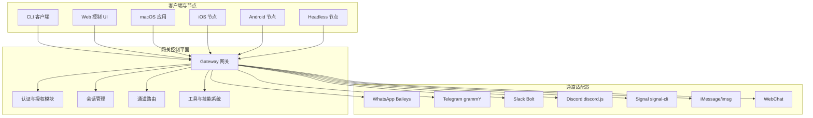
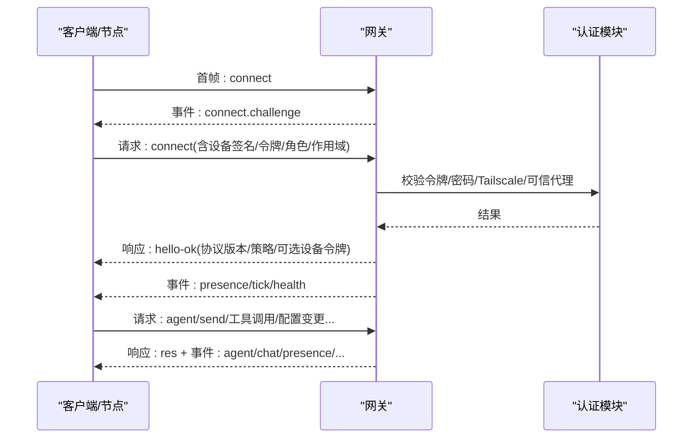
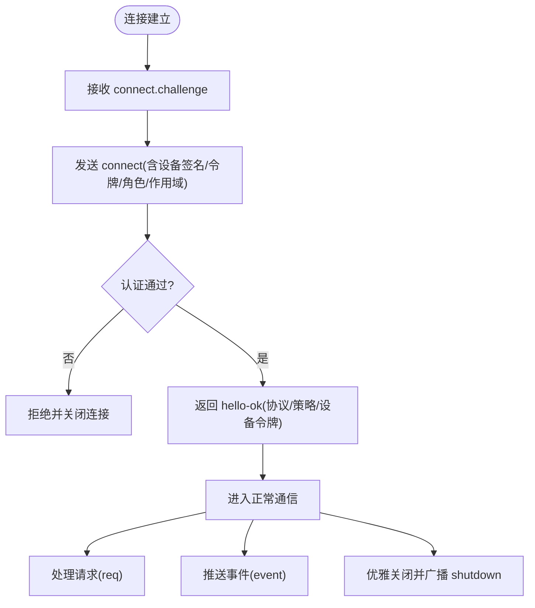
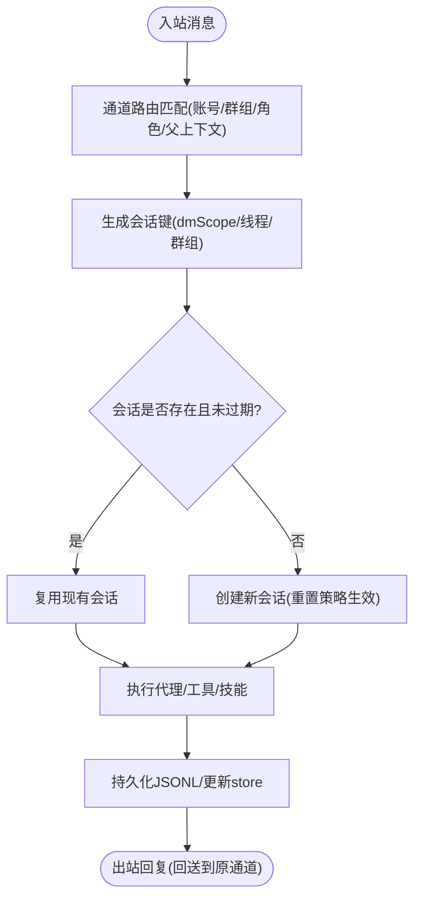
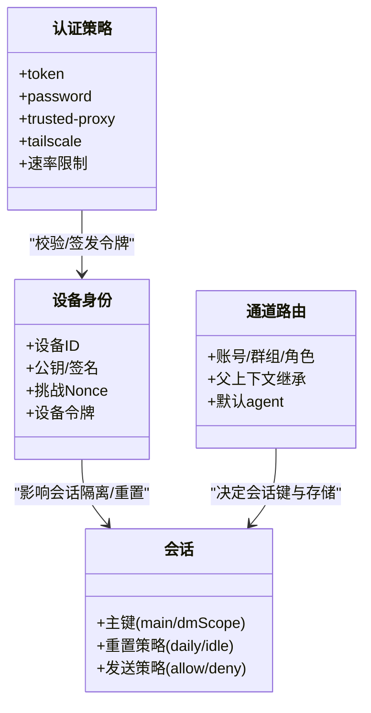
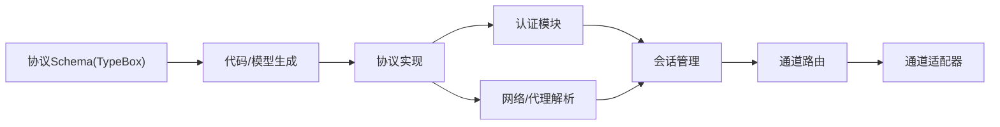

# 系统架构

<cite>
**本文引用的文件**
- [README.md](file://README.md)
- [architecture.md](file://docs/concepts/architecture.md)
- [gateway/index.md](file://docs/gateway/index.md)
- [protocol.md](file://docs/gateway/protocol.md)
- [configuration.md](file://docs/gateway/configuration.md)
- [session.md](file://docs/concepts/session.md)
- [channel-routing.md](file://docs/channels/channel-routing.md)
- [auth.ts](file://src/gateway/auth.ts)
- [schema.ts](file://src/gateway/protocol/schema.ts)
</cite>

## 目录
1. [引言](#引言)
2. [项目结构](#项目结构)
3. [核心组件](#核心组件)
4. [架构总览](#架构总览)
5. [详细组件分析](#详细组件分析)
6. [依赖分析](#依赖分析)
7. [性能考虑](#性能考虑)
8. [故障排查指南](#故障排查指南)
9. [结论](#结论)
10. [附录](#附录)

## 引言
本文件面向OpenClaw系统架构，聚焦“网关控制平面、代理运行时、通道适配器、工具系统”等核心子系统之间的关系与交互模式，系统性阐述WebSocket控制平面的工作原理、会话管理机制、消息路由策略与安全模型设计，并总结分布式网关架构在多渠道消息集成、Pi代理运行时、本地优先安全策略等方面的实现要点与优势。

## 项目结构
OpenClaw采用“单网关控制平面 + 多客户端/节点”的统一架构：网关负责会话、通道、工具与事件的集中编排；客户端（CLI、Web UI、macOS应用）与设备节点（macOS/iOS/Android/headless）通过WebSocket连接到网关；通道适配器（WhatsApp/Telegram/Slack/Discord/Signal/iMessage/IRC/Teams/Matrix/Feishu/LINE/Mattermost/Nextcloud Talk/Nostr/Synology Chat/Tlon/Twitch/Zalo/WebChat等）由网关统一维护与调度；工具系统与技能平台提供可插拔的能力扩展。

图示来源
- [architecture.md](file://docs/concepts/architecture.md#L12-L26)
- [gateway/index.md](file://docs/gateway/index.md#L68-L77)

章节来源
- [README.md](file://README.md#L21-L26)
- [architecture.md](file://docs/concepts/architecture.md#L12-L26)
- [gateway/index.md](file://docs/gateway/index.md#L68-L77)

## 核心组件
- 网关（Gateway）：单一长连接控制平面，承载协议握手、请求响应、事件推送、健康状态、心跳、定时任务与HTTP API（OpenAI兼容、工具调用等），默认绑定于127.0.0.1:18789。
- 客户端（Operator）：CLI、Web 控制 UI、macOS 应用等，以操作者角色连接，具备读写/管理权限范围。
- 节点（Node）：设备或headless节点，声明能力与命令白名单，提供摄像头、画布、屏幕录制、位置信息、系统命令等能力。
- 通道适配器（Channels）：各即时通讯平台的连接与消息收发适配层，统一由网关进行认证、路由与会话管理。
- 工具与技能系统：内置工具集与可插拔技能，受工具策略与沙箱策略约束。
- 会话（Sessions）：按主键隔离对话上下文，支持多账户、多通道、多用户场景下的会话分组与重置策略。

章节来源
- [architecture.md](file://docs/concepts/architecture.md#L27-L58)
- [protocol.md](file://docs/gateway/protocol.md#L12-L16)
- [session.md](file://docs/concepts/session.md#L57-L73)

## 架构总览
OpenClaw的控制平面以WebSocket为核心传输，首帧必须为connect请求；握手后，网关返回hello-ok快照（包含健康、存在性、状态版本、运行时参数等）。所有请求/响应与事件均采用统一帧格式，支持幂等键、事件不重放、设备身份与配对、鉴权令牌与设备令牌等机制。网关同时提供HTTP服务用于工具调用与控制界面访问。

图示来源
- [protocol.md](file://docs/gateway/protocol.md#L22-L91)
- [protocol.md](file://docs/gateway/protocol.md#L127-L134)
- [auth.ts](file://src/gateway/auth.ts#L367-L472)

章节来源
- [protocol.md](file://docs/gateway/protocol.md#L17-L91)
- [gateway/index.md](file://docs/gateway/index.md#L202-L214)

## 详细组件分析

### WebSocket控制平面与协议
- 传输与帧格式：文本帧、JSON载荷；首帧必须为connect；后续为req/res/event三类帧。
- 握手流程：先收到connect.challenge，再发送带设备签名、角色、作用域、令牌等参数的connect；成功后返回hello-ok并附带策略与可选设备令牌。
- 幂等与去重：对有副作用的方法要求幂等键，服务端维护短期去重缓存。
- 设备身份与配对：所有连接需携带设备标识并在connect中签名挑战；新设备需经配对审批；本地直连（回环/同主机尾网）可自动批准；后续可使用设备令牌。
- 认证策略：支持token/password/无/可信代理；远程访问可通过Tailscale Serve/Funnel或SSH隧道，必要时启用TLS与证书指纹校验。
- 事件模型：存在性(presence)、心跳(tick)、健康(health)、代理输出(agent)、聊天(chat)、计划(cron)、关闭(shutdown)等。

图示来源
- [protocol.md](file://docs/gateway/protocol.md#L22-L91)
- [protocol.md](file://docs/gateway/protocol.md#L196-L205)
- [auth.ts](file://src/gateway/auth.ts#L367-L472)

章节来源
- [protocol.md](file://docs/gateway/protocol.md#L17-L91)
- [protocol.md](file://docs/gateway/protocol.md#L196-L205)
- [auth.ts](file://src/gateway/auth.ts#L217-L292)

### 会话管理与路由
- 会话键规则：主键main用于一对一连续性；按通道/群组/线程等维度隔离；支持按账户+通道+发送者进一步细分，避免多用户共享上下文。
- 会话存储：网关为主，存储于~/.openclaw/agents/<agentId>/sessions/sessions.json，转录以JSONL形式存放；支持维护策略（裁剪、轮换、磁盘预算）。
- 重置策略：每日重置（默认4:00本地时间）与空闲重置（可按类型/通道覆盖）；支持触发式重置（如/new或/reset）。
- 发送策略：基于规则的允许/拒绝，支持按会话前缀匹配与继承。
- 路由策略：根据通道、账号、群组、角色、父级上下文等精确匹配到特定agent工作区与会话存储。

图示来源
- [session.md](file://docs/concepts/session.md#L189-L217)
- [channel-routing.md](file://docs/channels/channel-routing.md#L58-L74)

章节来源
- [session.md](file://docs/concepts/session.md#L57-L73)
- [session.md](file://docs/concepts/session.md#L177-L188)
- [session.md](file://docs/concepts/session.md#L189-L217)
- [channel-routing.md](file://docs/channels/channel-routing.md#L58-L74)

### 分布式网关与多通道集成
- 单一网关：每台主机仅运行一个网关实例，统一持有Baileys会话，避免多实例竞争。
- 远程访问：推荐Tailscale Serve/Funnel或SSH隧道；远程连接仍需遵循相同的握手与鉴权策略。
- 通道适配器：各平台适配器由网关统一启动与维护，确保一致的路由、会话与安全策略。
- 节点能力：节点声明能力与命令白名单，网关侧进行允许列表校验；节点可提供摄像头、画布、屏幕录制、位置等能力。

章节来源
- [architecture.md](file://docs/concepts/architecture.md#L12-L26)
- [gateway/index.md](file://docs/gateway/index.md#L108-L123)

### 安全模型与本地优先策略
- 默认安全：工具在主会话中默认运行于宿主机，单用户场景下提供最大便利；群组/频道场景可启用沙箱隔离。
- 设备身份与配对：所有WS连接需携带设备身份并在connect中签名挑战；新设备需配对审批；本地直连可自动批准；后续使用设备令牌。
- 认证与速率限制：支持token/password/可信代理/Tailscale；失败尝试计入速率限制；Tailscale可作为远程登录的补充认证。
- 机密与凭据：支持SecretRef（环境变量/文件/外部执行）与凭据表面矩阵，严格最小暴露面。

图示来源
- [auth.ts](file://src/gateway/auth.ts#L217-L292)
- [protocol.md](file://docs/gateway/protocol.md#L206-L220)
- [session.md](file://docs/concepts/session.md#L189-L217)
- [channel-routing.md](file://docs/channels/channel-routing.md#L58-L74)

章节来源
- [auth.ts](file://src/gateway/auth.ts#L217-L292)
- [auth.ts](file://src/gateway/auth.ts#L367-L472)
- [protocol.md](file://docs/gateway/protocol.md#L206-L220)

### Pi代理运行时与工具系统
- 代理运行时：基于pi-mono的嵌入式运行时，工作区为agents.defaults.workspace，首次会话注入AGENTS/SOUL/TOOLS等引导文件。
- 工具与技能：内置工具集与可插拔技能，受工具策略与沙箱策略约束；支持块流式输出与软块合并，减少单行刷屏。
- 模型选择：支持主模型与回退模型，模型别名与自定义提供商；会话内可切换模型。

章节来源
- [agent.md](file://docs/concepts/agent.md#L6-L23)
- [agent.md](file://docs/concepts/agent.md#L49-L65)
- [agent.md](file://docs/concepts/agent.md#L106-L113)

## 依赖分析
- 协议与类型：协议Schema由TypeBox定义并通过代码生成，Swift模型亦从JSON Schema生成，保证跨语言一致性。
- 认证与网络：认证模块依赖可信代理配置、Tailscale Whois查询、客户端IP解析与速率限制；网络模块提供本地直连判断与代理地址识别。
- 会话与路由：会话键生成与重置策略依赖通道路由规则；路由规则又依赖通道适配器提供的上下文与元数据。

图示来源
- [schema.ts](file://src/gateway/protocol/schema.ts#L1-L19)
- [protocol.md](file://docs/gateway/protocol.md#L111-L116)
- [auth.ts](file://src/gateway/auth.ts#L217-L292)

章节来源
- [schema.ts](file://src/gateway/protocol/schema.ts#L1-L19)
- [protocol.md](file://docs/gateway/protocol.md#L111-L116)

## 性能考虑
- 会话存储维护：在写路径执行清理（裁剪、轮换、归档、磁盘预算），建议生产使用强制模式并设置合理上限；大存储可能增加写延迟。
- 流式输出：块流式与软块合并可降低高频单行输出带来的UI压力；不同通道需显式开启块回复。
- 远程访问：Tailscale Serve/Funnel与SSH隧道均可，但需注意握手与鉴权开销；TLS指纹可提升远端信任度。

章节来源
- [session.md](file://docs/concepts/session.md#L88-L120)
- [agent.md](file://docs/concepts/agent.md#L94-L104)
- [gateway/index.md](file://docs/gateway/index.md#L108-L123)

## 故障排查指南
- 连接失败：检查是否为非JSON或非connect首帧导致直接关闭；确认OPENCLAW_GATEWAY_TOKEN或--token与connect.params.auth.token一致；验证设备签名与挑战Nonce。
- 认证问题：核对token/password配置；若启用可信代理，确认代理头与用户白名单；Tailscale模式下核对allowTailscale与转发头。
- 事件不重放：事件不重放，断线后需刷新health/system-presence恢复状态。
- 端口冲突/绑定限制：非回环绑定需配置token或密码；避免端口占用与EADDRINUSE。

章节来源
- [protocol.md](file://docs/gateway/protocol.md#L196-L205)
- [auth.ts](file://src/gateway/auth.ts#L294-L318)
- [gateway/index.md](file://docs/gateway/index.md#L216-L244)

## 结论
OpenClaw通过“单网关控制平面 + WebSocket协议 + 统一会话与路由 + 可插拔通道适配器 + 本地优先安全策略”的架构，实现了跨平台、跨渠道的一致体验与强安全边界。分布式网关在多账户、多通道、多用户场景下保持会话隔离与可控的工具执行范围，结合Pi代理运行时与工具/技能系统，满足个人助理的本地化、私有化与可扩展需求。

## 附录
- 快速启动与健康检查：参考“5分钟本地启动”与“健康检查”步骤，确保端口、认证与通道就绪。
- 配置热重载：大部分配置支持热应用，关键项（如端口、HTTP/TLS、发现/插件）需要重启；提供config.apply与config.patch RPC接口。
- 远程访问：推荐Tailscale Serve/Funnel或SSH隧道；远程连接仍需遵循握手与鉴权策略。

章节来源
- [gateway/index.md](file://docs/gateway/index.md#L27-L67)
- [gateway/index.md](file://docs/gateway/index.md#L349-L387)
- [configuration.md](file://docs/gateway/configuration.md#L349-L387)