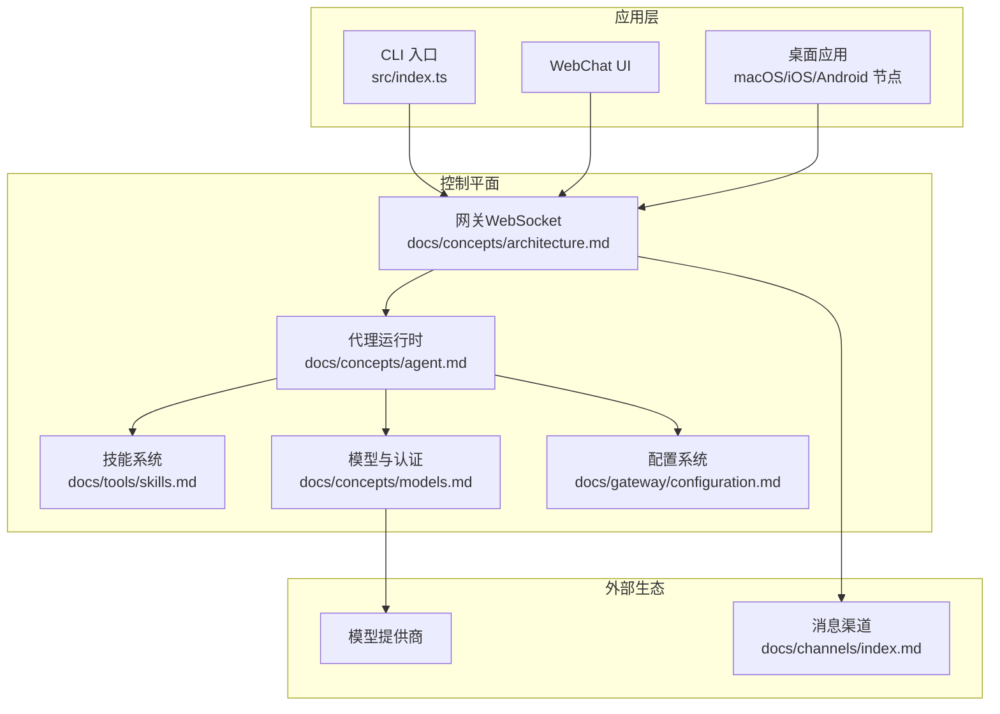
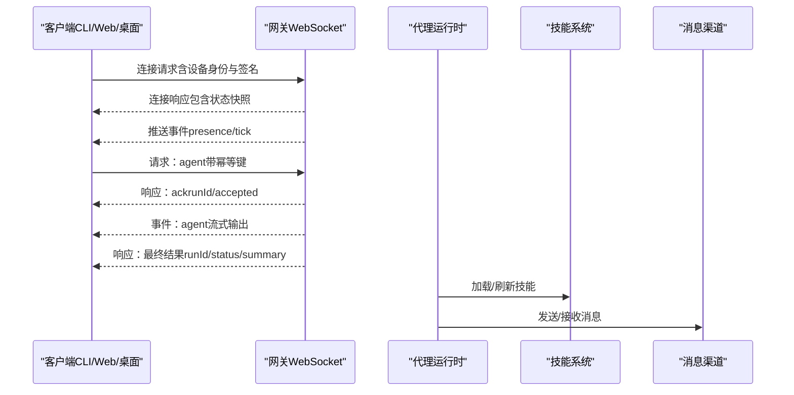
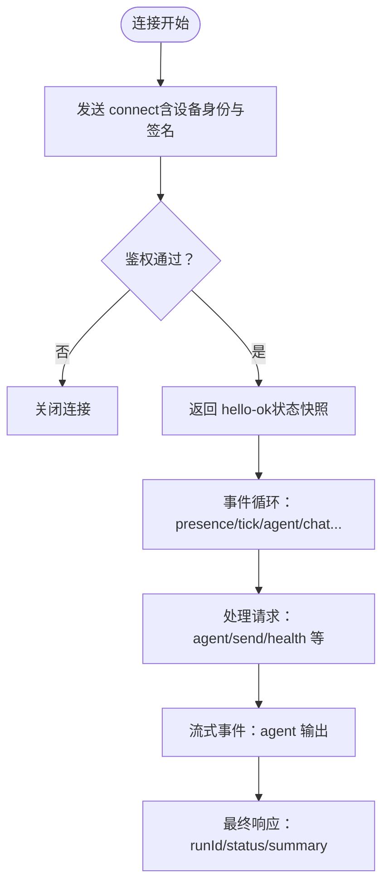
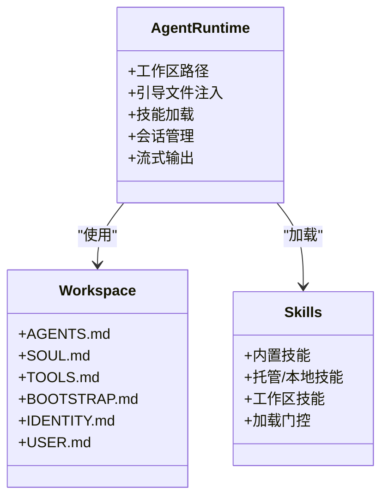
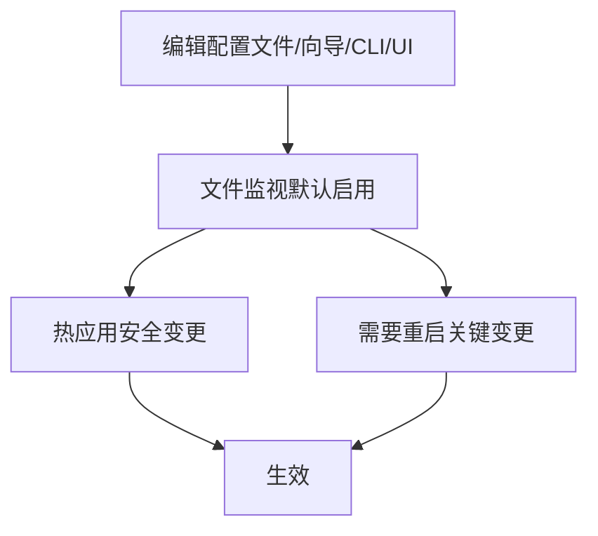
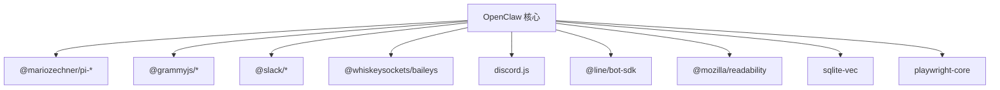

# 项目概述

<cite>
**本文档引用的文件**
- [README.md](file://README.md)
- [VISION.md](file://VISION.md)
- [CONTRIBUTING.md](file://CONTRIBUTING.md)
- [src/index.ts](file://src/index.ts)
- [package.json](file://package.json)
- [docs/concepts/architecture.md](file://docs/concepts/architecture.md)
- [docs/concepts/agent.md](file://docs/concepts/agent.md)
- [docs/gateway/configuration.md](file://docs/gateway/configuration.md)
- [docs/channels/index.md](file://docs/channels/index.md)
- [docs/tools/skills.md](file://docs/tools/skills.md)
- [docs/concepts/models.md](file://docs/concepts/models.md)
- [docs/start/onboarding.md](file://docs/start/onboarding.md)
</cite>

## 目录
1. [引言](#引言)
2. [项目结构](#项目结构)
3. [核心组件](#核心组件)
4. [架构总览](#架构总览)
5. [详细组件分析](#详细组件分析)
6. [依赖关系分析](#依赖关系分析)
7. [性能考量](#性能考量)
8. [故障排查指南](#故障排查指南)
9. [结论](#结论)
10. [附录](#附录)

## 引言
OpenClaw 是一个“个人AI助手”，可在你的设备上运行，接入你常用的聊天渠道（如 WhatsApp、Telegram、Slack、Discord、Google Chat、Signal、iMessage、BlueBubbles、IRC、Microsoft Teams、Matrix、Feishu、LINE、Mattermost、Nextcloud Talk、Nostr、Synology Chat、Tlon、Twitch、Zalo、Zalo Personal、WebChat），支持语音唤醒与实时画布协作，并通过网关统一控制会话、工具与事件。其核心价值在于：
- 本地优先：所有数据与计算尽可能在本地完成，降低隐私风险
- 多渠道集成：统一网关连接多种消息平台，实现跨渠道一致体验
- 可扩展代理运行时：基于 Pi 的嵌入式代理运行时，支持技能与工具扩展
- 安全沙箱：默认强安全策略，支持按会话隔离与容器沙箱

OpenClaw 的愿景是“真正能做事”的个人AI助手，强调易用性、广泛平台支持与隐私安全。

**章节来源**
- [README.md](file://README.md#L21-L24)
- [VISION.md](file://VISION.md#L15-L16)

## 项目结构
OpenClaw 采用模块化与多语言并存的工程组织方式：
- 核心入口与CLI：src/index.ts 构建命令行程序，加载环境变量与运行时守卫，解析用户输入并分发到各子系统
- 网关与协议：docs/concepts/architecture.md 描述了基于 WebSocket 的单网关控制平面，客户端与节点均通过该网关进行通信
- 代理与工作区：docs/concepts/agent.md 定义了代理工作区、引导文件注入、技能加载与会话管理
- 配置系统：docs/gateway/configuration.md 提供完整的配置参考与热重载机制
- 渠道生态：docs/channels/index.md 列举了支持的消息平台及各自特性
- 技能体系：docs/tools/skills.md 说明了技能的加载顺序、权限门控与安装流程
- 模型与认证：docs/concepts/models.md 解释了模型选择、别名、回退与扫描能力
- 上手向导：docs/start/onboarding.md 展示了首次运行的安全信任模型与权限授予流程

**图表来源**
- [src/index.ts](file://src/index.ts#L46-L48)
- [docs/concepts/architecture.md](file://docs/concepts/architecture.md#L12-L26)
- [docs/concepts/agent.md](file://docs/concepts/agent.md#L10-L11)
- [docs/gateway/configuration.md](file://docs/gateway/configuration.md#L10-L21)
- [docs/channels/index.md](file://docs/channels/index.md#L9-L14)
- [docs/tools/skills.md](file://docs/tools/skills.md#L9-L11)
- [docs/concepts/models.md](file://docs/concepts/models.md#L10-L14)

**章节来源**
- [src/index.ts](file://src/index.ts#L1-L94)
- [package.json](file://package.json#L1-L444)

## 核心组件
- 网关（Gateway）
  - 单一长连接的控制平面，承载消息通道、事件推送、心跳与健康检查
  - 支持设备配对、鉴权令牌、事件不重放等安全与一致性约束
- 代理运行时（Agent Runtime）
  - 基于 Pi 的嵌入式运行时，结合 OpenClaw 的工作区与会话管理
  - 注入引导文件（AGENTS/SOUL/TOOLS 等），支持技能与工具调用
- 配置系统（Configuration）
  - JSON5 配置文件，严格校验；支持热重载与 RPC 更新
  - 分类覆盖：渠道、代理、自动化、会话、工具、媒体、UI 等
- 渠道适配器（Channels）
  - 广泛支持主流 IM 平台，统一通过网关路由与访问控制
- 技能系统（Skills）
  - AgentSkills 兼容的技能目录，支持本地/托管/工作区三层优先级
  - 加载期门控（二进制、环境变量、配置项）与运行期环境注入
- 模型与认证（Models）
  - 主模型与回退列表、图像模型、别名与扫描能力
  - 支持订阅型 OAuth 与 API Key 等多种认证模式

**章节来源**
- [docs/concepts/architecture.md](file://docs/concepts/architecture.md#L12-L26)
- [docs/concepts/agent.md](file://docs/concepts/agent.md#L10-L11)
- [docs/gateway/configuration.md](file://docs/gateway/configuration.md#L10-L21)
- [docs/channels/index.md](file://docs/channels/index.md#L9-L14)
- [docs/tools/skills.md](file://docs/tools/skills.md#L9-L11)
- [docs/concepts/models.md](file://docs/concepts/models.md#L10-L14)

## 架构总览
OpenClaw 的整体架构围绕“单一网关控制平面 + 多客户端/节点 + 代理运行时”的模式展开。客户端（CLI、Web UI、桌面应用）与节点（macOS/iOS/Android/headless）通过 WebSocket 连接到网关，网关负责：
- 维护渠道连接与消息路由
- 发出事件（agent/chat/presence/health/heartbeat/cron）
- 执行配置热重载与安全策略（鉴权、配对、签名）

**图表来源**
- [docs/concepts/architecture.md](file://docs/concepts/architecture.md#L59-L78)

**章节来源**
- [docs/concepts/architecture.md](file://docs/concepts/architecture.md#L12-L26)

## 详细组件分析

### 组件A：网关与协议
- 连接生命周期：握手必须为 JSON 且首帧为 connect；后续请求/响应与事件帧遵循统一格式
- 设备配对与本地信任：设备身份、挑战签名、本地/远程区分、自动批准策略
- 远程访问：推荐 Tailscale 或 SSH 隧道，支持 WS TLS 与可选证书固定
- 运维快照：启动方式、健康查询、守护进程（launchd/systemd）

**图表来源**
- [docs/concepts/architecture.md](file://docs/concepts/architecture.md#L59-L78)

**章节来源**
- [docs/concepts/architecture.md](file://docs/concepts/architecture.md#L59-L140)

### 组件B：代理运行时与工作区
- 工作区契约：单一工作目录作为工具与上下文的工作区，支持沙箱覆盖
- 引导文件注入：AGENTS/SOUL/TOOLS/BOOTSTRAP/IDENTITY/USER 等文件在首次回合注入
- 技能加载：三段式优先级（工作区 > 托管/本地 > 内置），支持插件技能
- 会话存储：JSONL 记录，稳定会话 ID，不读取旧 Pi/Tau 目录
- 流式与块流：支持块级流式输出与合并，控制边界与分块大小

**图表来源**
- [docs/concepts/agent.md](file://docs/concepts/agent.md#L12-L42)
- [docs/tools/skills.md](file://docs/tools/skills.md#L13-L27)

**章节来源**
- [docs/concepts/agent.md](file://docs/concepts/agent.md#L10-L124)

### 组件C：配置系统与热重载
- 配置来源：JSON5 文件、交互向导、CLI、Control UI、RPC
- 严格校验：未知键/类型错误/非法值导致网关拒绝启动
- 热重载：大部分设置即时生效；服务器端口/基础设施变更需重启
- RPC 更新：config.apply 与 config.patch，带速率限制与重启协调

**图表来源**
- [docs/gateway/configuration.md](file://docs/gateway/configuration.md#L349-L387)

**章节来源**
- [docs/gateway/configuration.md](file://docs/gateway/configuration.md#L10-L547)

### 组件D：渠道与多代理路由
- 渠道矩阵：支持 WhatsApp、Telegram、Discord、Slack、Google Chat、Signal、iMessage、BlueBubbles、IRC、Microsoft Teams、Matrix、Feishu、LINE、Mattermost、Nextcloud Talk、Nostr、Synology Chat、Tlon、Twitch、Zalo、Zalo Personal、WebChat
- 群组路由：按账户/频道/群组绑定到不同代理，实现隔离与个性化
- DM 策略：配对/白名单/开放/禁用，保障入站 DM 安全

**章节来源**
- [docs/channels/index.md](file://docs/channels/index.md#L9-L48)
- [docs/gateway/configuration.md](file://docs/gateway/configuration.md#L303-L323)

### 组件E：技能系统与安装
- 三层优先级：工作区 > 托管/本地 > 内置
- 加载门控：二进制存在、环境变量、配置项三类要求
- 安装器：brew/node/yarn/bun/uv/download 等多渠道安装
- 运行期注入：仅在当前代理回合生效，避免全局污染
- 性能影响：技能列表注入提示词具有确定性开销，可通过 XML 转义估算

**章节来源**
- [docs/tools/skills.md](file://docs/tools/skills.md#L9-L302)

### 组件F：模型与认证
- 选择顺序：主模型 → 回退列表 → 提供商认证回退
- 别名与扫描：支持模型别名与 OpenRouter 免费模型扫描，按图像支持、工具延迟、上下文与参数排序
- 认证模式：API Key、订阅型 OAuth、自定义提供商
- 图像模型：当主模型不接受图像时使用图像专用模型

**章节来源**
- [docs/concepts/models.md](file://docs/concepts/models.md#L16-L218)

## 依赖关系分析
- 运行时与包管理：Node ≥22，pnpm 为主，TypeScript 与 Vitest 用于构建与测试
- 第三方依赖：包含 @mariozechner/pi-*、@grammyjs/*、@slack/*、@whiskeysockets/baileys、discord.js、@line/bot-sdk、@mozilla/readability、sqlite-vec、playwright-core 等
- 导出与插件SDK：通过 package.json 的 exports 字段暴露多个插件 SDK 包，便于扩展

**图表来源**
- [package.json](file://package.json#L332-L383)

**章节来源**
- [package.json](file://package.json#L1-L444)

## 性能考量
- 会话压缩与使用追踪：支持会话压缩与令牌使用统计，减少上下文开销
- 流式与块流：块流式输出减少单行碎片，合并空闲事件降低噪声
- 技能提示成本：技能列表注入提示词具有确定性字符开销，建议控制技能数量与字段长度
- 沙箱与隔离：非主会话可启用容器沙箱，隔离工具执行与文件系统访问，兼顾安全性与性能

**章节来源**
- [docs/concepts/agent.md](file://docs/concepts/agent.md#L82-L104)
- [docs/tools/skills.md](file://docs/tools/skills.md#L268-L285)

## 故障排查指南
- 安全与信任：入站 DM 视为不受信输入，默认采用配对/白名单策略；可通过 doctor 检查 DM 策略与鉴权配置
- 远程访问：Tailscale Serve/Funnel 与 SSH 隧道均可；确保绑定地址为 loopback 并正确设置鉴权
- 配置校验：严格模式下未知键或非法值会导致网关拒绝启动；使用 doctor 诊断并修复
- 渠道问题：参考各渠道文档与故障排查页面，定位连接与权限问题
- 首次运行：遵循 macOS 应用的首次运行流程，授予必要 TCC 权限，生成安全令牌

**章节来源**
- [README.md](file://README.md#L112-L125)
- [docs/concepts/architecture.md](file://docs/concepts/architecture.md#L117-L128)
- [docs/gateway/configuration.md](file://docs/gateway/configuration.md#L61-L73)
- [docs/start/onboarding.md](file://docs/start/onboarding.md#L33-L39)

## 结论
OpenClaw 以“本地优先、多渠道集成、可扩展代理运行时、安全沙箱”为核心，构建了一个既适合个人使用又具备企业级安全与可运维性的个人AI助手。通过单一网关控制平面与丰富的配置、技能与渠道生态，OpenClaw 在隐私、性能与可用性之间取得平衡，并持续迭代以提升稳定性与用户体验。

## 附录
- 快速开始与安装：参见 README 中的安装与入门指引
- 开发通道：stable/beta/dev 三种发布通道，支持切换
- 贡献指南：PR 规范、维护者团队与漏洞报告流程
- 项目历史与愿景：从 Warelay 到 OpenClaw 的演进，明确优先级与路线图

**章节来源**
- [README.md](file://README.md#L50-L91)
- [VISION.md](file://VISION.md#L17-L33)
- [CONTRIBUTING.md](file://CONTRIBUTING.md#L64-L117)